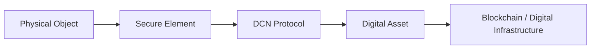

# About DCN

> **Digital Crypto Note (DCN) is an open standard for bringing digital assets into the physical world.**

DCN defines a common technical framework for creating secure, interoperable, programmable, and verifiable **Physical Digital Assets**.

It is designed to establish the missing physical layer between blockchain-based assets and everyday human interaction.

***

## What Is DCN?

Digital assets today primarily exist behind screens.

Cryptocurrencies, stablecoins, digital identities, credentials, loyalty points, tokenized assets, and other blockchain-based instruments are generally accessed through:

* Mobile applications
* Browser wallets
* QR codes
* Exchanges
* Seed phrases
* Complex blockchain interfaces

DCN introduces another interface:

**The physical object itself.**

A DCN-compliant object may contain secure hardware, NFC communication, cryptographic identity, and standardized protocols that allow it to interact with wallets, merchants, applications, and blockchain networks.

```
Digital Asset
      ↓
Blockchain / Digital Infrastructure
      ↓
DCN Protocol
      ↓
Secure Physical Object
      ↓
Tap • Verify • Use • Transfer
```

The result is a new category of infrastructure:

> **Physical Digital Assets**

***

## DCN Is a Standard, Not a Currency

Despite the name **Digital Crypto Note**, DCN is not a cryptocurrency.

It is also not:

* A blockchain
* A stablecoin
* A payment network
* A bank
* A wallet
* A single hardware product

DCN is an **open technical standard**.

Just as established technology standards allow independently manufactured devices to communicate with one another, DCN aims to define common rules for physical objects representing or interacting with digital assets.

***

## What Can Become a DCN?

A Digital Crypto Note is only the first application.

The same architecture can potentially support many categories of Physical Digital Assets.

```
DCN Standard
│
├── Digital Crypto Notes
├── Stablecoin Notes
├── CBDC Instruments
├── Gift Cards
├── Payroll Assets
├── Government Benefits
├── Transit Passes
├── Event Tickets
├── Loyalty Assets
├── Digital Identity
├── Certificates
├── Collectibles
└── Future Physical Digital Assets
```

A DCN implementation therefore does not have to look like traditional currency.

It could be a note, card, wearable, tag, certificate, collectible, or another secure physical form factor.

***

## The Core Idea

The fundamental concept behind DCN is simple:

**Digital value should not require a complicated digital experience.**

A user should eventually be able to interact with digital assets through familiar physical actions.

For example:

```
Tap a Note
     ↓
Authenticate Hardware
     ↓
Verify Asset
     ↓
Authorize Interaction
     ↓
Blockchain / Settlement
```

The complexity remains underneath the interface.

Cryptography, blockchain transactions, certificate validation, Secure Element operations, and network communication can occur behind a simple physical interaction.

***

## Physical + Digital

DCN combines two worlds.

#### Physical Layer

The physical object may provide:

* Secure Element
* NFC Interface
* Hardware Identity
* Anti-counterfeit features
* Printed security features
* Physical ownership experience

#### Digital Layer

The digital infrastructure may provide:

* Blockchain assets
* Smart contracts
* Wallet integration
* Ownership records
* Publisher infrastructure
* Verification services
* Recovery mechanisms
* Programmable policies

Together they create a trusted physical-digital object.



***

## Open by Design

DCN is intended to function as an ecosystem rather than a closed product.

Independent organizations should be able to participate as:

* Publishers
* Wallet Providers
* Merchants
* Developers
* Manufacturers
* Secure Element Vendors
* Blockchain Networks
* Stablecoin Providers
* Banks
* Enterprises
* Governments
* Certification Authorities

No single wallet, blockchain, manufacturer, or issuer should be required for the standard to function.

***

## Blockchain Neutral

DCN does not define one preferred blockchain.

Different implementations may connect to different networks through standardized Blockchain Adapters.

```
                    ┌─ Bitcoin
                    ├─ Ethereum
                    ├─ Solana
Physical Asset ─ DCN ├─ TON
                    ├─ EVM Networks
                    ├─ Private Networks
                    ├─ CBDC Infrastructure
                    └─ Future Networks
```

This allows the physical interface to remain consistent even as the underlying digital infrastructure changes.

***

## Security First

A physical representation of digital value cannot depend solely on printed QR codes or identifiers.

DCN therefore introduces a security architecture based around technologies such as:

* Secure Elements
* Hardware Root of Trust
* Cryptographic keys
* Challenge-response authentication
* Device certificates
* Publisher certificates
* Secure provisioning
* Secure messaging
* Anti-replay protection
* Lifecycle management

The objective is to make authenticity **cryptographically verifiable**.

A user or merchant should not need to trust how an object looks.

They should be able to verify what it **is**.

***

## Anyone Can Be a Publisher

DCN is designed around an open Publisher model.

Subject to applicable technical, certification, security, and legal requirements, organizations can create their own DCN implementations.

For example:

```
Stablecoin Company
        ↓
DCN Publisher
        ↓
USDC Physical Notes


Government
        ↓
DCN Publisher
        ↓
Benefit / Identity Instrument


Gaming Company
        ↓
DCN Publisher
        ↓
Physical Game Assets


Enterprise
        ↓
DCN Publisher
        ↓
Employee Credentials
```

The Publisher defines the asset and its business rules while the DCN Standard provides interoperability.

***

## One Standard. Any Asset. Everywhere.

The long-term objective is not simply to manufacture cryptocurrency notes.

The objective is to create a common physical interface for the digital economy.

A world where different digital assets can be:

**Issued physically.**

**Authenticated cryptographically.**

**Discovered automatically.**

**Interacted with through a tap.**

**Verified through open protocols.**

**Connected to multiple blockchain networks.**

That is the broader vision behind Digital Crypto Note.

***

## Our Mission

The mission of DCN is:

> **To establish an open, secure, interoperable global standard for Physical Digital Assets.**

The standard is intended to enable developers, governments, enterprises, financial institutions, blockchain ecosystems, and hardware manufacturers to build independently while remaining interoperable.

***

## The DCN Vision

The internet standardized information.

Blockchain standardized programmable digital ownership.

DCN proposes a standard for bringing that ownership into the physical environment.

```
INTERNET
Information

        ↓

BLOCKCHAIN
Digital Ownership

        ↓

DCN
Physical Digital Ownership
```

The opportunity extends beyond cryptocurrency.

It represents a potential infrastructure layer connecting **physical objects, digital identity, programmable value, and decentralized networks**.
