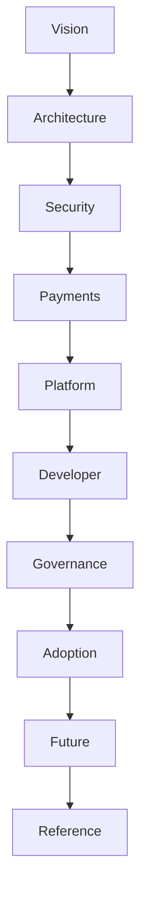

# Documentation Guide

Welcome to the **DCN v1.0 Documentation**.

This GitBook is the official technical specification for the **DCN Standard (Digital Crypto Note)**, an open standard for creating, issuing, managing, and verifying **Physical Digital Assets (PDAs)**.

The documentation is organized progressively, allowing readers with different backgrounds to quickly find the information most relevant to them.

Whether you are a developer, hardware manufacturer, government agency, enterprise architect, security researcher, or publisher, each section is designed to build upon the previous one while remaining independently understandable.

***

## How to Read This Documentation

The documentation follows a layered approach.

Each part introduces a higher level of technical detail.

Readers may choose to read the documentation sequentially or jump directly to the chapters relevant to their role.

***

## Documentation Structure

### HOME

Introduces the DCN Standard, its vision, purpose, and how this documentation is organized.

***

### Part I — Vision

Explains the motivation behind DCN.

Topics include:

* Executive Summary
* Why Physical Digital Assets
* The DCN Standard

Recommended for:

* Business leaders
* Investors
* Government agencies
* Product managers
* Architects

***

### Part II — Architecture

Describes the technical architecture of the DCN ecosystem.

Topics include:

* System Architecture
* Physical Digital Assets
* Secure Hardware
* Wallet Architecture
* Multi-Chain Support

Recommended for:

* System architects
* Blockchain developers
* Hardware manufacturers

***

### Part III — Security

Defines the security model that protects Physical Digital Assets.

Topics include:

* Cryptography
* Authentication
* Certificate Infrastructure
* Ownership
* Trust

Recommended for:

* Security engineers
* Auditors
* Secure hardware vendors

***

### Part IV — Payments

Describes how DCN assets are used in payment scenarios.

Topics include:

* Payment Protocol
* Merchant Acceptance

Recommended for:

* Payment providers
* Wallet developers
* POS vendors

***

### Part V — Platform

Explains how publishers manufacture, issue, and manage Physical Digital Assets.

Topics include:

* Publisher Platform
* Manufacturing
* Verification Services

Recommended for:

* Issuers
* Manufacturers
* Enterprises

***

### Part VI — Developer

Provides integration guidance.

Topics include:

* SDKs
* APIs
* Blockchain Adapters

Recommended for:

* Software developers
* Wallet teams
* Merchant integrators

***

### Part VII — Governance

Describes how the DCN ecosystem evolves.

Topics include:

* Foundation
* Open Standards
* Certification

Recommended for:

* Standards organizations
* Ecosystem partners
* Publishers

***

### Part VIII — Adoption

Illustrates how DCN can be applied across industries.

Topics include:

* Business Model
* Industry Use Cases

Recommended for:

* Governments
* Banks
* Enterprises
* Solution providers

***

### Part IX — Future

Explores future research and the long-term roadmap.

Topics include:

* Development Roadmap
* Future Research
* Global Adoption Strategy

***

### Part X — Reference

Contains supporting technical material.

Topics include:

* Glossary
* Standards References
* Architecture Diagrams
* API Examples
* Frequently Asked Questions

***

## Documentation Conventions

Throughout this documentation, the following conventions are used.

| Convention  | Meaning                                             |
| ----------- | --------------------------------------------------- |
| **MUST**    | Mandatory requirement for compliant implementations |
| **SHOULD**  | Strong recommendation                               |
| **MAY**     | Optional implementation choice                      |
| **NOTE**    | Additional clarification                            |
| **WARNING** | Important security or operational consideration     |

These keywords follow common standards documentation practices and help distinguish mandatory protocol requirements from implementation guidance.

***

## Intended Audience

This documentation is written for:

* Blockchain protocol developers
* Wallet developers
* Hardware manufacturers
* Secure element vendors
* NFC solution providers
* Banks and financial institutions
* Government agencies
* Enterprises
* Universities
* Stablecoin issuers
* Auditors
* Security researchers
* Standards organizations

Readers are encouraged to begin with the Vision section before moving into the architectural and technical chapters.

***

## Versioning

This documentation follows semantic versioning.

* **Major versions** introduce significant architectural or protocol changes.
* **Minor versions** add new capabilities while maintaining compatibility.
* **Patch versions** provide clarifications, corrections, or editorial improvements.

The current release is **DCN v1.0**, representing the initial public specification of the DCN Standard.

***

## Feedback and Contributions

DCN is designed as an open standard that evolves through collaboration.

Future versions of this documentation may incorporate feedback from developers, hardware manufacturers, publishers, security researchers, enterprises, and standards organizations.

Contributions that improve interoperability, security, usability, or implementation guidance are encouraged through the project's public review process.
