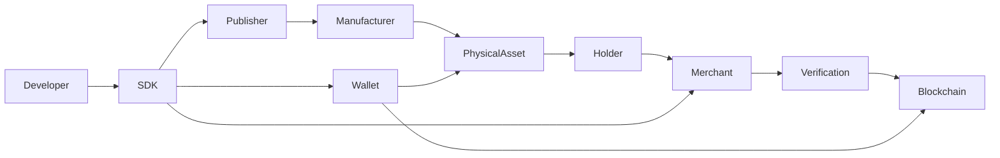

# Welcome

> **DCN — The Open Standard for Physical Digital Assets**

Welcome to the official documentation of the **DCN (Digital Crypto Note) Standard**, an open protocol designed to bridge the physical and digital worlds through secure, blockchain-backed physical assets.

DCN defines a common framework for creating, issuing, managing, transferring, authenticating, and verifying **Physical Digital Assets (PDAs)**. It enables trusted organizations—including governments, financial institutions, enterprises, educational institutions, merchants, and developers—to issue physical objects that securely represent digital assets on blockchain networks.

Unlike traditional payment cards or proprietary NFC solutions, DCN is designed as an **open, interoperable standard**. Any organization can build compatible hardware, software, wallets, verification services, manufacturing systems, or publishing platforms while remaining fully interoperable with the wider DCN ecosystem.

The first reference implementation of the standard is the **Digital Crypto Note**, a secure NFC-enabled physical device capable of representing blockchain-backed assets such as cryptocurrencies, stablecoins, and tokenized value. However, the protocol is intentionally designed to support a much broader ecosystem of physical digital assets beyond digital currency.

***

### Why DCN?

Today's blockchain ecosystem is almost entirely digital. Users interact with wallets, private keys, QR codes, browser extensions, and mobile applications. While these tools provide powerful capabilities, they often create barriers to usability, accessibility, and mainstream adoption.

Physical objects remain one of the most intuitive ways for people to exchange value, prove ownership, access services, and establish trust. Cash, payment cards, passports, identity cards, tickets, certificates, and access badges continue to play an essential role in everyday life because they are familiar, portable, and easy to use.

DCN extends these familiar physical experiences into the blockchain era by providing a standardized method for securely connecting physical objects with decentralized digital assets.

***

### What is a Physical Digital Asset?

A **Physical Digital Asset (PDA)** is a tangible object that securely represents a blockchain-backed digital asset through standardized hardware, cryptographic, and communication protocols.

A Physical Digital Asset may represent:

* Digital cryptocurrencies
* Stablecoins
* Central Bank Digital Currencies (CBDCs)
* Gift cards
* Payroll instruments
* Event tickets
* Transit passes
* Loyalty rewards
* University certificates
* Digital identity credentials
* Tokenized financial instruments
* Carbon credits
* Enterprise security credentials
* Digital collectibles
* Future blockchain-based assets

The DCN Standard defines how these assets are securely issued, authenticated, transferred, recovered, and verified throughout their lifecycle.

***

### Design Philosophy

The DCN Standard is built upon several guiding principles:

* **Open by Design** — Anyone can build compatible implementations.
* **Blockchain Agnostic** — Support multiple blockchain ecosystems.
* **Security First** — Hardware-backed cryptographic security.
* **Interoperable** — Common standards across manufacturers and publishers.
* **Extensible** — Designed to support future asset classes.
* **User Ownership** — Individuals retain control over their assets.
* **Publisher Neutral** — Any trusted organization can become a publisher.
* **Developer Friendly** — Open APIs, SDKs, and reference implementations.

***

### The DCN Ecosystem

The DCN ecosystem brings together multiple participants that collaborate through a common protocol.

Each participant follows the same protocol specifications, ensuring interoperability regardless of manufacturer, wallet provider, blockchain network, or publisher.

***

### Who Should Read This Documentation?

This documentation is intended for:

* Blockchain protocol developers
* Wallet developers
* Hardware manufacturers
* Secure element vendors
* NFC solution providers
* Banks and payment providers
* Government agencies
* Stablecoin issuers
* Enterprises
* Security researchers
* Auditors
* Developers building DCN-compatible applications
* Standards organizations

Whether you are implementing a secure wallet, manufacturing compliant devices, integrating merchant acceptance, or publishing new classes of Physical Digital Assets, this documentation provides the technical foundation required to build interoperable DCN-compatible systems.

***

### How This Documentation is Organized

The documentation is divided into ten major parts:

1. Vision
2. Architecture
3. Security
4. Payments
5. Platform
6. Developer
7. Governance
8. Adoption
9. Future
10. Reference

Each chapter builds upon the previous one, gradually introducing the concepts, architecture, security model, protocol specifications, and implementation guidance necessary to understand and implement the DCN Standard.

***

### Open Standard Commitment

DCN is envisioned as an open standard that encourages collaboration across industries rather than creating a closed ecosystem.

Its long-term success depends on broad participation from hardware manufacturers, software developers, blockchain networks, financial institutions, governments, enterprises, academic institutions, and the global open-source community.

By establishing common specifications for Physical Digital Assets, DCN aims to create an interoperable ecosystem where innovation can flourish without sacrificing compatibility, security, or user ownership.

***

### Next

➡ **About DCN**
