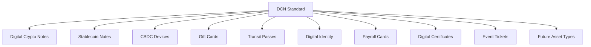
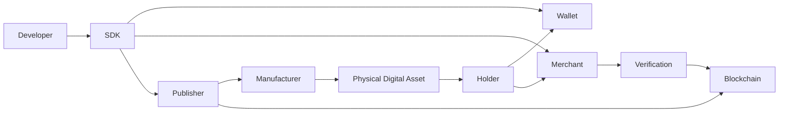

# Why DCN

> **DCN — The Open Standard for Physical Digital Assets**

DCN (Digital Crypto Note) is an open standard that defines how **Physical Digital Assets (PDAs)** can be securely created, issued, owned, transferred, authenticated, and managed using blockchain technology.

Rather than being a single product, blockchain, wallet, or payment application, DCN provides the foundational rules and specifications that allow independent organizations to build interoperable physical digital asset solutions.

Just as internet standards allow different browsers and websites to communicate seamlessly, and payment standards allow cards from different banks to work across millions of merchants, the DCN Standard enables different physical digital assets, wallets, manufacturers, publishers, and blockchain networks to operate together through a common protocol.

***

## What is DCN?

DCN is a **protocol specification** for blockchain-backed physical assets.

It defines:

* How physical assets are manufactured
* How digital assets are securely linked to physical devices
* How ownership is established
* How authenticity is verified
* How assets are transferred
* How security is maintained
* How publishers issue assets
* How wallets interact with assets
* How merchants verify assets
* How lifecycle events are managed

The protocol is intentionally blockchain-agnostic, allowing multiple blockchain ecosystems to participate without requiring changes to the physical asset itself.

***

## From Product to Standard

One of the fundamental design decisions behind DCN is that it is **not limited to Digital Crypto Notes**.

Instead, DCN defines the common infrastructure required for an entire ecosystem of Physical Digital Assets.

Each implementation follows the same core protocol while serving different industries and use cases.

***

## The Role of the DCN Standard

The DCN Standard provides a common language for every participant in the ecosystem.

Instead of each manufacturer or organization creating proprietary hardware and software, DCN establishes standardized interfaces for:

* Physical asset manufacturing
* Cryptographic identity
* Ownership management
* Authentication
* Wallet communication
* NFC interactions
* Publisher operations
* Merchant verification
* Blockchain integration
* Recovery mechanisms

This standardization enables interoperability while allowing organizations to innovate independently.

***

## Physical Digital Assets

A Physical Digital Asset (PDA) is any physical object that securely represents a blockchain-backed digital asset.

Unlike traditional NFC cards or QR-code vouchers, a PDA contains cryptographic identity and follows standardized security and communication protocols defined by DCN.

Examples include:

| Category       | Example                                             |
| -------------- | --------------------------------------------------- |
| Monetary       | Digital Crypto Notes, Stablecoin Notes, CBDCs       |
| Commerce       | Gift Cards, Loyalty Cards, Membership Cards         |
| Government     | Welfare Benefits, Food Assistance, Subsidy Cards    |
| Identity       | Student IDs, Employee Badges, Digital Credentials   |
| Transportation | Metro Cards, Transit Passes, Toll Passes            |
| Finance        | Payroll Cards, Tokenized Bonds, Savings Instruments |
| Enterprise     | Secure Access Credentials, Asset Authentication     |
| Collectibles   | Limited Edition Digital Collectibles                |
| Sustainability | Carbon Credit Certificates                          |

Over time, additional asset categories can be introduced without changing the underlying protocol.

***

## Publisher-Centric Ecosystem

One of the defining characteristics of DCN is its **publisher-neutral architecture**.

Any qualified organization can become a DCN Publisher and issue Physical Digital Assets under the standard.

Examples of publishers include:

* Central banks
* Commercial banks
* Stablecoin issuers
* Government agencies
* Universities
* Enterprises
* Retail brands
* Event organizers
* Public transportation authorities
* Financial institutions
* Blockchain foundations

The protocol does not favor any single issuer. Instead, it provides a consistent framework that all publishers can adopt while maintaining their own business rules and regulatory requirements.

***

## Core Ecosystem Participants

The DCN ecosystem is built around several key participants.

Each participant performs a specialized role while relying on the same protocol for secure interoperability.

***

## Guiding Principles

The development of DCN is based on several long-term principles.

#### Open Standard

The protocol should be openly documented, extensible, and accessible to organizations worldwide.

#### Security by Design

Hardware security, cryptographic protection, and secure communication are integrated into every layer of the architecture.

#### Interoperability

Devices, wallets, publishers, and blockchain networks should work together regardless of vendor.

#### Blockchain Agnostic

The protocol supports multiple blockchain ecosystems without being tied to a single network.

#### User Ownership

Users remain in control of the digital assets represented by their Physical Digital Assets.

#### Future Compatibility

The protocol is designed to support future technologies, asset classes, and communication methods without breaking existing implementations.

***

## Why an Open Standard Matters

Historically, open standards have enabled global interoperability and accelerated innovation.

Examples include:

| Standard            | Industry                    |
| ------------------- | --------------------------- |
| TCP/IP              | Internet Networking         |
| HTTP                | World Wide Web              |
| USB                 | Device Connectivity         |
| EMV                 | Payment Cards               |
| NFC Forum Standards | Contactless Communication   |
| FIDO                | Passwordless Authentication |
| ERC-20              | Fungible Blockchain Tokens  |
| ERC-721             | Non-Fungible Tokens         |
| **DCN**             | **Physical Digital Assets** |

Rather than creating another proprietary platform, DCN aims to establish a common foundation that enables organizations to build compatible physical digital asset ecosystems while encouraging competition, innovation, and long-term interoperability.

***

## Summary

DCN is more than a payment protocol or a hardware product. It is an open standard that defines how blockchain-backed physical assets can be securely created, issued, authenticated, transferred, and managed across industries.

By separating the protocol from any single implementation, DCN provides a flexible foundation capable of supporting everything from Digital Crypto Notes and stablecoin devices to government credentials, transit passes, certificates, and future classes of Physical Digital Assets.
