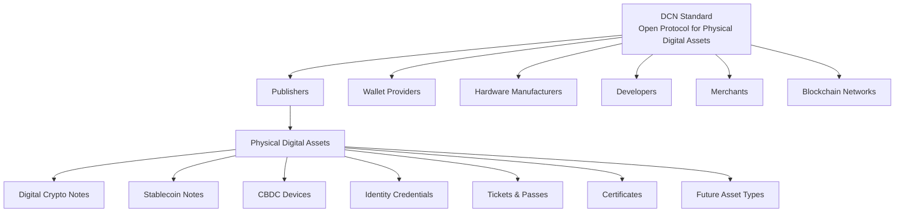

# Introduction

> _"DCN is the open standard for Physical Digital Assets, enabling trusted organizations to securely bridge blockchain-based digital assets with the physical world."_

***

### A New Era of Digital Ownership

The world has entered an era where value is increasingly created, stored, and exchanged in digital form. Cryptocurrencies, stablecoins, tokenized assets, digital identities, and decentralized applications have transformed how people think about ownership and finance. Blockchain technology has introduced a trust model where ownership can be verified without centralized intermediaries, creating new opportunities for global commerce and digital innovation.

Despite these advances, one important challenge remains unresolved: **digital assets largely exist only within digital environments**.

Most blockchain interactions require users to operate mobile applications, browser extensions, hardware wallets, QR codes, recovery phrases, and complex cryptographic concepts. While these tools provide strong security and decentralization, they often present significant barriers for everyday users, merchants, institutions, and governments seeking intuitive ways to interact with digital assets.

The physical world still plays a central role in daily life. People continue to exchange cash, carry identity cards, use payment cards, present event tickets, access buildings with security badges, and receive official certificates in physical form. These physical objects are familiar, portable, and trusted because they simplify interactions between individuals and organizations.

DCN was created to bridge this gap.

***

### Introducing the DCN Standard

**DCN (Digital Crypto Note)** is an **open standard for Physical Digital Assets (PDAs)**.

Rather than defining a single product, blockchain, or payment system, DCN establishes a common framework that allows physical objects to securely represent blockchain-backed digital assets through standardized hardware, cryptographic protocols, communication methods, and lifecycle management.

The standard enables independent organizations to develop interoperable solutions while maintaining security, transparency, and user ownership.

The first reference implementation of the standard is the **Digital Crypto Note**, a secure NFC-enabled physical device capable of representing digital assets such as cryptocurrencies and stablecoins. However, the protocol is intentionally designed to support many additional asset categories and industries.

***

### Physical Digital Assets

A **Physical Digital Asset (PDA)** is a tangible object that securely represents and interacts with a blockchain-backed digital asset.

Unlike traditional NFC cards or proprietary smart cards, Physical Digital Assets are built upon an open protocol that defines:

* Cryptographic identity
* Secure ownership
* Authentication
* Verification
* Lifecycle management
* Publisher trust
* Wallet interoperability
* Multi-chain compatibility

This allows different manufacturers, publishers, wallets, merchants, and blockchain networks to work together using the same standard.

Examples of Physical Digital Assets include:

* Digital Crypto Notes
* Stablecoin Notes
* CBDC Devices
* Government Benefit Cards
* Payroll Cards
* Gift Cards
* Event Tickets
* Transit Passes
* University Certificates
* Digital Identity Credentials
* Carbon Credit Certificates
* Tokenized Financial Instruments
* Enterprise Security Credentials
* Digital Collectibles

As blockchain technology evolves, new asset categories can be introduced without changing the underlying protocol.

***

### An Open Ecosystem

One of the core principles of DCN is openness.

The protocol is designed to enable broad participation rather than creating a proprietary ecosystem controlled by a single organization.

Under the DCN Standard:

* Hardware manufacturers can produce compliant devices.
* Wallet providers can build compatible applications.
* Governments can issue official digital credentials.
* Banks can publish stablecoin or CBDC products.
* Enterprises can issue secure employee credentials.
* Universities can distribute verifiable academic certificates.
* Developers can create new applications using open SDKs and APIs.

Every participant follows the same protocol specifications while retaining flexibility to innovate within their own products and services.

***

### The Foundation for Future Innovation

History has shown that open standards create thriving ecosystems.

The Internet became globally accessible through standardized networking protocols. Payment cards achieved worldwide acceptance through interoperable payment specifications. Blockchain ecosystems expanded through token standards such as ERC-20 and ERC-721.

DCN aims to provide a similar foundation for the physical representation of blockchain-backed digital assets.

Rather than defining every future application, the standard establishes common building blocks that enable innovation across industries while preserving interoperability and long-term compatibility.

***

### High-Level Vision

The relationship between the DCN Standard and its ecosystem can be summarized as follows.

The protocol serves as a shared foundation upon which independent organizations can build secure, interoperable Physical Digital Asset ecosystems.

***

### Building for the Long Term

DCN is not intended to solve only today's payment challenges. It is designed as long-term digital infrastructure capable of supporting future innovations in finance, identity, commerce, public services, and decentralized applications.

As new blockchain technologies, communication standards, and hardware capabilities emerge, the protocol is designed to evolve while maintaining compatibility with existing implementations.

By separating the standard from any single product or organization, DCN creates a foundation that can support global adoption across industries and jurisdictions.

***

### Summary

The emergence of blockchain technology has transformed digital ownership, but its interaction with the physical world remains fragmented. DCN addresses this challenge by defining an open standard that enables secure, interoperable Physical Digital Assets.

By establishing common specifications for publishers, manufacturers, wallets, merchants, and blockchain networks, DCN seeks to provide the missing infrastructure layer between decentralized digital assets and the physical experiences that people use every day.

This vision forms the foundation for the chapters that follow, beginning with the challenges that inspired the creation of the DCN Standard.
