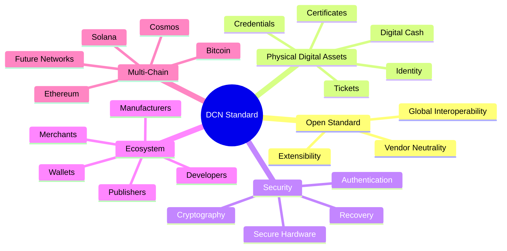

# Key Objectives

> _The objective of DCN is not to create another blockchain, wallet, or payment application. Its objective is to establish the open infrastructure that allows Physical Digital Assets to become universally trusted and interoperable._

***

## Purpose of the DCN Standard

DCN is designed as a foundational protocol that enables organizations worldwide to securely issue, manage, transfer, and verify **Physical Digital Assets (PDAs)**.

Just as the Internet relies on common networking standards and the payment industry relies on interoperable card standards, DCN provides a common framework for blockchain-backed physical assets.

Its purpose is to ensure that assets issued by different publishers, built by different manufacturers, and supported by different blockchain networks can operate together through a single open standard.

***

## Primary Objectives

The DCN Standard is built around several strategic objectives that guide the design of every protocol, interface, and implementation.

***

## Objective 1 — Standardize Physical Digital Assets

Today, physical blockchain-enabled devices are developed independently using proprietary architectures.

DCN aims to establish a common specification for:

* Physical asset architecture
* Device identity
* Secure ownership
* Authentication
* Lifecycle management
* Verification
* Wallet interoperability
* Publisher integration

A standardized approach reduces fragmentation and enables interoperability across the ecosystem.

***

## Objective 2 — Create an Open Publisher Ecosystem

The future of Physical Digital Assets should not depend on a single company or technology provider.

DCN enables any qualified organization to become a publisher.

Examples include:

* Governments
* Central banks
* Commercial banks
* Stablecoin issuers
* Universities
* Enterprises
* Retail organizations
* Event organizers

Every publisher follows the same protocol while maintaining control over its own products, branding, compliance, and business models.

***

## Objective 3 — Simplify User Experience

Blockchain technology should become easier to use without compromising security.

DCN seeks to replace complex blockchain interactions with familiar physical experiences.

Instead of asking users to understand:

* Wallet addresses
* Seed phrases
* Gas fees
* Network selection
* QR codes

Users simply interact with secure Physical Digital Assets through intuitive actions such as:

* Tap
* Verify
* Transfer
* Receive
* Authenticate

This reduces the learning curve for mainstream adoption while preserving the underlying security of blockchain systems.

***

## Objective 4 — Enable Multi-Chain Interoperability

The blockchain ecosystem consists of many independent networks, each serving different purposes.

DCN is designed to support multiple blockchain ecosystems through a common abstraction layer.

Supported implementations may include:

* Ethereum-compatible networks
* Bitcoin
* Solana
* Cosmos
* Polkadot
* Future blockchain platforms

This approach allows publishers and developers to choose the blockchain most appropriate for their applications while maintaining a consistent physical user experience.

***

## Objective 5 — Build Security into Every Layer

Security is fundamental to the DCN architecture.

Rather than relying solely on software, the protocol combines hardware security, cryptography, and standardized authentication to protect Physical Digital Assets throughout their lifecycle.

Key security objectives include:

* Secure key protection
* Hardware-backed identity
* Mutual authentication
* Certificate validation
* Anti-cloning mechanisms
* Secure ownership transfer
* Recovery processes
* Lifecycle integrity

Security is designed to be transparent to users while remaining verifiable by participating systems.

***

## Objective 6 — Encourage Global Interoperability

One of the principal goals of DCN is to prevent ecosystem fragmentation.

Independent organizations should be able to develop compatible implementations without requiring proprietary integrations.

Interoperability extends across:

* Wallets
* Hardware manufacturers
* Publishers
* Merchants
* Verification services
* Blockchain networks

This enables a Physical Digital Asset issued in one ecosystem to be recognized and verified in another, provided both follow the DCN Standard.

***

## Objective 7 — Support Diverse Asset Classes

The protocol is intentionally designed to support a broad range of applications beyond digital currency.

Potential asset categories include:

| Category       | Example Applications                                      |
| -------------- | --------------------------------------------------------- |
| Financial      | Digital Crypto Notes, Stablecoins, CBDCs, Tokenized Bonds |
| Commerce       | Gift Cards, Loyalty Programs, Membership Cards            |
| Government     | Welfare Benefits, Public Services, Digital Credentials    |
| Education      | Diplomas, Certificates, Student Identification            |
| Transportation | Transit Passes, Toll Access, Parking Credentials          |
| Enterprise     | Employee Badges, Device Credentials, Asset Tracking       |
| Sustainability | Carbon Credits, Renewable Energy Certificates             |
| Collectibles   | Limited Edition Digital Assets, Event Memorabilia         |

Future asset categories can be introduced without requiring changes to the core protocol.

***

## Objective 8 — Empower Developers

An open standard succeeds when developers can build upon it with confidence.

DCN therefore prioritizes:

* Open documentation
* Reference implementations
* Software Development Kits (SDKs)
* Standardized APIs
* Test environments
* Certification programs

This lowers the barrier to adoption and encourages innovation across the ecosystem.

***

## Objective 9 — Ensure Long-Term Evolution

Technology evolves continuously.

The DCN Standard is designed to evolve through transparent governance and versioned specifications while maintaining compatibility wherever practical.

Future enhancements may include:

* New communication technologies
* Additional blockchain integrations
* Enhanced security mechanisms
* Advanced recovery models
* Emerging asset classes
* New regulatory frameworks

This approach allows the protocol to adapt without compromising existing implementations.

***

## Measuring Success

The long-term success of DCN will not be measured by the number of devices manufactured or transactions processed alone.

Instead, success will be reflected by the growth of an interoperable ecosystem where multiple participants adopt the standard.

Key indicators include:

* Independent publishers issuing DCN-compliant assets
* Hardware manufacturers producing certified devices
* Wallet providers supporting the protocol
* Merchants accepting Physical Digital Assets
* Governments and enterprises deploying real-world solutions
* Developers building new applications and services

A healthy ecosystem is one where innovation occurs within a shared framework rather than through isolated proprietary systems.

***

## Strategic Vision

The objectives of DCN can be summarized as follows.

***

## Summary

The DCN Standard is designed to become the foundational infrastructure for Physical Digital Assets.

Its objectives extend beyond digital payments to include secure identity, financial instruments, government services, enterprise credentials, and future blockchain-enabled applications.

By standardizing how Physical Digital Assets are issued, authenticated, transferred, and managed, DCN seeks to enable a global ecosystem where organizations can innovate independently while remaining interoperable through a shared open protocol.

***

### Chapter Summary

With this chapter complete, readers should understand:

* **Why** DCN is needed.
* **What problem** it solves.
* **What vision** it aims to achieve.
* **What strategic objectives** guide the development of the standard.

These concepts form the foundation for the remainder of the specification.
