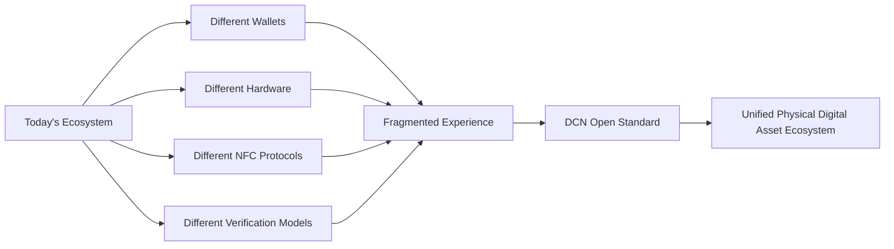

# The Problem

> _Blockchain has revolutionized digital ownership, but it has not yet revolutionized how people experience digital ownership in the physical world._

***

### The Missing Bridge Between Physical and Digital

Blockchain technology has fundamentally changed how digital assets are created, owned, and transferred. Millions of people now hold cryptocurrencies, stablecoins, tokenized assets, and digital collectibles that exist entirely on decentralized networks.

However, despite the maturity of blockchain infrastructure, the user experience remains largely confined to screens, applications, and complex software.

Today's blockchain ecosystem requires users to interact with:

* Mobile wallet applications
* Browser extensions
* Hardware wallets
* QR codes
* Seed phrases
* Private keys
* Smart contract approvals
* Blockchain explorers

These tools are powerful but often difficult for non-technical users to understand.

The result is a growing gap between blockchain technology and mainstream adoption.

***

## Digital Assets Feel Invisible

Throughout history, valuable assets have almost always had a physical representation.

Examples include:

| Asset          | Physical Representation |
| -------------- | ----------------------- |
| Cash           | Banknotes and coins     |
| Credit         | Payment cards           |
| Identity       | Passport, ID card       |
| Education      | Degree certificate      |
| Transportation | Transit card            |
| Events         | Printed ticket          |
| Membership     | Membership card         |
| Property       | Ownership documents     |

People instinctively understand how to use these physical objects because they provide a simple and familiar interaction model.

Blockchain, by contrast, removes the physical interface almost entirely.

Ownership exists digitally, but users often cannot physically see, carry, or exchange that ownership in intuitive ways.

***

## Complexity Slows Adoption

Although blockchain technology offers remarkable capabilities, interacting with it often requires knowledge that ordinary users do not possess.

A typical cryptocurrency transaction may require understanding:

* Wallet addresses
* Network selection
* Gas fees
* Transaction confirmations
* Token standards
* Smart contract permissions
* Recovery phrases

Even experienced users occasionally make irreversible mistakes.

Common examples include:

* Sending assets to the wrong network
* Losing recovery phrases
* Sharing private keys
* Sending to incorrect addresses
* Paying excessive gas fees
* Falling victim to phishing attacks

For new users, these complexities can make blockchain appear intimidating and risky.

***

## The Merchant Challenge

Merchants also face challenges when accepting blockchain-based payments.

Current solutions often depend on:

* QR code scanning
* Wallet compatibility
* Network availability
* Customer familiarity
* Manual payment verification

Compared with contactless payment cards or cash, crypto payments frequently involve additional steps that increase transaction time and reduce customer confidence.

For merchants serving large numbers of customers, simplicity is essential.

***

## The Institutional Challenge

Governments, banks, universities, enterprises, and public service organizations increasingly recognize the value of blockchain technology.

However, deploying blockchain solutions at national or enterprise scale requires more than secure ledgers.

Institutions also need:

* Standardized issuance processes
* Secure physical devices
* Identity verification
* Authentication mechanisms
* Lifecycle management
* Recovery procedures
* Compliance controls
* Hardware security

Today, many organizations build proprietary systems that solve similar problems in different ways, creating fragmentation and limiting interoperability.

***

## No Common Standard Exists

Blockchain ecosystems have standardized many digital concepts.

Examples include:

* Token standards
* Wallet interfaces
* Smart contracts
* Digital signatures
* Consensus protocols

Yet there is currently **no widely accepted open standard** for Physical Digital Assets.

Every implementation tends to define its own:

* Hardware architecture
* NFC communication
* Authentication protocol
* Manufacturing process
* Ownership model
* Recovery system
* Verification method

This fragmentation prevents devices and platforms from working together seamlessly.

***

## Why Existing Solutions Are Not Enough

Several technologies address parts of the problem, but none provide a complete open framework.

| Technology       | Strength                  | Limitation                                                             |
| ---------------- | ------------------------- | ---------------------------------------------------------------------- |
| Hardware Wallets | Secure key storage        | Designed for individual crypto users, not standardized physical assets |
| Payment Cards    | Simple user experience    | Closed financial ecosystems                                            |
| NFC Smart Cards  | Contactless communication | No blockchain-native ownership model                                   |
| QR Codes         | Easy to generate          | Require cameras, applications, and visual interaction                  |
| Mobile Wallets   | Flexible software         | Depend on smartphones and battery power                                |

Each solves a specific challenge, but none establishes a universal protocol for blockchain-backed physical assets.

***

## The Need for an Open Infrastructure Layer

Just as the Internet required TCP/IP and the payment industry required EMV, the blockchain ecosystem now requires a standardized physical infrastructure layer.

That layer should define:

* How assets are issued
* How physical devices are secured
* How ownership is established
* How authenticity is verified
* How wallets communicate
* How merchants interact
* How assets are recovered
* How publishers participate
* How multiple blockchain networks interoperate

Rather than prescribing one product, this infrastructure should allow many independent implementations to coexist.

***

## The Opportunity

The absence of a common standard creates an opportunity to establish a universal framework that connects physical objects with decentralized digital ownership.

Such a framework could enable:

* Digital cash that feels as intuitive as paper currency
* Government-issued blockchain credentials
* Secure digital identity cards
* Tokenized financial instruments
* Blockchain-enabled transit passes
* Verifiable academic certificates
* Enterprise security credentials
* Physical representations of future digital assets

All operating under a common, interoperable protocol.

***

## The Role of DCN

DCN was created to address these challenges.

Instead of introducing another wallet, another blockchain, or another payment application, DCN defines the rules that allow every participant in the ecosystem to communicate through a shared standard.

By establishing common specifications for hardware, software, authentication, ownership, and lifecycle management, DCN aims to become the foundational infrastructure for Physical Digital Assets.

***

## Summary

Blockchain technology has transformed digital ownership but has not yet provided an intuitive, standardized way to bring those assets into the physical world.

Users face complexity, merchants lack interoperability, and institutions often build isolated solutions that cannot easily work together.

DCN addresses this gap by defining an open standard that connects secure hardware, blockchain networks, publishers, wallets, merchants, and users through a common protocol for Physical Digital Assets.

The following section introduces the long-term vision that this standard seeks to achieve.
