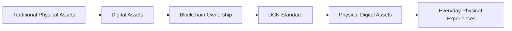
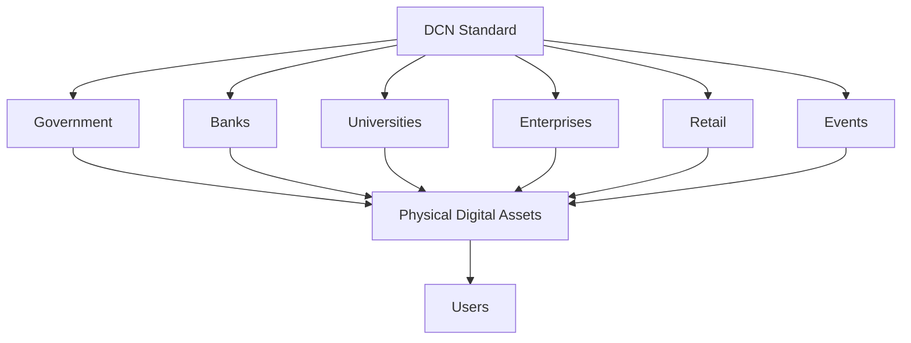
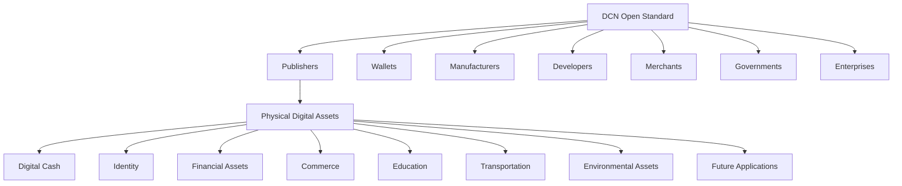

# The Vision

> _"To establish DCN as the global open standard for Physical Digital Assets, enabling secure, interoperable, and trusted interactions between blockchain networks and the physical world."_

***

### A World Where Digital Assets Become Physical

Imagine a future where interacting with blockchain-based assets is as natural as using cash, tapping a payment card, presenting an identity card, or showing an event ticket.

Instead of opening multiple wallet applications, copying long addresses, scanning QR codes, or remembering recovery phrases, users simply interact with secure physical objects that represent their digital assets while preserving blockchain ownership and cryptographic security.

This is the future that DCN aims to enable.

DCN envisions a world where blockchain technology becomes part of everyday life—not because people understand the underlying technology, but because interacting with it becomes intuitive, secure, and universally accepted.

***

## From Digital Assets to Physical Digital Assets

Blockchain has successfully digitized ownership.

DCN extends that achievement by standardizing **physical representations of digital ownership**.

Rather than replacing blockchain, DCN complements it by providing the missing physical interaction layer.

***

## Beyond Digital Crypto Notes

Although the first reference implementation is called the **Digital Crypto Note**, the long-term vision extends far beyond cryptocurrency.

DCN is designed to become the common foundation for many categories of Physical Digital Assets.

Examples include:

#### Financial

* Digital Crypto Notes
* Stablecoin Notes
* CBDC Devices
* Payroll Cards
* Tokenized Bonds
* Savings Instruments

#### Government

* National Digital Identity
* Welfare Distribution
* Subsidy Programs
* Public Service Credentials
* Emergency Aid Distribution

#### Education

* Student Identification
* Digital Diplomas
* Academic Certificates
* Campus Access Credentials

#### Commerce

* Gift Cards
* Loyalty Programs
* Membership Cards
* Promotional Vouchers

#### Transportation

* Transit Passes
* Toll Credentials
* Parking Access
* Travel Tickets

#### Enterprise

* Employee Identification
* Building Access
* Equipment Authentication
* Secure Device Credentials

#### Sustainability

* Carbon Credit Certificates
* Renewable Energy Certificates
* Environmental Incentives

As new industries emerge, additional asset types can be introduced without changing the underlying DCN protocol.

***

## A Universal Publisher Network

The future envisioned by DCN is one where any trusted organization can become a **Publisher**.

Rather than relying on a single central authority, the ecosystem supports multiple independent publishers operating under the same open standard.

Potential publishers include:

* Central banks
* Commercial banks
* Governments
* Universities
* Enterprises
* Stablecoin issuers
* Retail brands
* Transportation authorities
* Healthcare providers
* Event organizers

Each publisher can issue its own Physical Digital Assets while remaining interoperable with wallets, verification services, and compliant infrastructure worldwide.

***

## An Open Global Ecosystem

The Internet became successful because it was built on open standards.

The payment industry achieved worldwide interoperability through common specifications.

Blockchain ecosystems grew through open token standards.

DCN follows the same philosophy.

The standard is intended to encourage innovation while ensuring compatibility across:

* Hardware manufacturers
* Wallet providers
* Publishers
* Merchants
* Developers
* Blockchain networks
* Verification services

No single organization owns the ecosystem.

Instead, organizations collaborate through shared protocol specifications.

***

## Security Without Complexity

The long-term vision is to make blockchain security largely invisible to end users.

Instead of requiring people to understand cryptography, private keys, or network configuration, the protocol embeds security into every interaction.

Users experience simple actions such as:

* Tap
* Verify
* Transfer
* Receive
* Authenticate

Behind these interactions, the protocol manages:

* Cryptographic authentication
* Secure key protection
* Certificate validation
* Ownership verification
* Blockchain synchronization

This separation allows sophisticated security mechanisms to coexist with a simple user experience.

***

## A Multi-Chain Future

Blockchain innovation is not limited to a single network.

DCN is designed from the beginning to support multiple blockchain ecosystems.

Examples include:

* Ethereum-compatible networks
* Bitcoin-based assets
* Solana
* Cosmos
* Polkadot
* Future blockchain protocols

The goal is not to replace existing blockchains, but to provide a consistent physical interface across them.

***

## Building Digital Infrastructure for Decades

Many technology standards have remained relevant for decades because they were designed as foundational infrastructure rather than products.

DCN follows the same approach.

The protocol is designed to evolve through:

* New asset classes
* Improved hardware
* Emerging communication technologies
* Advances in cryptography
* New blockchain networks
* Updated security practices

While implementations may evolve, the core principles of interoperability, security, openness, and user ownership remain constant.

***

## The Long-Term Vision

The future ecosystem envisioned by DCN can be represented as follows.

This architecture illustrates DCN's role as an infrastructure layer rather than a single application.

***

## Summary

The vision of DCN is to establish the world's first open standard for Physical Digital Assets.

By providing a common framework for issuance, ownership, authentication, verification, lifecycle management, and interoperability, DCN enables governments, financial institutions, enterprises, developers, and manufacturers to build trusted blockchain-enabled physical experiences.

Rather than creating another isolated platform, DCN seeks to become the shared infrastructure upon which future physical digital asset ecosystems are built.
