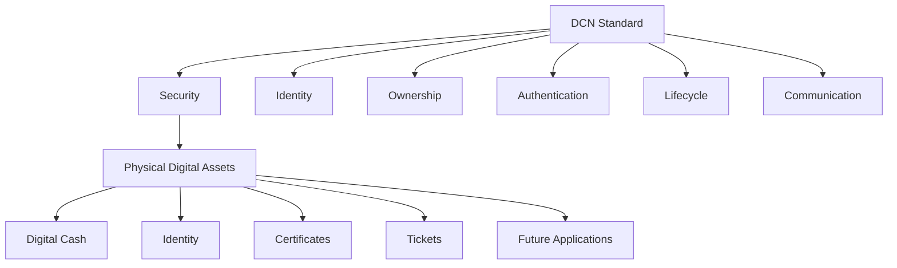

# 2. Why Physical Digital Assets

> _Blockchain solved digital ownership. DCN solves how people interact with that ownership in the physical world._

***

### Introduction

Since the invention of blockchain technology, the world has witnessed a fundamental transformation in how digital value is created, owned, and exchanged. Cryptocurrencies, tokenized assets, decentralized finance (DeFi), non-fungible tokens (NFTs), and digital identities have demonstrated that ownership no longer requires centralized authorities.

However, while blockchain has successfully digitized ownership, **it has not standardized the physical experience of ownership.**

Today, nearly every blockchain interaction occurs through a screen.

Users open mobile wallets, browser extensions, desktop applications, or hardware wallets to interact with assets that exist entirely in digital form.

Although technically secure, this interaction model is not always intuitive for the billions of people who are accustomed to carrying and exchanging physical objects every day.

This chapter explains why the next stage of blockchain adoption requires more than digital infrastructure—it requires a standardized physical layer.

***

## The Evolution of Ownership

Throughout human history, ownership has always been represented physically.

When people exchanged value, proved identity, or demonstrated rights, they relied on tangible objects that could be easily recognized and trusted.

Examples include:

| Purpose        | Physical Representation      |
| -------------- | ---------------------------- |
| Money          | Coins and Banknotes          |
| Identity       | Passports and Identity Cards |
| Banking        | Debit and Credit Cards       |
| Education      | Diplomas and Certificates    |
| Transportation | Tickets and Transit Cards    |
| Membership     | Membership Cards             |
| Government     | Licenses and Benefit Cards   |

These physical objects simplified human interaction because they were:

* Easy to carry
* Easy to verify
* Familiar
* Trusted
* Portable
* Independent of internet connectivity
* Simple enough for anyone to understand

Blockchain introduced digital ownership, but the physical representation disappeared.

***

## Blockchain Changed Ownership, Not Experience

Blockchain technology answered one important question:

> **"Who owns this digital asset?"**

But it did not fully answer another equally important question:

> **"How should people interact with this ownership in everyday life?"**

Today, users often experience blockchain through:

* Mobile applications
* Browser extensions
* QR codes
* Wallet addresses
* Seed phrases
* Transaction hashes
* Gas fees

These are powerful technical mechanisms, but they are not natural human interfaces.

As a result, blockchain ownership often feels invisible and abstract compared with physical assets people use every day.

***

## Humans Naturally Understand Physical Objects

People do not need training to understand a banknote.

They instinctively know:

* who holds it,
* how to exchange it,
* when ownership changes,
* and how to verify its authenticity.

The same principle applies to:

* passports,
* tickets,
* payment cards,
* employee badges,
* certificates,
* access cards.

The physical object itself becomes part of the user experience.

Blockchain currently lacks this universally understood physical interaction layer.

***

## The Missing Physical Layer

The blockchain industry has spent more than a decade improving:

* consensus algorithms,
* scalability,
* smart contracts,
* decentralized finance,
* interoperability,
* tokenization.

Yet one critical layer remains largely undefined:

> **How should blockchain assets exist and operate in the physical world?**

There is currently no universally accepted standard defining:

* Physical blockchain devices
* Physical ownership
* Device identity
* Hardware authentication
* Publisher trust
* Lifecycle management
* Physical verification
* Secure transfer

Each project builds its own proprietary solution.

The result is fragmentation.

***

## Physical Digital Assets

DCN introduces a new concept:

### **Physical Digital Assets (PDAs)**

A Physical Digital Asset is a physical object that securely represents and interacts with a blockchain-backed digital asset through standardized hardware, cryptographic identity, and communication protocols.

Unlike traditional smart cards or NFC tags, a PDA is designed to become an active participant in the blockchain ecosystem.

A Physical Digital Asset is capable of:

* Proving authenticity
* Proving ownership
* Secure communication
* Cryptographic authentication
* Blockchain interaction
* Secure lifecycle management

This transforms a simple physical object into a trusted blockchain interface.

***

## Why Standards Matter

History has repeatedly shown that industries grow faster when they adopt common standards.

Without standards:

* Every implementation becomes proprietary.
* Systems cannot interoperate.
* Manufacturers become vendor-locked.
* Developers build incompatible solutions.
* Adoption slows.

With standards:

* Innovation accelerates.
* Competition increases.
* Compatibility improves.
* Costs decrease.
* User confidence grows.

This is why the Internet, payment cards, Wi-Fi, Bluetooth, USB, and blockchain token standards have all succeeded.

DCN applies the same philosophy to Physical Digital Assets.

***

## Beyond Cryptocurrency

Although cryptocurrencies inspired the creation of DCN, the standard is intentionally much broader.

A Physical Digital Asset is not limited to representing money.

It can represent almost any blockchain-backed right, entitlement, or credential.

Examples include:

#### Financial

* Digital Crypto Notes
* Stablecoin Notes
* CBDCs
* Tokenized Bonds

#### Commerce

* Gift Cards
* Loyalty Programs
* Membership Cards

#### Government

* Welfare Benefits
* Subsidies
* Digital Licenses
* Citizen Credentials

#### Education

* Student IDs
* Diplomas
* Academic Certificates

#### Enterprise

* Employee Identification
* Building Access
* Device Credentials

#### Transportation

* Transit Passes
* Toll Cards
* Parking Credentials

#### Sustainability

* Carbon Credits
* Renewable Energy Certificates

The same protocol supports all of these use cases.

***

## The Role of DCN

DCN does not define one specific product.

Instead, it defines **how Physical Digital Assets should work**, regardless of who builds them or what they represent.

This architecture allows innovation at the application layer while preserving interoperability at the protocol layer.

***

## Why This Matters

The long-term success of blockchain will not depend solely on faster transactions or more scalable networks.

It will also depend on making blockchain accessible to ordinary people.

Physical Digital Assets provide a familiar interaction model that reduces complexity while preserving the security and transparency of blockchain technology.

By combining secure hardware with open standards, DCN enables digital ownership to become tangible, portable, and intuitive.

***

## Summary

Blockchain introduced a revolutionary model of digital ownership, but the physical experience of that ownership remains fragmented and largely undefined.

Physical Digital Assets bridge this gap by giving blockchain-backed assets a secure, standardized physical representation.

DCN establishes the open standard that enables these assets to be created, issued, authenticated, transferred, and managed consistently across industries, organizations, and blockchain networks.

This foundation prepares the reader for the historical journey of value exchange and ownership, beginning with the **Evolution of Money**, where we examine how society progressed from physical commodities to digital assets—and why the next logical step is the emergence of Physical Digital Assets.

***

## In this chapter

* [Evolution of Money](evolution-of-money.md)
* [Blockchain Without Physical Presence](blockchain-without-physical-presence.md)
* [The Missing Physical Layer](the-missing-physical-layer.md)
* [Why DCN Exists](why-dcn-exists.md)
