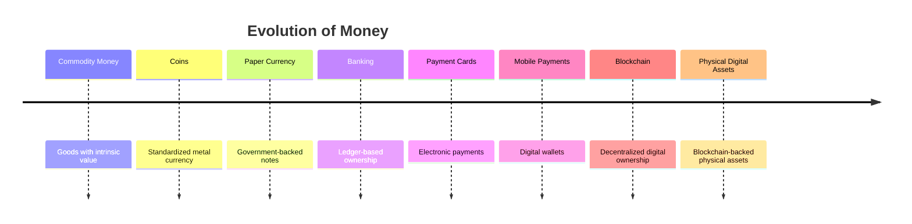

# Evolution of Money

> _Money has continuously evolved to solve one fundamental challenge: making the exchange of value easier, safer, faster, and more trusted. Every major evolution introduced a better representation of value. DCN represents the next step in that evolution._

***

### Introduction

The history of money is not simply the history of currency—it is the history of how civilization represents trust and value.

As societies became more complex, the methods used to exchange value also evolved. Each generation solved the limitations of the previous one by introducing a more efficient way to represent ownership.

The journey began with physical commodities, progressed through coins and paper currency, evolved into banking systems and electronic payments, and eventually entered the era of blockchain-based digital assets.

Today, blockchain enables decentralized digital ownership, but one important element has been lost during this evolution—the **physical experience of ownership**.

DCN seeks to restore that missing connection.

***

## The Evolution of Value

The evolution of money can be viewed as a progression of increasingly efficient trust systems.

Each stage solved existing problems while introducing new opportunities.

***

## Stage 1 — Commodity Money

Thousands of years ago, people exchanged goods directly through barter.

Items such as:

* Grain
* Salt
* Livestock
* Precious metals
* Shells
* Tea
* Spices

were used as mediums of exchange because they possessed recognized value.

However, barter presented major challenges.

People needed:

* Mutual demand
* Difficult transportation
* Difficult storage
* Inconsistent valuation
* Limited divisibility

Economic growth required a better system.

***

## Stage 2 — Coins

The introduction of metal coins represented one of history's greatest financial innovations.

Coins provided:

* Standardized value
* Government authority
* Durability
* Portability
* Easy verification

Instead of evaluating the value of each traded commodity, people trusted standardized coins issued by recognized authorities.

This dramatically increased commercial activity.

Yet coins still had limitations.

Large transactions required transporting significant amounts of metal, making commerce inefficient.

***

## Stage 3 — Paper Currency

Paper currency solved the transportation problem.

Rather than carrying heavy metal coins, people could exchange lightweight notes representing value.

Paper money introduced several advantages:

* Easier transportation
* Lower production costs
* Faster transactions
* Large denomination support
* Centralized monetary control

Governments became trusted issuers of value.

The note itself became a physical representation of monetary trust.

***

## Stage 4 — Banking Systems

As economies expanded, ownership gradually shifted from physical possession to financial records maintained by banks.

People no longer needed to carry all their wealth physically.

Instead, value was represented by:

* Bank accounts
* Ledgers
* Statements
* Transfers
* Cheques

Trust moved from physical currency toward institutional record keeping.

Banks became custodians of financial ownership.

***

## Stage 5 — Payment Cards

Payment cards transformed banking by making electronic access to funds simple.

Instead of carrying large amounts of cash, users could carry a small plastic card linked to their accounts.

Cards introduced:

* Instant authorization
* Electronic settlement
* Global acceptance
* Contactless payments
* ATM access

Although the physical card itself contained little monetary value, it became a trusted interface to digital banking systems.

This was a major shift: **the physical object no longer represented value directly—it represented secure access to value.**

***

## Stage 6 — Mobile Payments

Smartphones further simplified payments.

Applications replaced many physical cards.

Users could now:

* Pay with mobile wallets
* Transfer money instantly
* Authenticate using biometrics
* Store multiple payment methods

Digital convenience increased dramatically.

However, reliance on smartphones introduced new dependencies:

* Battery life
* Internet connectivity
* Software compatibility
* Device security
* Application ecosystems

The user experience remained tied to screens.

***

## Stage 7 — Blockchain

Blockchain fundamentally changed how ownership is established.

For the first time, digital assets could exist independently of banks or centralized authorities.

Blockchain introduced:

* Decentralized ownership
* Cryptographic security
* Programmable assets
* Smart contracts
* Transparent verification
* Global accessibility

Ownership became mathematically verifiable rather than institutionally maintained.

This represented one of the largest shifts in financial history.

However, blockchain ownership remained almost entirely digital.

***

## The Missing Evolution

Each stage in the history of money improved one or more of the following:

* Trust
* Accessibility
* Portability
* Security
* Efficiency

Blockchain solved many longstanding trust problems, but it also removed the familiar physical interface that people had relied upon for centuries.

Today, blockchain users often interact with:

* Wallet addresses
* QR codes
* Recovery phrases
* Applications
* Browser extensions

These are technically effective, but they are not natural physical experiences.

The next logical evolution is therefore **not replacing blockchain—it is making blockchain physically accessible.**

***

## The Next Stage: Physical Digital Assets

DCN introduces the next stage in the evolution of money.

Rather than replacing existing financial systems, it extends blockchain into the physical world through standardized Physical Digital Assets.

In this model:

* Blockchain continues to provide decentralized ownership.
* Physical Digital Assets provide intuitive human interaction.
* DCN provides the open standard connecting both worlds.

***

## Evolution Beyond Currency

While the history of money provides the inspiration, DCN is not limited to monetary assets.

The same evolutionary principles apply to many forms of ownership.

Future Physical Digital Assets may represent:

* Digital currencies
* Stablecoins
* CBDCs
* Identity credentials
* Academic certificates
* Transit passes
* Government benefits
* Enterprise access credentials
* Carbon credits
* Tokenized securities

In this sense, DCN extends the evolution of **ownership**, not just the evolution of money.

***

## Why This Evolution Matters

Every successful evolution of money has shared one common objective:

> **Make trusted value easier for people to use.**

DCN continues that tradition by combining the trust of blockchain with the simplicity of physical interaction.

Instead of forcing people to adapt to increasingly complex digital systems, DCN brings digital ownership into a form that feels familiar, intuitive, and universally understandable.

The objective is not to replace existing financial infrastructure, but to create the next generation of trusted physical interfaces for the digital economy.

***

## Summary

The evolution of money demonstrates that every major advancement has improved how society represents and exchanges value.

Blockchain introduced decentralized digital ownership, but it left the physical layer largely undefined.

DCN builds upon this history by introducing Physical Digital Assets—secure physical representations of blockchain-backed ownership—creating the next evolutionary step in how people interact with value in an increasingly digital world.
