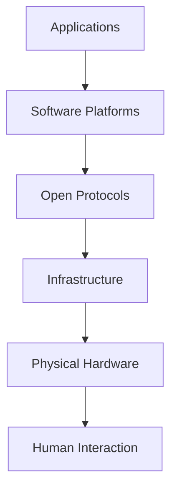
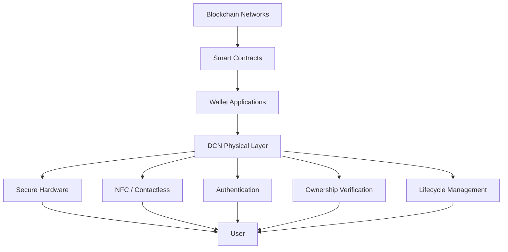

# The Missing Physical Layer

> _The Internet standardized how information moves. Blockchain standardized how digital ownership works. DCN standardizes how people physically interact with digital ownership._

***

### Introduction

Every successful technology ecosystem consists of multiple layers working together.

For example, the Internet is not simply websites. It is built upon physical cables, networking protocols, routers, operating systems, browsers, and applications.

Similarly, blockchain is not just cryptocurrency. It consists of consensus algorithms, distributed ledgers, cryptographic signatures, smart contracts, wallets, and decentralized applications.

Yet one important layer has never been formally standardized:

**The Physical Interaction Layer.**

This is the layer where humans physically interact with digital ownership.

DCN defines this missing layer.

***

## Understanding Technology Layers

Most modern technologies are built as layered architectures.

Each layer has a specific responsibility.

Blockchain has standardized many digital layers.

However, the final interaction between humans and blockchain assets remains fragmented.

***

## Blockchain Already Has Strong Digital Layers

Today's blockchain ecosystem already includes mature standards for:

* Consensus mechanisms
* Smart contracts
* Token standards
* Wallet interfaces
* Digital signatures
* Cryptographic security
* Decentralized applications

These standards allow independent systems to communicate with one another.

For example:

* ERC-20 defines fungible tokens.
* ERC-721 defines non-fungible tokens.
* WalletConnect enables wallet interoperability.
* JSON-RPC provides blockchain communication.

These standards accelerated innovation because developers built upon common foundations instead of creating incompatible systems.

***

## The Layer That Does Not Exist

Although blockchain standardized digital ownership, there is no equivalent standard for physical interaction.

Questions such as the following remain unanswered:

* How should a blockchain asset exist as a physical object?
* How should a wallet authenticate that object?
* How can merchants verify authenticity?
* How can publishers securely issue physical assets?
* How should ownership transfer be represented physically?
* How should counterfeit protection work?
* How can different manufacturers build compatible devices?

Today, every organization answers these questions differently.

This creates isolated ecosystems rather than a unified industry.

***

## Fragmentation Across the Industry

Many companies have introduced blockchain-enabled physical products.

Examples include:

* Hardware wallets
* NFC payment devices
* Crypto cards
* Secure authentication tokens
* Cold storage devices
* Smart cards

Each solution has unique strengths.

However, most implement their own:

* Communication protocol
* Hardware architecture
* Authentication flow
* Device identity
* Security model
* Recovery mechanism
* Wallet integration

Because there is no shared specification, interoperability is limited.

***

## The Consequences of Fragmentation

Without a common physical standard:

#### Users

* Learn different workflows for different products.
* Face inconsistent user experiences.
* Cannot easily move between ecosystems.

#### Developers

* Build separate integrations for every device.
* Maintain multiple SDKs.
* Increase development costs.

#### Manufacturers

* Produce proprietary hardware.
* Depend on vendor-specific software.
* Cannot easily support multiple ecosystems.

#### Publishers

* Must build complete infrastructure independently.
* Cannot leverage existing interoperable tools.
* Face higher deployment costs.

Innovation continues, but it occurs in isolated environments rather than within a connected ecosystem.

***

## The Role of the Physical Layer

The Physical Layer should perform one simple role:

> **Provide a standardized bridge between humans and blockchain ownership.**

This layer should define:

* Device identity
* Secure authentication
* Physical ownership
* Communication interfaces
* Trust verification
* Asset lifecycle
* Recovery mechanisms
* Publisher certificates
* Wallet interoperability

It should not dictate business models or blockchain implementations.

Instead, it provides common rules that every participant can follow.

***

## DCN as the Physical Layer

DCN fills this missing layer by defining an open specification for Physical Digital Assets.

Rather than replacing existing blockchain standards, DCN complements them.

***

## What the Physical Layer Standardizes

The DCN Standard focuses on defining how physical assets behave, regardless of the blockchain or manufacturer.

Core areas include:

### Identity

Every Physical Digital Asset has a unique cryptographic identity.

### Authentication

Devices prove authenticity through standardized cryptographic protocols.

### Ownership

Ownership is securely linked to blockchain-based digital assets.

### Communication

Standardized NFC and secure communication interfaces allow interoperability.

### Lifecycle

Assets follow consistent issuance, activation, transfer, suspension, recovery, and retirement procedures.

### Verification

Merchants, wallets, and verification services use common methods to validate authenticity.

***

## What the Physical Layer Does Not Define

Equally important is what DCN intentionally leaves outside its scope.

DCN does **not** define:

* A new blockchain
* A consensus algorithm
* A cryptocurrency
* Monetary policy
* Smart contract programming language
* Wallet implementation details
* Regulatory frameworks
* Commercial business models

These remain the responsibility of individual blockchain networks, publishers, governments, and application developers.

This separation keeps the protocol flexible and broadly applicable.

***

## The Power of Open Standards

History demonstrates that open standards enable entire industries to flourish.

Examples include:

| Standard            | Industry Impact                  |
| ------------------- | -------------------------------- |
| TCP/IP              | Internet communication           |
| HTTP                | World Wide Web                   |
| USB                 | Universal hardware connectivity  |
| Bluetooth           | Wireless device interoperability |
| EMV                 | Global payment card acceptance   |
| NFC Forum Standards | Contactless communication        |
| ERC-20              | Fungible blockchain tokens       |
| ERC-721             | Digital collectibles and NFTs    |

Each standard allowed independent organizations to innovate while maintaining compatibility.

DCN aims to play the same role for Physical Digital Assets.

***

## Building an Ecosystem Instead of a Product

DCN is designed as infrastructure rather than a single commercial solution.

This enables:

* Multiple hardware manufacturers
* Multiple wallet providers
* Multiple publishers
* Multiple verification services
* Multiple blockchain networks
* Multiple application developers

All participating within the same interoperable ecosystem.

This approach reduces vendor lock-in and encourages healthy competition.

***

## Looking Ahead

The Physical Layer enables future applications that extend well beyond digital payments.

Potential implementations include:

* Physical Stablecoins
* CBDC Notes
* Digital Identity Cards
* Healthcare Credentials
* Academic Certificates
* Event Tickets
* Enterprise Access Devices
* Carbon Credit Certificates
* Tokenized Securities
* Machine-to-Machine Authentication

Because these applications share common requirements for identity, authentication, ownership, and verification, they can all build upon the same DCN foundation.

***

## Summary

Blockchain has successfully standardized digital ownership but has never defined a universal physical interaction layer.

As a result, today's ecosystem consists of many proprietary hardware products, authentication methods, and user experiences that rarely interoperate.

DCN addresses this challenge by introducing an open Physical Layer Standard that defines how Physical Digital Assets are identified, authenticated, transferred, verified, and managed throughout their lifecycle.

By establishing this missing layer, DCN enables a future where blockchain ownership is not only secure and decentralized but also tangible, intuitive, and universally interoperable.
