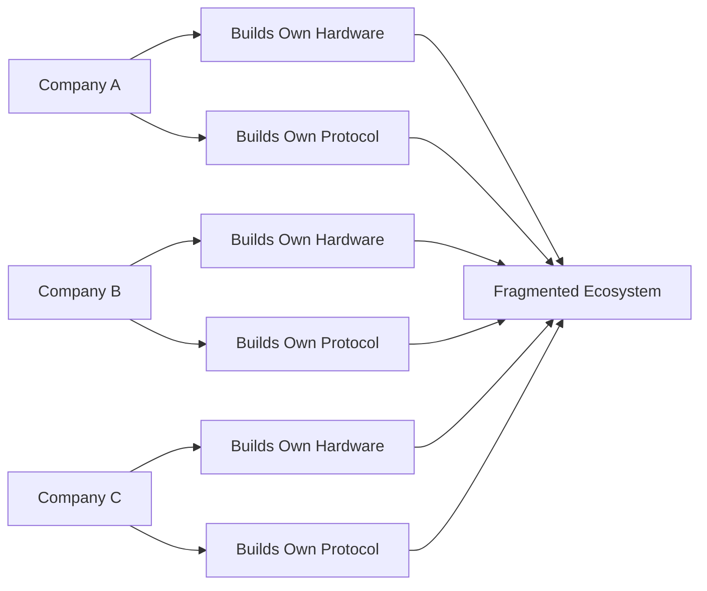
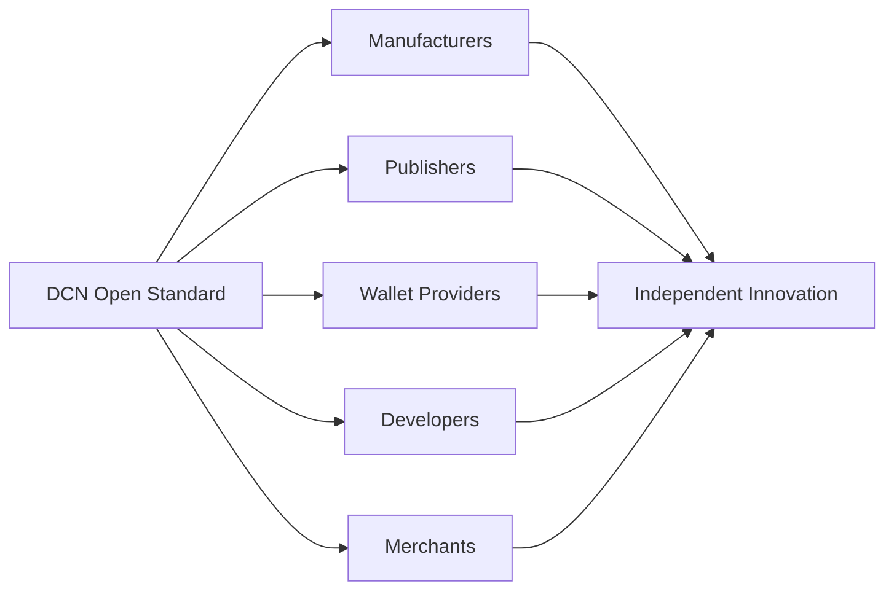
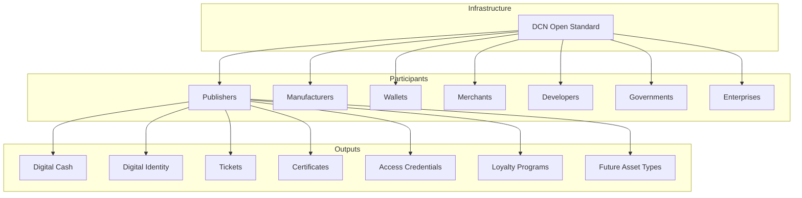

# Why DCN Exists

> _DCN exists to establish an open, secure, and interoperable standard that brings digital ownership into the physical world._

***

### Introduction

Blockchain technology has transformed the way people own and exchange digital assets. It has enabled decentralized finance, programmable money, tokenized real-world assets, and digital identity systems that operate without centralized intermediaries.

Despite these breakthroughs, one challenge remains largely unsolved:

**There is no universal standard for representing and interacting with digital assets in the physical world.**

Today, organizations that wish to create blockchain-enabled physical products must build almost everything themselves—from secure hardware and authentication protocols to wallet integrations and lifecycle management.

This approach is expensive, fragmented, and difficult to scale.

DCN was created to solve this problem.

***

## The Industry Does Not Need Another Blockchain

The blockchain ecosystem already contains hundreds of public and private networks.

Each offers different strengths:

* High performance
* Smart contracts
* Privacy
* Scalability
* Enterprise features
* Regulatory compliance

The objective of DCN is **not** to compete with these networks.

Instead, DCN complements them.

Just as USB did not replace computers, and EMV did not replace banks, DCN does not replace blockchains—it provides the standard that allows physical assets to interact with them consistently.

***

## The Industry Does Not Need Another Wallet

Thousands of wallet applications already exist.

Some focus on:

* Self-custody
* Institutional custody
* Hardware security
* DeFi
* NFTs
* Cross-chain assets

DCN is not intended to become another wallet competing for users.

Instead, DCN defines **how wallets communicate with Physical Digital Assets**, allowing any compliant wallet to support any compliant asset.

This encourages competition while preserving interoperability.

***

## The Industry Does Not Need Proprietary Hardware

Today, many blockchain-enabled hardware products are designed as closed ecosystems.

Each manufacturer typically develops:

* Its own hardware
* Its own firmware
* Its own mobile application
* Its own authentication protocol
* Its own recovery mechanism

While these products may be secure, they often cannot interoperate with products from other vendors.

This fragmentation slows adoption and increases development costs.

DCN defines common specifications so that manufacturers can innovate without sacrificing compatibility.

***

## The Missing Standard

Most successful technology industries are built upon open standards.

Consider a few examples:

| Industry      | Open Standard    | What It Standardized             |
| ------------- | ---------------- | -------------------------------- |
| Internet      | TCP/IP           | Network communication            |
| Web           | HTTP             | Information exchange             |
| Payment Cards | EMV              | Card authentication and payments |
| Contactless   | NFC Forum        | Near-field communication         |
| Blockchain    | ERC-20 / ERC-721 | Digital asset formats            |
| Wireless      | Bluetooth        | Device connectivity              |

Each of these standards solved a common problem by creating a shared language for independent systems.

DCN applies this same philosophy to Physical Digital Assets.

***

## A Shared Foundation for Innovation

Without a common standard, every organization must solve the same problems independently.

Every participant spends time solving identical infrastructure problems instead of creating new products and services.

DCN changes this model.

By standardizing the foundation, organizations can focus on innovation rather than rebuilding infrastructure.

***

## Enabling a Global Publisher Ecosystem

One of DCN's core principles is that **any qualified organization should be able to publish Physical Digital Assets**.

Examples include:

* Governments issuing digital identity credentials.
* Central banks issuing CBDC-based physical instruments.
* Stablecoin issuers creating branded payment notes.
* Universities issuing tamper-resistant diplomas.
* Event organizers distributing secure tickets.
* Enterprises issuing employee credentials.
* Retail brands creating loyalty and gift products.

All of these publishers can coexist while following the same open specification.

***

## A Common Language for Hardware

DCN defines a common framework for secure hardware without prescribing a single hardware vendor.

Manufacturers remain free to innovate while complying with shared requirements for:

* Secure Element integration
* Device identity
* Cryptographic operations
* Authentication
* NFC communication
* Tamper resistance
* Certificate handling

This creates healthy competition while ensuring compatibility across compliant devices.

***

## A Common Language for Wallets

Wallet providers should not need to create unique integrations for every hardware product.

Under DCN, wallets communicate using standardized interfaces.

This enables a user to interact with Physical Digital Assets from different publishers using a familiar and consistent experience.

Benefits include:

* Reduced development effort
* Improved interoperability
* Faster adoption
* Consistent user experience
* Simplified maintenance

***

## A Common Language for Verification

Merchants and service providers require confidence that a presented asset is authentic.

DCN standardizes verification procedures for:

* Authenticity
* Ownership
* Certificate validation
* Revocation status
* Lifecycle state

This allows verification services to support assets from many different publishers through a single protocol.

***

## Building for the Next Billion Users

One of the greatest opportunities for blockchain lies beyond today's technically experienced community.

Future users may include:

* Families
* Students
* Small businesses
* Governments
* Retail consumers
* Public service organizations
* Developing economies

Many of these users may never learn blockchain terminology.

They simply want technology that is:

* Easy to use
* Secure
* Reliable
* Familiar
* Trusted

DCN exists to make this possible.

***

## Building Infrastructure That Lasts

Technology products change rapidly.

Standards endure.

The goal of DCN is to become long-term infrastructure that continues evolving alongside blockchain technology.

Future innovations may include:

* New blockchain networks
* Quantum-resistant cryptography
* Advanced Secure Elements
* New communication technologies
* Offline transaction capabilities
* Machine-to-machine authentication
* Digital twins for physical assets
* AI-assisted verification

Because DCN focuses on interoperability rather than individual products, it can evolve without disrupting the broader ecosystem.

***

## The Vision in One Diagram

***

## Summary

DCN exists because blockchain has reached a point where digital ownership needs a standardized physical interaction layer.

Rather than introducing another blockchain, wallet, or proprietary device, DCN provides the open framework that enables manufacturers, publishers, developers, merchants, and blockchain networks to work together through a shared protocol.

Its purpose is to accelerate innovation, reduce fragmentation, and establish the global foundation for **Physical Digital Assets**.

As the Internet standardized digital communication and EMV standardized payment cards, DCN aims to standardize how humanity securely interacts with digital ownership in the physical world.

***

### Chapter Summary

In this chapter, we explored:

* How money and ownership have evolved over time.
* Why blockchain lacks a standardized physical interface.
* The importance of a Physical Digital Asset layer.
* Why an open standard is essential for long-term interoperability.
* Why DCN was created and the role it plays within the broader blockchain ecosystem.

These concepts establish the philosophical foundation of the DCN Standard before moving into the technical architecture in the following chapters.
