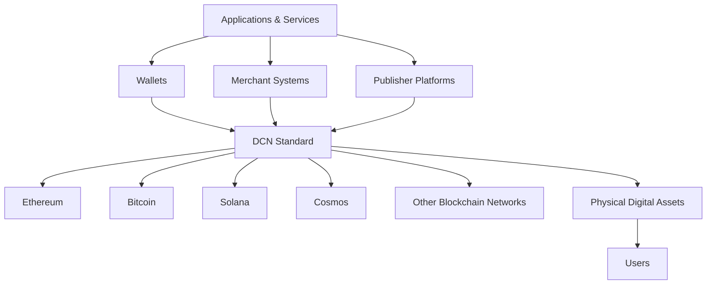
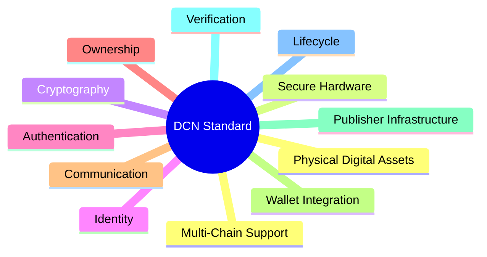

# 3. The DCN Standard

> _DCN is not a product. It is an open standard that defines how Physical Digital Assets are securely created, authenticated, managed, and used across multiple blockchain ecosystems._

***

### Introduction

Every successful technology ecosystem is built upon standards.

The Internet relies on TCP/IP to move data across networks. The World Wide Web relies on HTTP to exchange information. Payment cards rely on EMV to ensure secure and interoperable transactions.

These standards do not define a single product. Instead, they establish a common language that allows thousands of independent organizations to build compatible solutions.

DCN follows the same philosophy.

Rather than introducing another blockchain, wallet, or hardware device, DCN defines the common rules that enable **Physical Digital Assets (PDAs)** to operate securely and consistently regardless of who manufactures them, who publishes them, or which blockchain network they use.

***

## What is the DCN Standard?

The **Digital Crypto Note (DCN) Standard** is an open technical specification for representing blockchain-backed digital assets through secure physical objects.

The standard defines:

* How Physical Digital Assets are structured.
* How they are securely manufactured.
* How identity is established.
* How ownership is verified.
* How wallets communicate with assets.
* How merchants authenticate assets.
* How publishers issue and manage assets.
* How assets interact with blockchain networks.

DCN is therefore an **interoperability layer**, not an application.

***

## The Purpose of DCN

The purpose of the standard is to eliminate fragmentation.

Without DCN:

* Every manufacturer creates proprietary hardware.
* Every wallet requires different integrations.
* Every publisher defines its own protocols.
* Every merchant implements unique verification methods.

With DCN:

* Devices become interoperable.
* Wallets support multiple publishers.
* Merchants follow one verification process.
* Developers build once and deploy everywhere.

***

## The Role of DCN in the Ecosystem

DCN sits between blockchain infrastructure and real-world physical interactions.

DCN allows every participant to communicate using a common protocol while remaining independent.

***

## Core Responsibilities of the Standard

DCN focuses on standardizing the infrastructure required for Physical Digital Assets.

Its primary responsibilities include:

### Physical Asset Specification

Defines how compliant Physical Digital Assets are designed and identified.

### Secure Authentication

Defines how devices prove authenticity using cryptographic mechanisms.

### Ownership Model

Defines how ownership is represented and securely transferred.

### Communication Protocols

Defines how wallets, merchants, and verification systems communicate with assets.

### Lifecycle Management

Defines how assets are issued, activated, suspended, transferred, recovered, and retired.

### Interoperability

Defines how independent implementations remain compatible.

***

## What DCN Does Not Standardize

To remain flexible and future-proof, DCN intentionally avoids defining areas that belong to other technologies.

DCN does **not** define:

* A blockchain consensus mechanism.
* A cryptocurrency.
* A token economics model.
* Monetary policy.
* Smart contract programming languages.
* Wallet user interface design.
* Government regulations.
* Commercial pricing models.

These remain the responsibility of blockchain networks, publishers, regulators, and application developers.

***

## Design Principles

The DCN Standard is guided by several foundational principles.

#### Open

The specification is intended to be openly documented and implementable by any organization.

#### Secure

Security is embedded into every stage of the asset lifecycle through cryptography and secure hardware.

#### Interoperable

Independent implementations should work together without proprietary integrations.

#### Blockchain-Agnostic

The protocol supports multiple blockchain ecosystems rather than a single network.

#### Extensible

New asset types and capabilities can be introduced without redesigning the standard.

#### User-Centric

The technical complexity remains behind the scenes while providing a familiar user experience.

***

## Who Uses the DCN Standard?

The standard serves many different participants within the ecosystem.

| Participant               | Role                                     |
| ------------------------- | ---------------------------------------- |
| Publishers                | Issue and manage Physical Digital Assets |
| Manufacturers             | Produce compliant hardware               |
| Wallet Providers          | Enable user interaction                  |
| Merchants                 | Accept and verify assets                 |
| Developers                | Build applications and services          |
| Blockchain Networks       | Record and validate ownership            |
| Certification Authorities | Verify compliance and trust              |
| End Users                 | Own and use Physical Digital Assets      |

Each participant follows the same specification while remaining operationally independent.

***

## The Building Blocks of DCN

The standard is organized into several architectural domains.

Each domain is described in detail throughout the remaining chapters of this specification.

***

## Benefits of a Common Standard

A shared standard creates value for every participant.

#### For Users

* Consistent experience
* Greater trust
* Easier adoption

#### For Publishers

* Faster product development
* Lower infrastructure costs
* Broader ecosystem compatibility

#### For Manufacturers

* Larger addressable market
* Common certification process
* Reduced integration effort

#### For Developers

* Standard APIs
* Reusable SDKs
* Cross-platform compatibility

#### For Blockchain Networks

* Increased real-world adoption
* Physical access layer
* Broader ecosystem integration

***

## Why This Matters

The blockchain industry has reached a stage where foundational infrastructure is becoming more important than isolated products.

Just as developers today rarely think about the details of TCP/IP when using the Internet, future users should not need to understand blockchain internals to interact with digital assets.

DCN enables this future by standardizing the physical interaction layer while allowing innovation to continue above and below it.

***

## Summary

The DCN Standard is an open technical specification that defines how Physical Digital Assets are securely created, authenticated, transferred, verified, and managed.

Rather than replacing existing blockchain technologies, it provides the interoperability layer that connects secure hardware, blockchain networks, wallets, merchants, publishers, and users through a common protocol.

This foundation establishes the architecture upon which every DCN-compliant implementation can be built.

***

## In this chapter

* [What is DCN](what-is-dcn.md)
* [Design Principles](design-principles.md)
* [Core Concepts](core-concepts.md)
* [Physical Digital Assets](physical-digital-assets.md)
* [Publisher Model](publisher-model.md)
