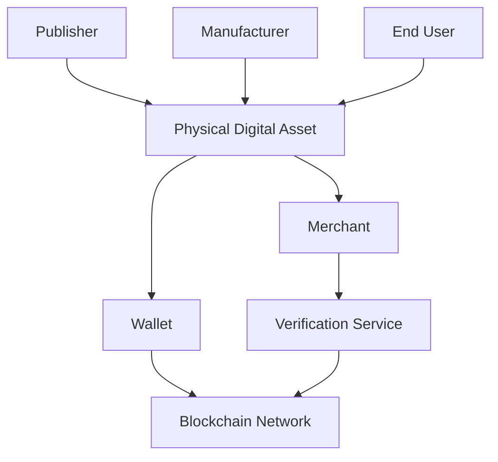
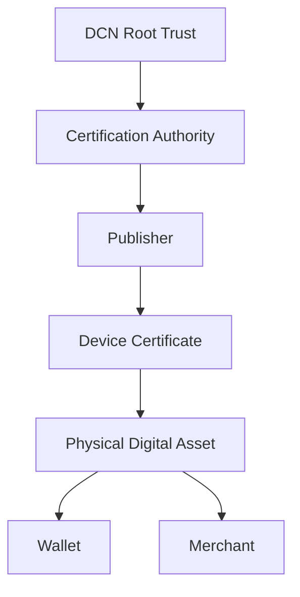
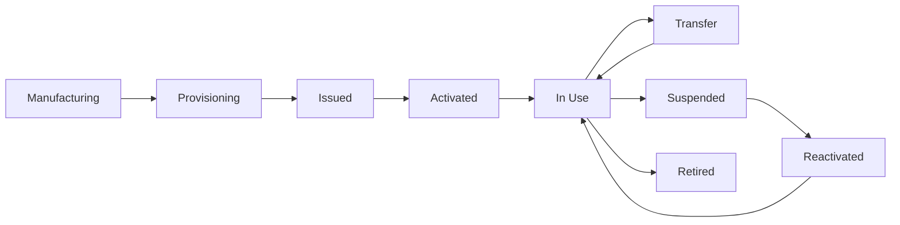
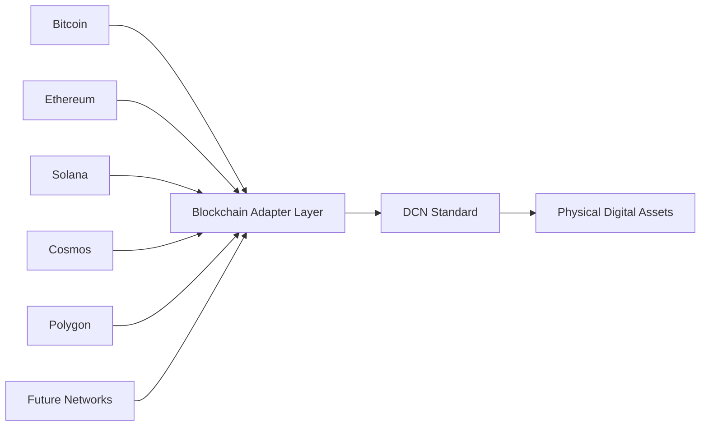
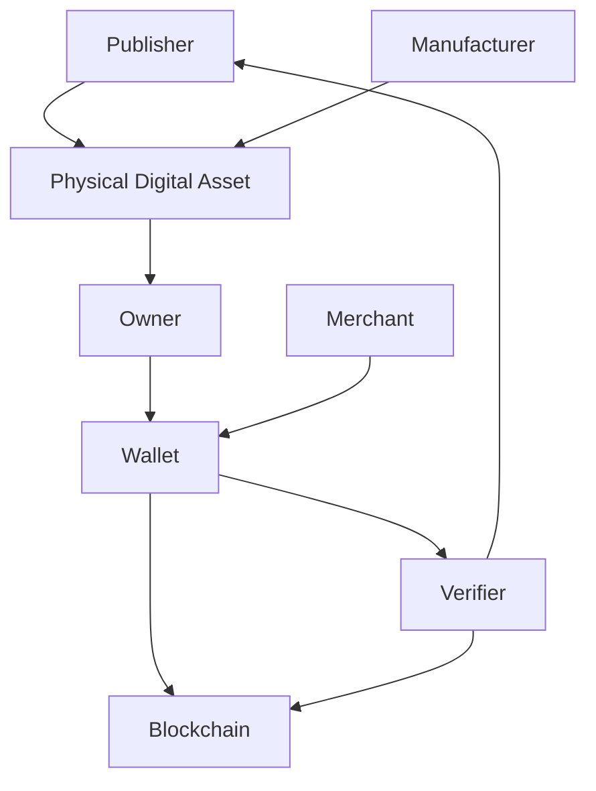

# Core Concepts

> _Every implementation of the DCN Standard is built upon a common set of concepts. These concepts establish a shared understanding of how Physical Digital Assets are created, owned, verified, transferred, and managed throughout their lifecycle._

***

### Introduction

Before exploring the technical architecture of DCN, it is important to understand the fundamental concepts that define the ecosystem.

These concepts serve as the common language shared by manufacturers, publishers, wallet providers, merchants, blockchain networks, developers, certification authorities, and end users.

Every protocol, API, hardware implementation, and software application described in this specification builds upon these core concepts.

***

## The DCN Ecosystem at a Glance

The DCN ecosystem consists of multiple independent participants working together through a common standard.

Each participant has a distinct role while communicating through standardized protocols defined by DCN.

***

## Core Concept 1 — Physical Digital Asset (PDA)

A **Physical Digital Asset (PDA)** is the primary object defined by the DCN Standard.

It is a secure physical item that represents and interacts with a blockchain-backed digital asset.

Examples include:

* Digital Crypto Note
* Stablecoin Note
* CBDC Card
* Digital Identity Card
* University Certificate
* Event Ticket
* Employee Credential
* Transit Pass
* Gift Card

A PDA combines:

* Secure hardware
* Cryptographic identity
* Blockchain integration
* Standardized communication
* Ownership metadata

Every Physical Digital Asset follows the same lifecycle regardless of its purpose.

***

## Core Concept 2 — Publisher

A **Publisher** is an organization authorized to issue Physical Digital Assets.

Examples include:

* Governments
* Central Banks
* Commercial Banks
* Stablecoin Issuers
* Universities
* Enterprises
* Retail Brands
* Event Organizers

Publishers are responsible for:

* Creating asset definitions
* Issuing new assets
* Managing lifecycle policies
* Maintaining trust certificates
* Supporting recovery and revocation processes

The publisher defines **what the asset represents**, while DCN defines **how the asset operates**.

***

## Core Concept 3 — Asset Owner

The **Asset Owner** is the individual or organization that legally or cryptographically controls a Physical Digital Asset.

Ownership may be established through:

* Blockchain ownership records
* Smart accounts
* Digital identity systems
* Multi-signature policies
* Enterprise authorization models

Ownership gives the holder the right to use, transfer, or manage the asset according to the publisher's rules.

***

## Core Concept 4 — Wallet

A **Wallet** is the software interface that allows users to interact with Physical Digital Assets.

A DCN-compatible wallet may perform functions such as:

* Authenticate assets
* Display balances
* Verify ownership
* Transfer assets
* Reload value
* Configure permissions
* Update asset metadata
* Connect to blockchain networks

The wallet is not the asset itself—it is the interface between the user and the asset.

***

## Core Concept 5 — Secure Element

Every compliant Physical Digital Asset should contain a trusted execution environment for sensitive cryptographic operations.

This is typically implemented using a **Secure Element (SE)** or equivalent secure hardware.

The Secure Element is responsible for:

* Protecting cryptographic keys
* Generating digital signatures
* Executing secure authentication
* Preventing key extraction
* Detecting tampering

The Secure Element acts as the **Hardware Root of Trust** for the Physical Digital Asset.

***

## Core Concept 6 — Device Identity

Every Physical Digital Asset has a unique identity.

This identity is assigned during secure provisioning and remains associated with the asset throughout its lifecycle.

Device identity enables:

* Authentication
* Ownership verification
* Counterfeit detection
* Secure provisioning
* Lifecycle tracking

No two compliant Physical Digital Assets should share the same cryptographic identity.

***

## Core Concept 7 — Asset Identity

A Device Identity identifies **the physical object**.

An Asset Identity identifies **the digital asset represented by that object**.

For example:

| Identity           | Purpose                                |
| ------------------ | -------------------------------------- |
| Device Identity    | Identifies the physical hardware       |
| Asset Identity     | Identifies the blockchain-backed asset |
| Owner Identity     | Identifies the current owner           |
| Publisher Identity | Identifies the issuing organization    |

Separating these identities allows assets to change ownership without changing the physical device.

***

## Core Concept 8 — Authentication

Authentication allows participants to verify that a Physical Digital Asset is genuine.

Authentication typically involves:

* Cryptographic challenge-response
* Digital signatures
* Certificate validation
* Secure Element verification
* Publisher trust verification

Successful authentication proves that:

* The device is genuine.
* The publisher is trusted.
* The asset has not been cloned.
* The asset is in a valid lifecycle state.

***

## Core Concept 9 — Trust Chain

DCN establishes trust through a certificate hierarchy.

Every participant can independently verify authenticity using standardized trust relationships.

***

## Core Concept 10 — Lifecycle

Every Physical Digital Asset progresses through a defined lifecycle.

Lifecycle management ensures predictable behavior across all compliant implementations.

***

## Core Concept 11 — Verification

Verification extends beyond authentication.

Verification determines:

* Is the device authentic?
* Is the publisher trusted?
* Is the asset active?
* Who owns the asset?
* Has the asset been revoked?
* Is the asset transferable?
* Does the asset contain valid metadata?

Verification services may interact with blockchain networks and publisher infrastructure to answer these questions.

***

## Core Concept 12 — Multi-Chain Architecture

DCN is designed to support multiple blockchain ecosystems.

Instead of embedding blockchain-specific logic into every Physical Digital Asset, DCN introduces a standardized abstraction layer.

This architecture enables future blockchain integrations without redesigning the physical asset.

***

## Core Concept Relationships

The following diagram illustrates how the major concepts relate to one another.

Every interaction within the ecosystem follows these standardized relationships.

***

## Summary

The DCN Standard is built upon a set of foundational concepts that define the structure and behavior of the ecosystem.

Physical Digital Assets, publishers, owners, wallets, Secure Elements, device identities, authentication mechanisms, trust chains, lifecycle management, verification services, and blockchain adapters together form the architectural foundation of DCN.

Understanding these concepts provides the context needed for the detailed technical chapters that follow, where each component is examined in depth.
