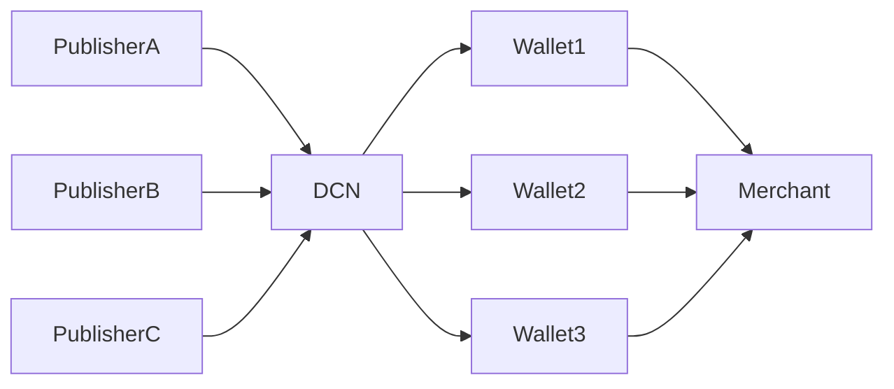
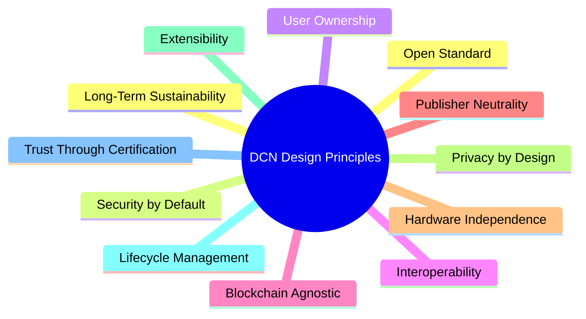

# Design Principles

>
>
> _]The DCN Standard is built upon a set of fundamental principles that ensure every Physical Digital Asset remains secure, interoperable, future-proof, and universally compatible._

***

### Introduction

A technical standard is more than a collection of specifications.

Its long-term success depends on the principles that guide every architectural decision.

The Internet continues to evolve because TCP/IP was designed to be open and extensible.

Payment cards are accepted worldwide because EMV defines common security and interoperability rules.

Similarly, the DCN Standard is guided by a set of design principles that ensure every implementation—from a Digital Crypto Note to a government-issued identity credential—follows the same architectural philosophy.

These principles provide consistency across manufacturers, publishers, developers, wallet providers, and blockchain networks.

***

## Principle 1 — Open Standard

DCN is designed as an **open specification**.

Any organization should be able to implement the standard without being locked into a proprietary ecosystem.

This encourages:

* Competition
* Innovation
* Transparency
* Independent implementations
* Community contributions
* Global adoption

The success of the ecosystem should not depend on a single company controlling the technology.

***

## Principle 2 — Security by Default

Security is not an optional feature—it is the foundation of the DCN architecture.

Every compliant Physical Digital Asset should be designed with security at every layer.

Security includes:

* Secure hardware
* Protected cryptographic keys
* Strong authentication
* Tamper resistance
* Secure communication
* Trusted manufacturing
* Secure ownership transfer
* Secure recovery mechanisms

Every interaction should assume that attackers exist and that security must remain effective even in hostile environments.

***

## Principle 3 — User Ownership

The rightful owner should always remain at the center of the system.

The standard is designed so users maintain control over their assets while enabling secure recovery and verification mechanisms.

Ownership should be:

* Verifiable
* Transferable
* Recoverable (where applicable)
* Cryptographically protected
* Independent of hardware manufacturers

This principle aligns with the philosophy of decentralized ownership introduced by blockchain technology.

***

## Principle 4 — Interoperability

A Physical Digital Asset issued by one publisher should be understandable by any compliant wallet, merchant, or verification service.

Interoperability requires common definitions for:

* Asset identity
* Communication protocols
* Authentication
* Metadata
* Certificates
* Lifecycle states
* Ownership verification

The objective is **build once, use everywhere**.

***

## Principle 5 — Blockchain Agnostic

DCN is independent of any single blockchain.

The protocol should support multiple blockchain ecosystems through standardized interfaces.

Examples include:

* Ethereum
* Bitcoin
* Solana
* Cosmos
* Polkadot
* Hyperledger
* Future blockchain networks

This allows organizations to choose the blockchain that best fits their requirements while maintaining a consistent physical experience.

***

## Principle 6 — Publisher Neutrality

DCN defines **how** assets are issued, not **who** may issue them.

Publishers may include:

* Governments
* Central banks
* Commercial banks
* Stablecoin issuers
* Enterprises
* Universities
* Transportation authorities
* Retail organizations
* Event organizers

Every publisher follows the same technical standard while maintaining independent governance, branding, and business models.

***

## Principle 7 — Hardware Independence

The DCN Standard specifies functional and security requirements rather than mandating a specific hardware vendor or chipset.

Manufacturers remain free to innovate using different:

* Secure Elements
* NFC controllers
* Antennas
* Embedded processors
* Secure memory
* Manufacturing processes

As long as the implementation satisfies the DCN compliance requirements, it remains interoperable with the ecosystem.

This encourages innovation while preventing vendor lock-in.

***

## Principle 8 — Privacy by Design

Physical Digital Assets may contain sensitive information.

The standard therefore promotes privacy as a core architectural requirement.

Implementations should minimize unnecessary disclosure by using techniques such as:

* Selective disclosure
* Cryptographic proofs
* Tokenization
* Encrypted communication
* Secure authentication
* Permission-based data access

Only the information required for a specific interaction should be exchanged.

***

## Principle 9 — Extensibility

Technology evolves continuously.

The DCN Standard is designed so that new capabilities can be added without redesigning the entire ecosystem.

Future enhancements may include:

* New asset categories
* Improved cryptographic algorithms
* New communication interfaces
* Advanced Secure Elements
* Offline transaction support
* AI-assisted verification
* Post-quantum cryptography

The architecture should evolve while preserving compatibility wherever possible.

***

## Principle 10 — Lifecycle Management

Every Physical Digital Asset follows a well-defined lifecycle.

The standard specifies consistent states such as:

* Manufacturing
* Provisioning
* Issuance
* Activation
* Usage
* Transfer
* Suspension
* Recovery
* Retirement
* Destruction

A common lifecycle enables consistent behavior across all compliant implementations.

***

## Principle 11 — Trust Through Certification

Trust is established through standardized verification rather than brand recognition alone.

The DCN ecosystem supports certification processes for:

* Hardware compliance
* Secure manufacturing
* Publisher identity
* Wallet compatibility
* Merchant systems
* Verification services

Certification ensures independent implementations meet the security and interoperability requirements defined by the standard.

***

## Principle 12 — Long-Term Sustainability

DCN is intended to serve as foundational infrastructure for decades.

To achieve this, the standard separates:

* Stable architectural concepts
* Versioned protocol specifications
* Implementation-specific technologies

This approach allows future generations of hardware and blockchain networks to remain compatible with the broader ecosystem.

***

## Design Principles Overview

The following diagram summarizes how these principles collectively shape the DCN Standard.

***

## Principles Applied Across the Ecosystem

| Design Principle            | Purpose                             | Primary Beneficiaries                            |
| --------------------------- | ----------------------------------- | ------------------------------------------------ |
| Open Standard               | Prevent vendor lock-in              | Entire ecosystem                                 |
| Security by Default         | Protect digital ownership           | Users, Publishers                                |
| User Ownership              | Maintain user control               | End Users                                        |
| Interoperability            | Enable cross-platform compatibility | Wallets, Merchants, Developers                   |
| Blockchain Agnostic         | Support multiple networks           | Blockchain Ecosystem                             |
| Publisher Neutrality        | Allow any qualified issuer          | Governments, Enterprises, Financial Institutions |
| Hardware Independence       | Encourage innovation                | Manufacturers                                    |
| Privacy by Design           | Protect sensitive information       | Users, Enterprises                               |
| Extensibility               | Enable future evolution             | Developers, Standards Community                  |
| Lifecycle Management        | Standardize asset behavior          | Publishers, Wallet Providers                     |
| Trust Through Certification | Ensure compliance                   | Entire ecosystem                                 |
| Long-Term Sustainability    | Maintain compatibility over time    | Future Implementations                           |

***

## Summary

The DCN Design Principles establish the architectural philosophy behind the standard.

Rather than prescribing specific products or technologies, these principles define the characteristics that every compliant implementation should uphold. By prioritizing openness, security, interoperability, user ownership, privacy, extensibility, and long-term sustainability, DCN creates a robust foundation for a global ecosystem of Physical Digital Assets.

These principles guide every subsequent chapter of this specification, ensuring that future protocols, APIs, hardware, and software remain aligned with the core mission of the DCN Standard.
