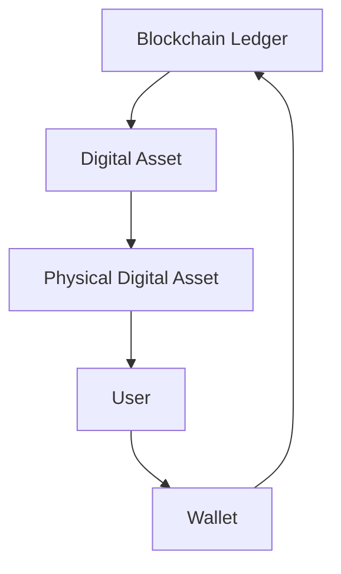
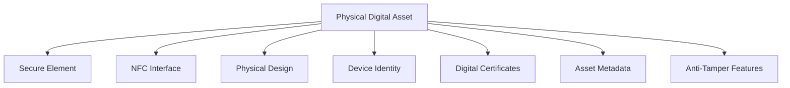
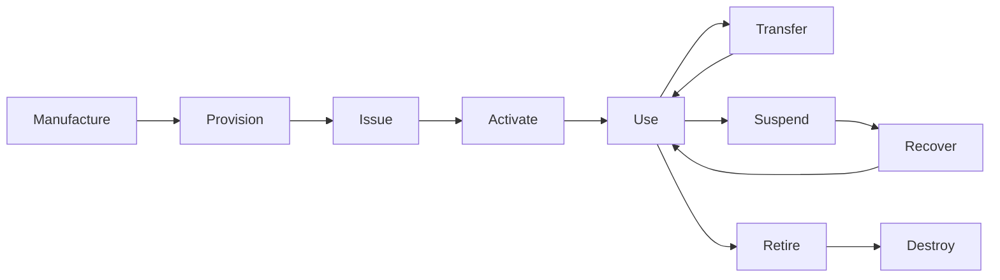
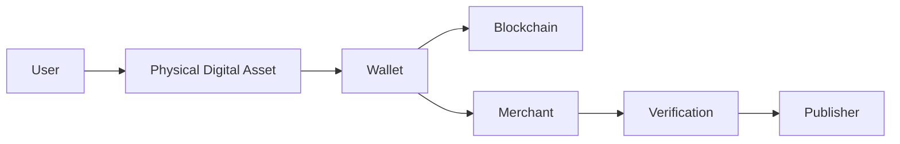

# Physical Digital Assets

> _A Physical Digital Asset (PDA) is a secure physical object that serves as the trusted physical representation of a blockchain-backed digital asset. It combines secure hardware, cryptographic identity, and blockchain connectivity into a standardized, interoperable form._

***

### Introduction

The primary innovation introduced by the DCN Standard is the concept of the **Physical Digital Asset (PDA).**

For centuries, people have interacted with value through physical objects:

* Coins
* Banknotes
* Passports
* Credit cards
* Tickets
* Certificates
* Membership cards

Blockchain transformed these assets into digital records but removed their physical form.

DCN restores that missing physical interaction by introducing a standardized physical object that securely represents digital ownership while remaining connected to blockchain infrastructure.

A Physical Digital Asset is therefore much more than an NFC card or a smart card—it is a blockchain-native asset designed from the ground up for secure digital ownership.

***

## Definition

A **Physical Digital Asset (PDA)** is a physical object that:

* Possesses its own cryptographic identity.
* Securely stores cryptographic credentials.
* Authenticates itself using standardized protocols.
* Represents one or more blockchain-backed digital assets.
* Communicates with compliant wallets and merchant systems.
* Follows the lifecycle defined by the DCN Standard.

The PDA becomes the trusted bridge between the user and the blockchain.

***

## A Physical Digital Asset Is Not the Blockchain Asset

One of the most important concepts within DCN is the separation between the physical object and the blockchain asset.

The blockchain remains the source of truth for ownership and state.

The Physical Digital Asset is the secure interface used to access and interact with that ownership.

This separation enables the physical object to be replaced, upgraded, or recovered without fundamentally changing the blockchain architecture.

***

## Components of a Physical Digital Asset

Every DCN-compliant Physical Digital Asset is composed of several standardized components.

Each component contributes to the overall security and interoperability of the asset.

***

## Secure Element

The Secure Element acts as the Hardware Root of Trust.

Responsibilities include:

* Secure key generation
* Private key protection
* Digital signatures
* Authentication
* Cryptographic operations
* Secure storage

Sensitive cryptographic material never leaves the Secure Element in plain form.

***

## NFC Interface

The NFC interface enables secure short-range communication.

It allows the Physical Digital Asset to interact with:

* Mobile wallets
* Merchant terminals
* Verification devices
* Authorized readers

The communication protocol is standardized by DCN so compliant devices can interoperate regardless of manufacturer.

***

## Physical Design

The physical appearance is determined by the publisher.

Examples include:

* Plastic cards
* Premium metal cards
* Polymer notes
* Secure paper documents
* Wearables
* Key fobs
* Wristbands
* Badges

DCN standardizes functionality, not appearance.

Publishers remain free to create products that align with their branding and use cases.

***

## Device Identity

Every Physical Digital Asset possesses a unique cryptographic identity.

This identity:

* Is generated securely.
* Cannot be duplicated.
* Persists throughout the device lifecycle.
* Enables authentication.
* Enables counterfeit detection.

Device identity represents the physical object—not the owner.

***

## Digital Certificates

Each asset may contain certificates proving:

* Manufacturer authenticity
* Publisher authenticity
* Device authenticity
* Compliance status

Certificates establish trust relationships throughout the ecosystem.

***

## Asset Metadata

Metadata describes the characteristics of the asset.

Examples include:

* Asset type
* Publisher
* Supported blockchain
* Version
* Manufacturing batch
* Security profile
* Lifecycle state
* Capability profile

The metadata enables wallets and merchant systems to understand how the asset should behave.

***

## Anti-Tamper Protection

Physical Digital Assets should resist both digital and physical attacks.

Protection mechanisms may include:

* Secure chip packaging
* Tamper detection
* Secure firmware
* Encrypted communication
* Physical security printing
* Anti-cloning technologies
* Secure manufacturing controls

The specific implementation may vary by manufacturer while meeting the security requirements defined by the DCN Standard.

***

## Characteristics of a Physical Digital Asset

Every compliant PDA should exhibit the following characteristics.

| Characteristic | Description                                              |
| -------------- | -------------------------------------------------------- |
| Physical       | Exists as a tangible object.                             |
| Cryptographic  | Possesses unique cryptographic identity.                 |
| Secure         | Protects keys using secure hardware.                     |
| Verifiable     | Can prove authenticity.                                  |
| Transferable   | Supports secure ownership transfer where permitted.      |
| Interoperable  | Works across compliant wallets and systems.              |
| Multi-Chain    | Supports one or more blockchain networks.                |
| Upgradable     | Supports compatible protocol evolution where applicable. |

***

## Asset Types

The DCN Standard supports many categories of Physical Digital Assets.

Examples include:

#### Financial Assets

* Digital Crypto Notes
* Stablecoin Notes
* CBDC Cards
* Tokenized Bonds

#### Identity Assets

* National ID
* Employee ID
* Student ID

#### Commercial Assets

* Gift Cards
* Loyalty Cards
* Membership Cards

#### Transportation

* Transit Passes
* Toll Cards
* Parking Credentials

#### Government

* Welfare Cards
* Healthcare Cards
* Digital Licenses

#### Enterprise

* Building Access
* Device Credentials
* Authentication Tokens

The same architecture supports every asset category.

***

## Lifecycle Participation

Every Physical Digital Asset participates in the standardized DCN lifecycle.

This ensures consistent behavior regardless of publisher or manufacturer.

***

## PDA vs Traditional Smart Card

Although they may appear similar externally, a DCN Physical Digital Asset provides capabilities beyond a conventional smart card.

| Traditional Smart Card     | DCN Physical Digital Asset           |
| -------------------------- | ------------------------------------ |
| Application-specific       | Open standard                        |
| Usually single ecosystem   | Multi-publisher ecosystem            |
| Limited blockchain support | Native blockchain integration        |
| Vendor-dependent           | Vendor-neutral                       |
| Proprietary lifecycle      | Standardized lifecycle               |
| Device authentication      | Device and blockchain authentication |
| Limited interoperability   | Cross-platform interoperability      |

***

## The Role of Physical Digital Assets

Within the DCN ecosystem, the Physical Digital Asset acts as the trusted interaction point between people and decentralized infrastructure.

The PDA enables secure, intuitive interaction while blockchain maintains the authoritative record of ownership.

***

## Summary

A Physical Digital Asset is the foundational building block of the DCN Standard.

It combines secure hardware, cryptographic identity, standardized communication, and blockchain integration into a trusted physical object that represents digital ownership.

By separating the physical interface from the blockchain itself, DCN enables users to interact with decentralized assets through familiar physical experiences while preserving the security, transparency, and interoperability of blockchain technology.
