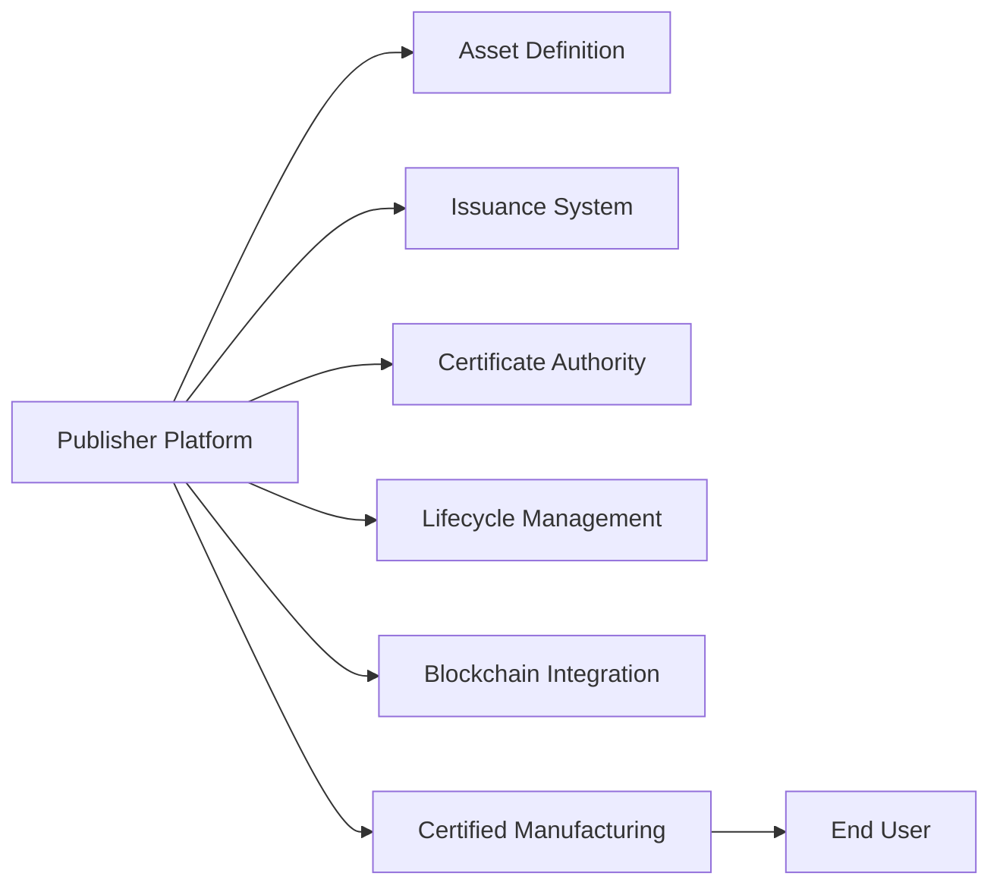
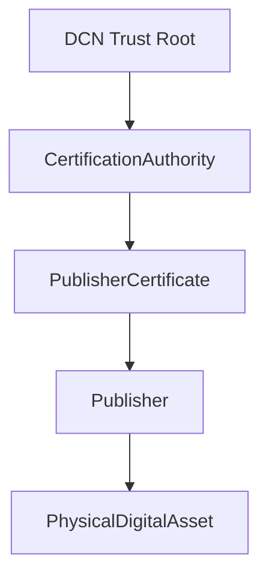
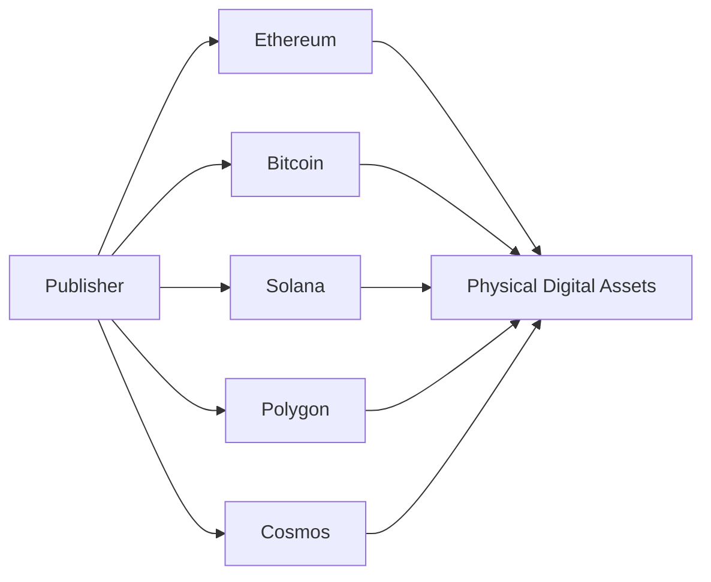
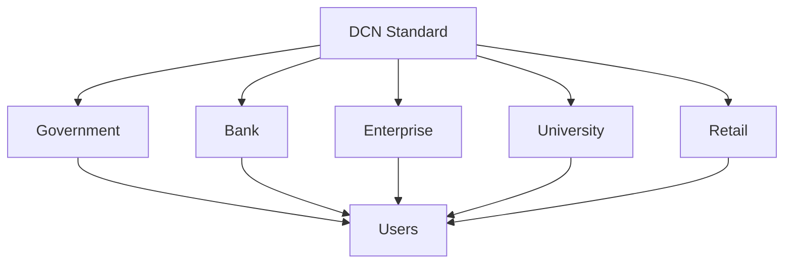

# Publisher Model

> _The Publisher Model defines how organizations create, issue, and manage Physical Digital Assets within the DCN ecosystem. Rather than centralizing issuance under a single authority, DCN enables multiple trusted publishers to participate through a common standard._

***

### Introduction

One of the defining characteristics of the DCN Standard is its **open publisher architecture**.

Traditional physical money is typically issued by a central bank.

Payment cards are issued by financial institutions.

Passports are issued by governments.

Membership cards are issued by private organizations.

Each asset type has its own issuer, rules, and infrastructure.

DCN extends this concept into the blockchain era by allowing **any qualified organization** to become a Publisher while following a common technical standard.

This creates a decentralized ecosystem where innovation is encouraged, interoperability is maintained, and users are not locked into a single provider.

***

## What is a Publisher?

A **Publisher** is a trusted organization that creates and manages Physical Digital Assets (PDAs) according to the DCN Standard.

The Publisher defines:

* What the asset represents
* The blockchain network used
* The ownership model
* Asset rules
* Lifecycle policies
* Recovery policies
* Compliance requirements
* Branding and visual design

The DCN Standard defines **how** these assets operate, while the Publisher defines **why** they exist.

***

## Anyone Can Become a Publisher

Unlike traditional payment systems, DCN is not restricted to banks or governments.

Any organization that satisfies the technical, operational, and security requirements may become a Publisher.

Potential Publishers include:

#### Financial Institutions

* Central Banks
* Commercial Banks
* Stablecoin Issuers
* Crypto Exchanges
* Payment Providers

#### Government Organizations

* National Governments
* Municipal Authorities
* Identity Agencies
* Transport Authorities

#### Educational Institutions

* Universities
* Schools
* Certification Bodies

#### Commercial Organizations

* Retail Brands
* Airlines
* Hotels
* Membership Organizations
* Event Companies

#### Enterprise Organizations

* Large Corporations
* Technology Companies
* Healthcare Providers
* Logistics Companies

This open model allows innovation without changing the underlying protocol.

***

## Publisher Responsibilities

Every Publisher has responsibilities beyond simply issuing assets.

These responsibilities include:

### Asset Definition

Determine what the asset represents.

Examples:

* USDC Physical Note
* Bitcoin Collector Card
* Employee ID
* University Diploma
* Transit Pass

***

### Asset Issuance

Create new Physical Digital Assets using certified manufacturing and provisioning processes.

***

### Policy Definition

Specify rules governing:

* Transferability
* Reloadability
* Spending restrictions
* Expiration
* Recovery
* Ownership changes

***

### Trust Management

Maintain certificates that allow wallets and merchants to verify authenticity.

***

### Lifecycle Management

Manage every asset throughout its lifecycle.

Including:

* Issue
* Activate
* Suspend
* Recover
* Revoke
* Retire

***

### Compliance

Ensure issued assets comply with applicable legal, regulatory, and organizational requirements.

***

## Publisher Architecture

The Publisher Platform becomes the operational control center for issued Physical Digital Assets.

***

## Publisher Identity

Every Publisher possesses a unique identity within the DCN ecosystem.

Publisher Identity typically consists of:

* Publisher ID
* Organization Name
* Public Key
* Publisher Certificate
* Supported Asset Types
* Supported Blockchain Networks
* Compliance Status
* Protocol Version

Wallets and verification services use this identity to establish trust before interacting with issued assets.

***

## Publisher Certificate

Every Publisher receives one or more cryptographic certificates that prove its legitimacy.

The certificate allows participants to verify:

* Publisher authenticity
* Certificate validity
* Supported protocol version
* Asset authorization
* Trust status

If a Publisher's certificate is revoked, newly issued assets can no longer be trusted until the issue is resolved.

***

## Asset Templates

Rather than designing every asset from scratch, Publishers may create reusable **Asset Templates**.

An Asset Template defines:

* Asset category
* Visual design
* Supported blockchain
* Metadata schema
* Security profile
* NFC capabilities
* Ownership model
* Lifecycle policies

Example:

| Template | Purpose               |
| -------- | --------------------- |
| DCN-S    | Stored Value Note     |
| DCN-R    | Reloadable Value Note |
| DCN-P    | Programmable Asset    |
| DCN-ID   | Identity Credential   |
| DCN-T    | Transit Pass          |
| DCN-C    | Collectible Edition   |

Templates ensure consistency across large-scale issuance.

***

## Multi-Chain Publishing

A single Publisher may support multiple blockchain ecosystems.

For example, a financial institution could issue:

* USDC Notes on Ethereum
* BTC Vault Cards on Bitcoin
* Loyalty Cards on Polygon
* Enterprise Credentials on a private blockchain

All managed through one Publisher Platform.

***

## Publisher Workflow

The typical publishing process follows these stages.

This workflow is standardized regardless of asset category.

***

## Publisher vs Manufacturer

These roles are intentionally separated within the DCN architecture.

| Publisher                  | Manufacturer                    |
| -------------------------- | ------------------------------- |
| Defines the asset          | Produces the physical device    |
| Issues assets              | Installs secure hardware        |
| Creates lifecycle policies | Manufactures compliant hardware |
| Maintains certificates     | Delivers certified devices      |
| Integrates blockchain      | Does not own the asset          |

A Publisher may use one or multiple certified Manufacturers.

Similarly, a Manufacturer may produce devices for many different Publishers.

This separation promotes specialization and competition.

***

## Publisher Ecosystem

The DCN ecosystem is designed to support thousands of independent Publishers.

Every Publisher follows the same protocol while serving different industries and use cases.

***

## Benefits of the Publisher Model

The Publisher Model provides significant advantages.

#### Open Participation

Organizations are not limited by a centralized issuer.

#### Innovation

Publishers can create new asset categories without modifying the protocol.

#### Interoperability

Assets from different Publishers work with the same wallets and merchant systems.

#### Scalability

The ecosystem can grow organically as more Publishers join.

#### Flexibility

Each Publisher defines business rules appropriate for its industry while remaining compliant with the standard.

***

## Summary

The Publisher Model is one of the foundational pillars of the DCN Standard.

Rather than relying on a single issuing authority, DCN enables a global ecosystem of trusted Publishers that can create Physical Digital Assets for financial services, governments, enterprises, education, transportation, retail, and many other industries.

By separating publishing responsibilities from manufacturing and standardizing the issuance process, DCN creates an open, interoperable, and scalable ecosystem capable of supporting millions of assets across multiple blockchain networks.
