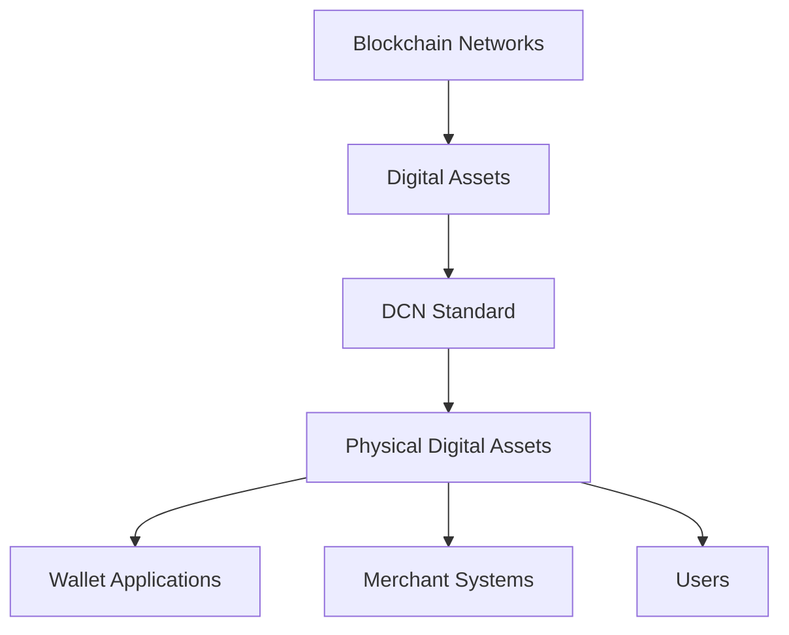
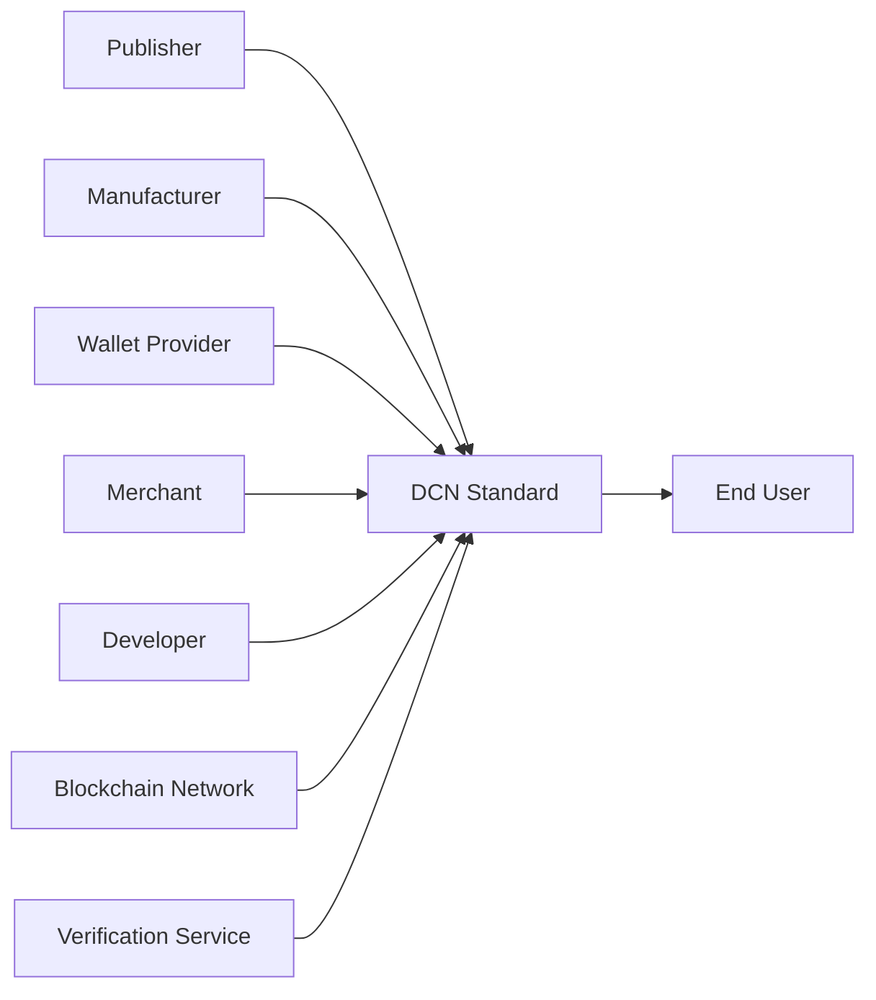

# What is DCN

> _Digital Crypto Note (DCN) is an open standard that defines how Physical Digital Assets are securely created, issued, owned, transferred, authenticated, and verified across multiple blockchain networks._

***

### Introduction

The Digital Crypto Note (DCN) Standard is an open technical specification designed to bridge the gap between blockchain technology and the physical world.

While blockchain has successfully established decentralized digital ownership, there has never been a universal standard for representing that ownership through secure physical objects.

DCN addresses this challenge by defining a common framework that allows physical devices to securely represent and interact with blockchain-backed digital assets.

Rather than being a blockchain, cryptocurrency, wallet, or payment application, DCN is the **standard that enables all of these systems to work together through Physical Digital Assets.**

***

## Defining DCN

DCN stands for **Digital Crypto Note**.

Within this specification, DCN refers to the **open standard**, not a specific product.

The standard defines the architecture, protocols, security requirements, communication methods, and lifecycle of **Physical Digital Assets (PDAs)**.

A DCN-compliant asset may represent:

* Digital Currency
* Stablecoins
* Central Bank Digital Currency (CBDC)
* Tokenized Real-World Assets (RWAs)
* Digital Identity
* Academic Certificates
* Event Tickets
* Government Credentials
* Enterprise Access Credentials
* Loyalty Programs
* Collectibles
* Future blockchain-based assets

The standard is intentionally designed to support many industries rather than a single financial use case.

***

## DCN is a Standard, Not a Product

One of the most important concepts in this specification is understanding the difference between a **standard** and an **implementation**.

| Standard                | Implementation                       |
| ----------------------- | ------------------------------------ |
| Defines the rules       | Follows the rules                    |
| Open specification      | Physical product or software         |
| Vendor neutral          | Built by manufacturers or publishers |
| Long-term foundation    | Commercial solution                  |
| Shared by the ecosystem | Owned by individual organizations    |

For example:

* HTTP is a standard; web browsers implement HTTP.
* EMV is a standard; payment cards implement EMV.
* USB is a standard; hardware devices implement USB.

Similarly:

* **DCN is the standard.**
* **Digital Crypto Notes, Stablecoin Notes, Identity Cards, and other compliant devices are implementations of the DCN Standard.**

***

## The Purpose of DCN

The purpose of DCN is to provide a common language for Physical Digital Assets.

Instead of every organization developing proprietary hardware and communication protocols, DCN establishes shared specifications for:

* Secure hardware
* Device identity
* Cryptographic authentication
* Ownership verification
* Communication protocols
* Publisher infrastructure
* Wallet interoperability
* Merchant acceptance
* Lifecycle management

This enables independent implementations to operate within the same ecosystem.

***

## The Physical Layer for Blockchain

Blockchain already standardizes digital ownership.

DCN standardizes physical interaction.

In this architecture:

* Blockchain stores ownership.
* DCN defines physical interaction.
* Wallets provide user access.
* Physical Digital Assets provide intuitive real-world usability.

***

## Core Components of DCN

The DCN Standard is composed of several interconnected components.

### Physical Digital Asset

A secure physical object representing a blockchain-backed digital asset.

### Secure Hardware

Provides tamper resistance, key protection, and cryptographic operations.

### Publisher

An organization authorized to issue DCN-compliant Physical Digital Assets.

### Wallet

Software that interacts with Physical Digital Assets and blockchain networks.

### Verification Service

A service responsible for validating authenticity, ownership, and lifecycle status.

### Blockchain Adapter

A component that enables interoperability with one or more blockchain networks.

Together, these components create a complete ecosystem for secure physical ownership.

***

## What DCN Standardizes

The DCN Standard defines common rules for:

#### Asset Structure

How Physical Digital Assets are identified and organized.

#### Device Identity

How every compliant asset receives a globally unique cryptographic identity.

#### Authentication

How assets prove authenticity to wallets and merchant systems.

#### Ownership

How ownership is securely established and transferred.

#### Communication

How devices communicate using standardized interfaces such as NFC.

#### Lifecycle

How assets are issued, activated, suspended, transferred, recovered, and retired.

#### Verification

How authenticity and ownership are validated.

#### Multi-Chain Support

How Physical Digital Assets interact with multiple blockchain ecosystems.

***

## What DCN Does Not Define

To remain flexible and vendor-neutral, DCN intentionally excludes several areas.

The standard does **not** define:

* A blockchain network
* A consensus algorithm
* A cryptocurrency
* Token economics
* Monetary policy
* Wallet user interfaces
* Government regulations
* Commercial pricing models

These remain the responsibility of blockchain networks, publishers, regulators, and application developers.

***

## Participants in the DCN Ecosystem

The DCN ecosystem includes multiple independent participants working together through the same standard.

Every participant performs a different role while following the same protocol.

***

## Why an Open Standard Matters

Without a common standard:

* Hardware becomes proprietary.
* Wallet integrations become fragmented.
* Merchant support becomes inconsistent.
* Development costs increase.
* Innovation slows.

With DCN:

* Devices become interoperable.
* Wallets support multiple publishers.
* Merchants integrate once.
* Manufacturers compete through innovation.
* Developers build reusable applications.
* Users enjoy a consistent experience.

An open standard benefits every participant in the ecosystem.

***

## The Long-Term Vision

The objective of DCN is to become for **Physical Digital Assets** what EMV became for payment cards and what HTTP became for the Web.

It provides a common foundation that allows independent organizations to innovate while remaining interoperable.

As adoption grows, the same standard can support:

* Financial services
* Government infrastructure
* Education
* Healthcare
* Enterprise security
* Transportation
* Retail
* Digital identity
* Internet of Things (IoT)
* Future blockchain applications

The standard evolves, while the ecosystem remains compatible.

***

## Summary

DCN is an open technical standard for Physical Digital Assets.

It defines how secure physical objects interact with blockchain-based digital ownership through standardized architecture, authentication, communication, and lifecycle management.

Rather than introducing another blockchain or wallet, DCN establishes the common infrastructure that enables publishers, manufacturers, developers, merchants, and blockchain networks to build interoperable physical experiences on top of decentralized digital ownership.
