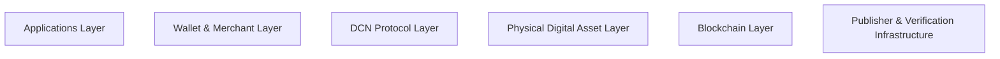
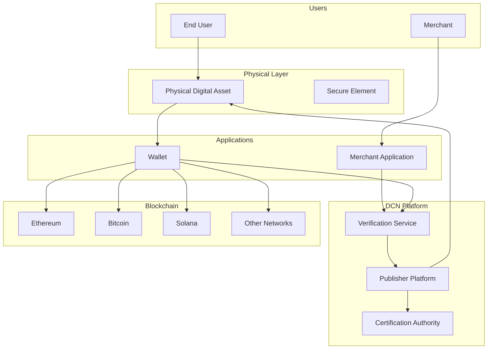

# 4. System Architecture

> _The DCN System Architecture defines the complete technical framework that enables Physical Digital Assets to operate securely across hardware, software, blockchain networks, publishers, wallets, merchants, and verification services._

***

### Introduction

The previous chapters introduced the vision, philosophy, and foundational concepts of the DCN Standard. This chapter shifts from **"why DCN exists"** to **"how DCN works."**

The DCN architecture is designed as a layered, modular, and interoperable system that separates responsibilities between hardware, software, blockchain infrastructure, and participating organizations.

Rather than building a single monolithic platform, DCN defines a collection of interoperable components that work together through standardized protocols.

This modular approach allows different organizations to innovate independently while remaining compatible with the broader ecosystem.

***

## Purpose of the Architecture

The primary purpose of the DCN System Architecture is to provide a common technical framework that enables:

* Secure issuance of Physical Digital Assets
* Trusted ownership verification
* Standardized communication
* Multi-chain interoperability
* Secure lifecycle management
* Hardware and software interoperability
* Global publisher participation
* Long-term protocol evolution

The architecture ensures that every participant understands its responsibilities and communicates using the same standards.

***

## Architectural Philosophy

The DCN architecture follows five fundamental engineering principles.

#### Modular

Each component performs a specific function without tightly depending on other components.

#### Layered

Hardware, communication, applications, and blockchain infrastructure are separated into logical layers.

#### Interoperable

Independent implementations can communicate through standardized interfaces.

#### Secure

Every layer contributes to the overall trust and security of the ecosystem.

#### Extensible

New hardware, blockchain networks, asset types, and applications can be introduced without redesigning the entire architecture.

***

## System Layers

The DCN ecosystem is organized into several logical layers.

Each layer has a clearly defined responsibility and communicates with adjacent layers through standardized interfaces.

***

## Architectural Domains

The DCN Standard is divided into several major architectural domains.

| Domain          | Purpose                                    |
| --------------- | ------------------------------------------ |
| Physical Assets | Defines secure physical devices            |
| Secure Hardware | Protects cryptographic operations          |
| Communication   | Standardizes NFC and secure messaging      |
| Wallets         | Enables user interaction                   |
| Publishers      | Issues and manages assets                  |
| Verification    | Validates authenticity and ownership       |
| Blockchain      | Records digital ownership and transactions |
| Certification   | Establishes trust across participants      |

Together, these domains form the complete DCN ecosystem.

***

## Separation of Responsibilities

One of the key goals of DCN is to separate responsibilities between participants.

For example:

* Manufacturers build secure hardware.
* Publishers issue Physical Digital Assets.
* Wallet providers develop user applications.
* Blockchain networks maintain ownership records.
* Verification services validate authenticity.
* Merchants accept compliant assets.
* Users own and interact with the assets.

No single participant controls the entire ecosystem.

This separation improves security, scalability, resilience, and interoperability.

***

## Trust Through Architecture

Rather than relying on a central authority to approve every interaction, the DCN architecture establishes trust through multiple independent components.

Trust is created by combining:

* Secure hardware
* Cryptographic identity
* Digital certificates
* Blockchain verification
* Standardized protocols
* Independent certification
* Publisher authentication

Each layer verifies the integrity of the next, creating a chain of trust throughout the ecosystem.

***

## Scalability by Design

The architecture is designed to support deployment at global scale.

It should accommodate:

* Millions of users
* Millions of Physical Digital Assets
* Thousands of publishers
* Hundreds of manufacturers
* Multiple blockchain networks
* Diverse asset categories
* Independent wallet providers
* Global merchant acceptance

Because the architecture is modular, growth in one domain does not require redesigning the others.

***

## Future-Proof Architecture

Technology evolves continuously.

The DCN architecture is intentionally designed to support future innovation without breaking existing implementations.

Future enhancements may include:

* New Secure Element technologies
* Advanced NFC capabilities
* Quantum-resistant cryptography
* Additional blockchain networks
* Offline transaction mechanisms
* AI-assisted verification
* IoT integrations
* Machine-to-machine authentication

By separating stable architectural principles from implementation-specific technologies, DCN can evolve while preserving interoperability.

***

## Architecture Overview

The complete DCN ecosystem can be visualized as follows.

This high-level architecture illustrates how the major components interact while remaining independent.

Subsequent sections of this chapter examine each architectural domain in detail.

***

## What This Chapter Covers

The remainder of this chapter explains the technical architecture of the DCN Standard through the following sections:

* **Architecture Overview** — High-level structure and component relationships.
* **Platform Components** — Core building blocks of the ecosystem.
* **Data Flow** — How information moves between participants.
* **Trust Relationships** — How trust is established and maintained.
* **Component Responsibilities** — Roles and responsibilities of each participant.

Together, these sections describe how the DCN ecosystem functions as a secure, interoperable platform for Physical Digital Assets.

***

## Summary

The DCN System Architecture provides the technical foundation that transforms the principles of the standard into a practical, scalable, and interoperable ecosystem.

By separating responsibilities, defining standardized interfaces, and building trust through layered security, the architecture enables organizations worldwide to issue, manage, verify, and use Physical Digital Assets across multiple blockchain networks.

The following section begins with a high-level view of the architecture and introduces the major components that make up the DCN ecosystem.

***

## In this chapter

* [Architecture Overview](architecture-overview.md)
* [Platform Components](platform-components.md)
* [Trust Model](trust-model.md)
* [Data Flow](data-flow.md)
