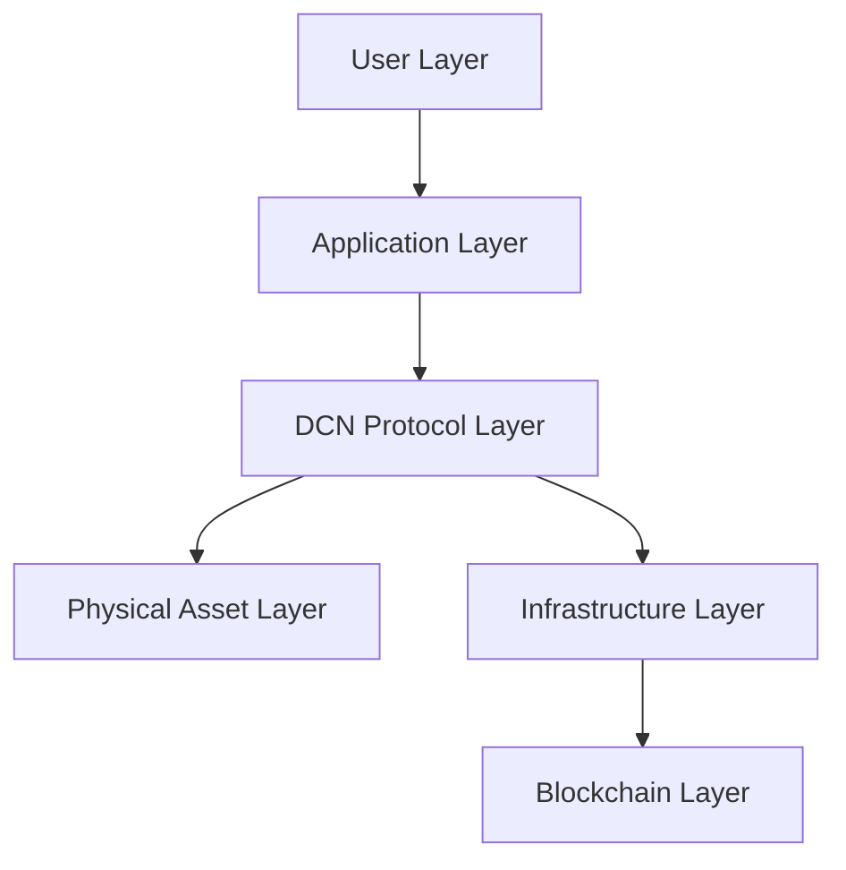
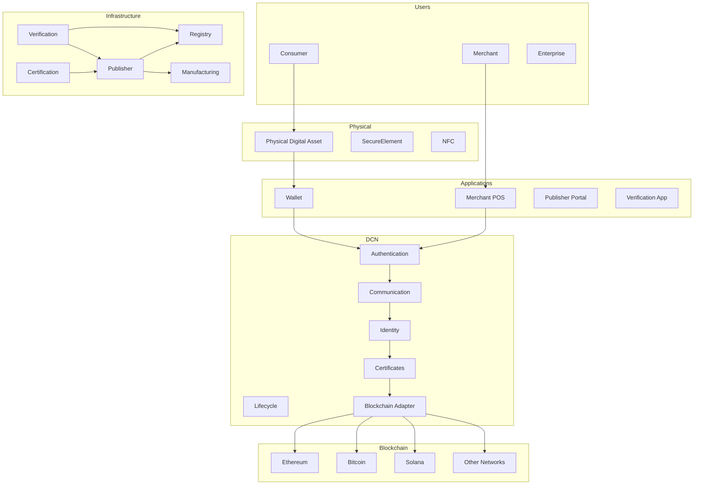
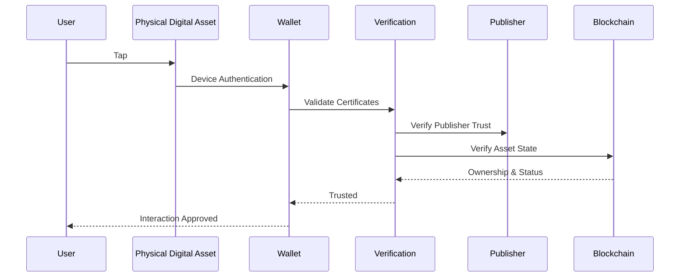

# Architecture Overview

> _The DCN Architecture is a layered, interoperable ecosystem that connects Physical Digital Assets, secure hardware, wallets, publishers, merchants, verification services, and blockchain networks through a common open standard._

***

### Introduction

The DCN ecosystem is not a single application or centralized platform.

Instead, it is a distributed architecture where independent participants perform specialized roles while communicating through standardized protocols.

Every interaction—from issuing a new Physical Digital Asset to making a payment or verifying ownership—passes through well-defined architectural components.

This modular approach enables:

* Global interoperability
* Independent innovation
* Vendor neutrality
* Multi-chain compatibility
* Long-term scalability
* High security

Rather than forcing every participant into one platform, DCN provides the common language that allows all participants to work together.

***

## A Layered Architecture

The DCN Standard follows a layered architecture where each layer has a clear responsibility.

Each layer communicates only through standardized interfaces, allowing implementations to evolve independently.

***

## The Six Architectural Layers

### 1. User Layer

The User Layer represents people and organizations interacting with Physical Digital Assets.

Participants include:

* Consumers
* Merchants
* Enterprises
* Governments
* Universities
* Financial Institutions

Users never interact directly with blockchain protocols.

Instead, they interact with Physical Digital Assets and compatible applications.

***

### 2. Application Layer

The Application Layer provides software interfaces.

Typical applications include:

* Mobile Wallets
* Desktop Wallets
* Merchant POS Systems
* Publisher Portals
* Verification Applications
* Enterprise Platforms

Applications implement the DCN protocol while providing user-friendly experiences.

***

### 3. DCN Protocol Layer

The Protocol Layer is the heart of the architecture.

It standardizes:

* Authentication
* Communication
* Asset metadata
* Ownership verification
* Lifecycle management
* Publisher interaction
* Certificate validation
* Multi-chain abstraction

Every compliant application follows these protocol specifications.

***

### 4. Physical Asset Layer

This layer consists of the Physical Digital Asset itself.

Each asset contains:

* Secure Element
* NFC interface
* Device identity
* Cryptographic keys
* Digital certificates
* Asset metadata
* Anti-tamper mechanisms

The Physical Digital Asset acts as the trusted bridge between users and blockchain infrastructure.

***

### 5. Infrastructure Layer

Infrastructure services support the operation of the ecosystem.

Examples include:

* Publisher Platforms
* Certificate Authorities
* Verification Services
* Asset Registries
* Lifecycle Management Systems
* Manufacturing Systems
* Recovery Services

These services ensure assets remain trusted throughout their lifecycle.

***

### 6. Blockchain Layer

The Blockchain Layer stores the authoritative record of digital ownership.

Supported networks may include:

* Ethereum
* Bitcoin
* Solana
* Polygon
* Cosmos
* Enterprise Blockchains
* Future blockchain networks

The blockchain is the source of truth, while DCN provides the physical interaction model.

***

## High-Level Component Architecture

The complete ecosystem can be represented as follows.

***

## Major Participants

The DCN architecture consists of several independent participants.

| Participant             | Primary Responsibility                   |
| ----------------------- | ---------------------------------------- |
| User                    | Owns and uses Physical Digital Assets    |
| Publisher               | Issues and manages assets                |
| Manufacturer            | Produces certified hardware              |
| Wallet Provider         | User interaction and blockchain access   |
| Merchant                | Accepts Physical Digital Assets          |
| Verification Service    | Validates authenticity and ownership     |
| Certification Authority | Establishes trust                        |
| Blockchain Network      | Stores ownership and transaction records |

Each participant focuses on a specific responsibility while relying on the DCN Standard for interoperability.

***

## Trust Flow

Trust is established through multiple independent verification stages.

No single participant controls the entire trust process.

Instead, trust is established through cryptographic verification and standardized protocols.

***

## Information Flow

Information moves through the architecture in a predictable manner.

1. The user interacts with a Physical Digital Asset.
2. The wallet authenticates the device.
3. Certificates are validated.
4. Ownership information is retrieved.
5. Publisher policies are evaluated.
6. Blockchain state is confirmed.
7. The requested action is authorized.
8. Results are returned to the application.

This standardized workflow enables consistent behavior across different implementations.

***

## Separation of Concerns

Each architectural layer has a single responsibility.

| Layer          | Responsibility                           |
| -------------- | ---------------------------------------- |
| User           | Human interaction                        |
| Applications   | User interface and business logic        |
| DCN Protocol   | Standardized communication and security  |
| Physical Asset | Secure hardware and identity             |
| Infrastructure | Trust, issuance, verification, lifecycle |
| Blockchain     | Immutable ownership records              |

This separation allows individual layers to evolve without disrupting the others.

***

## Architectural Benefits

The layered architecture provides several advantages.

#### Modularity

Components can be upgraded independently.

#### Scalability

New participants can join without redesigning the ecosystem.

#### Security

Each layer adds an additional level of protection.

#### Flexibility

Different organizations can build specialized implementations.

#### Interoperability

Independent systems communicate through shared protocols.

#### Future Compatibility

New technologies can be integrated without changing the overall architecture.

***

## Why This Architecture Matters

Without a standardized architecture, every blockchain-enabled physical product would require its own ecosystem, applications, authentication model, and infrastructure.

DCN avoids this fragmentation by defining a common architectural foundation that every participant can build upon.

As a result:

* Manufacturers can produce compatible hardware.
* Publishers can issue interoperable assets.
* Wallet providers can integrate once and support many publishers.
* Merchants can accept multiple asset types.
* Users experience consistent interactions regardless of the issuing organization.

This shared architecture is essential for global adoption.

***

## Summary

The DCN System Architecture organizes the ecosystem into six interoperable layers that separate user interaction, applications, protocols, physical assets, infrastructure, and blockchain networks.

By clearly defining the responsibilities of each layer and the relationships between participants, the architecture provides a secure, scalable, and vendor-neutral foundation for Physical Digital Assets.

This layered approach enables organizations to innovate independently while remaining compatible with the broader DCN ecosystem.
