# Data Flow

> _The DCN Data Flow defines how information moves securely between users, Physical Digital Assets, wallets, publishers, merchants, verification services, and blockchain networks. Every interaction follows standardized communication patterns that ensure security, interoperability, and consistency across the ecosystem._

***

## Introduction

The DCN ecosystem is composed of multiple independent participants.

Whenever a user taps a Digital Crypto Note, reloads value, transfers ownership, or verifies authenticity, information travels through several architectural components.

Unlike traditional payment systems, where most operations occur within a single institution, the DCN ecosystem distributes responsibilities across hardware, software, infrastructure, and blockchain networks.

The purpose of the Data Flow model is to standardize these interactions so that every compliant implementation behaves predictably.

***

## Data Flow Objectives

The DCN Data Flow is designed to achieve the following objectives:

* Secure communication
* Minimal trust assumptions
* Interoperability
* Low latency
* Multi-chain compatibility
* Offline support where applicable
* Standardized messaging
* Auditability
* Privacy protection

***

## High-Level Data Flow

The following diagram illustrates the primary flow of information within the DCN ecosystem.

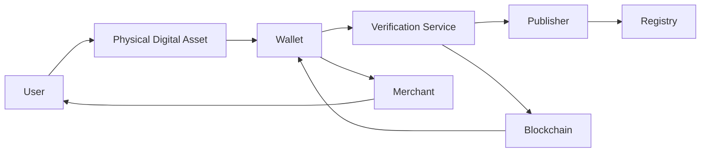

Every interaction is initiated by a user and completed through a sequence of standardized communication steps.

***

## Communication Layers

Data moves through several logical communication layers.

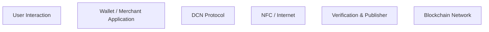

Each layer is responsible for processing specific types of information while remaining independent of implementation details.

***

## Typical User Interaction

A standard interaction begins when the user taps a Physical Digital Asset using a compatible wallet or merchant device.

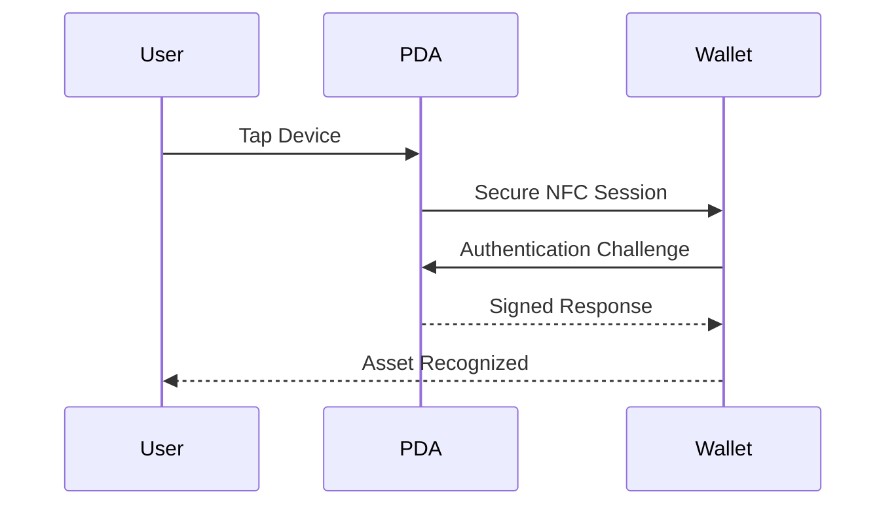

No sensitive cryptographic material leaves the Secure Element during this interaction.

***

## Authentication Flow

Before any operation is permitted, the device must prove its authenticity.

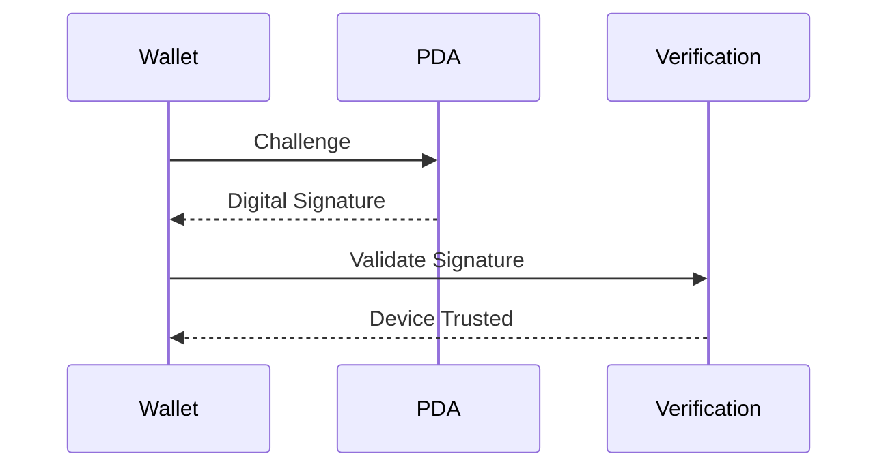

Authentication ensures the physical device is genuine before additional operations proceed.

***

## Certificate Validation Flow

Certificates establish trust between ecosystem participants.

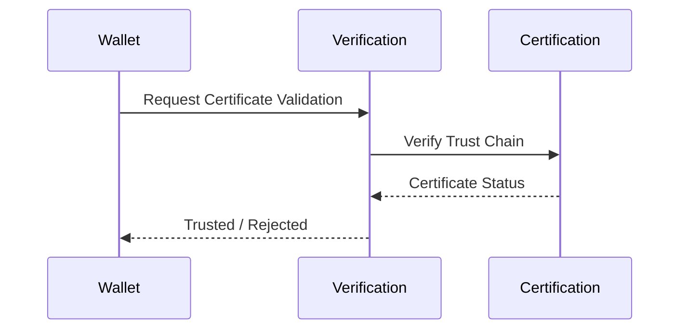

Certificate validation protects the ecosystem from unauthorized or counterfeit devices.

***

## Ownership Verification Flow

Ownership information is verified using blockchain records.

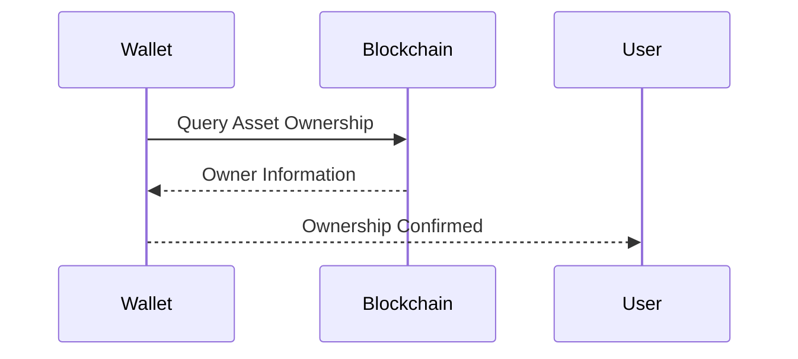

The blockchain remains the authoritative source for ownership and transaction history.

***

## Payment Flow

A payment transaction involves multiple participants.

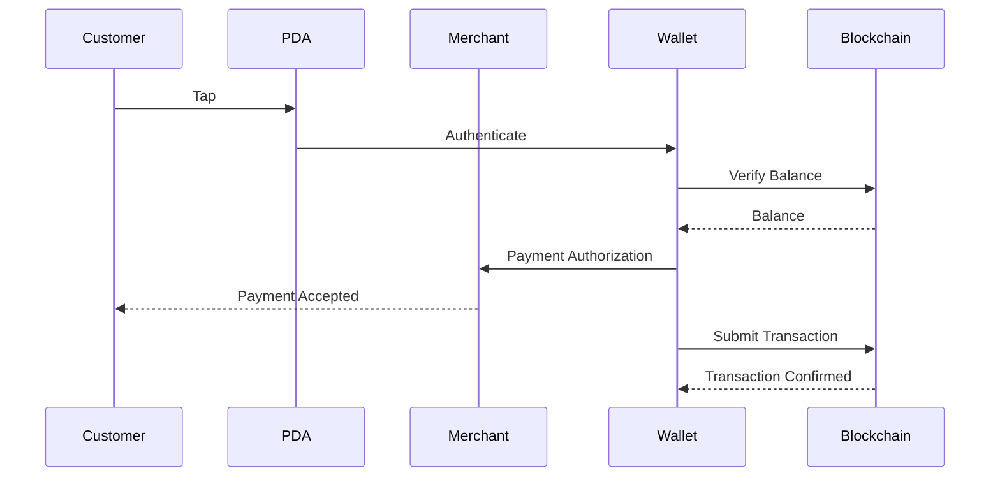

Depending on the implementation, settlement may occur immediately or asynchronously.

***

## Asset Issuance Flow

When a Publisher issues a new Physical Digital Asset, multiple systems cooperate.

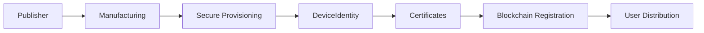

This standardized process ensures every issued asset begins with a trusted identity.

***

## Asset Activation Flow

After distribution, the asset must be activated.

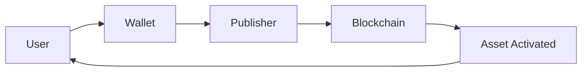

Activation links the physical asset with its intended owner and establishes its operational state.

***

## Ownership Transfer Flow

Ownership transfers are performed securely through blockchain transactions.

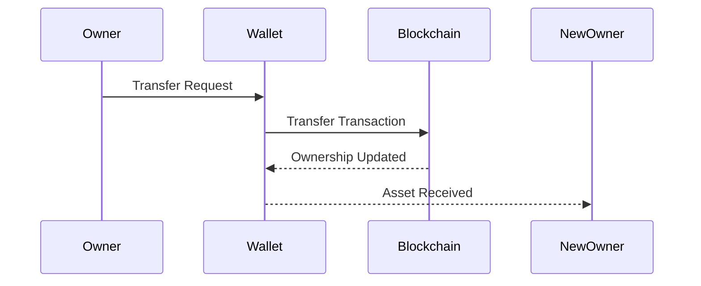

Ownership records remain immutable and traceable on the blockchain.

***

## Reload Flow

Reloadable Physical Digital Assets allow additional value to be added after issuance.

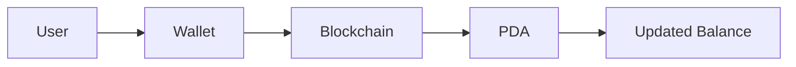

The Physical Digital Asset reflects the updated blockchain state after synchronization.

***

## Verification Flow

Merchants and wallets may verify assets before accepting them.

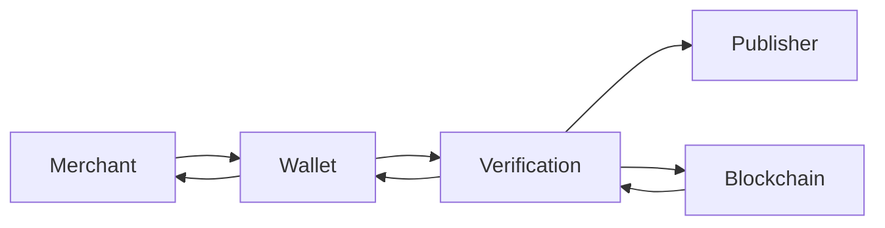

Verification confirms:

* Device authenticity
* Publisher trust
* Ownership
* Asset status
* Policy compliance

***

## Lifecycle Event Flow

Every lifecycle event follows a standardized communication pattern.

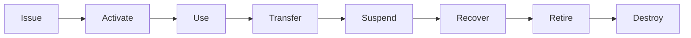

Each state transition is recorded according to publisher policies and blockchain requirements.

***

## Offline Interaction Flow

Certain operations may be performed while temporarily offline.

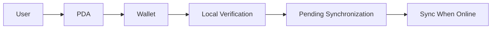

Offline functionality depends on publisher policies, asset type, and supported risk models.

***

## Data Classification

Different types of information travel through different channels.

| Data Type               | Primary Source       | Destination       |
| ----------------------- | -------------------- | ----------------- |
| Device Identity         | Secure Element       | Wallet            |
| Certificate             | Publisher / CA       | Wallet            |
| Asset Metadata          | Publisher            | Wallet            |
| Ownership               | Blockchain           | Wallet            |
| Transaction             | Wallet               | Blockchain        |
| Lifecycle Status        | Publisher            | Verification      |
| Authentication Response | Secure Element       | Wallet            |
| Verification Result     | Verification Service | Wallet / Merchant |

Separating data types reduces unnecessary exposure and improves security.

***

## Security Considerations

Every data exchange within the DCN ecosystem should be protected using appropriate security controls.

Examples include:

* Mutual authentication
* Encrypted communication
* Digital signatures
* Nonce-based challenge-response
* Certificate validation
* Replay protection
* Integrity verification
* Secure session management

These controls ensure that data cannot be intercepted, modified, or replayed without detection.

***

## End-to-End Interaction

The following diagram summarizes a complete DCN interaction.

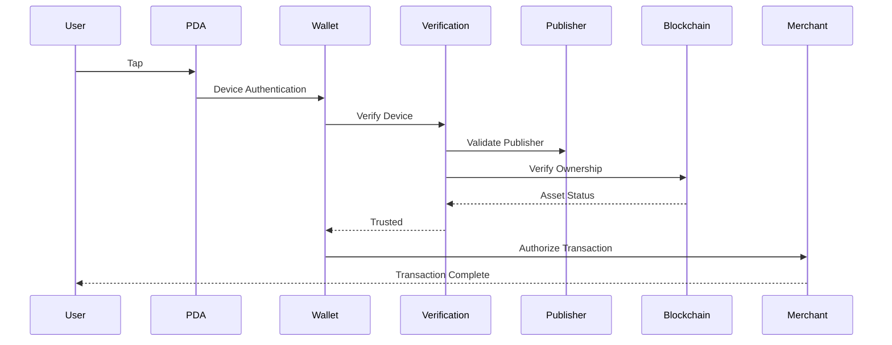

This standardized flow enables independent implementations to interoperate while maintaining security and consistency.

***

## Data Flow Principles

Every compliant implementation should follow these principles.

| Principle          | Description                                                         |
| ------------------ | ------------------------------------------------------------------- |
| Deterministic      | Standardized interaction sequences.                                 |
| Secure             | Every message is authenticated and protected.                       |
| Minimal Disclosure | Only required information is exchanged.                             |
| Interoperable      | Independent implementations communicate seamlessly.                 |
| Auditable          | Critical operations are traceable.                                  |
| Extensible         | New message types can be introduced without breaking compatibility. |

***

## Summary

The DCN Data Flow model defines how information moves throughout the ecosystem, from the moment a user interacts with a Physical Digital Asset to the final verification or blockchain transaction.

By standardizing communication between devices, wallets, publishers, verification services, merchants, and blockchain networks, DCN enables secure, interoperable, and scalable interactions across diverse implementations and industries.

The data flow architecture ensures that every participant speaks the same protocol while preserving user security, publisher flexibility, and blockchain integrity.
