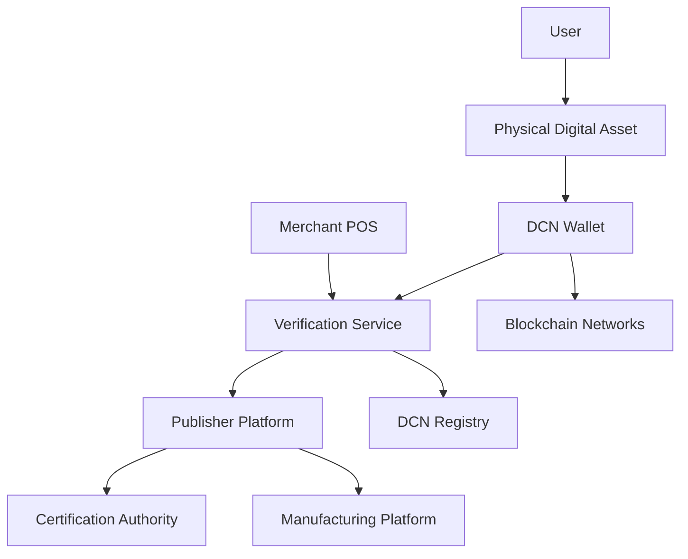
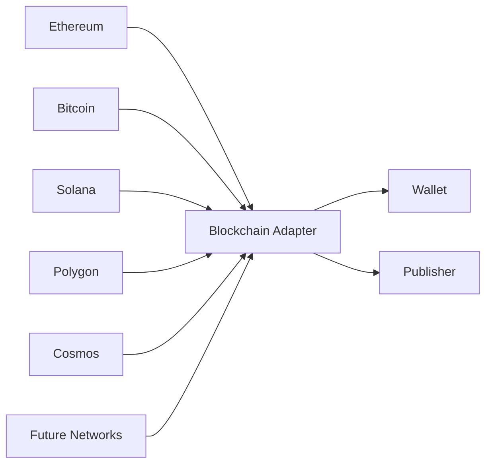
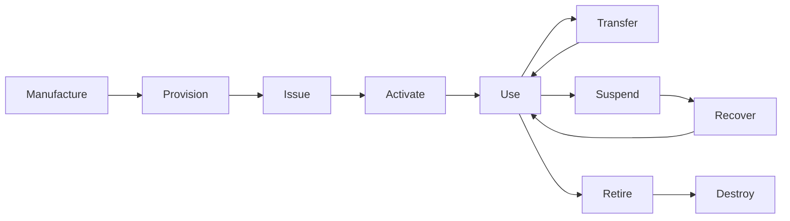
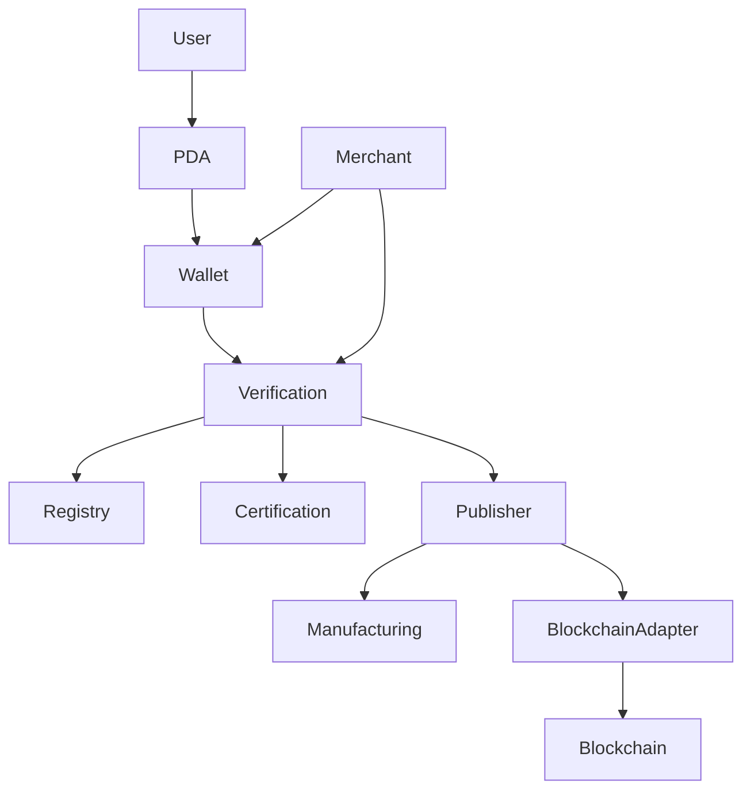
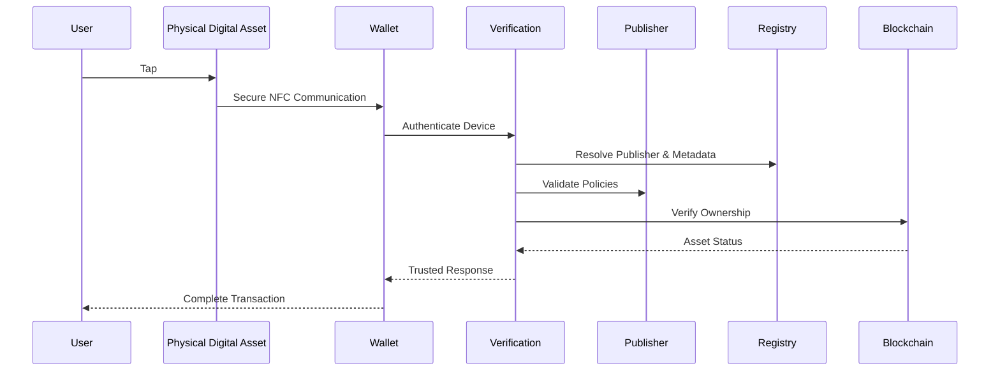

# Platform Components

> _The DCN ecosystem is composed of independent yet interoperable platform components. Each component has a clearly defined responsibility, enabling the entire ecosystem to operate securely, efficiently, and at global scale._

***

## Introduction

The DCN Standard is intentionally designed as a modular platform rather than a single software application.

Instead of one centralized system performing every task, the architecture distributes responsibilities across specialized components.

This approach provides several advantages:

* Better security
* Easier scalability
* Vendor independence
* Faster innovation
* Simpler maintenance
* Multi-chain compatibility
* Global interoperability

Every component communicates using standardized interfaces defined by the DCN Protocol.

***

## Platform Overview

The complete DCN platform consists of the following major components.

Each component is replaceable and independently operated while remaining fully interoperable.

***

## 1. Physical Digital Asset (PDA)

The Physical Digital Asset is the primary object defined by the DCN Standard.

It serves as the secure physical interface between users and digital assets.

#### Responsibilities

* Secure key storage
* Device authentication
* Secure NFC communication
* Asset identification
* Cryptographic signing
* Anti-tamper protection

#### Core Technologies

* Secure Element
* NFC
* Device Certificates
* Secure Firmware
* Random Number Generator
* Cryptographic Engine

The PDA never exposes sensitive cryptographic material outside the secure hardware.

***

## 2. DCN Wallet

The DCN Wallet is the user's primary software interface.

Unlike traditional crypto wallets, a DCN Wallet is designed to interact with Physical Digital Assets.

#### Responsibilities

* Read Physical Digital Assets
* Authenticate devices
* Display balances
* Transfer ownership
* Reload assets
* Verify certificates
* Connect to blockchain networks
* Manage multiple publishers

#### Supported Platforms

* iOS
* Android
* Desktop
* Web Wallet
* Enterprise Wallet
* Hardware Wallet Integration

***

## 3. Publisher Platform

The Publisher Platform is responsible for issuing and managing Physical Digital Assets.

Every Publisher operates its own platform while following the DCN Standard.

#### Responsibilities

* Asset creation
* Issuance
* Lifecycle management
* Policy management
* Asset templates
* Metadata management
* Blockchain integration

#### Example Publishers

* Banks
* Governments
* Stablecoin Issuers
* Enterprises
* Universities
* Retail Brands

***

## 4. Verification Service

Verification Services validate the authenticity and current status of a Physical Digital Asset.

They act as independent trust providers within the ecosystem.

#### Responsibilities

* Device authentication
* Certificate validation
* Publisher verification
* Ownership verification
* Lifecycle validation
* Revocation checks
* Policy evaluation

Verification services may be operated by Publishers, independent providers, or consortium members.

***

## 5. DCN Registry

The Registry is a standardized directory of ecosystem information.

Unlike the blockchain, which stores ownership and transactions, the Registry stores metadata required for interoperability.

#### Registry Information

* Publisher identifiers
* Device identifiers
* Certificate locations
* Supported protocol versions
* Asset templates
* Manufacturer information
* Verification endpoints

The Registry enables applications to discover trusted participants automatically.

***

## 6. Certification Authority (CA)

The Certification Authority establishes trust within the ecosystem.

It issues and manages digital certificates used by Publishers, Manufacturers, and other trusted participants.

#### Responsibilities

* Issue certificates
* Renew certificates
* Revoke certificates
* Maintain trust chains
* Verify participant identities

A compliant implementation may support multiple Certification Authorities while maintaining a common trust framework.

***

## 7. Manufacturing Platform

Manufacturing Platforms produce compliant Physical Digital Assets.

Manufacturing is separated from publishing to maintain neutrality and encourage competition.

#### Responsibilities

* Device production
* Secure chip installation
* Secure provisioning
* Device identity generation
* Quality assurance
* Compliance testing

Only certified manufacturing processes should produce DCN-compliant devices.

***

## 8. Blockchain Adapter Layer

One of the most important architectural components is the Blockchain Adapter Layer.

Instead of embedding blockchain-specific logic into every wallet or device, DCN introduces an abstraction layer.

#### Responsibilities

* Standardize blockchain communication
* Normalize transaction formats
* Translate network-specific operations
* Support future blockchain integrations
* Provide a consistent API

This enables DCN to remain blockchain agnostic.

***

## 9. Blockchain Networks

Blockchain networks remain the authoritative record of ownership and transactions.

DCN does not replace blockchains—it extends them into the physical world.

Supported networks may include:

* Bitcoin
* Ethereum
* Polygon
* Solana
* Cosmos
* Avalanche
* Hyperledger
* Private Enterprise Chains
* Future Networks

***

## 10. Merchant Platform

Merchant Platforms enable businesses to accept Physical Digital Assets.

Examples include:

* Retail POS systems
* E-commerce platforms
* Ticket validation systems
* Transit gates
* Hospitality systems
* Enterprise access control

#### Responsibilities

* Authenticate assets
* Verify ownership
* Accept transactions
* Validate policies
* Connect with wallet applications
* Support offline verification where applicable

***

## 11. Lifecycle Management Service

Lifecycle Management ensures every Physical Digital Asset transitions securely through predefined states.

#### Responsibilities

* Activation
* Suspension
* Recovery
* Ownership transfer
* Retirement
* Revocation
* Status synchronization

***

## 12. Monitoring & Audit Platform

To maintain trust and operational integrity, DCN implementations should include monitoring and audit capabilities.

#### Responsibilities

* Security monitoring
* Certificate auditing
* Issuance logging
* Verification statistics
* Fraud detection
* Compliance reporting
* Operational analytics

These systems support transparency and help identify abnormal behavior across the ecosystem.

***

## Component Relationships

The following diagram illustrates how the primary platform components interact.

Each component performs a specific role while communicating through standardized DCN interfaces.

***

## Design Principles for Components

Every platform component should adhere to the following principles:

| Principle     | Description                                                            |
| ------------- | ---------------------------------------------------------------------- |
| Modular       | Components operate independently.                                      |
| Replaceable   | Vendors can substitute implementations without breaking compatibility. |
| Secure        | Every component follows DCN security requirements.                     |
| Interoperable | Communication uses standardized protocols.                             |
| Scalable      | Components support deployments from small pilots to global ecosystems. |
| Auditable     | Operations should be traceable and verifiable.                         |
| Extensible    | New capabilities can be added without redesigning the architecture.    |

***

## Putting It All Together

A typical interaction involves multiple platform components working together.

No single component controls the ecosystem. Instead, trust is established collaboratively through standardized interactions between independent participants.

***

## Summary

The DCN Platform is composed of specialized components that together enable the issuance, management, verification, and use of Physical Digital Assets.

By separating responsibilities across wallets, publishers, verification services, registries, certification authorities, manufacturers, blockchain adapters, and blockchain networks, the DCN architecture achieves a secure, scalable, and vendor-neutral ecosystem.

This modular design allows organizations to innovate independently while remaining fully compatible with the global DCN Standard.
