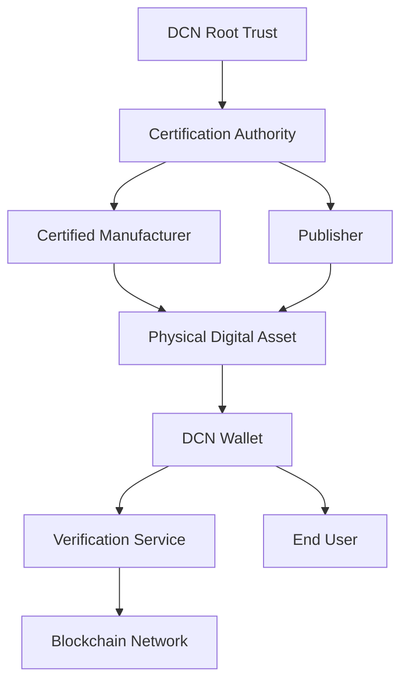
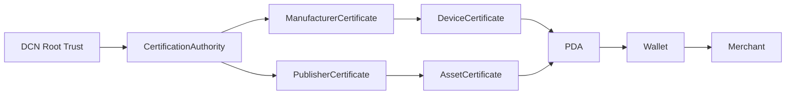
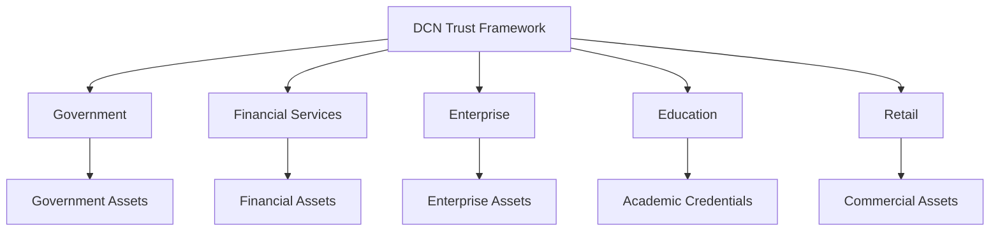
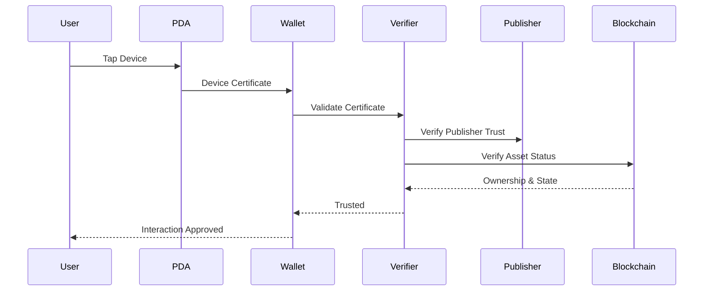
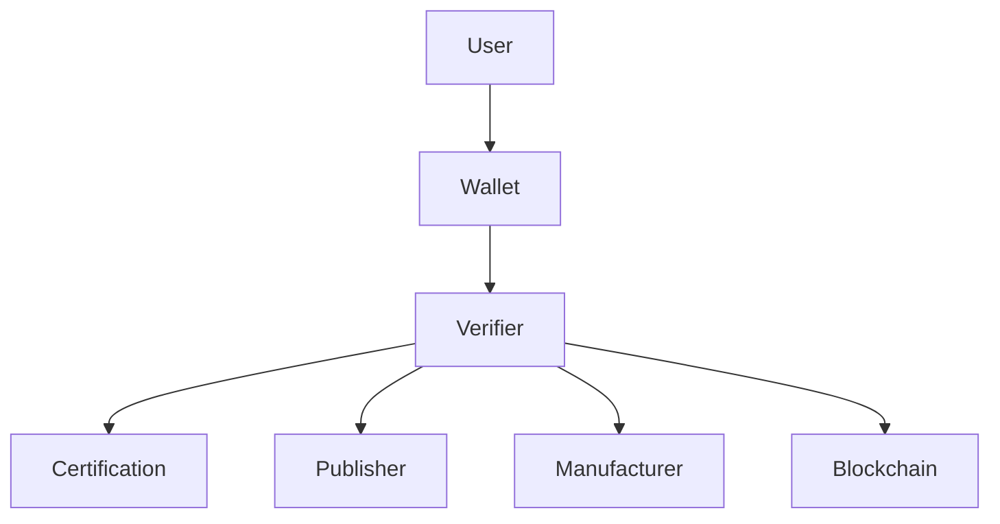

# Trust Model

> _The DCN Trust Model establishes how every participant in the ecosystem can securely trust a Physical Digital Asset without relying on a single centralized authority. Trust is built through cryptography, certified identities, secure hardware, standardized protocols, and blockchain verification._

***

## Introduction

Trust is the foundation of every financial and identity system.

When a person accepts a banknote, they trust it is genuine.

When a merchant accepts a payment card, they trust the issuing bank.

When a browser connects to a secure website, it trusts a digital certificate.

Similarly, when a user taps a Digital Crypto Note or any other Physical Digital Asset, every participant must be able to answer several critical questions:

* Is this device genuine?
* Who manufactured it?
* Which publisher issued it?
* Has it been cloned?
* Is it still active?
* Who owns it?
* Is it safe to interact with?

The DCN Trust Model answers these questions through a layered architecture that distributes trust across multiple independent participants instead of relying on a single organization.

***

## Trust Principles

The DCN Trust Model is based on the following principles.

#### Cryptographic Trust

Trust is established through cryptographic proof rather than visual inspection.

#### Hardware Trust

Sensitive operations are protected by certified secure hardware.

#### Identity Trust

Every participant has a unique, verifiable digital identity.

#### Certificate Trust

Trusted certificates establish relationships between ecosystem participants.

#### Blockchain Trust

Ownership and asset state are verified using blockchain records.

#### Policy Trust

Publishers define policies that govern how assets behave throughout their lifecycle.

#### Open Verification

Any compliant wallet or verifier can independently validate trust without requiring proprietary infrastructure.

***

## Trust Architecture

Every trust relationship is independently verifiable.

***

## Chain of Trust

The DCN ecosystem establishes trust through a chain of cryptographic relationships.

If any link in the chain becomes invalid, the trust relationship is broken.

***

## Trust Anchors

A **Trust Anchor** is the highest authority accepted by a verifier.

Examples include:

* DCN Root Certificate
* National Government Root
* Enterprise Root CA
* Consortium Root
* Industry Root Certificate

Every verifier begins by trusting one or more approved Trust Anchors.

All subsequent trust relationships derive from these anchors.

***

## Trust Domains

Different organizations may operate within different trust domains.

Although policies differ between domains, they remain interoperable through the DCN Standard.

***

## Identity Trust

Every important participant possesses a cryptographic identity.

| Participant            | Identity             |
| ---------------------- | -------------------- |
| Manufacturer           | Manufacturer ID      |
| Publisher              | Publisher ID         |
| Physical Digital Asset | Device ID            |
| User                   | Wallet Address / DID |
| Wallet                 | Wallet Certificate   |
| Merchant               | Merchant Identity    |
| Verification Service   | Service Certificate  |

Every identity is digitally signed and verifiable.

***

## Device Trust

Each Physical Digital Asset establishes trust through secure hardware.

The Secure Element is responsible for:

* Secure key generation
* Private key protection
* Challenge-response authentication
* Cryptographic signing
* Anti-cloning protection
* Secure firmware validation

Because the private key never leaves the Secure Element, attackers cannot simply copy a genuine device.

***

## Publisher Trust

Publishers establish trust by issuing assets under their certified identity.

Publisher trust includes:

* Publisher Certificate
* Organization identity
* Supported asset types
* Supported blockchain networks
* Protocol version
* Policy definitions
* Certificate validity

Wallets validate Publisher trust before accepting interactions.

***

## Manufacturer Trust

Manufacturers are responsible for producing authentic hardware.

A certified manufacturer guarantees:

* Approved secure hardware
* Secure provisioning
* Unique device identity
* Tamper-resistant production
* Compliance with DCN manufacturing requirements

Manufacturers do not control issued assets but provide the trusted hardware foundation.

***

## Certificate Validation

Certificates are validated before sensitive operations occur.

Validation typically includes:

* Signature verification
* Certificate chain validation
* Expiration checks
* Revocation status
* Trust anchor verification
* Protocol compatibility

Only valid certificates establish trusted relationships.

***

## Blockchain Trust

Blockchain networks provide immutable verification of digital state.

Typical checks include:

* Asset ownership
* Asset balance
* Asset existence
* Smart contract status
* Transaction history
* Revocation records
* Policy enforcement

The blockchain acts as the authoritative source of truth for digital ownership.

***

## Verification Flow

The following sequence illustrates a typical trust verification process.

Each participant independently validates the information it receives.

***

## Trust Decisions

Before approving any interaction, a compliant implementation should evaluate:

* Is the Secure Element authentic?
* Is the device certificate valid?
* Is the manufacturer trusted?
* Is the publisher trusted?
* Has the certificate expired?
* Has the certificate been revoked?
* Is the asset active?
* Does blockchain ownership match?
* Does the requested action comply with publisher policies?

Only when all required conditions are satisfied should the interaction proceed.

***

## Trust Without Centralization

One of the key design goals of DCN is to eliminate dependence on a single centralized authority.

Instead, trust is distributed across multiple independent participants.

Even if one participant becomes unavailable, other trust relationships remain independently verifiable where applicable.

***

## Revocation and Recovery

Trust is dynamic rather than permanent.

Certificates or assets may become untrusted due to:

* Device compromise
* Secure Element failure
* Publisher revocation
* Certificate expiration
* Fraud detection
* Regulatory action
* Device retirement

The DCN Trust Model includes standardized mechanisms for:

* Certificate revocation
* Asset suspension
* Ownership recovery
* Device replacement
* Certificate renewal
* Trust restoration

This ensures that compromised assets can be removed from circulation while maintaining the integrity of the ecosystem.

***

## Trust Model Benefits

The DCN Trust Model provides significant advantages.

| Benefit                    | Description                                                             |
| -------------------------- | ----------------------------------------------------------------------- |
| Cryptographic Security     | Trust is based on mathematical proof rather than appearance.            |
| Hardware Protection        | Secure Elements protect sensitive operations.                           |
| Decentralized Verification | Multiple independent parties can verify authenticity.                   |
| Interoperability           | Common trust framework across publishers and industries.                |
| Multi-Chain Support        | Trust model remains consistent across blockchain networks.              |
| Scalability                | Supports millions of devices and thousands of publishers.               |
| Extensibility              | New trust domains and certification authorities can be added over time. |

***

## Summary

The DCN Trust Model provides the security foundation for the entire ecosystem.

Instead of relying on a single institution, trust is established through a combination of secure hardware, cryptographic identities, digital certificates, blockchain verification, standardized protocols, and certified participants.

This layered approach enables users, wallets, merchants, publishers, and verification services to independently validate the authenticity and integrity of every Physical Digital Asset while maintaining an open, scalable, and interoperable ecosystem.
