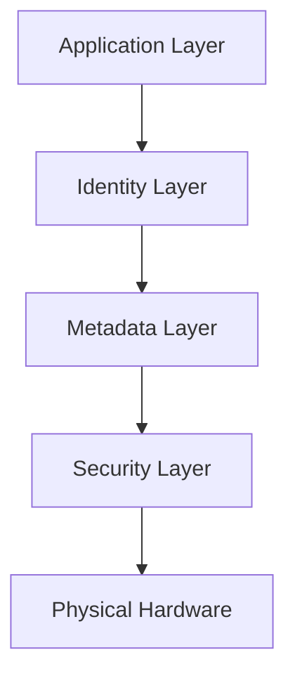
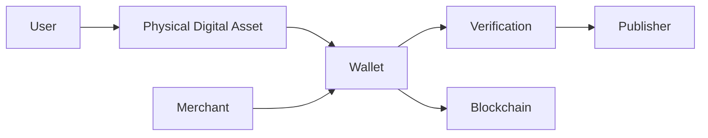

# 5. Physical Digital Asset

> _The Physical Digital Asset (PDA) is the foundational object of the DCN Standard. It combines secure hardware, cryptographic identity, and standardized protocols to bridge the physical and digital worlds, enabling trusted interaction with blockchain-based assets._

***

## Introduction

The DCN Standard introduces a new category of digital infrastructure known as the **Physical Digital Asset (PDA)**.

A Physical Digital Asset is a tangible object that securely represents or provides controlled access to a digital asset, digital identity, or digital credential. Unlike traditional smart cards or NFC tags, a PDA is designed specifically for decentralized ecosystems, combining secure hardware, cryptographic trust, and blockchain interoperability into a standardized form.

Within the DCN ecosystem, every compliant device—from a Digital Crypto Note to a government-issued digital identity card—implements the same core architecture while allowing publishers to define their own business logic and use cases.

This standardization enables a common ecosystem where assets from different publishers can be securely recognized, authenticated, and used through compatible wallets, merchant systems, and verification services.

***

## Purpose

The purpose of a Physical Digital Asset is to provide a trusted physical interface for interacting with digital systems.

A PDA enables users to:

* Hold digital value in a physical form.
* Authenticate ownership securely.
* Interact with blockchain networks through familiar physical actions.
* Exchange assets using tap-based interactions.
* Verify authenticity without relying on visual inspection alone.
* Access digital services using standardized protocols.

The PDA serves as the bridge between human interaction and decentralized infrastructure.

***

## Scope

The DCN Standard does not define a single product.

Instead, it defines the requirements for an entire class of interoperable physical assets.

Examples include:

* Digital Crypto Notes
* Stablecoin Cards
* CBDC Cards
* Identity Credentials
* Access Badges
* Transit Passes
* Gift Cards
* Membership Cards
* Educational Certificates
* Collectible Digital Assets

Every implementation follows the same architectural principles while supporting different industries and applications.

***

## Design Objectives

Every compliant Physical Digital Asset should achieve the following objectives.

### Security

Protect cryptographic keys and sensitive operations using secure hardware.

### Interoperability

Operate consistently across compliant wallets, merchants, publishers, and blockchain networks.

### Portability

Allow users to carry and use digital assets in a familiar physical form.

### Durability

Remain functional throughout its intended operational lifecycle.

### Recoverability

Support standardized recovery and replacement procedures where permitted by publisher policies.

### Extensibility

Allow future capabilities without requiring redesign of the core architecture.

***

## Core Characteristics

A Physical Digital Asset combines both physical and digital capabilities.

| Characteristic    | Description                                          |
| ----------------- | ---------------------------------------------------- |
| Physical          | Exists as a tangible object.                         |
| Cryptographic     | Possesses a unique cryptographic identity.           |
| Secure            | Protects sensitive operations using secure hardware. |
| Verifiable        | Can independently prove authenticity.                |
| Interoperable     | Works across compliant DCN implementations.          |
| Transferable      | Supports ownership transfer where applicable.        |
| Multi-Chain       | May operate with one or more blockchain networks.    |
| Lifecycle Managed | Operates according to standardized lifecycle states. |

***

## High-Level Architecture

Every Physical Digital Asset consists of multiple logical layers.

Each layer performs a distinct function while contributing to the overall security and interoperability of the asset.

***

## Position Within the DCN Ecosystem

The Physical Digital Asset is the central interaction point within the DCN ecosystem.

Users interact with the Physical Digital Asset, while wallets and infrastructure services perform authentication, verification, and blockchain communication behind the scenes.

***

## Separation of Responsibilities

The Physical Digital Asset is intentionally designed to perform only a limited set of responsibilities.

The PDA is responsible for:

* Secure identity
* Cryptographic authentication
* Secure communication
* Local metadata
* Secure key protection

The PDA is **not** responsible for:

* Executing blockchain consensus
* Maintaining distributed ledgers
* Running smart contracts
* Storing complete transaction history
* Managing publisher infrastructure

This separation reduces complexity and improves security.

***

## Standardization

The DCN Standard defines the common behavior expected from every Physical Digital Asset.

This includes standardized requirements for:

* Asset structure
* Identity
* Metadata
* Ownership
* Lifecycle
* Authentication
* Communication
* Security
* Certification

Publishers remain free to define their own branding, policies, and business models while maintaining compatibility with the standard.

***

## Compliance

A Physical Digital Asset is considered DCN-compliant when it satisfies the mandatory requirements defined throughout this specification.

Compliance includes, but is not limited to:

* Unique device identity
* Secure cryptographic implementation
* Standardized metadata
* DCN communication protocols
* Lifecycle management
* Authentication support
* Certificate validation
* Interoperability with compliant ecosystem participants

Formal certification requirements are described in later chapters of this specification.

***

## Relationship to Other Chapters

This chapter introduces the technical specification for the Physical Digital Asset.

The following sections provide detailed definitions of its architecture:

* **Asset Structure** — Defines the physical and logical components of a compliant asset.
* **Metadata** — Specifies the information associated with every asset.
* **Ownership** — Describes ownership models and transfer mechanisms.
* **Lifecycle** — Defines the standardized operational states of an asset.
* **Asset Types** — Introduces standardized categories of Physical Digital Assets.

Together, these sections define the core object upon which the remainder of the DCN Standard is built.

***

## Summary

The Physical Digital Asset is the cornerstone of the DCN Standard.

It provides a secure, standardized, and interoperable physical representation of digital ownership, enabling users to interact with blockchain-based assets through familiar physical experiences.

By separating physical interaction from blockchain infrastructure while maintaining strong cryptographic trust, the DCN Standard creates a flexible foundation for financial services, identity systems, government applications, enterprise solutions, and future digital ecosystems.

***

## In this chapter

* [Asset Structure](asset-structure.md)
* [Metadata](metadata.md)
* [Ownership](ownership.md)
* [Lifecycle](lifecycle.md)
* [Asset Types](asset-types.md)
