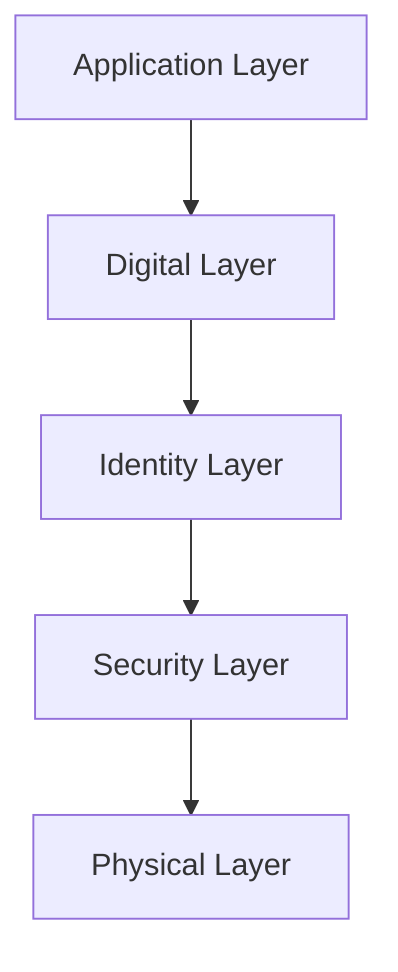
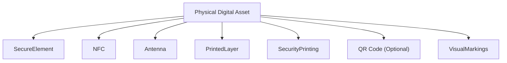
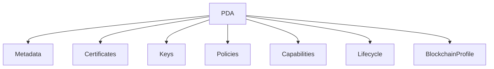
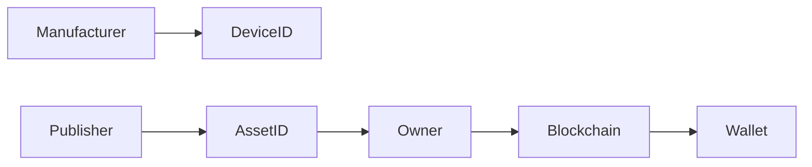
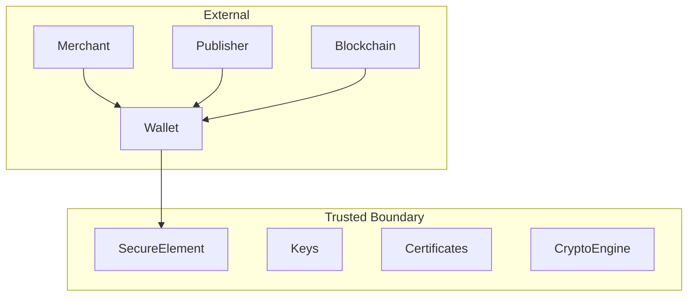
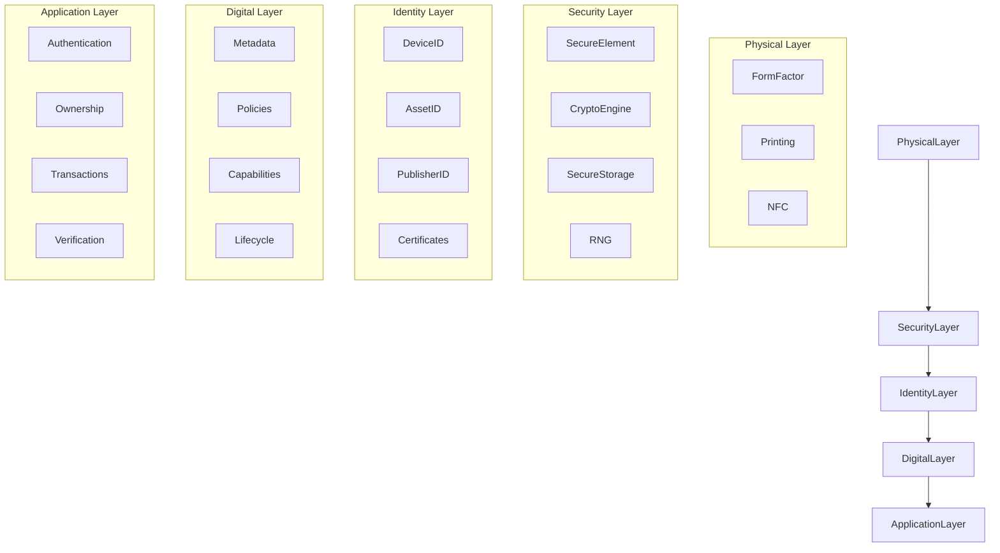

# Asset Structure

> _The Asset Structure defines the mandatory logical and physical components that together form a compliant Physical Digital Asset (PDA). While publishers may customize appearance, branding, and functionality, every compliant asset shares a common architectural foundation defined by the DCN Standard._

***

## Introduction

A Physical Digital Asset is more than a printed note, smart card, or NFC-enabled object.

It is a secure computing device designed to represent, protect, and interact with digital assets.

To ensure interoperability across manufacturers, publishers, wallets, and blockchain networks, every Physical Digital Asset must follow a standardized structure.

The DCN Standard separates an asset into multiple logical layers, allowing each layer to evolve independently while maintaining compatibility with the ecosystem.

***

## Design Goals

The Asset Structure is designed to achieve the following objectives:

* Standardized implementation
* Strong hardware security
* Interoperability across vendors
* Modular architecture
* Future extensibility
* Blockchain independence
* Consistent user experience

Regardless of whether the asset is a Digital Crypto Note, Identity Card, Transit Pass, or Stablecoin Card, the underlying structure remains consistent.

***

## Logical Architecture

Every compliant Physical Digital Asset consists of five logical layers.

Each layer has a distinct responsibility within the asset.

***

## Physical Layer

The Physical Layer represents the tangible form of the asset.

Examples include:

* Polymer note
* Plastic card
* Metal card
* Smart badge
* Wristband
* Key fob
* Wearable
* Secure document

The DCN Standard intentionally does not mandate a specific form factor.

Publishers are free to choose materials and designs appropriate for their application while maintaining compliance with the standard.

Typical characteristics include:

* Durable construction
* Tamper-resistant assembly
* Printed security features
* Embedded secure hardware
* NFC communication area
* Human-readable information

***

## Security Layer

The Security Layer provides the hardware root of trust.

Its purpose is to protect sensitive operations from physical and digital attacks.

Typical components include:

* Secure Element (SE)
* Cryptographic Engine
* Secure Storage
* Hardware Random Number Generator
* Secure Boot
* Anti-Tamper Sensors
* Secure Firmware

Private keys and sensitive credentials should never be exposed outside this layer.

***

## Identity Layer

The Identity Layer uniquely identifies the asset within the DCN ecosystem.

A compliant implementation should maintain independent identities for different purposes.

| Identity        | Purpose                               |
| --------------- | ------------------------------------- |
| Device ID       | Identifies the physical device        |
| Asset ID        | Identifies the represented asset      |
| Publisher ID    | Identifies the issuing organization   |
| Manufacturer ID | Identifies the certified manufacturer |
| Certificate ID  | Identifies trust credentials          |

Separating identities enables secure lifecycle management and ownership changes without replacing the physical device.

***

## Digital Layer

The Digital Layer contains the logical information associated with the asset.

Typical information includes:

* Asset metadata
* Supported blockchain networks
* Protocol version
* Capability profile
* Policy references
* Lifecycle state
* Configuration parameters

This layer enables wallets and applications to understand how the asset should behave.

***

## Application Layer

The Application Layer defines the services available to external applications.

Typical services include:

* Authentication
* Ownership verification
* Balance retrieval
* Transaction authorization
* Secure messaging
* Policy validation
* Asset information
* Lifecycle operations

Applications interact with standardized interfaces rather than directly accessing secure hardware.

***

## Physical Components

A typical Physical Digital Asset contains the following hardware components.

Not every implementation requires every component, but mandatory security requirements must always be satisfied.

***

## Logical Components

The logical architecture is independent of hardware implementation.

These logical components allow software systems to interact with the asset in a predictable manner.

***

## Mandatory Components

Every DCN-compliant Physical Digital Asset **must** include the following capabilities.

| Component                               | Requirement |
| --------------------------------------- | ----------- |
| Unique Device Identity                  | Required    |
| Secure Cryptographic Storage            | Required    |
| Secure Authentication                   | Required    |
| Standardized Metadata                   | Required    |
| Digital Certificates                    | Required    |
| Lifecycle Support                       | Required    |
| NFC or Approved Communication Interface | Required    |
| Protocol Version Identification         | Required    |

These components establish the minimum interoperability baseline for the ecosystem.

***

## Optional Components

Publishers may include additional capabilities depending on their use case.

Examples include:

* Display screens
* Biometric sensors
* Dynamic QR codes
* LEDs
* Buttons
* Battery-backed secure functions
* GPS modules
* Bluetooth Low Energy
* USB interfaces

Optional features must not compromise mandatory security requirements.

***

## Communication Interfaces

A Physical Digital Asset may expose one or more communication interfaces.

| Interface                | Typical Use                     |
| ------------------------ | ------------------------------- |
| NFC                      | Contactless interaction         |
| QR Code                  | Human-readable fallback         |
| Bluetooth LE             | Extended communication          |
| USB                      | Provisioning and enterprise use |
| Secure Contact Interface | Manufacturing and testing       |

The DCN Standard defines communication protocols independently of the transport medium.

***

## Asset Identification Model

Every Physical Digital Asset contains multiple identifiers.

This model separates manufacturing, issuance, ownership, and blockchain representation into independent domains.

***

## Security Boundaries

The standardized structure defines clear security boundaries.

Sensitive operations occur exclusively within the trusted boundary.

External systems interact through authenticated interfaces only.

***

## Design Principles

Every compliant implementation should follow these architectural principles.

#### Modular

Components should be replaceable without affecting unrelated functions.

#### Secure by Design

Security is built into every layer rather than added afterward.

#### Vendor Neutral

The architecture supports multiple manufacturers and hardware platforms.

#### Extensible

Future capabilities should integrate without breaking compatibility.

#### Interoperable

Every implementation should communicate using standardized DCN protocols.

***

## Asset Structure Summary

The following diagram summarizes the complete architecture of a Physical Digital Asset.

***

## Summary

The Asset Structure defines the common architecture shared by every Physical Digital Asset within the DCN ecosystem.

By separating physical construction, security, identity, digital information, and application services into distinct layers, the DCN Standard enables interoperability, simplifies implementation, and provides a secure foundation for a wide range of asset types.

This standardized structure ensures that regardless of manufacturer, publisher, or blockchain network, every compliant Physical Digital Asset behaves consistently within the global DCN ecosystem.
