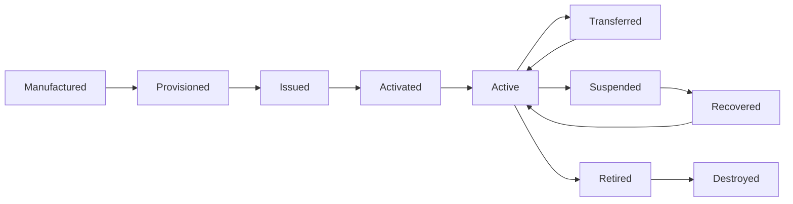
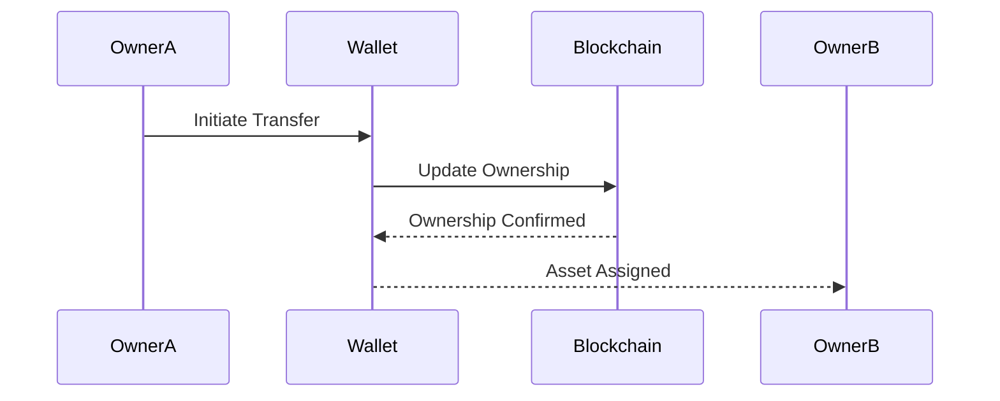
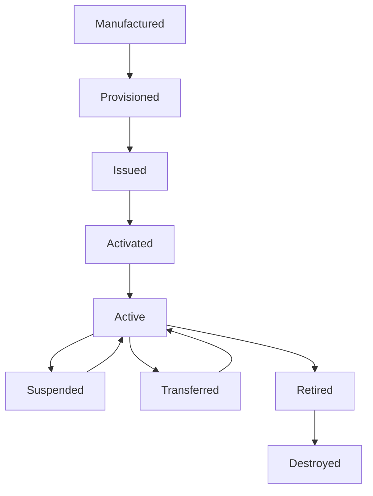
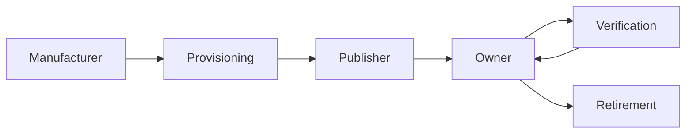

# Lifecycle

> _The Lifecycle defines the standardized states through which a Physical Digital Asset progresses from manufacturing to retirement. A consistent lifecycle ensures that every compliant asset can be securely issued, managed, verified, transferred, recovered, and decommissioned regardless of publisher, manufacturer, or blockchain network._

***

## Introduction

Every Physical Digital Asset (PDA) has a lifecycle.

From the moment secure hardware is manufactured until the asset is permanently retired, it passes through a series of well-defined operational states.

Standardizing these states is essential for interoperability across the DCN ecosystem.

Whether the asset is a Digital Crypto Note, Stablecoin Card, Identity Credential, Transit Pass, or Enterprise Badge, every compliant implementation follows the same lifecycle model.

This enables wallets, merchants, publishers, and verification services to consistently determine the current status of an asset and the operations that are permitted.

***

## Lifecycle Objectives

The DCN Lifecycle is designed to provide:

* Predictable asset behavior
* Standardized state transitions
* Secure provisioning
* Controlled activation
* Trusted ownership changes
* Consistent verification
* Secure recovery
* Proper retirement

Every lifecycle transition should be authenticated, auditable, and authorized.

***

## Lifecycle Overview

Every Physical Digital Asset progresses through a defined sequence of states.

Some transitions are optional depending on the asset type and publisher policies.

***

## Lifecycle States

The DCN Standard defines the following primary lifecycle states.

| State        | Description                                                     |
| ------------ | --------------------------------------------------------------- |
| Manufactured | Physical device has been produced.                              |
| Provisioned  | Secure identity and cryptographic material have been installed. |
| Issued       | Asset has been created by a Publisher.                          |
| Activated    | Asset has been assigned to its first owner.                     |
| Active       | Asset is fully operational.                                     |
| Transferred  | Ownership has changed.                                          |
| Suspended    | Asset is temporarily disabled.                                  |
| Recovered    | Ownership or access has been restored.                          |
| Retired      | Asset is permanently removed from service.                      |
| Destroyed    | Physical device has been securely destroyed or decommissioned.  |

***

## State 1 — Manufactured

Manufacturing is the first stage in the lifecycle.

Typical activities include:

* Device fabrication
* Secure Element installation
* Hardware inspection
* Initial quality assurance
* Tamper protection
* Compliance testing

At this stage, the asset has no publisher identity or blockchain association.

***

## State 2 — Provisioned

Provisioning prepares the device for secure operation.

Typical activities include:

* Device identity generation
* Cryptographic key generation
* Certificate installation
* Secure firmware validation
* Security profile configuration

Provisioning establishes the device's Hardware Root of Trust.

***

## State 3 — Issued

Issuance occurs when a Publisher creates a new Physical Digital Asset.

Typical activities include:

* Asset registration
* Metadata creation
* Publisher certificate assignment
* Blockchain association
* Policy assignment

The asset now exists within the DCN ecosystem but may not yet have an owner.

***

## State 4 — Activated

Activation prepares the asset for operational use.

Typical activities include:

* Owner assignment
* Wallet pairing
* Initial verification
* Publisher authorization
* Lifecycle registration

Activation marks the beginning of the asset's operational life.

***

## State 5 — Active

The Active state represents normal operation.

Typical operations include:

* Authentication
* Payments
* Ownership verification
* Asset transfers
* Metadata retrieval
* Policy enforcement
* Balance updates
* Secure communication

Most interactions occur while the asset is in this state.

***

## State 6 — Transferred

Ownership transfer occurs when the asset changes owners.

Transfer does not alter the physical identity of the asset; only its ownership changes.

***

## State 7 — Suspended

Suspension temporarily disables the asset.

Typical reasons include:

* Lost device
* Suspected theft
* Security investigation
* Policy violation
* Administrative action
* Temporary account restrictions

While suspended, authentication or transaction capabilities may be restricted according to publisher policies.

***

## State 8 — Recovered

Recovery restores a previously suspended or inaccessible asset.

Recovery methods may include:

* Identity verification
* Multi-signature approval
* Guardian authorization
* Enterprise administration
* Publisher-assisted recovery

Recovery procedures should preserve the integrity of ownership and transaction history.

***

## State 9 — Retired

Retirement permanently removes an asset from operational use.

Typical reasons include:

* Hardware end-of-life
* Publisher replacement
* Security compromise
* Policy changes
* Product discontinuation

Retired assets should no longer participate in operational transactions.

***

## State 10 — Destroyed

Destruction is the final lifecycle state.

Typical activities include:

* Secure key deletion
* Certificate revocation
* Secure Element decommissioning
* Hardware destruction
* Audit logging

Destroyed assets cannot be restored.

***

## Lifecycle Transitions

Every state transition should be explicitly authorized.

Unauthorized transitions must be rejected.

***

## Lifecycle Events

Throughout its operational life, a Physical Digital Asset may generate lifecycle events.

Examples include:

* Device manufactured
* Asset issued
* Owner assigned
* Ownership transferred
* Policy updated
* Certificate renewed
* Device suspended
* Asset recovered
* Asset retired

Lifecycle events support monitoring, auditing, and operational management.

***

## Lifecycle Governance

Different participants are responsible for different lifecycle stages.

| Participant          | Responsibilities                             |
| -------------------- | -------------------------------------------- |
| Manufacturer         | Manufacture and provisioning                 |
| Publisher            | Issuance, activation, suspension, retirement |
| Owner                | Daily use and authorized transfers           |
| Wallet               | Authentication and lifecycle awareness       |
| Verification Service | State validation                             |
| Blockchain           | Ownership and transaction history            |

Separating responsibilities strengthens security and operational transparency.

***

## Lifecycle Security

Each lifecycle stage introduces different security requirements.

Examples include:

| Lifecycle Stage | Primary Security Focus                      |
| --------------- | ------------------------------------------- |
| Manufacturing   | Secure production                           |
| Provisioning    | Key generation and certificate installation |
| Issuance        | Publisher authentication                    |
| Activation      | Owner verification                          |
| Active          | Transaction security                        |
| Transfer        | Ownership validation                        |
| Suspension      | Fraud prevention                            |
| Recovery        | Identity assurance                          |
| Retirement      | Secure decommissioning                      |
| Destruction     | Permanent key removal                       |

Every transition should be cryptographically verifiable.

***

## Lifecycle Compliance

Compliant implementations should ensure:

* Every asset has a valid lifecycle state.
* State transitions are authenticated.
* Unauthorized transitions are rejected.
* Lifecycle events are auditable.
* Retired or destroyed assets cannot be reactivated.
* Lifecycle status is available to authorized verification services.

These requirements promote consistency across the ecosystem.

***

## Complete Lifecycle Model

The following diagram summarizes the complete lifecycle.

This model demonstrates how responsibility shifts between ecosystem participants throughout the life of the asset.

***

## Design Principles

The lifecycle model is guided by the following principles.

#### Standardized

Every compliant asset follows the same lifecycle framework.

#### Secure

Transitions require appropriate authorization and verification.

#### Auditable

Lifecycle events can be recorded and reviewed.

#### Interoperable

Different implementations interpret lifecycle states consistently.

#### Extensible

Future lifecycle states may be introduced while preserving backward compatibility.

***

## Summary

The Lifecycle model provides a standardized framework for managing Physical Digital Assets from manufacturing through secure destruction.

By defining consistent lifecycle states, transition rules, and participant responsibilities, the DCN Standard ensures that every compliant asset behaves predictably and securely throughout its operational life.

This common lifecycle enables interoperability across manufacturers, publishers, wallets, merchants, and blockchain networks while supporting diverse asset types and deployment models.
