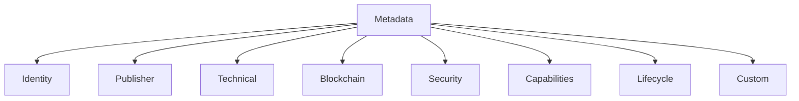
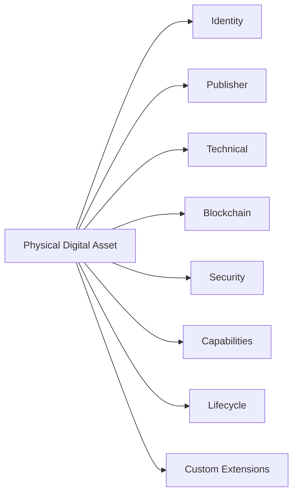
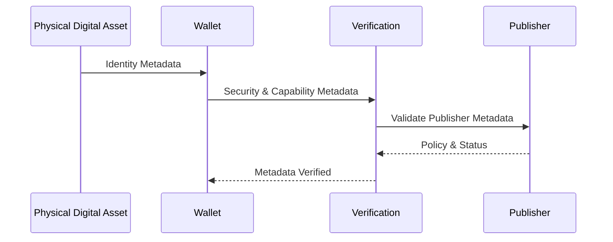

# Metadata

> _Metadata describes the identity, capabilities, configuration, and operational characteristics of a Physical Digital Asset. It provides the information required for wallets, publishers, merchants, and verification services to securely identify and interact with an asset while maintaining interoperability across the DCN ecosystem._

***

## Introduction

Every Physical Digital Asset contains information beyond its cryptographic keys and blockchain address.

This information, known as **metadata**, enables software systems to understand what the asset is, who issued it, what capabilities it supports, and how it should behave.

Metadata does **not** represent ownership or financial value. Instead, it provides descriptive information that allows independent implementations to communicate consistently.

The DCN Standard defines a common metadata model to ensure interoperability across all compliant assets, regardless of manufacturer, publisher, or blockchain network.

***

## Purpose

Metadata serves four primary purposes.

#### Identification

Allows applications to identify the asset and its origin.

#### Interoperability

Provides standardized information that enables different implementations to work together.

#### Configuration

Describes supported capabilities and operational parameters.

#### Verification

Supplies information required to validate authenticity and compatibility.

***

## Metadata Architecture

Metadata is organized into logical categories.

Each category contains information relevant to a specific aspect of the asset.

***

## Identity Metadata

Identity metadata uniquely identifies the Physical Digital Asset.

Typical fields include:

| Field         | Description                            |
| ------------- | -------------------------------------- |
| Asset ID      | Unique identifier of the digital asset |
| Device ID     | Identifier of the physical device      |
| Asset Type    | Classification of the asset            |
| Version       | Metadata specification version         |
| Serial Number | Manufacturer-assigned identifier       |

These identifiers remain stable throughout the asset's operational lifetime unless otherwise defined by publisher policy.

***

## Publisher Metadata

Publisher metadata identifies the organization responsible for issuing the asset.

Typical fields include:

* Publisher ID
* Publisher Name
* Publisher Certificate
* Publisher URL
* Support Contact
* Issuance Policy Reference
* Terms of Use Reference

Wallets use this information to establish trust and display issuer information to users.

***

## Technical Metadata

Technical metadata describes implementation details required for interoperability.

Typical information includes:

* DCN protocol version
* Hardware version
* Firmware version
* Secure Element version
* Supported communication interfaces
* Supported cryptographic algorithms

Applications use these fields to determine compatibility before initiating secure operations.

***

## Blockchain Metadata

Blockchain metadata links the Physical Digital Asset to one or more blockchain ecosystems.

Typical fields include:

* Supported blockchain network
* Network identifier
* Smart contract reference
* Token standard
* Asset address
* Blockchain adapter profile

A single Physical Digital Asset may support multiple blockchain networks depending on publisher implementation.

***

## Security Metadata

Security metadata provides information required to evaluate trust.

Examples include:

* Certificate identifiers
* Certificate status
* Cryptographic profile
* Secure Element profile
* Authentication methods
* Trust level
* Security classification

Sensitive security information should never expose confidential cryptographic material.

***

## Capability Metadata

Capability metadata defines the features supported by the asset.

Examples include:

| Capability            | Description                           |
| --------------------- | ------------------------------------- |
| Authentication        | Device authentication support         |
| Ownership Transfer    | Supports ownership changes            |
| Reloadable            | Supports balance updates              |
| Offline Operation     | Limited offline interaction           |
| Multi-Chain           | Supports multiple blockchain networks |
| Programmable Policies | Supports configurable rules           |
| Collectible Features  | Supports non-financial attributes     |

Applications can adapt their behavior based on supported capabilities.

***

## Lifecycle Metadata

Lifecycle metadata describes the current operational state of the asset.

Examples include:

* Manufactured
* Provisioned
* Issued
* Activated
* Active
* Suspended
* Revoked
* Retired
* Destroyed

Lifecycle information allows applications to reject assets that are no longer valid.

***

## Custom Metadata

Publishers may include additional metadata specific to their implementation.

Examples include:

* Loyalty information
* Membership level
* Transit zone
* Government classification
* Enterprise department
* Product edition
* Campaign identifier

Custom metadata must not conflict with standardized DCN fields.

***

## Metadata Model

The following diagram illustrates the relationship between metadata categories.

This modular structure allows future expansion while preserving interoperability.

***

## Mandatory Metadata

Every compliant Physical Digital Asset should include the following minimum metadata.

| Metadata           | Required |
| ------------------ | -------- |
| Asset ID           | Yes      |
| Device ID          | Yes      |
| Asset Type         | Yes      |
| Publisher ID       | Yes      |
| Protocol Version   | Yes      |
| Security Profile   | Yes      |
| Lifecycle State    | Yes      |
| Capability Profile | Yes      |

These fields establish the baseline required for interoperability.

***

## Optional Metadata

Additional metadata may be included where appropriate.

Examples include:

* Manufacturer details
* Production batch
* Asset artwork
* Localization information
* Branding
* Display name
* User-defined labels
* External references

Optional fields should remain backward compatible with future versions of the DCN Standard.

***

## Metadata Integrity

Metadata forms part of the trust model and should be protected against unauthorized modification.

Implementations should ensure:

* Integrity validation
* Authenticated updates
* Version tracking
* Publisher authorization
* Tamper detection

Critical metadata should be digitally signed or otherwise cryptographically protected.

***

## Metadata Versioning

To maintain compatibility across implementations, metadata should include explicit version information.

Versioning enables applications to:

* Interpret metadata correctly
* Support legacy assets
* Introduce new fields
* Preserve backward compatibility

Future revisions of the DCN Standard may extend the metadata model without invalidating compliant Version 1.0 assets.

***

## Metadata Visibility

Not all metadata is intended for every participant.

The DCN Standard recognizes different visibility levels.

| Visibility   | Typical Access            |
| ------------ | ------------------------- |
| Public       | Wallets, merchants, users |
| Protected    | Verified applications     |
| Restricted   | Publisher infrastructure  |
| Confidential | Secure Element only       |

Separating metadata by visibility improves privacy while maintaining interoperability.

***

## Metadata Exchange

During a standard interaction, metadata is exchanged as required between ecosystem participants.

Only the metadata required for a particular operation should be exchanged.

***

## Design Principles

The metadata model follows several guiding principles.

#### Standardized

Core fields are defined by the DCN Standard.

#### Extensible

Publishers may introduce custom extensions.

#### Interoperable

Independent implementations interpret metadata consistently.

#### Secure

Sensitive metadata is protected against unauthorized access or modification.

#### Versioned

Future revisions remain compatible with existing assets.

#### Minimal

Only the information necessary for interoperability is standardized.

***

## Summary

Metadata provides the descriptive foundation of every Physical Digital Asset.

It enables wallets, publishers, merchants, and verification services to identify assets, determine capabilities, establish trust, and maintain interoperability across the DCN ecosystem.

By defining a standardized yet extensible metadata model, the DCN Standard ensures that compliant assets can evolve over time while remaining compatible with existing implementations and future versions of the specification.
