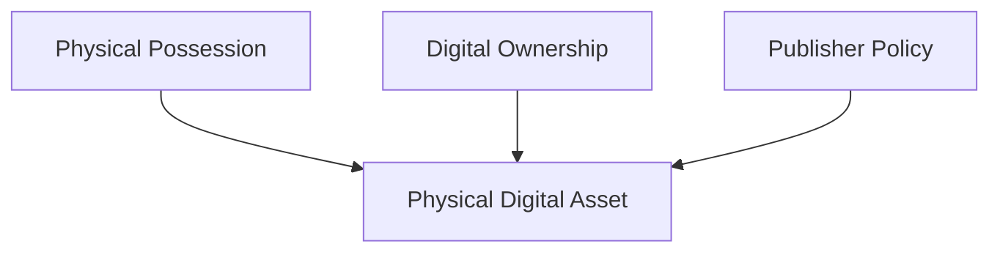
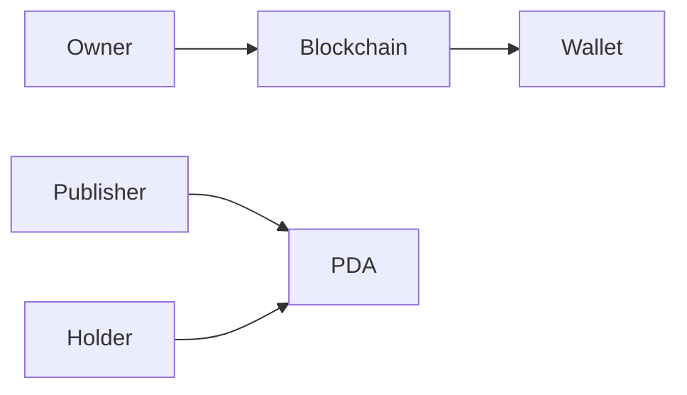
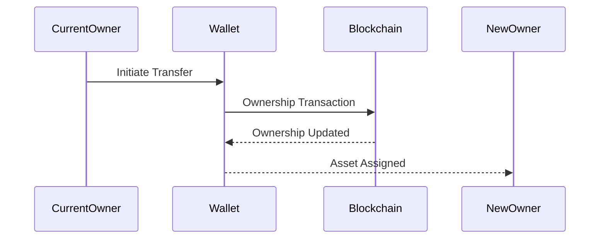
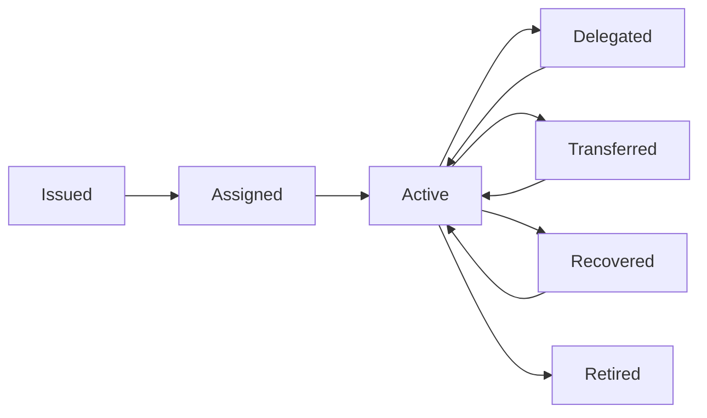

# Ownership

> _Ownership defines the relationship between a Physical Digital Asset, its holder, and the underlying digital asset. The DCN Standard establishes a flexible ownership model that supports self-custody, institutional custody, delegated control, and programmable ownership while maintaining interoperability across the ecosystem._

***

## Introduction

Ownership is one of the fundamental concepts of the DCN Standard.

A Physical Digital Asset (PDA) is a secure physical object, but ownership is not determined by possession alone. Instead, ownership is established through cryptographic proof, blockchain records, publisher policies, or a combination of these mechanisms.

This distinction allows a Physical Digital Asset to be physically transferred, securely recovered, temporarily delegated, or permanently retired without compromising the integrity of the underlying digital asset.

The DCN Standard separates **physical possession**, **cryptographic control**, and **legal ownership**, enabling different deployment models across financial, governmental, and enterprise environments.

***

## Ownership Model

A Physical Digital Asset consists of three independent ownership domains.

A compliant implementation may require one, two, or all three domains to authorize an operation.

***

## Ownership Principles

Every compliant implementation should follow these principles.

#### User Ownership

Users should maintain control over their assets whenever permitted by publisher policy.

#### Cryptographic Proof

Ownership should be verified using cryptographic evidence rather than visual inspection.

#### Separation of Roles

Possession, ownership, and administration are independent concepts.

#### Recoverability

Ownership recovery mechanisms should be standardized where applicable.

#### Transferability

Assets may support secure ownership transfer according to publisher-defined policies.

#### Auditability

Ownership changes should be traceable and verifiable.

***

## Ownership Domains

The DCN Standard recognizes multiple ownership domains.

| Domain                 | Description                                          |
| ---------------------- | ---------------------------------------------------- |
| Physical Possession    | Who currently holds the physical asset               |
| Digital Ownership      | Who controls the blockchain asset                    |
| Administrative Control | Publisher or enterprise management rights            |
| Legal Ownership        | Ownership recognized by applicable laws or contracts |

These domains may belong to different entities depending on the asset type.

***

## Physical Possession

Physical possession refers to the individual or organization currently holding the Physical Digital Asset.

Examples include:

* A person carrying a Digital Crypto Note
* An employee holding a company access badge
* A passenger carrying a transit card

Possession alone does not necessarily grant ownership or spending authority.

***

## Digital Ownership

Digital ownership represents control of the associated blockchain asset or digital credential.

Depending on implementation, this may be determined by:

* Wallet ownership
* Smart account ownership
* Multi-signature authorization
* Digital Identity (DID)
* Smart contract logic

The blockchain remains the authoritative record of digital ownership where applicable.

***

## Administrative Ownership

Certain asset types require administrative control.

Examples include:

* Enterprise employee cards
* Government-issued identity documents
* University credentials
* Healthcare cards

Administrative ownership allows publishers to:

* Suspend assets
* Renew certificates
* Update policies
* Replace compromised assets
* Retire obsolete assets

Administrative control does not automatically imply ownership of the represented digital asset.

***

## Ownership Relationships

A single asset may have different entities acting as publisher, owner, and holder.

***

## Ownership Verification

Before performing sensitive operations, ownership should be verified.

Typical verification methods include:

* Cryptographic challenge-response
* Blockchain ownership verification
* Digital signature validation
* Publisher authorization
* Multi-factor authentication
* Policy evaluation

Verification requirements depend on the asset type and publisher configuration.

***

## Ownership Transfer

Ownership transfer allows control of an asset to move from one owner to another.

Typical transfer process:

Transfer policies are defined by the Publisher and may include additional authorization requirements.

***

## Delegated Ownership

Some use cases require temporary delegation without changing the underlying owner.

Examples include:

* Parents assigning spending rights to children
* Companies issuing temporary employee credentials
* Event organizers issuing temporary access passes
* Enterprises granting limited operational authority

Delegated ownership should include:

* Duration
* Permissions
* Spending limits (if applicable)
* Revocation capability

***

## Shared Ownership

Certain assets may support multiple authorized owners.

Examples include:

* Corporate treasury assets
* Family savings assets
* Joint investment products
* Multi-signature wallets

Typical authorization models include:

| Model        | Description                        |
| ------------ | ---------------------------------- |
| 1-of-N       | Any authorized owner may act       |
| M-of-N       | Multiple approvals required        |
| Role-Based   | Authority depends on assigned role |
| Policy-Based | Rules determine authorization      |

***

## Recoverable Ownership

Loss of the physical asset should not automatically result in permanent loss of ownership.

Depending on publisher policy, recovery mechanisms may include:

* Publisher-assisted recovery
* Multi-signature recovery
* Guardian recovery
* Enterprise recovery
* Identity-based recovery
* Backup credential restoration

Recovery policies should balance usability with security.

***

## Ownership States

Ownership transitions occur throughout the lifecycle of an asset.

Each transition should follow standardized verification procedures.

***

## Ownership Policies

Publishers define ownership rules according to their use case.

Examples include:

| Asset Type          | Typical Ownership Policy     |
| ------------------- | ---------------------------- |
| Digital Crypto Note | Freely transferable          |
| Stablecoin Card     | User-controlled              |
| Government ID       | Non-transferable             |
| Employee Badge      | Organization-controlled      |
| Transit Pass        | User-specific                |
| Gift Card           | Bearer or assigned           |
| Collectible Asset   | Transferable with provenance |

The DCN Standard supports all models through configurable policies.

***

## Ownership Security

Ownership mechanisms should provide protection against:

* Unauthorized transfers
* Device theft
* Cloning attacks
* Identity spoofing
* Replay attacks
* Unauthorized delegation
* Privilege escalation

Security controls may include:

* Secure Element authentication
* Cryptographic signatures
* Certificate validation
* Blockchain confirmation
* Multi-factor authentication
* Policy enforcement

***

## Ownership Privacy

Ownership information should be disclosed only to authorized participants.

The DCN Standard encourages:

* Minimal identity disclosure
* Selective information sharing
* Pseudonymous blockchain addresses where appropriate
* Separation of public and private ownership data

This helps protect user privacy while preserving verifiability.

***

## Design Principles

The ownership model follows several core principles.

#### Flexible

Supports multiple ownership models across industries.

#### Secure

Ownership is protected through cryptographic verification.

#### Interoperable

Ownership semantics remain consistent across compliant implementations.

#### Recoverable

Supports secure recovery where permitted.

#### Transferable

Ownership transfer is standardized while respecting publisher policies.

#### Extensible

Future ownership models can be introduced without redesigning the architecture.

***

## Summary

The DCN Ownership Model defines how Physical Digital Assets are assigned, controlled, transferred, delegated, and recovered throughout their lifecycle.

By separating physical possession, digital ownership, administrative authority, and legal ownership, the DCN Standard supports a wide range of financial, governmental, enterprise, and consumer use cases while maintaining strong security, interoperability, and user control.

Ownership is therefore not simply about who holds the asset—it is a standardized trust relationship between people, devices, publishers, and blockchain infrastructure.
