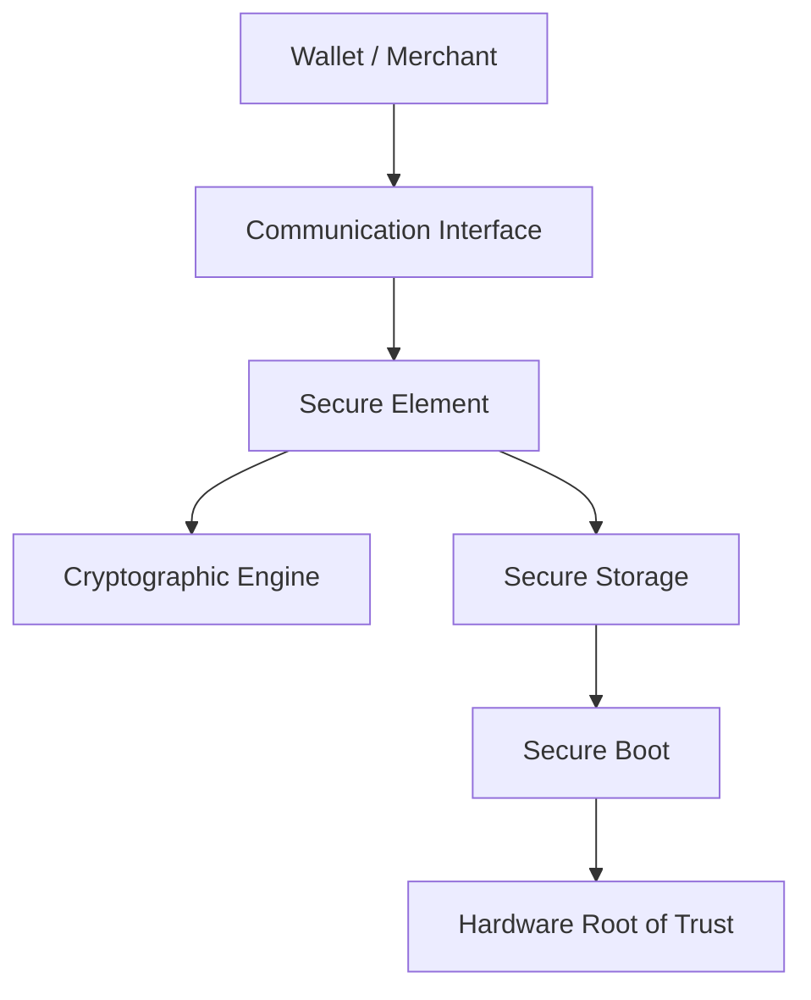
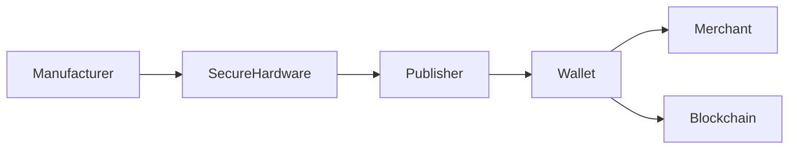

# 6. Secure Hardware

> _Secure Hardware forms the trusted physical foundation of every Digital Crypto Note (DCN). It protects cryptographic secrets, enforces security policies, and provides the hardware root of trust upon which the entire DCN ecosystem depends._

***

## Introduction

The security of a Physical Digital Asset begins with its hardware.

Unlike traditional paper currency, QR codes, or software wallets, a DCN contains dedicated secure hardware designed to protect digital assets against both physical and digital attacks.

The Secure Hardware architecture ensures that sensitive operations—such as cryptographic key generation, digital signatures, authentication, and secure storage—are performed inside an isolated trusted environment that cannot be accessed by unauthorized software or external devices.

The DCN Standard does not mandate a specific chip vendor or hardware implementation. Instead, it defines the minimum security capabilities required for interoperability and certification.

***

## Objectives

The Secure Hardware architecture is designed to achieve the following objectives:

* Protect cryptographic keys
* Prevent cloning and counterfeiting
* Provide a Hardware Root of Trust
* Enable secure NFC communication
* Detect physical tampering
* Support secure lifecycle management
* Enable secure firmware execution
* Maintain interoperability across certified hardware vendors

***

## Hardware Architecture

Every compliant Physical Digital Asset consists of multiple hardware security layers.

The layered architecture ensures that sensitive operations remain isolated from external systems.

***

## Secure Hardware Components

The DCN Standard defines the following core hardware components.

| Component               | Purpose                             |
| ----------------------- | ----------------------------------- |
| Secure Element          | Secure execution environment        |
| NFC Interface           | Contactless communication           |
| Hardware Root of Trust  | Trusted hardware identity           |
| Secure Storage          | Protection of cryptographic secrets |
| Cryptographic Engine    | Hardware cryptographic operations   |
| Random Number Generator | Secure entropy generation           |
| Secure Boot             | Trusted firmware execution          |
| Anti-Tamper System      | Physical attack resistance          |

Each component contributes to the overall security of the Physical Digital Asset.

***

## Security Layers

Secure Hardware follows a defense-in-depth model.

If one layer is compromised, the remaining layers continue protecting critical assets.

***

## Hardware Root of Trust

Every compliant device shall establish a unique Hardware Root of Trust (HRoT).

The Hardware Root of Trust provides:

* Device identity
* Trusted cryptographic keys
* Secure boot verification
* Certificate validation
* Firmware authenticity
* Device attestation

The HRoT forms the foundation upon which all higher-level trust relationships are built.

***

## Secure Execution

Sensitive operations should execute exclusively inside the Secure Element.

Examples include:

* Private key generation
* Digital signature creation
* Authentication
* Certificate validation
* Secure messaging
* Cryptographic verification

Private keys should never leave the secure execution boundary.

***

## Hardware Identity

Every compliant device shall possess a unique hardware identity.

Typical identifiers include:

* Manufacturer ID
* Device ID
* Hardware Version
* Secure Element Identifier
* Production Batch
* Certificate Identifier

These identifiers support lifecycle management, certification, and authenticity verification.

***

## Hardware Security Objectives

The Secure Hardware architecture should provide protection against:

* Device cloning
* Counterfeit hardware
* Side-channel attacks
* Fault injection
* Firmware modification
* Hardware replacement
* Memory extraction
* Unauthorized debugging

These protections establish trust throughout the DCN ecosystem.

***

## Hardware Independence

The DCN Standard is hardware-neutral.

Manufacturers may implement compliant devices using different certified secure hardware platforms, provided they satisfy the mandatory security requirements defined by this specification.

Possible implementations include:

* Secure Elements
* Smart Card ICs
* Secure Microcontrollers
* Trusted Execution Environments (where appropriate)
* Future certified secure hardware technologies

This approach encourages innovation while maintaining interoperability.

***

## Manufacturing Security

Secure Hardware security begins during manufacturing.

Typical manufacturing processes include:

* Secure chip provisioning
* Device identity generation
* Certificate installation
* Secure key generation
* Hardware validation
* Tamper inspection
* Secure packaging

Manufacturers should maintain documented chain-of-custody procedures throughout production.

***

## Secure Provisioning

Before issuance, every device undergoes secure provisioning.

Provisioning typically includes:

* Installing trusted firmware
* Generating device keys
* Registering certificates
* Assigning hardware identifiers
* Configuring security policies
* Validating hardware integrity

Provisioning establishes the trusted identity of the Physical Digital Asset.

***

## Trust Relationships

The Secure Hardware architecture establishes trust between ecosystem participants.

Trust originates from certified hardware and extends through publishers, wallets, and blockchain infrastructure.

***

## Compliance Requirements

A DCN-compliant Secure Hardware implementation shall provide:

* Certified secure hardware
* Hardware Root of Trust
* Secure cryptographic execution
* Protected key storage
* Secure provisioning
* Secure boot capability
* Tamper resistance
* Unique hardware identity
* Authenticated firmware
* Standardized communication interfaces

Additional requirements may be introduced in future versions of the DCN Specification.

***

## Relationship to Subsequent Sections

This chapter introduces the Secure Hardware architecture.

The following sections define each major component in detail:

* **Secure Element** — Secure execution and key protection
* **NFC Interface** — Contactless communication architecture
* **Hardware Root of Trust** — Trusted device identity
* **Anti-Tamper Design** — Protection against physical attacks

Together, these components establish the trusted computing foundation of every Physical Digital Asset.

***

## Design Principles

The Secure Hardware architecture follows five fundamental principles.

#### Secure by Design

Security is embedded into the hardware architecture from the beginning.

#### Vendor Neutral

Multiple certified manufacturers may implement compliant hardware.

#### Cryptographically Trusted

Trust is established through hardware-backed cryptographic identities.

#### Tamper Resistant

Physical attacks should be detected, resisted, or mitigated.

#### Future Ready

The architecture supports future secure hardware technologies while maintaining backward compatibility.

***

## Summary

Secure Hardware provides the physical foundation upon which every Digital Crypto Note is built.

By combining certified secure components, trusted execution, cryptographic protection, and standardized security requirements, the DCN Standard creates a hardware platform capable of securely representing digital assets in the physical world.

Subsequent sections describe the individual hardware components that together implement this trusted architecture.

***

## In this chapter

* [Secure Element](secure-element.md)
* [NFC Interface](nfc-interface.md)
* [Hardware Root of Trust](hardware-root-of-trust.md)
* [Anti-Tamper Design](anti-tamper-design.md)
