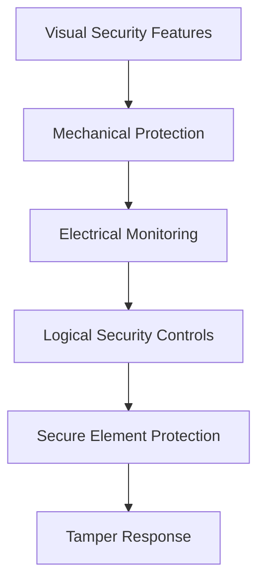
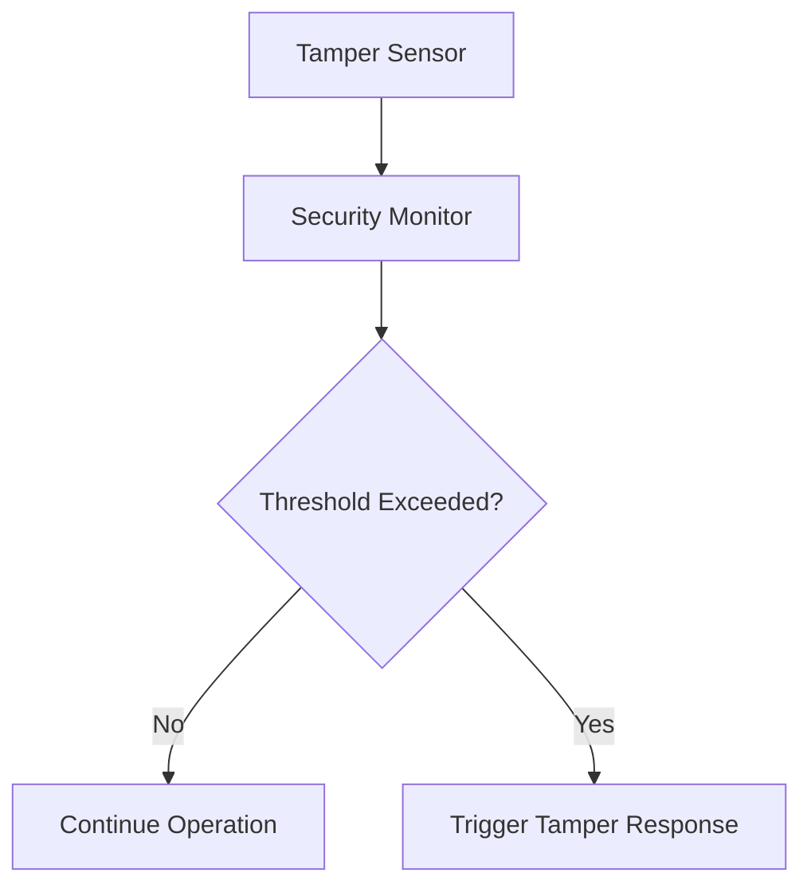
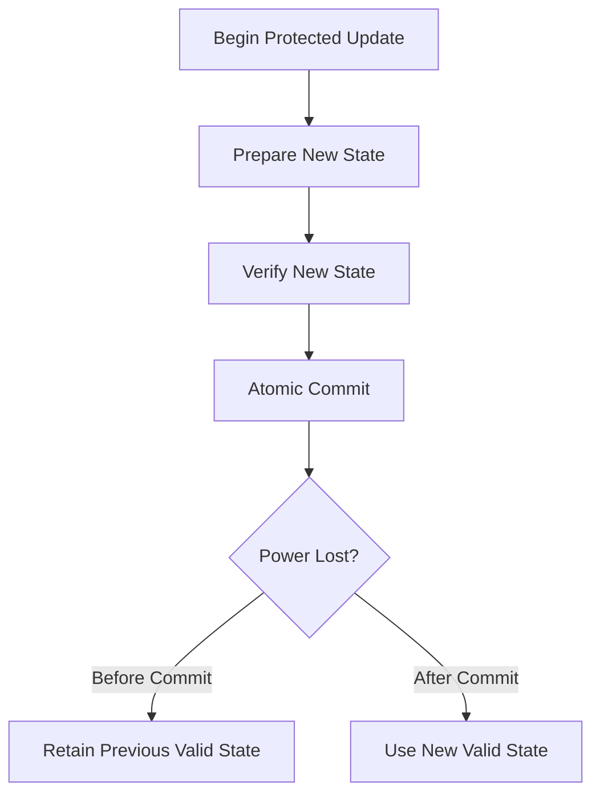
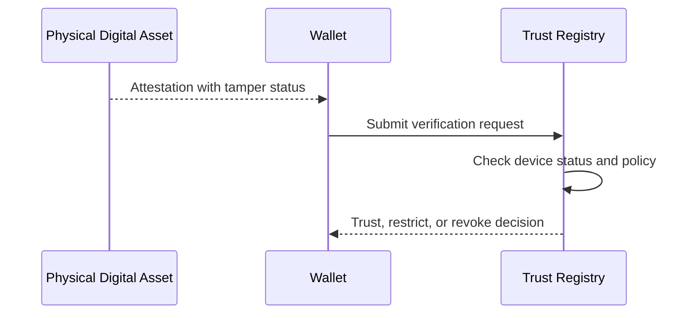
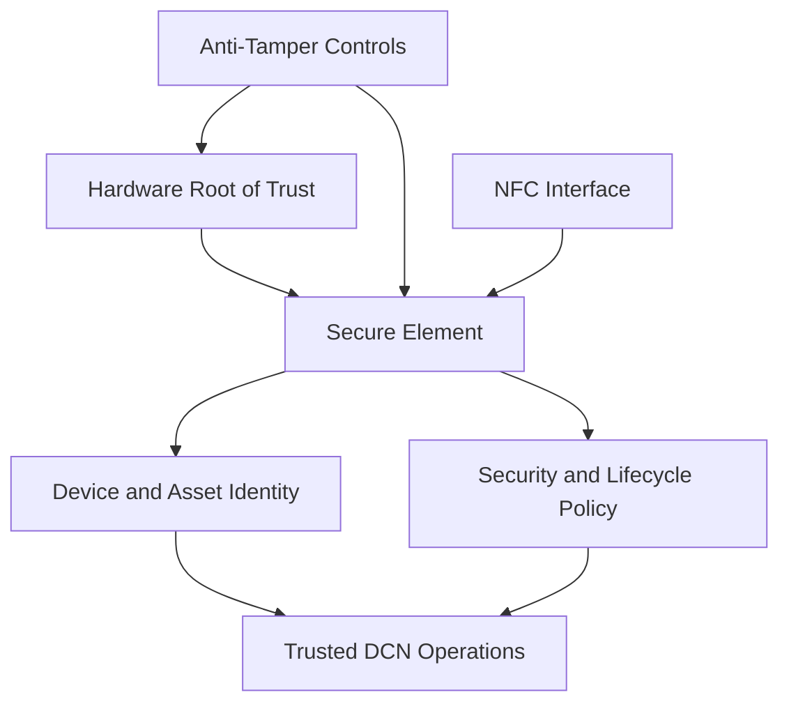

# Anti-Tamper Design

> _Anti-Tamper Design protects a Physical Digital Asset against physical inspection, modification, extraction, substitution, and environmental manipulation intended to expose secrets or bypass trusted behavior._

***

## Introduction

A Physical Digital Asset may be directly handled, transported, stored, resold, stolen, disassembled, or exposed to hostile environments.

Unlike cloud infrastructure or mobile applications, the attacker may have prolonged physical access to the device.

The DCN architecture must therefore assume that an adversary may attempt to:

* Open the physical enclosure
* Remove the Secure Element
* Probe electrical connections
* Read internal memory
* Replace components
* modify NFC communication paths
* Inject electrical faults
* Manipulate voltage, clock, temperature, or light
* Observe power or electromagnetic emissions
* Reconstruct a counterfeit device
* Extract cryptographic keys

Anti-Tamper Design provides layered protections against these attacks.

The objective is not to claim that hardware can never be attacked. Instead, the objective is to make attacks detectable, economically impractical, operationally limited, or unable to compromise protected secrets.

***

## Purpose

Anti-Tamper Design is intended to:

* Protect cryptographic keys
* Prevent unauthorized hardware modification
* Detect enclosure or chip manipulation
* Resist probing and memory extraction
* Mitigate side-channel attacks
* Mitigate fault-injection attacks
* Prevent component substitution
* Reduce cloning and counterfeiting
* Protect trusted communication paths
* Trigger secure failure behavior
* Preserve evidence of tampering where supported

Anti-tamper controls must operate together with the Secure Element, Hardware Root of Trust, secure manufacturing, attestation, and lifecycle controls.

***

## Security Model

Anti-tamper protection follows a defense-in-depth model.

No single control should be treated as sufficient.

An attacker who bypasses one layer should still face additional independent protections.

***

## Tamper Protection Categories

The DCN Standard recognizes four broad categories of tamper control.

| Category          | Objective                                             |
| ----------------- | ----------------------------------------------------- |
| Tamper Evidence   | Make physical interference visible                    |
| Tamper Resistance | Increase the difficulty of interference               |
| Tamper Detection  | Detect abnormal physical or environmental conditions  |
| Tamper Response   | Restrict operation or protect secrets after detection |

A compliant device may implement multiple controls from each category.

***

## Tamper Evidence

Tamper-evident design provides visible or machine-verifiable evidence that a device has been opened, altered, or replaced.

Examples include:

* Destructible labels
* Holographic seals
* Void-pattern adhesives
* Microprinting
* Security threads
* Laser-engraved identifiers
* Serialized components
* Tamper-evident laminates
* Irreversible enclosure markings
* Cryptographically verifiable printed codes

Tamper evidence helps users and inspectors identify suspicious devices, but it must not be the only security control.

Visual security features can be copied or imitated.

Cryptographic verification remains mandatory.

***

## Tamper Resistance

Tamper-resistant construction increases the technical difficulty and cost of physical attack.

Possible measures include:

* Epoxy encapsulation
* Mesh protection layers
* Shielded chip packages
* Multi-layer circuit boards
* Hidden signal routing
* Secure component bonding
* Destructive chip packaging
* Restricted test points
* Protective coatings
* Hardened enclosures

The selected protection level should reflect the value and risk profile of the asset.

A low-value event ticket may require limited physical protection, while a high-value DCN-S, CBDC asset, or institutional treasury device may require advanced resistance.

***

## Tamper Detection

Tamper detection identifies physical or environmental conditions associated with attack.

Detection mechanisms may monitor:

* Enclosure opening
* Conductive mesh continuity
* Voltage levels
* Clock frequency
* Temperature
* Light exposure
* Pressure
* Motion
* Electromagnetic conditions
* Internal communication integrity
* Unexpected component behavior

Tamper detection should be evaluated inside trusted hardware wherever possible.

***

## Tamper Response

When tampering is detected, the device should enter a secure response state.

Possible responses include:

* Terminating the active session
* Rejecting protected commands
* Disabling transaction signing
* Increasing authentication requirements
* Entering a restricted lifecycle state
* Recording a protected tamper event
* Requiring remote verification
* Invalidating temporary secrets
* Erasing selected cryptographic material
* Permanently disabling the device

The response must be proportional to the severity and confidence of the detected event.

***

## Response Levels

The DCN Standard may define graduated tamper-response levels.

| Level              | Example Response                                 |
| ------------------ | ------------------------------------------------ |
| Level 1 — Observe  | Record event and continue                        |
| Level 2 — Restrict | Block high-risk operations                       |
| Level 3 — Suspend  | Disable normal asset use                         |
| Level 4 — Protect  | Invalidate session and sensitive temporary state |
| Level 5 — Zeroize  | Erase selected or all protected secrets          |

Automatic zeroization should be used carefully.

False positives could permanently disable legitimate assets.

***

## Enclosure Protection

The physical enclosure or printed layer should make unauthorized opening difficult or detectable.

Enclosure protection may include:

* Bonded layers
* Destructible laminates
* Internal conductive meshes
* One-time assembly methods
* Security adhesives
* Hidden alignment markers
* Serialized internal components
* Physical break lines

Opening the enclosure should alter at least one visible or cryptographically verifiable feature.

***

## Printed-Layer Security

For note-like DCN assets, the printed layer can provide additional anti-counterfeit protection.

Possible features include:

* Microtext
* Guilloché patterns
* UV-reactive ink
* Optically variable ink
* Holographic elements
* Embedded fibers
* Security threads
* Fine-line artwork
* Serialized QR or visual codes
* Machine-readable forensic markers

These features support inspection and fraud investigation.

They do not replace hardware-backed authentication.

***

## Component Binding

Critical hardware components should be cryptographically or physically bound to each other.

Examples include:

* Secure Element bound to the NFC controller
* Secure Element bound to the printed Asset ID
* Device certificate bound to the chip identity
* Asset profile bound to the secure hardware
* Enclosure serial number bound to the registry record

A component removed from one asset should not function as a valid replacement in another asset.

***

## Secure Element Substitution

An attacker may attempt to replace the genuine Secure Element with another chip.

To prevent substitution:

* The Secure Element must have a unique device identity.
* The Asset ID must be cryptographically bound to that identity.
* The NFC controller should authenticate the Secure Element where feasible.
* Wallets should validate the device certificate.
* The registry should identify duplicate or inconsistent bindings.
* Attestation should include hardware and application measurements.

A visually identical replacement should fail cryptographic verification.

***

## NFC Path Protection

The communication path between the NFC interface and Secure Element may be targeted for interception or modification.

Possible protections include:

* Authenticated internal messaging
* Encrypted internal communication
* Session binding
* Message sequence numbers
* Physical shielding
* Short protected signal paths
* Secure controller pairing
* Integrity checks

The NFC controller must not be able to impersonate the Secure Element.

***

## Probe Attack Resistance

Attackers may probe internal electrical signals to observe or manipulate communication.

Countermeasures may include:

* Active shielding
* Metal mesh layers
* Randomized bus encoding
* Encrypted internal buses
* Hidden routing
* Signal masking
* Sensor-triggered shutdown
* Removal of exposed test points

Sensitive plaintext values should not travel over unprotected external buses.

***

## Memory Extraction Protection

An attacker may attempt to read protected memory directly.

The implementation should protect against:

* Chip decapsulation
* Memory imaging
* Flash readout
* Debug-port access
* Cold-boot-style extraction
* Direct memory probing
* Storage duplication

Protected memory should use hardware access controls and, where appropriate, encryption bound to the device identity.

***

## Side-Channel Attacks

Side-channel attacks derive secrets from information leaked during normal computation.

Potential leakage sources include:

* Power consumption
* Electromagnetic emissions
* Execution timing
* Acoustic behavior
* Memory-access patterns
* Thermal behavior

Cryptographic operations should use implementations designed to reduce observable correlation with secret values.

***

## Side-Channel Countermeasures

Possible countermeasures include:

* Constant-time algorithms
* Power balancing
* Noise generation
* Operation randomization
* Blinding
* Masking
* Shielding
* Randomized execution order
* Protected cryptographic accelerators

The required protections should match the applicable Secure Element and HRoT assurance profile.

***

## Fault-Injection Attacks

Fault injection attempts to cause the device to make incorrect security decisions.

Attack methods may include:

* Voltage glitching
* Clock glitching
* Laser fault injection
* Electromagnetic pulses
* Temperature manipulation
* Radiation exposure
* Power interruption

An attacker may attempt to skip authentication, bypass signature verification, corrupt lifecycle state, or expose protected data.

***

## Fault-Injection Countermeasures

Possible defenses include:

* Voltage monitoring
* Clock monitoring
* Redundant computation
* Execution consistency checks
* Error-detecting codes
* Control-flow integrity
* Duplicate signature verification
* Random timing
* Secure reset behavior
* Protected state commits

Critical operations should not rely on a single unchecked computation.

***

## Environmental Monitoring

The device may monitor environmental conditions that exceed approved operating ranges.

Monitored conditions may include:

* Minimum and maximum voltage
* Clock tolerance
* Temperature range
* Light exposure
* Electromagnetic interference
* Radio-frequency anomalies

When values exceed permitted thresholds, the device should fail safely.

***

## Power-Loss Security

Passive NFC assets may experience sudden power loss.

An attacker may deliberately interrupt power during a sensitive state transition.

The implementation must ensure that:

* Protected updates are atomic
* Counters are not partially updated
* Transactions are not signed twice
* Lifecycle states do not roll back
* Session keys are invalidated
* Incomplete commands are rejected after restart

The device must never resume from an undefined intermediate state.

***

## Secure Zeroization

Zeroization is the controlled deletion or invalidation of sensitive material.

Material subject to zeroization may include:

* Session keys
* Temporary authentication secrets
* Cached transaction data
* Recovery tokens
* Device operational keys
* Asset private keys

Zeroization should make the targeted material cryptographically unusable.

Simply deleting a file pointer or metadata reference is not sufficient.

***

## Zeroization Policy

The Publisher or security profile should define:

* Which events trigger zeroization
* Which secrets are affected
* Whether zeroization is reversible
* Whether recovery is possible
* Whether the event must be logged
* Whether the device becomes permanently disabled

Permanent key destruction should be reserved for high-confidence and high-severity events.

***

## Tamper Event Logging

Where supported, tamper events should be recorded in protected storage.

A tamper record may include:

* Event type
* Secure counter
* Lifecycle state
* Sensor category
* Timestamp or sequence value
* Response action
* Attestation status

Logs should not expose detailed sensor thresholds that could help attackers bypass detection.

***

## Remote Tamper Reporting

A wallet or terminal may report tamper status to a Publisher, Trust Registry, or risk system.

Remote reporting should preserve user privacy and disclose only necessary information.

***

## Counterfeit Reconstruction

An attacker may build a counterfeit asset using copied artwork, identifiers, or external responses.

A counterfeit may imitate:

* Physical appearance
* Printed serial number
* QR code
* Brand design
* Public metadata
* NFC discovery response

It should not be able to produce:

* A valid device certificate
* A valid hardware attestation
* A valid Publisher binding
* A valid transaction signature
* A valid ownership proof
* A valid lifecycle proof

The primary authenticity test must therefore be cryptographic.

***

## Duplicate Identity Detection

The DCN ecosystem should detect reuse of the same hardware or asset identity across multiple physical devices.

Detection methods may include:

* Registry duplicate checks
* Attestation history analysis
* Simultaneous-use detection
* Impossible-location analysis
* Counter-sequence conflicts
* Conflicting lifecycle states
* Certificate-use anomalies

A duplicate identity should trigger investigation, restriction, or revocation.

***

## Visual and Cryptographic Verification

Users and merchants may perform two levels of authenticity checking.

### Visual Verification

Visual verification may include:

* Inspecting security features
* Checking printing quality
* Comparing serial markings
* Detecting enclosure damage
* Checking tamper seals

### Cryptographic Verification

Cryptographic verification includes:

* Validating the device certificate
* Checking attestation
* Validating the Publisher binding
* Checking registry status
* Verifying challenge-response signatures

Visual inspection provides an initial indication.

Cryptographic verification provides authoritative proof.

***

## Repair and Refurbishment

Repairing or refurbishing a Physical Digital Asset may affect its trust state.

A controlled repair process should:

* Authenticate the repair facility
* Record replaced components
* Revalidate component bindings
* Reissue affected certificates
* Update the lifecycle state
* Perform fresh attestation
* Record the repair event
* Re-certify the device where required

Unauthorized repair should cause the device to fail verification or enter a restricted state.

***

## Device Destruction

When a Physical Digital Asset is retired or destroyed, protected secrets should be rendered unusable.

Destruction may include:

* Cryptographic key zeroization
* Lifecycle transition to Destroyed
* Certificate revocation
* Registry status update
* Physical destruction of the Secure Element
* Destruction of the printed identifier
* Audit confirmation

A destroyed device must not return to an active lifecycle state.

***

## Manufacturing Anti-Tamper Controls

Anti-tamper security begins during manufacturing.

Manufacturing controls should include:

* Secure production facilities
* Controlled component inventory
* Serialized Secure Elements
* Separation of production duties
* Secure provisioning stations
* Reconciliation of produced and rejected units
* Destruction of failed units
* Protection of signing keys
* Audit trails
* Supply-chain verification

Unauthorized components should not enter the production process.

***

## Supply-Chain Security

Attackers may target the supply chain before the device reaches the Publisher or user.

Threats include:

* Counterfeit chips
* Replaced components
* Unauthorized production runs
* Stolen blank devices
* Modified firmware
* Compromised provisioning tools
* Reused certificates

Supply-chain controls should support traceability from component manufacturing to final issuance.

***

## Chain of Custody

High-assurance assets should maintain a documented chain of custody.

The record may include:

* Component manufacturer
* Assembly facility
* Provisioning facility
* Printing partner
* Publisher
* Distributor
* Issuance location

Each transfer should be authenticated and auditable.

***

## Security Profiles

The DCN Standard may define anti-tamper assurance profiles.

| Profile     | Intended Protection                                          |
| ----------- | ------------------------------------------------------------ |
| AT-Basic    | Tamper evidence and basic enclosure protection               |
| AT-Standard | Physical resistance, locked debug, environmental monitoring  |
| AT-Enhanced | Side-channel and fault-injection resistance                  |
| AT-Critical | High-assurance protection for regulated or high-value assets |

The required profile should correspond to the asset value, threat model, and regulatory environment.

***

## Asset-Type Requirements

Different asset types may require different anti-tamper profiles.

| Asset Type                   | Typical Anti-Tamper Profile |
| ---------------------------- | --------------------------- |
| Event Ticket                 | AT-Basic                    |
| Membership Asset             | AT-Basic or AT-Standard     |
| DCN-C Collectible            | AT-Standard, based on value |
| Identity Credential          | AT-Standard or AT-Enhanced  |
| DCN-S Stored Value           | AT-Standard or AT-Enhanced  |
| DCN-R Reloadable             | AT-Standard or AT-Enhanced  |
| DCN-P Programmable           | AT-Enhanced                 |
| CBDC Asset                   | AT-Enhanced or AT-Critical  |
| Government Credential        | AT-Enhanced or AT-Critical  |
| Institutional Treasury Asset | AT-Critical                 |

The Publisher must select a profile based on both maximum stored value and operational risk.

***

## Risk-Based Design

Anti-tamper protection should be proportional to:

* Maximum asset value
* Reloadability
* Transaction limits
* Offline capability
* Recovery model
* Regulatory requirements
* Expected asset lifetime
* Geographic deployment
* Threat environment
* Cost of compromise

A low-cost disposable ticket should not be required to use the same physical security architecture as a high-value institutional asset.

***

## False-Positive Management

Tamper sensors may occasionally detect benign environmental conditions.

The implementation should distinguish between:

* Normal operating variation
* Suspicious anomalies
* Confirmed tamper events
* Critical compromise

Responses should be graduated to reduce unnecessary asset destruction.

Where appropriate, a suspicious asset may be suspended and remotely evaluated before permanent zeroization.

***

## User Experience

Anti-tamper controls should not create unnecessary friction for legitimate users.

The device should not:

* Reveal sensitive technical details
* Display confusing low-level error messages
* Permanently disable itself for ordinary use errors
* Require specialized inspection for every transaction
* Expose personal information during verification

Wallets should present clear outcomes such as:

* Verified
* Verification unavailable
* Suspicious device
* Device suspended
* Device revoked

***

## Certification

Anti-tamper implementations should be evaluated according to the declared assurance profile.

Evaluation may include:

* Physical inspection
* Enclosure testing
* Debug-interface testing
* Side-channel analysis
* Fault-injection testing
* Secure-element validation
* Provisioning review
* Supply-chain audit
* Tamper-response testing
* Key-zeroization verification

Certification should be performed by qualified independent laboratories for Enhanced and Critical profiles.

***

## Conformance Requirements

A DCN-compliant Anti-Tamper Design:

* **MUST** protect access to cryptographic secrets.
* **MUST** prevent unauthorized production debug access.
* **MUST** cryptographically bind the Asset ID to genuine hardware.
* **MUST** detect or resist Secure Element substitution.
* **MUST** fail securely after integrity-critical tamper events.
* **MUST** preserve valid state during unexpected power loss.
* **MUST** prevent unauthorized rollback of protected state.
* **MUST** use cryptographic verification as the primary authenticity mechanism.
* **MUST NOT** rely solely on visual security features.
* **SHOULD** provide tamper-evident physical construction.
* **SHOULD** monitor abnormal voltage, clock, or environmental conditions.
* **SHOULD** resist side-channel and fault-injection attacks according to the declared profile.
* **SHOULD** record protected tamper events.
* **SHOULD** support remote restriction or revocation.
* **SHOULD** use graduated tamper responses.
* **MAY** support secure zeroization.
* **MAY** use active meshes, sensors, shielding, or physically unclonable functions.

***

## Security Considerations

Implementers must assume that attackers may possess:

* Specialized electronic equipment
* Chip-decapsulation tools
* Laser fault-injection equipment
* Power and electromagnetic analysis tools
* Counterfeit printing capabilities
* Stolen genuine hardware
* Compromised manufacturing access
* Significant time and financial resources

Security claims must be based on tested resistance and certified controls rather than obscurity.

Anti-tamper designs should be reviewed periodically because attack techniques and laboratory capabilities continue to evolve.

***

## Complete Secure Hardware Model

The following model summarizes Chapter 6.

The Hardware Root of Trust establishes device authenticity.

The Secure Element protects keys and executes trusted operations.

The NFC Interface provides contactless communication.

Anti-Tamper Design protects the entire physical implementation against manipulation and extraction.

***

## Summary

Anti-Tamper Design protects the Physical Digital Asset against physical attack, component substitution, probing, memory extraction, side-channel analysis, fault injection, environmental manipulation, and counterfeit reconstruction.

It combines tamper evidence, tamper resistance, tamper detection, and secure response.

The strength of these controls must correspond to the asset type, maximum value, offline capability, and regulatory environment.

Visual security features may help users identify suspicious assets, but authoritative authenticity must always be established through hardware-backed cryptographic verification.

Together with the Secure Element, NFC Interface, and Hardware Root of Trust, Anti-Tamper Design completes the secure hardware foundation of the DCN architecture.

***

Together, these components establish the trusted physical foundation required for Digital Crypto Notes, identity credentials, tickets, CBDC instruments, programmable assets, collectibles, and other DCN-compatible Physical Digital Assets.
