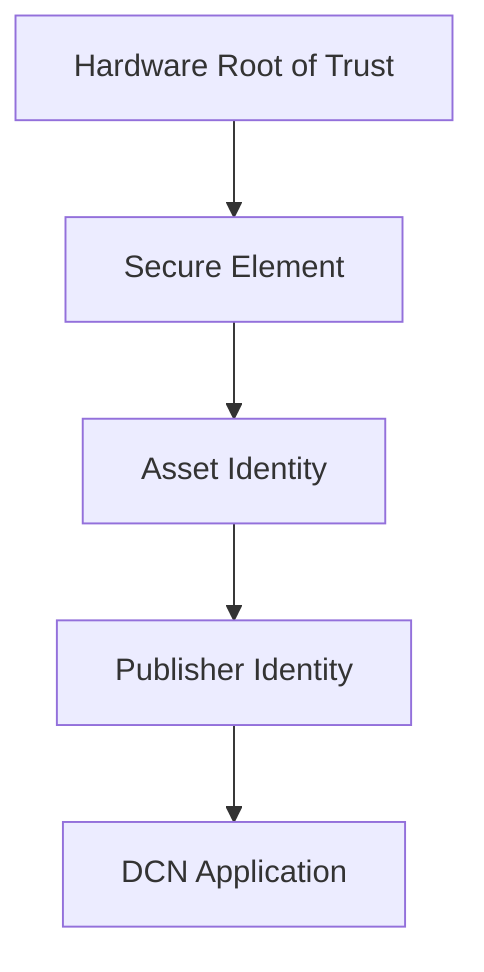
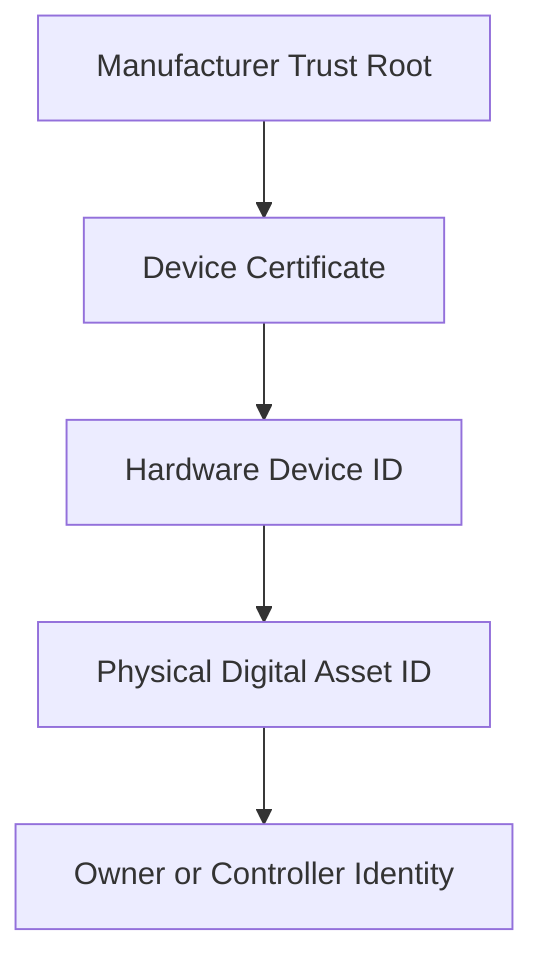
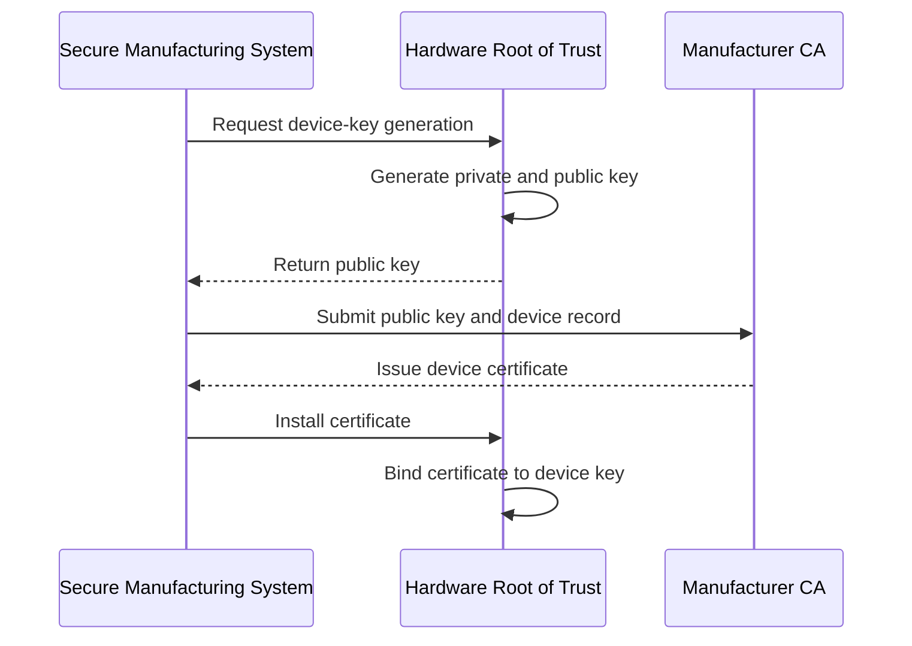
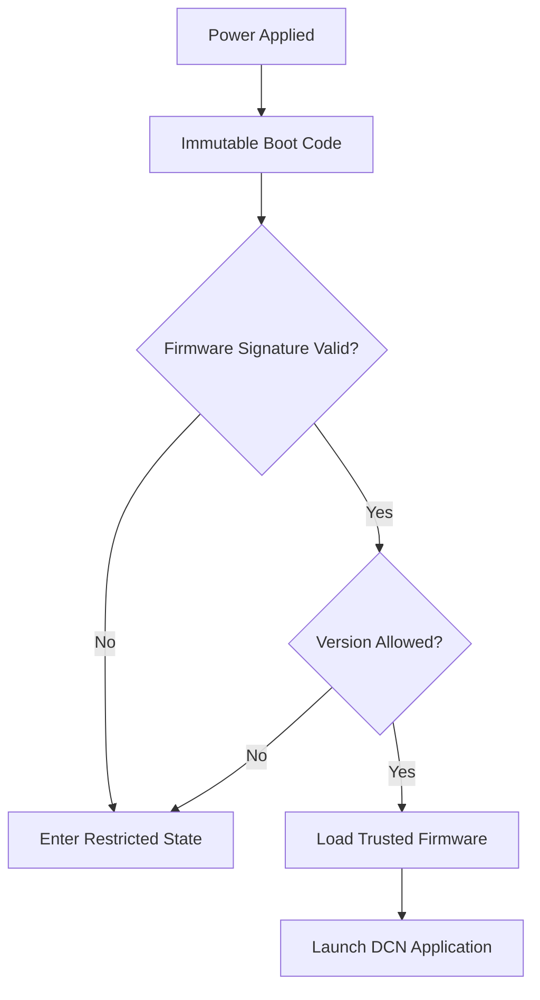
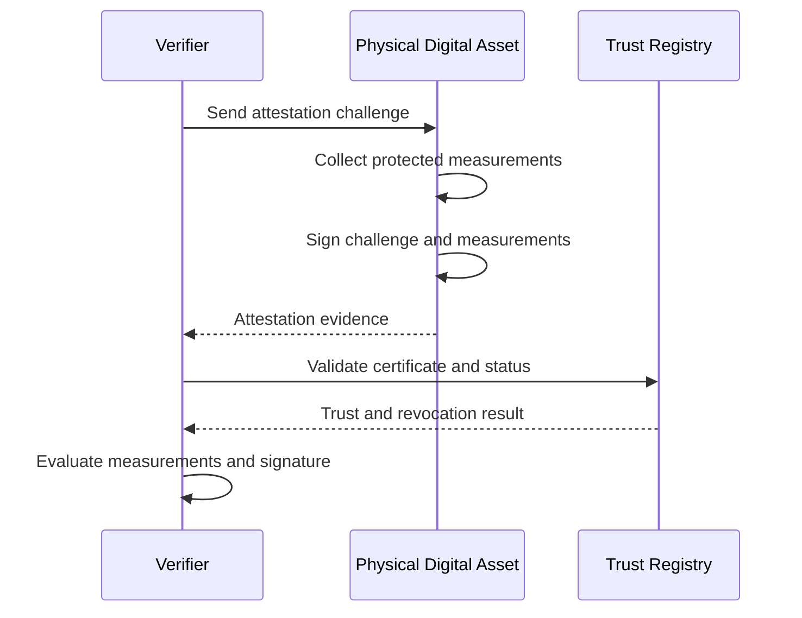
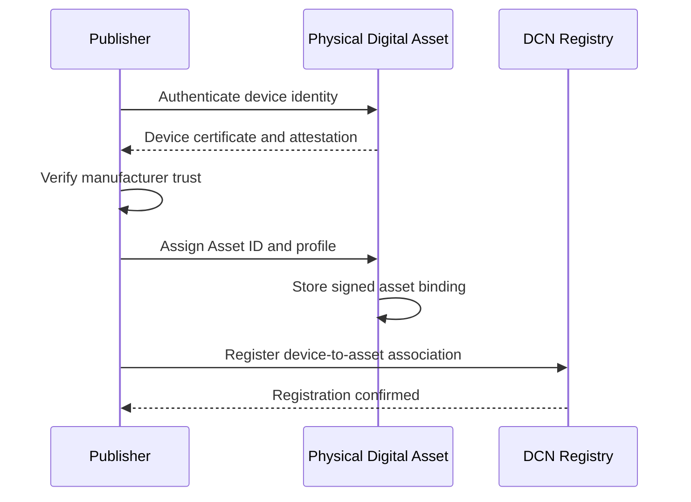
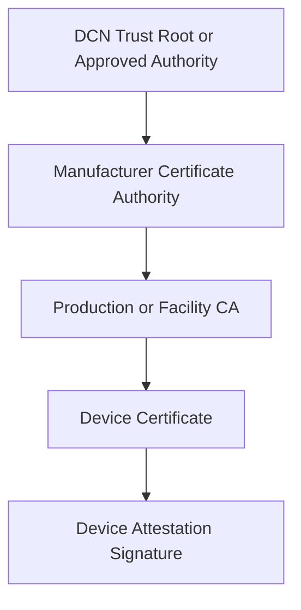
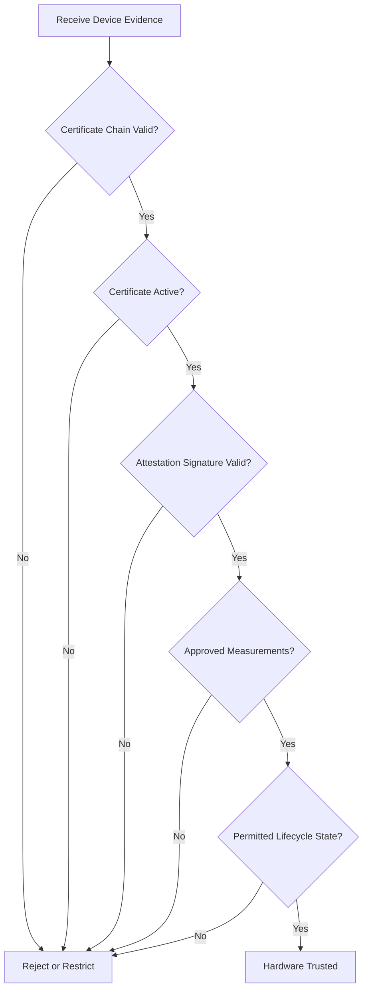

# Hardware Root of Trust

> _The Hardware Root of Trust is the immutable or strongly protected foundation from which the identity, authenticity, and trusted operation of a Physical Digital Asset are established._

***

## Introduction

Every DCN-compliant Physical Digital Asset must have a trusted starting point.

This starting point is called the **Hardware Root of Trust**, or **HRoT**.

The Hardware Root of Trust is the lowest trusted security layer within the asset. It provides the cryptographic foundation used to verify the hardware, authenticate the device, protect startup processes, establish trusted execution, and validate higher-level identities.

All other trust relationships within the Physical Digital Asset depend on this foundation.

The Secure Element, trusted application, Publisher credentials, Asset ID, ownership state, and transaction authority may all rely on the Hardware Root of Trust.

If the Hardware Root of Trust is compromised, the authenticity of the entire asset can no longer be reliably established.

***

## Purpose

The Hardware Root of Trust is responsible for establishing confidence that:

* The hardware is genuine
* The device identity is unique
* The device was provisioned by an authorized manufacturer
* Trusted firmware or applications have not been modified
* Protected keys belong to the intended hardware
* The device is operating in an approved state
* Attestation responses originate from genuine hardware
* Higher-level certificates can be traced to an approved trust anchor

The Hardware Root of Trust provides the first verifiable security assertion made by the Physical Digital Asset.

***

## Trust Foundation

The Hardware Root of Trust sits beneath every other logical trust layer.

Each higher layer inherits trust from the layer below it.

A verifier should not trust an application-level response unless the underlying hardware identity and integrity have also been validated.

***

## Root of Trust Components

A Hardware Root of Trust may include several protected components.

| Component                | Purpose                                            |
| ------------------------ | -------------------------------------------------- |
| Root Device Key          | Unique cryptographic identity of the hardware      |
| Boot Verification Key    | Validates trusted firmware or application code     |
| Manufacturer Certificate | Binds the hardware identity to the manufacturer    |
| Immutable Boot Code      | Executes the first trusted instructions            |
| Security Configuration   | Defines irreversible hardware protections          |
| Attestation Key          | Signs hardware and software integrity evidence     |
| Anti-Rollback Counter    | Prevents installation of older vulnerable software |
| Lifecycle Fuse or State  | Records irreversible manufacturing states          |

Not every implementation must use identical hardware mechanisms, but equivalent trust properties must be provided.

***

## Root Device Identity

Each compliant device shall possess a unique hardware-backed identity.

This identity should be generated or installed during secure manufacturing or provisioning.

The identity may be represented by:

* A unique public-private key pair
* A hardware-bound certificate
* A manufacturer-issued device credential
* A physically unclonable function-derived identity
* An equivalent certified hardware identity mechanism

The private component of the Root Device Identity must remain protected by the secure hardware.

It must not be exportable in plaintext.

***

## Device Identity Hierarchy

The Physical Digital Asset may contain several identities, but they must not be treated as equivalent.

The Hardware Device ID identifies the physical hardware.

The Asset ID identifies the logical asset configured on that hardware.

The owner or controller identity identifies the entity currently authorized to use the asset.

Ownership may change without changing the underlying Hardware Device ID.

***

## Manufacturer Trust Root

The manufacturer establishes the initial trust relationship for the device.

A certified manufacturer should maintain one or more protected root or intermediate certificate authorities used to issue device certificates.

The manufacturer trust infrastructure should:

* Protect certificate-signing keys
* Maintain certificate issuance records
* Support certificate revocation
* Identify production facilities or manufacturing domains
* Separate test and production credentials
* Support independent certification and audit
* Prevent unauthorized device enrollment

Production devices must not use development or test certificates.

***

## Hardware-Backed Key Generation

Where technically possible, the Root Device Key should be generated inside the secure hardware.

Generating the key internally reduces the risk that the private key is copied, intercepted, or reused across devices.

***

## Key Injection

Some manufacturing environments may securely inject a device key rather than generate it on-device.

Where key injection is used, the process must provide:

* Secure key generation
* Encrypted transport
* Controlled access
* Hardware-specific key binding
* Verifiable deletion of temporary copies
* Complete audit records
* Strong separation between test and production systems

Injected keys must not remain in manufacturing servers, logs, or temporary storage after provisioning.

On-device generation is preferred where supported.

***

## Immutable and Mutable Trust

The Hardware Root of Trust may include both immutable and updateable components.

### Immutable Components

Immutable components cannot normally be changed after manufacturing.

Examples include:

* Boot ROM
* Device identity seed
* Hardware configuration fuses
* Manufacturer root public key
* Debug-lock configuration

These components form the permanent foundation of trust.

### Mutable Components

Mutable components may be securely updated.

Examples include:

* Trusted firmware
* DCN applications
* Publisher certificates
* Security policy versions
* Approved algorithm profiles

Mutable components must be authenticated by the immutable root before execution or use.

***

## Secure Boot

Secure Boot ensures that only authorized firmware and trusted applications are executed.

The process begins from immutable or protected boot code.

Each stage should verify the integrity and authenticity of the next stage before transferring control.

***

## Chain of Trust

A secure startup process creates a chain of trust.

Each component is trusted only because it was authenticated by a previously trusted component.

If any stage fails validation, the device should not continue into normal operation.

***

## Measured Boot

In addition to Secure Boot, implementations may support Measured Boot.

Measured Boot records cryptographic measurements of executed software.

Measurements may include:

* Bootloader hash
* Firmware hash
* Trusted application hash
* Security configuration
* Policy version
* Cryptographic profile
* Lifecycle state

These measurements may later be included in device attestation.

Measured Boot does not necessarily block execution. It records the state so that an external verifier can evaluate whether the state is acceptable.

***

## Device Attestation

Attestation allows a Physical Digital Asset to prove its identity and trusted state.

An attestation response may include:

* Device certificate
* Hardware identifier
* Secure Element profile
* Firmware measurement
* Trusted application measurement
* Security policy version
* Lifecycle state
* Challenge nonce
* Attestation signature

The challenge nonce binds the attestation response to the current verification request and prevents replay.

***

## Attestation Levels

Different operations may require different levels of attestation.

| Attestation Level       | Typical Evidence                       |
| ----------------------- | -------------------------------------- |
| Device Attestation      | Genuine hardware identity              |
| Platform Attestation    | Hardware and Secure Element profile    |
| Application Attestation | Approved DCN application version       |
| State Attestation       | Lifecycle and policy state             |
| Transaction Attestation | Evidence bound to a specific operation |

A low-risk reader may require only device authenticity.

A high-value transaction may require hardware, application, lifecycle, and transaction-specific attestation.

***

## Key Binding

Sensitive keys should be bound to the Hardware Root of Trust.

Key binding means that a key can only be used:

* On the original hardware
* By an approved trusted application
* In an allowed lifecycle state
* For permitted cryptographic operations
* Under the correct security policy

A copied storage image must not allow protected keys to function on another device.

Key binding helps prevent cloning and unauthorized duplication.

***

## Asset Identity Binding

The logical Asset ID must be securely associated with the physical hardware identity.

This association may be represented by a signed record containing:

* Device ID
* Asset ID
* Publisher ID
* Asset Profile
* Provisioning timestamp
* Lifecycle state
* Security profile
* Certificate references

The binding should be signed by an authorized Publisher or provisioning authority and protected by the Secure Element.

***

## Binding Flow

A verifier can later confirm that the logical asset is operating on the intended physical hardware.

***

## Anti-Cloning Protection

The Hardware Root of Trust is a primary defense against cloning.

A clone may reproduce:

* Printed artwork
* QR codes
* Public metadata
* Serial numbers
* External NFC responses

However, it should not be able to reproduce the hardware-protected private key or produce valid attestation signatures.

A verifier should determine authenticity by validating cryptographic proof rather than relying only on visual or public identifiers.

***

## Hardware Uniqueness

Each Physical Digital Asset must be cryptographically distinguishable from every other asset.

Manufacturers must not:

* Reuse device private keys
* Duplicate device certificates
* Reuse secure identity seeds
* Assign identical protected hardware identities
* Copy production personalization records between devices

Duplicate hardware identities should be treated as a critical manufacturing or security incident.

***

## Physically Unclonable Functions

A manufacturer may use a Physically Unclonable Function, or PUF, as part of the hardware identity mechanism.

A PUF derives device-specific secret material from naturally occurring physical characteristics of the hardware.

Potential uses include:

* Device-key derivation
* Storage-encryption key generation
* Hardware fingerprinting
* Anti-cloning protection

Where a PUF is used, the implementation must ensure:

* Stable key reconstruction
* Error correction
* Resistance to modeling attacks
* Protection of helper data
* Secure integration with the Root of Trust

PUF use is optional and does not replace the need for cryptographic certificates and attestation.

***

## Anti-Rollback Protection

Attackers may attempt to install an older software version containing known vulnerabilities.

The Hardware Root of Trust should enforce anti-rollback protection using:

* Protected version counters
* Monotonic counters
* Security fuses
* Signed minimum-version policies
* Revocation lists

A software image with a version lower than the approved minimum should be rejected.

Emergency rollback may be supported only through a specially authorized recovery procedure.

***

## Debug Interface Control

Development and manufacturing interfaces can undermine the Hardware Root of Trust if left exposed.

Production devices shall restrict or disable:

* JTAG access
* SWD access
* ROM debug modes
* Test-key access
* Memory readout
* Unauthenticated boot modes
* Arbitrary code execution

Where a debug interface must remain available, access must require strong manufacturer authorization and should be auditable.

***

## Lifecycle Binding

The hardware lifecycle state should be protected by the Root of Trust.

Typical hardware lifecycle states include:

| State         | Description                             |
| ------------- | --------------------------------------- |
| Development   | Engineering and testing                 |
| Manufacturing | Device fabrication and initialization   |
| Provisioning  | Identity and credentials installed      |
| Production    | Normal operational state                |
| Restricted    | Security limitation applied             |
| Retired       | Device permanently removed from service |
| Destroyed     | Secrets erased or hardware disabled     |

Transitions from production back to development or manufacturing must not be permitted.

***

## Irreversible Transitions

Certain lifecycle transitions should be irreversible.

Examples include:

* Disabling test keys
* Locking debug interfaces
* Activating production identity
* Finalizing manufacturer credentials
* Permanently revoking the device
* Destroying protected key material

Irreversible transitions reduce the chance that an attacker can return a production device to a less secure state.

***

## Trust Registry

A DCN ecosystem may use a Trust Registry to publish and validate hardware trust information.

The Trust Registry may contain:

* Approved manufacturers
* Manufacturer certificate authorities
* Approved Secure Element models
* Device certificate status
* Revoked devices
* Approved firmware versions
* Security profile identifiers
* Certification records

The registry may be implemented using:

* A distributed registry
* A blockchain smart contract
* A certificate infrastructure
* A federated trust service
* A hybrid architecture

The DCN Standard should define interoperable registry records without requiring a single centralized operator.

***

## Certificate Chain

A typical device certificate chain may follow this structure.

A verifier should validate the complete certificate chain and the current revocation state.

***

## Certificate Rotation

The immutable Root Device Key may have a longer lifecycle than operational certificates.

Certificates may be renewed or rotated due to:

* Expiration
* Algorithm migration
* Manufacturer policy
* Certificate authority replacement
* Regulatory requirements
* Security incidents

Certificate rotation must preserve the link to the original hardware identity.

The private Root Device Key should not need to be replaced during normal certificate renewal.

***

## Root-Key Compromise

Compromise of a manufacturer root or intermediate certificate authority is a critical ecosystem event.

The trust model should support:

* Certificate revocation
* Emergency trust updates
* Manufacturer key rotation
* Device re-attestation
* Replacement certificate chains
* Affected-device identification
* Controlled suspension
* Incident transparency

A compromised manufacturer key must not require unrelated manufacturers or devices to be distrusted.

Trust domains should therefore remain properly isolated.

***

## Failure Behavior

The Hardware Root of Trust shall fail securely.

When integrity verification fails, the device should:

* Refuse normal operation
* Prevent protected-key use
* Enter a restricted or recovery state
* Avoid exposing detailed internal information
* Record the failure where supported
* Require authorized recovery or replacement

The device must not continue normal transaction signing after an unverified boot or failed integrity check.

***

## Recovery Mode

A controlled recovery mode may be supported for firmware repair or certificate renewal.

Recovery mode must:

* Require cryptographic authorization
* Use a minimal trusted code base
* Restrict normal asset operations
* Reject unauthorized software
* Preserve anti-rollback controls
* Record recovery actions
* Exit only after successful verification

Recovery mode must not become a bypass around Secure Boot or lifecycle protections.

***

## Privacy Considerations

Hardware identity is generally persistent and may create tracking risks.

A Physical Digital Asset should not expose its permanent Device ID to every nearby reader.

Privacy-preserving mechanisms may include:

* Pseudonymous session identifiers
* Randomized NFC discovery values
* Selective attestation
* Verifier-specific identifiers
* Zero-knowledge or privacy-preserving proofs
* Disclosure only after reader authentication

The full hardware identity should be disclosed only when required for trust verification.

***

## Selective Attestation

An asset should disclose only the attestation evidence necessary for the requested operation.

For example:

* A ticket reader may need proof of valid hardware and ticket status.
* A wallet may need proof of genuine hardware and approved firmware.
* A regulated CBDC terminal may require the full certified security profile.

Selective attestation reduces unnecessary information disclosure while preserving security.

***

## Hardware Root of Trust Profiles

The DCN Standard may define assurance profiles for Hardware Root of Trust implementations.

| Profile       | Typical Requirements                                                           |
| ------------- | ------------------------------------------------------------------------------ |
| HRoT-Basic    | Unique device key, secure identity, basic attestation                          |
| HRoT-Standard | Secure Boot, attestation, anti-rollback, locked debug                          |
| HRoT-Enhanced | Measured Boot, stronger physical protections, advanced key binding             |
| HRoT-Critical | High-assurance certification, regulated deployment, advanced attack resistance |

The required profile should match the value, risk, and intended use of the Physical Digital Asset.

***

## Asset-Type Considerations

Different asset types may require different Hardware Root of Trust assurance levels.

| Asset Type                   | Typical HRoT Expectation              |
| ---------------------------- | ------------------------------------- |
| DCN-S Stored Value           | Standard or Enhanced                  |
| DCN-R Reloadable             | Standard or Enhanced                  |
| DCN-P Programmable           | Enhanced                              |
| DCN-C Collectible            | Basic to Enhanced, depending on value |
| Identity Credential          | Standard or Enhanced                  |
| Event Ticket                 | Basic or Standard                     |
| Access Credential            | Standard                              |
| CBDC Asset                   | Enhanced or Critical                  |
| Government Credential        | Enhanced or Critical                  |
| Institutional Treasury Asset | Critical                              |

The Publisher must select an assurance level appropriate to the deployment risk.

***

## Verification Process

A verifier evaluating the Hardware Root of Trust should perform the following checks:

1. Retrieve the device certificate.
2. Validate the certificate chain.
3. Check certificate expiration.
4. Check revocation status.
5. Send a fresh attestation challenge.
6. Verify the attestation signature.
7. Validate firmware and application measurements.
8. Confirm the declared security profile.
9. Confirm the lifecycle state.
10. Apply transaction-specific policy.

***

## Conformance Requirements

A DCN-compliant Hardware Root of Trust:

* **MUST** provide a unique hardware-backed device identity.
* **MUST** protect the private Root Device Key against unauthorized export.
* **MUST** bind the device identity to the physical hardware.
* **MUST** support cryptographic proof of device authenticity.
* **MUST** validate trusted firmware or application code before protected use.
* **MUST** prevent unauthorized rollback to vulnerable software.
* **MUST** restrict production debug and test interfaces.
* **MUST** distinguish production credentials from development credentials.
* **MUST** fail securely when integrity verification fails.
* **MUST** support lifecycle-state protection.
* **SHOULD** generate the Root Device Key inside secure hardware.
* **SHOULD** support device and application attestation.
* **SHOULD** support certificate renewal without replacing the hardware identity.
* **SHOULD** minimize exposure of persistent device identifiers.
* **SHOULD** support independent revocation of compromised devices.
* **MAY** use physically unclonable functions.
* **MAY** support measured boot and selective attestation.

***

## Security Considerations

Implementers must consider attacks against:

* Manufacturing systems
* Device identity generation
* Certificate authorities
* Firmware-signing infrastructure
* Debug interfaces
* Boot verification
* Version counters
* Attestation protocols
* Provisioning stations
* Trust registries
* Revocation services
* Supply-chain processes

The Hardware Root of Trust is not only a chip feature.

It is a complete trust system that includes secure manufacturing, identity issuance, certificate management, software verification, attestation, lifecycle controls, and revocation.

Weakness in any of these areas may undermine the trustworthiness of the Physical Digital Asset.

***

## Summary

The Hardware Root of Trust provides the permanent security foundation of every DCN-compliant Physical Digital Asset.

It establishes a unique hardware identity, verifies trusted software, binds cryptographic keys to genuine hardware, supports device attestation, prevents rollback, restricts debug access, and protects lifecycle state.

Higher-level identities, including the Asset ID, Publisher relationship, ownership configuration, and transaction authority, depend on this foundation.

By requiring cryptographic verification of the physical device rather than relying on appearance, serial numbers, or public metadata, the DCN Standard enables wallets, merchants, Publishers, governments, and users to distinguish genuine Physical Digital Assets from counterfeit or cloned devices.
