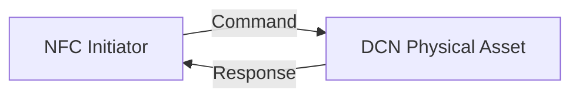
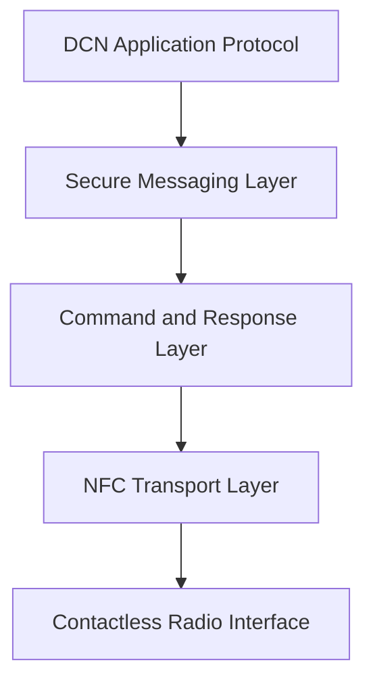
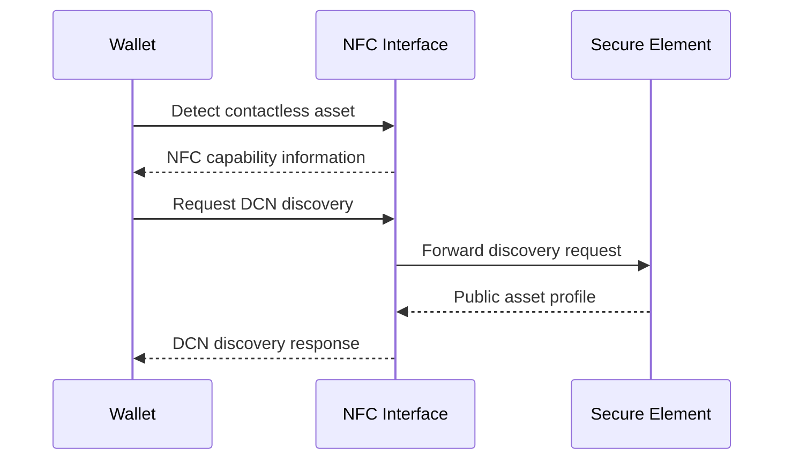
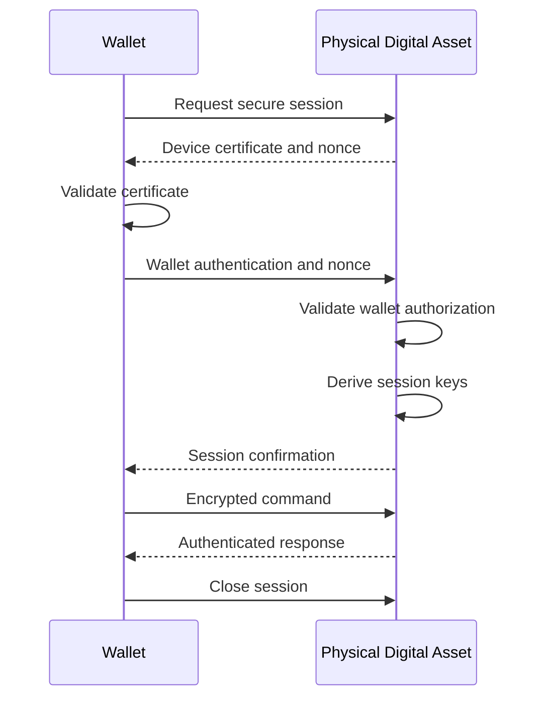
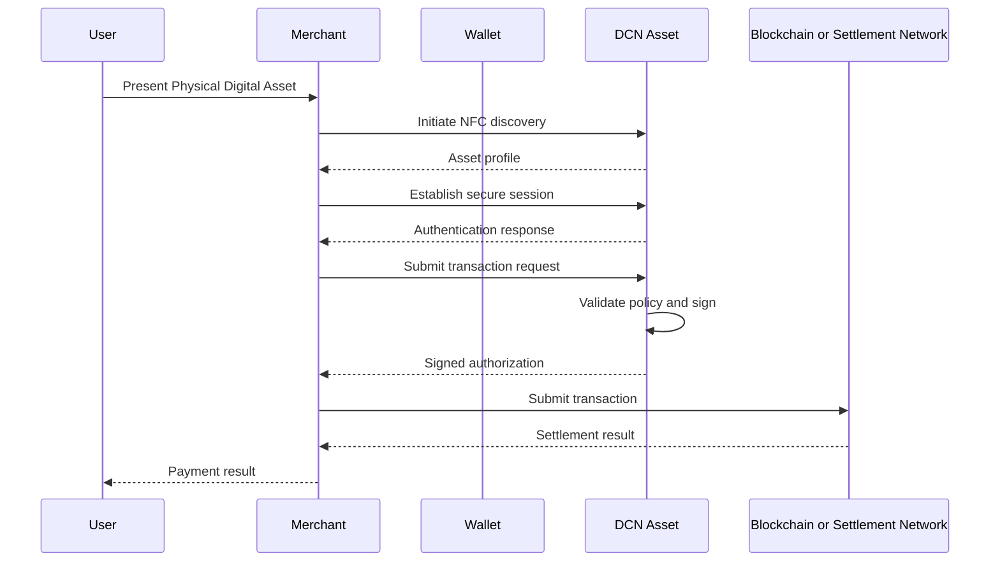
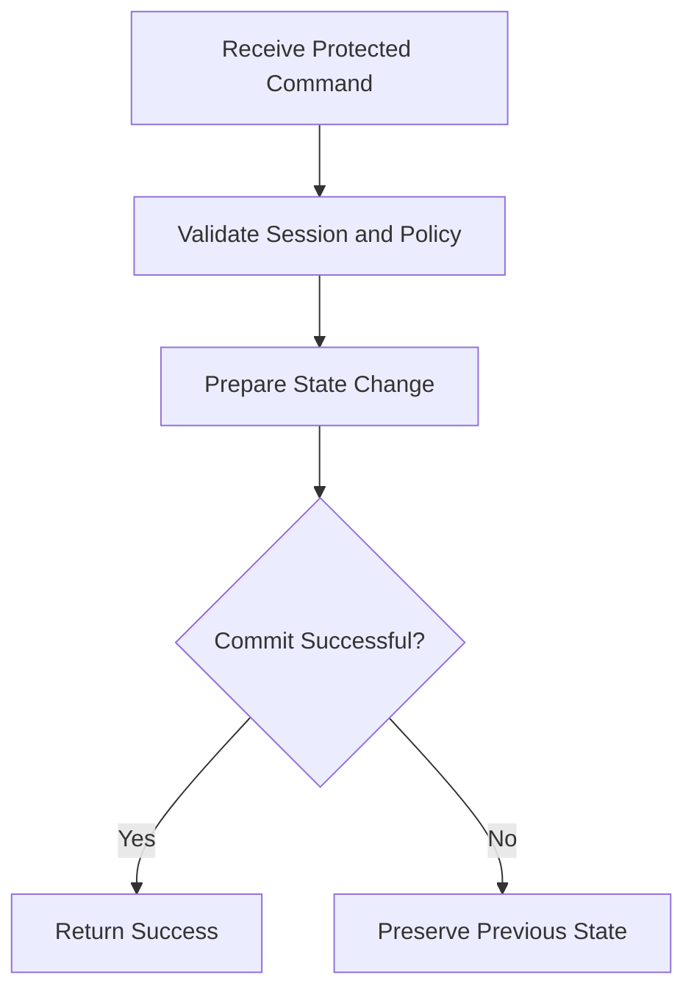
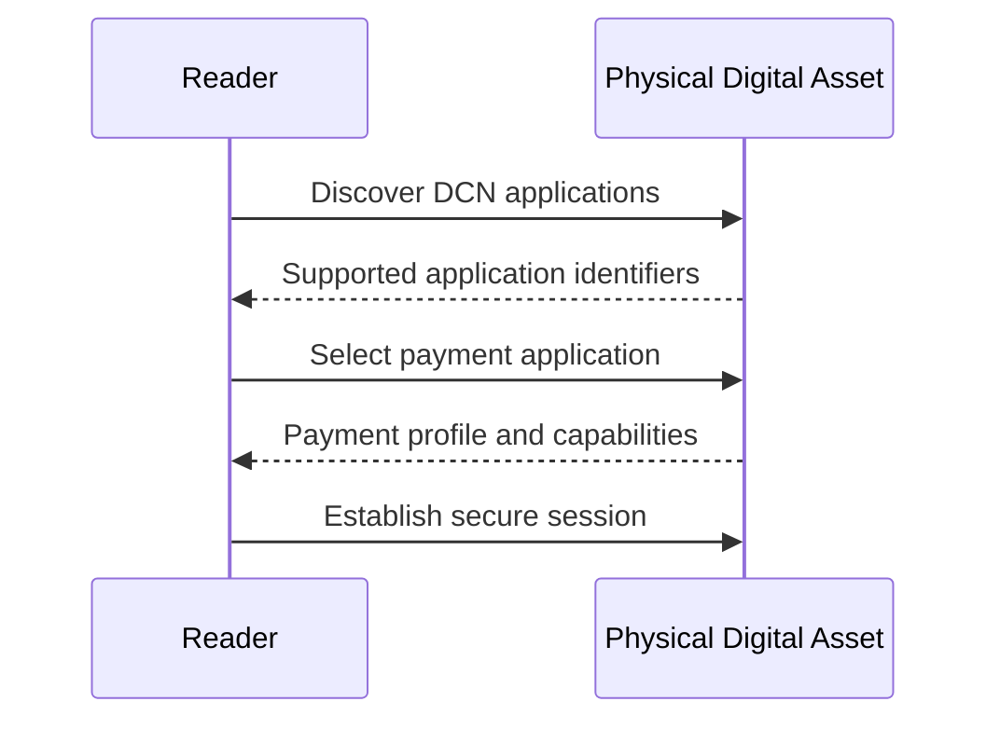
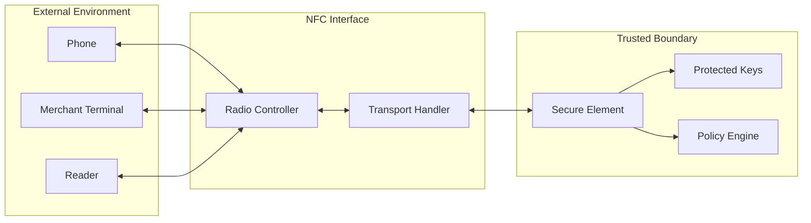

# NFC Interface

> _The NFC Interface provides the standardized contactless communication channel between a Physical Digital Asset and an external device. It enables wallets, merchant terminals, readers, and provisioning systems to discover, authenticate, and interact with the asset without exposing protected cryptographic material._

***

## Introduction

Near Field Communication, or NFC, is the primary communication interface for a DCN-compliant Physical Digital Asset.

NFC enables a user to interact with an asset by bringing it close to a compatible smartphone, merchant terminal, or reader. This creates a familiar tap-based experience while maintaining strict cryptographic security.

The NFC interface is not itself the trusted authority of the asset.

It acts only as a communication transport between the external device and the Secure Element. Sensitive decisions, key operations, ownership checks, and transaction authorization must remain inside the protected hardware boundary.

A compromised NFC reader must not be able to extract private keys, bypass lifecycle controls, or force the asset to perform an unauthorized operation.

***

## Purpose

The NFC Interface enables a Physical Digital Asset to:

* Announce its DCN compatibility
* Expose public discovery information
* Establish a secure communication session
* Receive standardized DCN commands
* Return authenticated responses
* Support wallet and merchant interaction
* Enable asset provisioning where authorized
* Operate without an internal power source where supported

The interface provides the physical communication layer required for tap-based use.

***

## NFC Communication Model

The standard NFC communication path consists of four logical components.

The external reader communicates with the NFC interface.

The NFC interface forwards approved protocol messages to the Secure Element.

The Secure Element validates the request, performs the authorized operation, and returns a protected response.

***

## Architectural Principle

The NFC Interface shall be treated as an untrusted transport layer.

It may:

* Receive commands
* Forward messages
* Return responses
* Report communication errors
* Support session negotiation

It must not independently:

* Store private keys
* Authorize transactions
* Modify ownership
* Change lifecycle state
* Approve firmware updates
* Override Secure Element policies

All security-sensitive decisions shall be made inside the Secure Element or another certified trusted hardware boundary.

***

## NFC Operating Modes

A DCN implementation may support passive or active NFC operation.

### Passive NFC

A passive asset receives power from the electromagnetic field generated by the reader.

Typical characteristics include:

* No battery required
* Lower manufacturing cost
* Long operational life
* Suitable for notes, cards, tickets, and identity assets
* Limited processing time and communication range

Passive NFC is expected to be the primary operating mode for most DCN assets.

### Active NFC

An active asset contains its own power source.

Typical characteristics include:

* Greater processing capability
* Support for displays or sensors
* Longer interaction windows
* Additional communication features
* Higher manufacturing complexity

Active NFC may be used for advanced, high-value, or programmable assets.

***

## Supported NFC Roles

A Physical Digital Asset normally operates as an NFC target or card-emulation device.

The external smartphone or terminal operates as the initiator or reader.

A DCN asset should not initiate unsolicited communication with an external reader.

All operations should begin with an explicit discovery or command request.

***

## NFC Technology Compatibility

A compliant implementation should use established NFC and contactless smart-card technologies where possible.

Supported implementations may include:

* ISO/IEC 14443 compatible interfaces
* ISO-DEP communication
* NFC Forum Type 4 Tag compatible behavior
* Contactless smart-card application protocols
* Equivalent future certified contactless technologies

The DCN protocol should remain logically independent from the exact chip manufacturer.

A compliant wallet should interact through standardized commands rather than vendor-specific hardware instructions.

***

## Communication Layers

The NFC architecture can be divided into multiple layers.

Each layer has a separate responsibility.

| Layer                | Responsibility                                               |
| -------------------- | ------------------------------------------------------------ |
| Radio Interface      | Physical contactless communication                           |
| Transport Layer      | Message exchange and framing                                 |
| Command Layer        | DCN command and response structure                           |
| Secure Messaging     | Encryption, integrity, and replay protection                 |
| Application Protocol | Authentication, payment, ownership, and lifecycle operations |

***

## Asset Discovery

Before beginning a secure interaction, the reader must identify the device as a DCN-compatible asset.

The discovery response may include public information such as:

* DCN protocol identifier
* Protocol version
* Asset type
* Asset profile
* Public Asset ID
* Supported commands
* Supported cryptographic profiles
* Maximum message size
* Secure-session requirement

Discovery information should be minimal and must not expose confidential information.

***

## Discovery Flow

The reader should verify that the discovered protocol and asset profile are supported before continuing.

***

## Public and Protected Commands

The NFC Interface may expose two command categories.

### Public Commands

Public commands may be processed before establishing a secure session.

Examples include:

* Read protocol version
* Read public Asset ID
* Read asset type
* Read capability profile
* Request device certificate
* Request session establishment

Public commands should expose only the minimum information required for discovery and verification.

### Protected Commands

Protected commands require an authenticated secure session.

Examples include:

* Sign transaction
* Verify ownership
* Update protected metadata
* Change lifecycle state
* Transfer ownership
* Reload balance
* Suspend asset
* Update policy
* Perform recovery

Protected commands must be rejected when no valid secure session exists.

***

## Standard Command Structure

A DCN command should contain a predictable set of fields.

| Field               | Description                          |
| ------------------- | ------------------------------------ |
| Protocol Version    | Identifies the DCN protocol version  |
| Command Code        | Identifies the requested operation   |
| Session ID          | Identifies the active secure session |
| Sequence Number     | Prevents replay and reordering       |
| Payload Length      | Defines the message size             |
| Payload             | Contains command-specific data       |
| Authentication Data | Protects integrity and authenticity  |

A response should contain corresponding status and authentication information.

| Field               | Description                       |
| ------------------- | --------------------------------- |
| Protocol Version    | Response protocol version         |
| Status Code         | Result of the requested operation |
| Session ID          | Associated secure session         |
| Sequence Number     | Matching response sequence        |
| Response Length     | Size of returned payload          |
| Response Data       | Operation result                  |
| Authentication Data | Integrity and authenticity proof  |

***

## Secure Session Establishment

Sensitive NFC communication shall use an authenticated secure session.

A typical session includes:

1. Reader discovery
2. Device certificate retrieval
3. Challenge generation
4. Mutual authentication
5. Session key derivation
6. Secure command exchange
7. Session termination

A new session should use fresh cryptographic material.

***

## Secure Messaging

Secure messaging protects commands exchanged through the NFC interface.

It should provide:

* Message confidentiality
* Message integrity
* Source authentication
* Replay protection
* Command ordering
* Session binding

Secure messaging may be implemented using authenticated encryption or an equivalent approved cryptographic construction.

Messages from one session must not be accepted in another session.

***

## Mutual Authentication

For high-risk operations, both the reader and the Physical Digital Asset should authenticate each other.

The asset verifies that the requesting wallet or terminal is authorized.

The wallet verifies that the asset:

* Contains genuine secure hardware
* Holds a valid device certificate
* Belongs to a recognized Publisher
* Has not been revoked
* Supports the declared asset profile
* Is operating in an acceptable lifecycle state

Mutual authentication prevents unauthorized readers from issuing protected commands and helps users detect counterfeit assets.

***

## NFC Transaction Flow

A standard tap-to-pay operation may follow this sequence.

The exact settlement process may vary depending on the asset type and blockchain network.

***

## NFC Range

NFC communication is intentionally designed for short-range interaction.

The short communication range helps:

* Reduce accidental interaction
* Require physical proximity
* Improve user awareness
* Limit remote interception opportunities
* Support intentional tap-based use

Short range alone is not a security control.

Cryptographic authentication and secure messaging are still mandatory for protected operations.

***

## Relay Attack Protection

An attacker may attempt to relay NFC communication between a legitimate asset and a distant reader.

A compliant implementation should mitigate relay attacks using one or more of the following:

* Strict interaction time limits
* Distance-bounding techniques where available
* User confirmation
* Reader authentication
* Transaction context binding
* One-time challenges
* Session expiration
* Secure transaction displays for active devices

High-value transactions should not rely solely on NFC proximity.

***

## Eavesdropping Protection

NFC communication may be observed by nearby specialized equipment.

Protected communication should therefore use encryption and integrity protection.

Sensitive information must not be transmitted in plaintext, including:

* Private ownership data
* Transaction authorization data
* Recovery credentials
* Session secrets
* Confidential metadata
* Administrative commands

Public discovery data should also be minimized to reduce tracking and profiling.

***

## Unauthorized Scanning

A malicious reader may attempt to scan a Physical Digital Asset without the holder's knowledge.

Implementations should minimize the information exposed before authentication.

Possible protections include:

* Randomized discovery identifiers
* Pseudonymous Asset IDs
* Limited public metadata
* User-presence detection
* Tap activation zones
* Physical shielding
* Reader authentication before protected disclosure

A public serial number should not automatically reveal ownership, balance, or transaction history.

***

## Privacy Considerations

The NFC interface should follow the principle of data minimization.

Before authentication, the asset should disclose only enough information to:

* Identify the protocol
* Negotiate compatibility
* Begin authentication
* Select the required asset application

Sensitive identity and financial data should require an authenticated session.

Where technically possible, temporary or randomized identifiers should be used to reduce device tracking.

***

## Message Size and Fragmentation

NFC interfaces may have limited message capacity.

The DCN protocol should support controlled fragmentation for larger responses such as:

* Certificate chains
* Attestation evidence
* Complex transaction requests
* Extended metadata
* Firmware authorization packages

Fragmented messages must include:

* Message identifier
* Fragment number
* Total fragment count
* Integrity protection
* Session binding

Incomplete or reordered fragmented messages must be rejected.

***

## Communication Timeout

NFC interactions may be interrupted when the asset is moved away from the reader.

A compliant implementation should define timeouts for:

* Discovery
* Authentication
* Command execution
* User confirmation
* Session inactivity
* Fragment transfer

When a timeout occurs, the Secure Element should invalidate incomplete sensitive operations.

A partially completed transaction must not be treated as authorized.

***

## Session Termination

An NFC secure session should terminate when:

* The transaction is completed
* The reader requests termination
* The asset leaves the NFC field
* The session timeout is reached
* Authentication fails
* An invalid sequence number is received
* A policy violation occurs
* The Secure Element enters a restricted state

Session keys should be deleted or invalidated after termination.

***

## Error Handling

The NFC Interface should return standardized error codes.

Typical error categories include:

| Error Category       | Example                                 |
| -------------------- | --------------------------------------- |
| Protocol Error       | Unsupported command                     |
| Version Error        | Unsupported protocol version            |
| Authentication Error | Invalid reader or wallet proof          |
| Session Error        | Expired or unknown session              |
| Sequence Error       | Replayed or reordered command           |
| Lifecycle Error      | Operation not allowed in current state  |
| Policy Error         | Publisher policy rejected the operation |
| Hardware Error       | Secure Element unavailable              |
| Communication Error  | Incomplete or corrupted message         |

Error responses should not reveal internal secrets or detailed security state.

***

## Denial-of-Service Protection

A malicious reader may repeatedly send commands to exhaust device resources.

The NFC Interface and Secure Element should support protection mechanisms such as:

* Command rate limiting
* Authentication attempt counters
* Temporary lockouts
* Session limits
* Maximum payload sizes
* Early rejection of malformed commands
* Resource quotas

Denial-of-service controls should not permanently disable legitimate assets without an authorized recovery process.

***

## Power Interruption

Passive NFC assets may lose power immediately when removed from the reader field.

Security-sensitive state changes must therefore use atomic operations.

An operation should either:

* Complete successfully and commit, or
* Fail without changing protected state

The device must not enter an undefined or partially updated state after power loss.

***

## Atomic Transaction Handling

For operations such as ownership transfer, balance update, or lifecycle change, the Secure Element should follow an atomic processing model.

A response should be returned only after the protected state transition has been safely committed.

***

## Multi-Application Support

A single Physical Digital Asset may support multiple applications.

Examples include:

* Payment
* Identity
* Access
* Membership
* Ticketing

Each application should have:

* A unique application identifier
* Separate access policies
* Isolated cryptographic keys
* Independent command permissions
* Clearly defined metadata

Access to one application must not automatically grant access to another.

***

## Application Selection

A reader may first request the list of supported DCN applications.

The reader then selects the application required for the interaction.

The asset should reject commands that do not belong to the selected application context.

***

## Wallet Compatibility

A compliant wallet should be able to:

* Detect a DCN asset
* Read the protocol version
* Identify the asset profile
* Retrieve public capabilities
* Validate device and Publisher certificates
* Establish a secure session
* Send standardized commands
* Interpret standardized responses
* Close the session securely

Wallets may provide additional user interfaces, but they should not require proprietary NFC commands for mandatory DCN operations.

***

## Merchant Terminal Compatibility

A compliant merchant terminal should support:

* DCN asset discovery
* Merchant authentication
* Secure-session negotiation
* Transaction request creation
* Signed authorization validation
* Transaction submission
* Standard error handling
* Receipt or confirmation generation

Merchant terminals should clearly display the transaction amount and asset type before requesting authorization.

***

## Provisioning Interface

The NFC interface may support secure provisioning operations when authorized.

Provisioning commands may include:

* Install Publisher certificate
* Assign Asset ID
* Configure asset profile
* Register supported networks
* Set ownership policy
* Activate the asset
* Lock manufacturing commands

Provisioning commands shall require stronger authorization than normal user operations.

Once provisioning is complete, manufacturing or initialization commands should be permanently disabled or cryptographically restricted.

***

## Firmware and Application Updates

Where NFC-based updates are supported, the update package must be:

* Digitally signed
* Authenticated
* Integrity protected
* Version controlled
* Protected against rollback
* Authorized for the specific hardware profile

The NFC interface must not directly execute update content.

The Secure Element or trusted bootloader must validate the update before installation.

***

## Offline Interaction

NFC can support limited offline operations where permitted by the asset profile.

Examples include:

* Offline identity verification
* Ticket validation
* Access authorization
* Low-value payment authorization
* Cached credential verification

Offline communication introduces additional risks, including double spending, outdated revocation information, and delayed settlement.

The exact offline rules should be defined by the applicable asset and security profile.

***

## NFC Security Boundary

The NFC controller and transport handler may exist outside the Secure Element.

They must never receive plaintext private keys or unrestricted access to secure functions.

***

## Conformance Requirements

A DCN-compliant NFC Interface:

* **MUST** support standardized DCN discovery.
* **MUST** communicate with the Secure Element through a controlled interface.
* **MUST NOT** store or expose private cryptographic keys.
* **MUST** distinguish between public and protected commands.
* **MUST** require a valid secure session for protected commands.
* **MUST** support message integrity and replay protection.
* **MUST** reject malformed, unsupported, or unauthorized commands.
* **MUST** handle power interruption without corrupting protected state.
* **MUST** support standardized status and error responses.
* **MUST** invalidate sensitive sessions after timeout or communication loss.
* **SHOULD** support mutual authentication.
* **SHOULD** minimize information exposed before authentication.
* **SHOULD** support privacy-preserving discovery identifiers.
* **SHOULD** implement relay and denial-of-service mitigations.
* **MAY** support passive or active NFC operation.
* **MAY** support multiple isolated DCN applications.

***

## Security Considerations

Implementers must assume that:

* The NFC reader may be malicious.
* Communication may be intercepted.
* Commands may be replayed or reordered.
* The user may unknowingly tap an unauthorized reader.
* The asset may be held near multiple readers.
* NFC power may be interrupted at any moment.
* Attackers may attempt relay or denial-of-service attacks.
* Public identifiers may be used for tracking.
* Merchant terminals may request manipulated transactions.

The NFC Interface must never be treated as proof of authorization by itself.

Authorization must be established through cryptographic verification, secure-session state, lifecycle rules, and applicable Publisher policies.

***

## Summary

The NFC Interface provides the contactless communication layer that enables wallets, merchant terminals, and readers to interact with a Physical Digital Asset.

It supports discovery, secure-session establishment, standardized command exchange, transaction authorization, provisioning, and limited offline interaction.

The interface remains outside the core trust boundary and must therefore be treated as an untrusted transport.

By separating NFC communication from Secure Element authority, the DCN Standard enables a convenient tap-based experience without exposing the cryptographic identity, protected keys, or trusted state of the asset.
