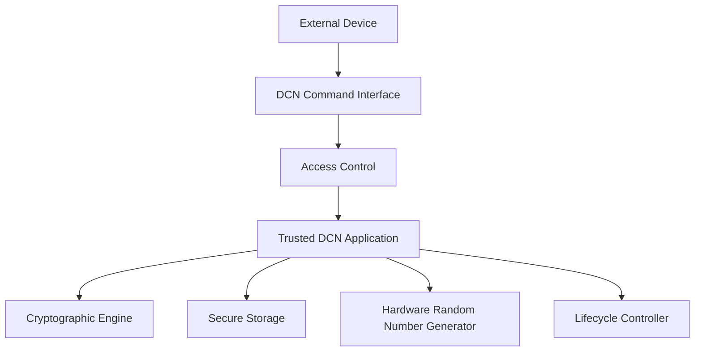
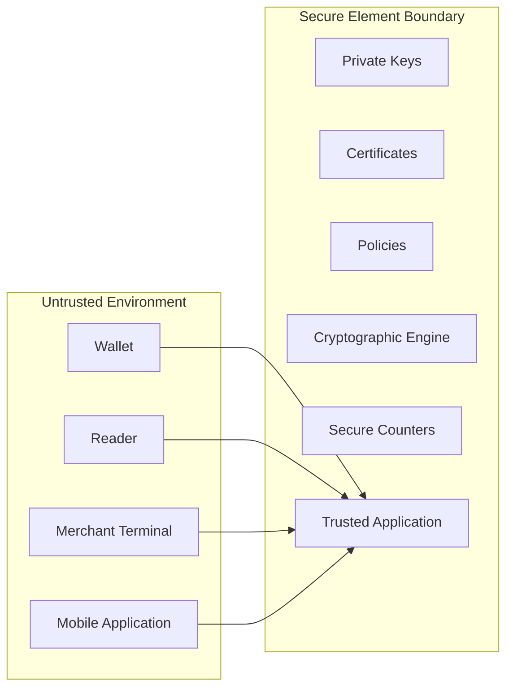
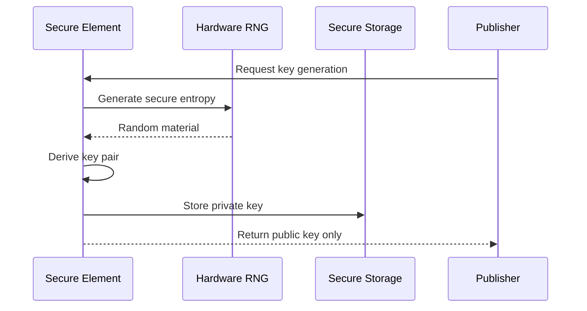
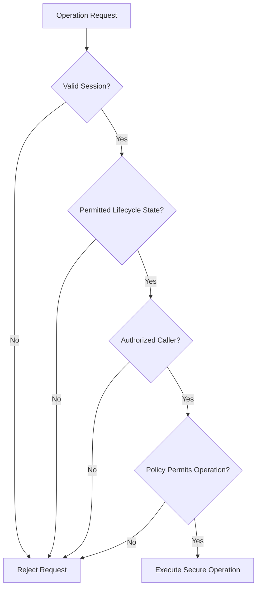
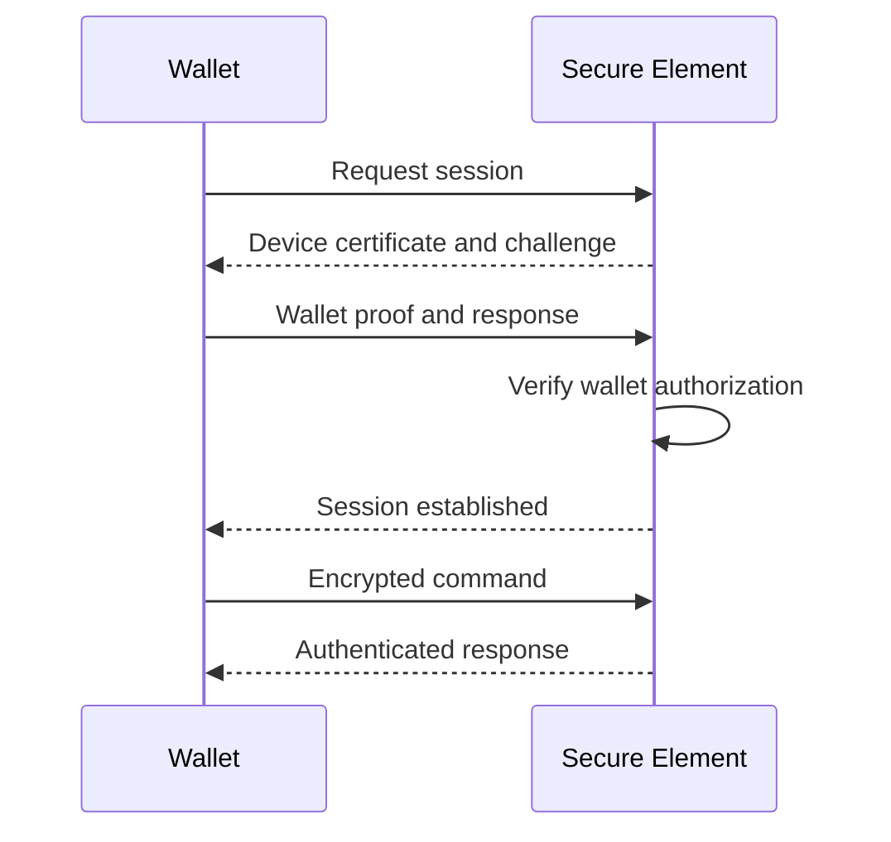
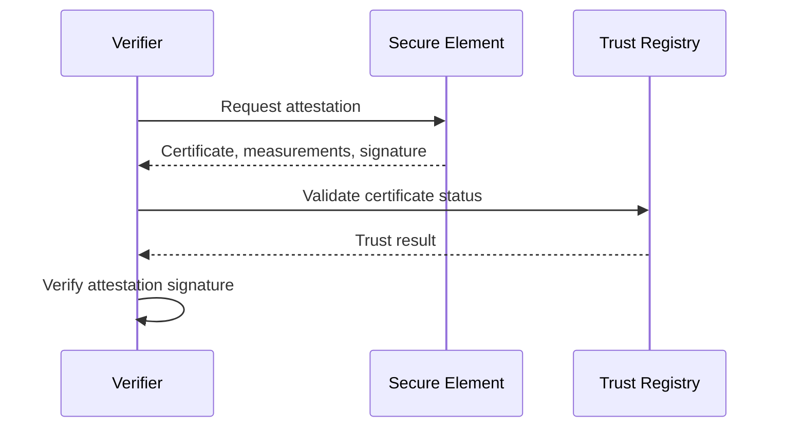
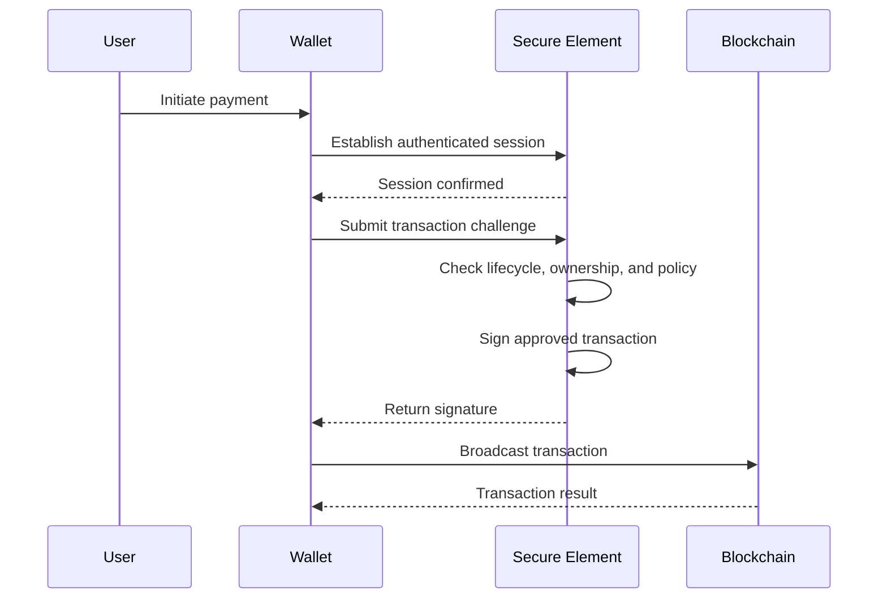

# Secure Element

> _The Secure Element is the protected execution environment of a Physical Digital Asset. It stores cryptographic secrets, performs trusted operations, and prevents sensitive material from being exposed to wallets, merchant devices, NFC readers, or other external systems._

***

## Introduction

The Secure Element is the core security component of every DCN-compliant Physical Digital Asset.

It is a tamper-resistant hardware environment designed to protect cryptographic keys, certificates, security policies, and trusted applications. All operations that depend on the authenticity or authority of the asset should be performed within this protected boundary.

The Secure Element must remain isolated from external systems. A wallet, NFC reader, merchant terminal, provisioning station, or mobile application may request an operation, but it must not receive direct access to protected secrets.

For example, an external wallet may request the Physical Digital Asset to sign a transaction challenge. The Secure Element performs the signature internally and returns only the resulting signature. The private key itself never leaves the secure boundary.

***

## Purpose

The Secure Element provides the trusted execution environment required to:

* Generate cryptographic keys
* Protect private keys and credentials
* Authenticate the Physical Digital Asset
* Sign transactions and messages
* Validate trusted certificates
* Enforce security policies
* Maintain secure counters
* Protect lifecycle operations
* Detect unauthorized access attempts

Without a Secure Element or an equivalent certified secure component, a Physical Digital Asset cannot provide reliable protection against cloning, key extraction, or counterfeit device attacks.

***

## Secure Element Architecture

A compliant Secure Element should contain isolated security services.

External systems interact only through the approved DCN command interface.

They must not directly access secure storage, cryptographic keys, memory, or internal execution state.

***

## Security Boundary

The Secure Element establishes a strict trusted boundary.

Everything outside the Secure Element should be treated as potentially untrusted.

This includes devices operated by legitimate users, because a user's phone or merchant terminal may be compromised.

***

## Mandatory Capabilities

A DCN-compliant Secure Element shall provide the following capabilities.

| Capability                                     | Requirement |
| ---------------------------------------------- | ----------- |
| Protected key generation                       | Mandatory   |
| Protected key storage                          | Mandatory   |
| Hardware-backed cryptographic operations       | Mandatory   |
| Secure random number generation                | Mandatory   |
| Access control                                 | Mandatory   |
| Secure application execution                   | Mandatory   |
| Lifecycle state protection                     | Mandatory   |
| Anti-replay support                            | Mandatory   |
| Secure counter support                         | Mandatory   |
| Device authentication                          | Mandatory   |
| Firmware or application integrity verification | Mandatory   |

These capabilities form the minimum security baseline for DCN Specification v1.0.

***

## Key Generation

Cryptographic keys should be generated inside the Secure Element using an approved hardware random number generator.

The generated private key shall not be exported in plaintext.

A compliant implementation should follow this model:

The public key may be registered with publishers, certification authorities, blockchain accounts, or smart contracts.

***

## Key Storage

The Secure Element shall protect all long-term cryptographic secrets.

Protected material may include:

* Device private key
* Asset private key
* Publisher-issued credentials
* Recovery credentials
* Session master keys
* Authentication secrets
* Certificate private keys
* Policy authorization keys

Protected keys should be bound to permitted operations.

For example, a transaction-signing key should not automatically be permitted to update firmware or change lifecycle state.

***

## Key Isolation

A Physical Digital Asset may contain multiple cryptographic keys for different purposes.

| Key Type                | Purpose                                  |
| ----------------------- | ---------------------------------------- |
| Device Identity Key     | Proves the identity of the hardware      |
| Asset Key               | Controls or represents the digital asset |
| Authentication Key      | Authenticates sessions                   |
| Transaction Key         | Authorizes transactions                  |
| Publisher Key Reference | Validates publisher instructions         |
| Recovery Key            | Supports controlled recovery             |
| Attestation Key         | Proves hardware and software state       |

The Secure Element should isolate these keys logically and cryptographically.

Compromise or misuse of one key should not automatically expose or authorize the use of another.

***

## Cryptographic Operations

The Secure Element should support hardware-protected cryptographic operations required by the selected DCN security profile.

Typical operations include:

* Digital signature generation
* Digital signature verification
* Public-key encryption
* Symmetric encryption
* Message authentication
* Hash generation
* Key derivation
* Challenge-response authentication
* Certificate verification
* Secure session establishment

The exact algorithms supported by DCN Specification v1.0 should be defined in the applicable cryptographic profile.

***

## Cryptographic Agility

The Secure Element should support cryptographic agility.

Cryptographic agility allows algorithms to be introduced, deprecated, or replaced without redesigning the Physical Digital Asset architecture.

A compliant implementation should:

* Identify supported algorithms
* Reject unsupported algorithms
* Support algorithm versioning
* Prevent unauthorized algorithm downgrade
* Allow certified profile updates where supported

Private or undocumented cryptographic algorithms should not be used for mandatory DCN operations.

***

## Secure Random Number Generation

The Secure Element shall provide access to a hardware-based random number generator suitable for cryptographic use.

Randomness is required for:

* Private key generation
* Nonce generation
* Session key creation
* Authentication challenges
* Signature operations
* Replay protection

A predictable random number generator may compromise every cryptographic operation performed by the device.

The Secure Element should continuously or periodically test the health of its entropy source.

***

## Trusted Application

DCN functions should execute inside a trusted application hosted by the Secure Element.

The trusted application is responsible for:

* Processing DCN commands
* Verifying authorization
* Enforcing access rules
* Selecting cryptographic keys
* Checking lifecycle state
* Managing secure sessions
* Returning signed responses
* Rejecting invalid operations

The trusted application must not trust command parameters solely because they were received over NFC or from an approved wallet.

Every request must be validated independently.

***

## Access Control

Access to Secure Element functions shall be controlled.

Access decisions may depend on:

* Requested operation
* Session authentication
* Wallet identity
* Publisher authorization
* Ownership proof
* Asset lifecycle state
* User verification
* Policy configuration
* Transaction value
* Secure counter state

Authorization shall be evaluated before a protected operation is performed.

***

## Secure Counters

The Secure Element should support protected monotonic counters or equivalent anti-rollback mechanisms.

Secure counters may be used for:

* Transaction sequence numbers
* Authentication attempts
* Session numbering
* Firmware versions
* Policy versions
* Lifecycle transitions
* Offline transaction limits

A secure counter should not be reset or decreased through normal external commands.

***

## Anti-Replay Protection

The Secure Element shall support mechanisms that prevent previously valid messages from being reused.

Anti-replay mechanisms may include:

* Nonces
* Timestamps
* Session identifiers
* Monotonic counters
* Transaction sequence numbers
* Challenge-response protocols

A previously signed command must not automatically remain valid for future operations.

***

## Secure Sessions

Sensitive operations should occur within an authenticated secure session.

A secure session typically provides:

* Mutual authentication
* Session key establishment
* Message confidentiality
* Message integrity
* Replay protection
* Session expiration
* Command sequencing

The Secure Element should invalidate expired, interrupted, or unauthorized sessions.

***

## Lifecycle Enforcement

The Secure Element shall enforce the current lifecycle state of the Physical Digital Asset.

For example:

| Lifecycle State | Typical Secure Element Behavior       |
| --------------- | ------------------------------------- |
| Manufactured    | Only manufacturing commands allowed   |
| Provisioned     | Provisioning and verification allowed |
| Issued          | Publisher operations allowed          |
| Active          | Normal user operations allowed        |
| Suspended       | Most transaction operations blocked   |
| Retired         | Operational signing disabled          |
| Destroyed       | Keys permanently erased or unusable   |

External software should not be able to bypass lifecycle restrictions.

***

## Secure Provisioning

Provisioning establishes the initial trusted state of the Secure Element.

Provisioning may include:

* Installing the DCN trusted application
* Generating the Device Identity Key
* Installing manufacturer certificates
* Registering the hardware identifier
* Setting the initial lifecycle state
* Locking manufacturing interfaces
* Configuring cryptographic profiles
* Enabling secure audit counters

Provisioning must occur in a controlled environment.

***

## Publisher Personalization

After manufacturing, the Publisher may personalize the Secure Element for a specific asset.

Publisher personalization may include:

* Installing Publisher ID
* Registering Asset ID
* Installing publisher certificates
* Assigning an asset profile
* Configuring ownership policy
* Configuring supported blockchain networks
* Establishing recovery policy
* Activating transaction capabilities

Publisher personalization shall not expose manufacturer-controlled root secrets.

***

## Secure Updates

Where Secure Element application updates are supported, updates shall be:

* Digitally signed
* Authenticated
* Version controlled
* Protected against rollback
* Applied only in permitted lifecycle states
* Logged or auditable
* Verified before execution

Unsigned or unauthorized code must not execute within the Secure Element.

Low-cost or non-updatable implementations may use immutable trusted applications, provided all DCN v1.0 requirements are satisfied.

***

## Attestation

The Secure Element should support device attestation.

Attestation allows a verifier to confirm:

* The device was produced by a recognized manufacturer
* The Secure Element is genuine
* The expected trusted application is installed
* The application version is approved
* The asset is in a valid lifecycle state
* The device certificate has not been revoked

Attestation should disclose only the information necessary for verification.

***

## Failure Handling

The Secure Element shall fail securely.

When an error occurs, the device should not expose:

* Private keys
* Internal memory
* Debug information
* Secret policy values
* Cryptographic intermediate values
* Sensitive certificate data

Typical failure behavior includes:

* Rejecting the command
* Invalidating the session
* Incrementing a failure counter
* Applying a temporary lockout
* Entering a restricted state
* Recording a security event

Repeated authentication failures may trigger stronger protections according to the applicable security profile.

***

## Debug and Test Interfaces

Production Secure Elements shall disable or permanently restrict unauthorized debug and test interfaces.

This includes:

* Memory inspection
* Arbitrary command execution
* Key export functions
* Test cryptographic keys
* Manufacturer bypass commands
* Unauthenticated firmware loading

Manufacturing interfaces that remain available after provisioning must require strong cryptographic authorization.

***

## Side-Channel Resistance

The Secure Element should provide resistance against side-channel attacks.

Relevant protections may include resistance to:

* Timing analysis
* Power analysis
* Electromagnetic analysis
* Cache analysis
* Fault injection
* Clock manipulation
* Voltage manipulation
* Temperature manipulation

The required assurance level may vary by asset profile and maximum supported value.

A high-value DCN-S or DCN-R implementation may require a stronger Secure Element profile than a low-risk ticket or membership asset.

***

## Data Minimization

The Secure Element should store only information that requires protected execution or secure storage.

Non-sensitive content such as branding, artwork, public descriptions, and general metadata may remain outside the Secure Element.

Sensitive data should not be duplicated unnecessarily across insecure memory.

This separation reduces cost and limits the impact of external component compromise.

***

## Secure Element Profiles

The DCN Standard may define multiple Secure Element assurance profiles.

| Profile     | Intended Use                                              |
| ----------- | --------------------------------------------------------- |
| SE-Basic    | Low-risk identity, ticket, and access applications        |
| SE-Standard | Consumer payment and reloadable assets                    |
| SE-Enhanced | High-value financial and programmable assets              |
| SE-Critical | Government, CBDC, regulated, or institutional deployments |

A Publisher must select a profile appropriate to the asset's risk, value, and regulatory environment.

Certification requirements for these profiles should be defined separately from protocol behavior.

***

## Interoperability Requirements

A compliant Secure Element shall expose DCN operations through standardized command interfaces.

A wallet should not need vendor-specific access to perform standard functions such as:

* Read public asset identity
* Request authentication
* Establish a secure session
* Request a signature
* Retrieve capability information
* Verify lifecycle state
* Request attestation

Vendor-specific extensions may exist but must not replace mandatory DCN commands.

***

## Conformance Requirements

A Secure Element conforms to DCN Specification v1.0 when it satisfies all mandatory requirements applicable to its declared security profile.

At minimum, the Secure Element:

* **MUST** generate or securely import cryptographic keys.
* **MUST** protect private keys against unauthorized export.
* **MUST** perform protected cryptographic operations.
* **MUST** provide cryptographically secure randomness.
* **MUST** authenticate protected commands.
* **MUST** enforce lifecycle restrictions.
* **MUST** support replay protection.
* **MUST** protect firmware or trusted application integrity.
* **MUST** disable unauthorized production debug access.
* **MUST** fail without exposing sensitive material.
* **SHOULD** support device attestation.
* **SHOULD** support protected monotonic counters.
* **SHOULD** support secure application updates where technically feasible.
* **MAY** support multiple isolated DCN applications.

***

## Secure Element Interaction Model

The following diagram summarizes a standard transaction authorization request.

At no point does the Wallet receive the private signing key.

***

## Security Considerations

Implementers should assume that:

* NFC readers may be malicious.
* Wallet applications may be compromised.
* Merchant terminals may submit manipulated commands.
* Physical devices may be stolen.
* Attackers may attempt to clone or disassemble assets.
* Network responses may be intercepted or replayed.
* Publishers may require remote revocation or suspension.
* Older cryptographic algorithms may become insecure.

The Secure Element must remain the final enforcement point for operations involving protected keys and trusted asset state.

***

## Summary

The Secure Element is the protected computational core of the Physical Digital Asset.

It provides secure key generation, protected storage, hardware-backed cryptographic execution, access control, lifecycle enforcement, anti-replay protection, and device attestation.

By ensuring that sensitive operations occur inside a tamper-resistant boundary, the Secure Element prevents external wallets, NFC readers, merchant devices, and attackers from directly accessing the cryptographic authority of the asset.

A compliant DCN implementation therefore treats the Secure Element not as passive storage, but as an independent trusted security controller responsible for protecting the identity and authority of the Physical Digital Asset.
