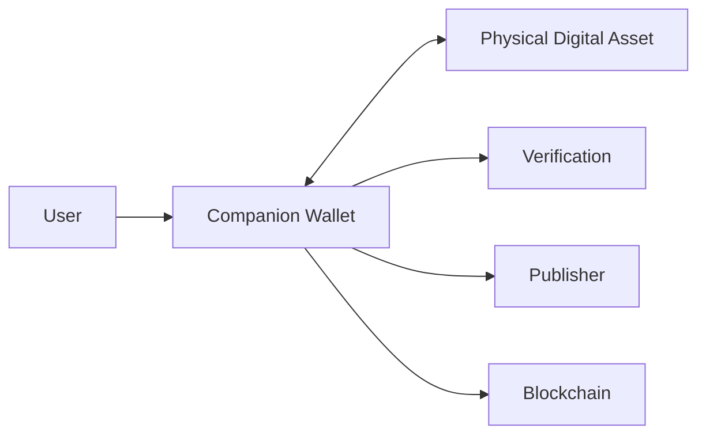
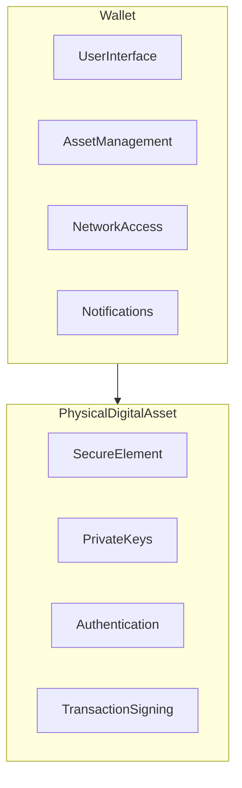

# 7. Wallet Architecture

### Introduction

> _The Companion Wallet is the primary software interface between users and Physical Digital Assets. It enables secure interaction with Digital Crypto Notes and other DCN-compatible assets while ensuring that sensitive cryptographic operations remain protected inside the Secure Element._

***

## Introduction

A Physical Digital Asset is designed to be simple to use, but it does not operate in isolation.

Users need a trusted application to manage assets, view balances, verify authenticity, authorize transactions, configure settings, and interact with blockchain networks.

The **DCN Companion Wallet** fulfills this role.

Unlike traditional cryptocurrency wallets, the Companion Wallet does not own or expose the device's protected cryptographic keys. Instead, it acts as a secure interface that communicates with the Physical Digital Asset through standardized DCN protocols.

The Secure Element inside the Physical Digital Asset remains responsible for all sensitive cryptographic operations, while the wallet provides an intuitive user experience for everyday interactions.

***

## Purpose

The Companion Wallet provides a secure and user-friendly interface for interacting with DCN-compatible Physical Digital Assets.

Its responsibilities include:

* Discovering Physical Digital Assets
* Establishing secure communication
* Displaying balances and asset information
* Initiating payments
* Managing ownership
* Configuring user preferences
* Managing multiple assets
* Supporting recovery workflows
* Receiving firmware and metadata updates
* Interacting with blockchain networks

The wallet simplifies user interaction without compromising security.

***

## Wallet Principles

Every DCN-compatible wallet should follow these principles.

#### Secure by Default

Security should be enabled automatically without requiring technical knowledge.

#### Hardware First

Sensitive operations should be delegated to the Secure Element whenever possible.

#### Multi-Chain

Support assets issued across multiple blockchain networks.

#### User Friendly

Provide a familiar payment and asset management experience.

#### Privacy Respecting

Collect and expose only the information required for the requested operation.

#### Interoperable

Support every DCN-compliant Physical Digital Asset regardless of manufacturer or publisher.

***

## Wallet Architecture

The Companion Wallet acts as the bridge between the user and the DCN ecosystem.

The wallet coordinates communication but does not replace the security provided by the Physical Digital Asset.

***

## Core Responsibilities

The Companion Wallet performs several important functions.

| Function           | Description                              |
| ------------------ | ---------------------------------------- |
| Asset Discovery    | Detect nearby DCN assets                 |
| Authentication     | Establish secure sessions                |
| Asset Management   | Display balances and metadata            |
| Payments           | Initiate transfers and purchases         |
| Verification       | Validate authenticity and ownership      |
| Recovery           | Assist with approved recovery procedures |
| Notifications      | Display lifecycle and security alerts    |
| Multi-Chain Access | Connect to supported blockchain networks |

***

## Separation of Responsibilities

The wallet intentionally separates user experience from security.

The wallet provides the interface.

The Physical Digital Asset provides trust.

***

## Security Model

The Companion Wallet should never:

* Store protected device private keys
* Bypass Secure Element policies
* Modify lifecycle state without authorization
* Execute protected cryptographic operations outside trusted hardware

Instead, the wallet requests operations from the Physical Digital Asset, which independently verifies whether the operation is permitted.

***

## Multi-Asset Support

A single Companion Wallet may manage multiple Physical Digital Assets.

Examples include:

* Digital Crypto Notes
* Stablecoin Cards
* CBDC Devices
* Identity Credentials
* Transit Passes
* Gift Cards
* Collectibles

Each asset maintains its own identity, lifecycle, ownership, and security policies.

***

## Multi-Chain Support

The Companion Wallet should support assets operating across multiple blockchain networks.

Supported networks may include:

* Ethereum
* Bitcoin
* Solana
* Cosmos
* Polkadot
* BNB Chain
* Avalanche
* Other DCN-supported networks

Blockchain-specific functionality is abstracted through standardized DCN interfaces, allowing users to interact with different networks through a consistent experience.

***

## Relationship to the Following Sections

This chapter defines the software architecture surrounding the Physical Digital Asset.

The following pages expand on each component:

* **Companion Wallet** — User interaction and wallet capabilities.
* **Smart Accounts** — Account abstraction and programmable accounts.
* **Recovery** — Asset and wallet recovery mechanisms.
* **User Permissions** — Authorization, delegation, and access control.

Together, these components define how users securely interact with the DCN ecosystem.

***

## Summary

The Companion Wallet is the primary software gateway to the DCN ecosystem.

By separating user experience from trusted hardware, the DCN Standard enables a familiar, intuitive interface while ensuring that sensitive cryptographic operations remain protected inside the Physical Digital Asset.

This architecture allows wallets from different vendors to interoperate with any DCN-compliant asset, creating an open ecosystem for Physical Digital Assets.

***

## In this chapter

* [Companion Wallet](companion-wallet.md)
* [Smart Accounts](smart-accounts.md)
* [Recovery](recovery.md)
* [User Permissions](user-permissions.md)
