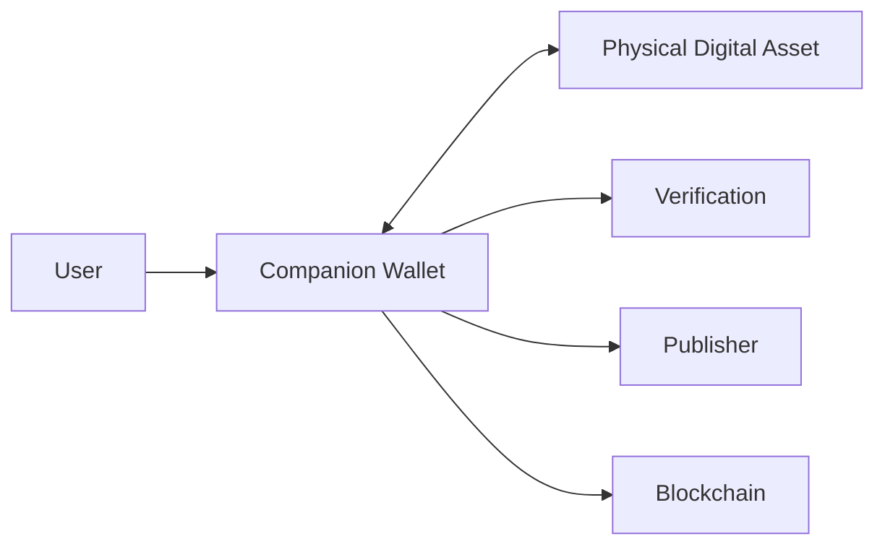
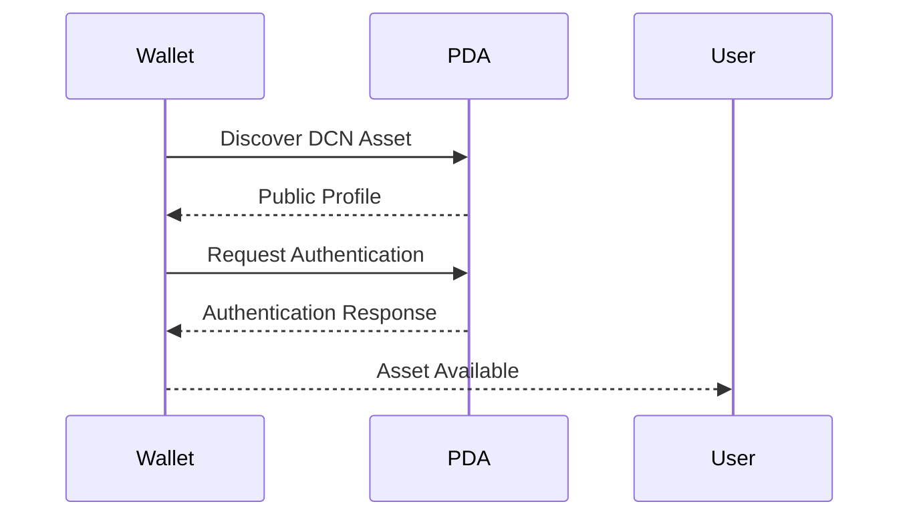
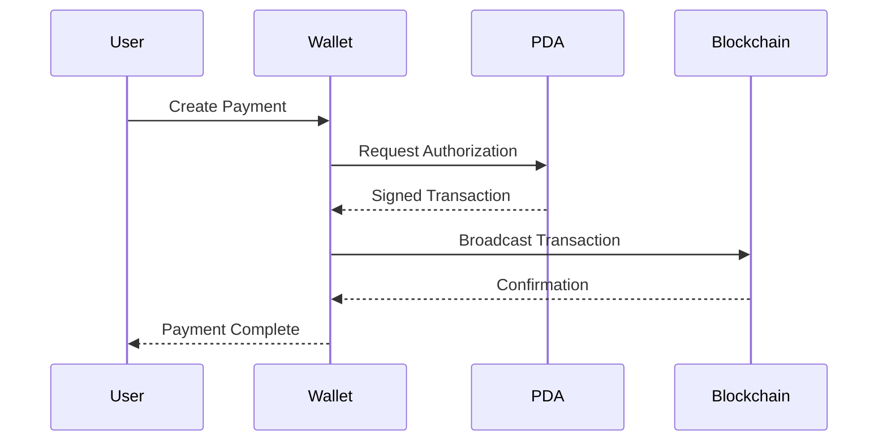
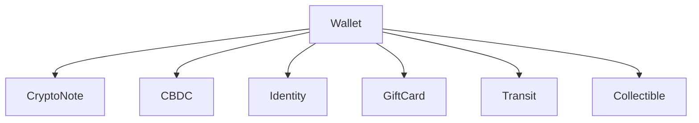

# Companion Wallet

> _The Companion Wallet is the trusted software companion for every Physical Digital Asset. It provides a secure, intuitive interface for users while delegating all security-critical operations to the Physical Digital Asset and its Secure Element._

***

## Introduction

The Companion Wallet is the primary application through which users interact with DCN-compatible Physical Digital Assets.

While the Physical Digital Asset securely stores cryptographic identities and performs trusted operations, the Companion Wallet provides the interface that allows users to manage assets, authorize transactions, verify authenticity, and access blockchain services.

The Companion Wallet is intentionally designed to separate **user experience** from **hardware security**.

This separation enables the wallet to evolve with new features while preserving the integrity of the Physical Digital Asset.

***

## Purpose

The Companion Wallet enables users to:

* View owned Physical Digital Assets
* Check balances and asset information
* Make payments
* Receive digital assets
* Verify authenticity
* Manage ownership
* Configure security settings
* Initiate recovery
* Receive firmware and metadata updates
* Connect to supported blockchain networks

The wallet acts as the user's gateway into the DCN ecosystem.

***

## Design Principles

Every DCN-compatible Companion Wallet should follow these principles.

#### Simple

Users should be able to interact with Physical Digital Assets using familiar actions such as **Tap**, **Pay**, **Receive**, and **Verify**.

#### Secure

Sensitive cryptographic operations must remain inside the Secure Element.

#### Open

The wallet should support all DCN-compliant assets regardless of manufacturer or publisher.

#### Multi-Chain

Users should manage assets across multiple blockchain networks from one application.

#### Privacy First

The wallet should request and disclose only the information necessary for each operation.

***

## Wallet Architecture

The Companion Wallet connects users with the DCN ecosystem.

The wallet manages communication while the Physical Digital Asset remains the trusted security anchor.

***

## Core Functions

The Companion Wallet provides a standard set of functions.

| Function        | Description                              |
| --------------- | ---------------------------------------- |
| Discover Assets | Detect nearby DCN assets                 |
| Pair Assets     | Register trusted assets                  |
| View Assets     | Display balances and metadata            |
| Payments        | Send and receive digital assets          |
| Verification    | Authenticate assets                      |
| Recovery        | Assist with approved recovery procedures |
| Settings        | Configure wallet preferences             |
| Notifications   | Display security and lifecycle alerts    |

***

## Asset Discovery

The wallet should automatically discover compatible Physical Digital Assets using supported communication methods.

Typical discovery flow:

Discovery should reveal only public information until authentication is complete.

***

## Asset Pairing

A user may pair a Physical Digital Asset with one or more Companion Wallets according to publisher policy.

Pairing establishes a trusted relationship between the wallet and the asset.

Typical pairing information includes:

* Device Identity
* Asset Identity
* Owner Association
* Supported Networks
* Asset Capabilities
* Security Profile

Pairing does **not** transfer ownership.

It simply allows the wallet to recognize and communicate with the asset more efficiently.

***

## Asset Dashboard

The Companion Wallet should provide a unified dashboard for all registered Physical Digital Assets.

Example dashboard information:

* Asset Name
* Asset Type
* Balance
* Blockchain Network
* Owner Status
* Security Status
* Lifecycle State
* Last Activity
* Verification Status

This allows users to manage multiple assets from a single interface.

***

## Payments

The Companion Wallet initiates payments but does not authorize them independently.

Payment flow:

The Secure Element inside the Physical Digital Asset performs the authorization.

***

## Verification

Users should be able to verify the authenticity of any DCN-compatible asset.

Verification may include:

* Device authenticity
* Publisher certificate
* Ownership status
* Lifecycle status
* Revocation status
* Security profile
* Asset metadata

The wallet presents the verification result in a simple and understandable format.

***

## Notifications

The wallet should notify users of important events.

Examples include:

* Successful payment
* Incoming transfer
* Ownership change
* Firmware update
* Security warning
* Asset suspension
* Certificate expiration
* Recovery request
* New supported blockchain

Notifications should avoid exposing sensitive information on locked devices.

***

## Multi-Asset Management

Users may own many different Physical Digital Assets.

The Companion Wallet should present these assets consistently while respecting each asset's capabilities and policies.

***

## Multi-Chain Management

The wallet should abstract blockchain complexity.

Instead of requiring users to manage separate wallets for each blockchain, the Companion Wallet should present a unified experience.

Supported blockchain-specific features should be handled internally through the DCN protocol and blockchain adapters.

***

## Security Responsibilities

The Companion Wallet is responsible for:

* Secure communication
* Session management
* User authentication
* Asset discovery
* Blockchain connectivity
* Verification requests
* User notifications

The Companion Wallet is **not** responsible for:

* Private key storage
* Transaction signing
* Device identity generation
* Secure key generation
* Hardware authentication

These functions remain within the Physical Digital Asset.

***

## User Experience

The Companion Wallet should prioritize simplicity.

Typical user actions include:

* Tap to Connect
* View Asset
* Pay
* Receive
* Verify
* Transfer Ownership
* Reload Balance
* View History
* Manage Settings

Users should not need to understand cryptography or blockchain internals to perform everyday operations.

***

## Privacy

The Companion Wallet should minimize data collection.

It should:

* Store only required information
* Request user consent where appropriate
* Avoid unnecessary tracking
* Support pseudonymous blockchain interactions
* Protect user preferences
* Encrypt locally stored wallet data

Privacy remains a core principle of the DCN Standard.

***

## Interoperability

Every compliant Companion Wallet should operate with any DCN-compliant Physical Digital Asset.

This enables users to freely choose:

* Wallet providers
* Hardware manufacturers
* Publishers
* Blockchain networks

without losing compatibility.

***

## Design Principles

The Companion Wallet follows five core principles.

#### Open

Compatible with every DCN-compliant asset.

#### Secure

Sensitive operations remain inside trusted hardware.

#### Simple

Provides an intuitive user experience.

#### Interoperable

Works across publishers and blockchain networks.

#### Extensible

Supports future asset types and protocol enhancements.

***

## Summary

The Companion Wallet is the trusted software companion of every Physical Digital Asset.

It enables users to securely manage assets, perform payments, verify authenticity, and interact with blockchain networks while ensuring that all security-critical operations remain protected inside the Physical Digital Asset.

By separating user experience from trusted hardware, the DCN Standard creates an open, interoperable wallet ecosystem that is simple for users and secure by design.
