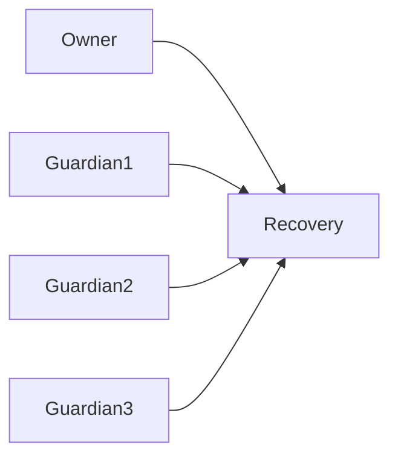
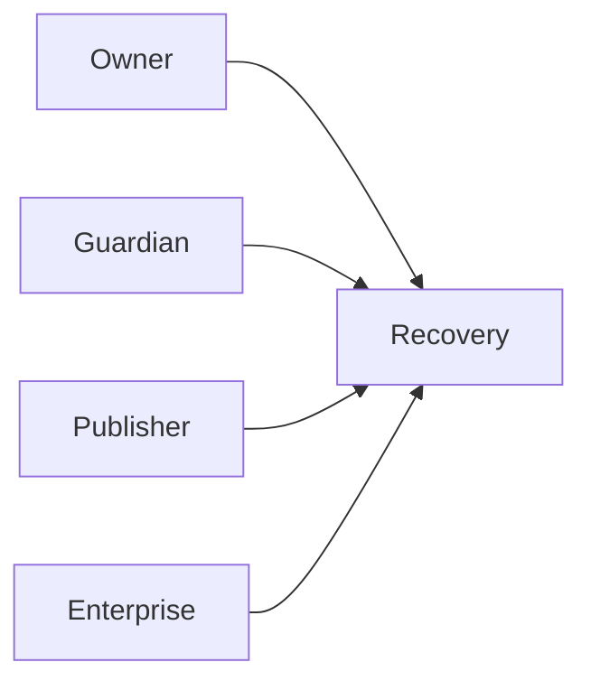
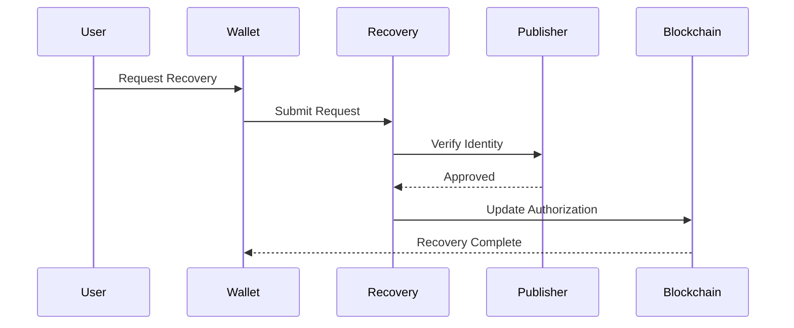

# Recovery

> _Recovery enables users to regain access to Physical Digital Assets without compromising security. The DCN Standard defines flexible recovery models that support self-custody, enterprise deployments, and regulated environments while ensuring that recovery never weakens the trust model._

***

## Introduction

One of the biggest barriers to mainstream adoption of digital assets is the risk of permanent loss.

Traditional blockchain wallets often depend on a single private key or seed phrase. If that secret is lost, forgotten, or destroyed, access to the assets may be permanently lost.

The DCN Standard addresses this challenge by introducing a **flexible recovery framework**.

Rather than relying on a single recovery mechanism, DCN supports multiple recovery models that publishers can adopt based on their use case, regulatory requirements, and security policies.

Recovery is therefore a **policy-driven capability**, not a mandatory feature of every Physical Digital Asset.

***

## Recovery Objectives

The Recovery architecture is designed to:

* Prevent permanent asset loss
* Preserve user ownership
* Support multiple recovery models
* Maintain hardware-backed security
* Prevent unauthorized recovery
* Minimize recovery complexity
* Support consumer, enterprise, and government deployments
* Preserve auditability

Recovery must never reduce the security of the Physical Digital Asset.

***

## Recovery Architecture

Recovery involves multiple trusted participants.

The exact recovery path depends on the selected recovery model.

***

## Recovery Principles

Every recovery mechanism should follow these principles.

#### Owner First

Recovery exists to restore access for the legitimate owner.

#### Policy Driven

Recovery rules are defined by the Publisher.

#### Secure

Recovery requires strong verification.

#### Auditable

Recovery actions should be recorded.

#### Optional

Recovery is enabled only where supported by the asset profile.

***

## Recovery Models

The DCN Standard supports multiple recovery models.

| Recovery Model       | Typical Use              |
| -------------------- | ------------------------ |
| Self Recovery        | Consumer assets          |
| Guardian Recovery    | Family accounts          |
| Publisher Recovery   | Gift cards, vouchers     |
| Enterprise Recovery  | Employee credentials     |
| Government Recovery  | National identity, CBDCs |
| Multi-Party Recovery | Institutional assets     |

Each model provides different balances between usability and decentralization.

***

## Self Recovery

Self Recovery allows users to restore access independently.

Typical mechanisms include:

* Recovery phrase
* Backup device
* Hardware backup
* Encrypted recovery package

The Publisher does not participate.

This model provides maximum user independence.

***

## Guardian Recovery

Guardian Recovery allows trusted individuals or organizations to assist.

Examples include:

* Family members
* Friends
* Legal representatives
* Business partners

Recovery succeeds only after the required number of guardians approve the request.

***

## Publisher Recovery

Some asset types require Publisher involvement.

Examples include:

* Gift cards
* Payroll cards
* Loyalty cards
* Event tickets

The Publisher verifies ownership according to its policies before restoring access.

Publisher Recovery should not be used for assets intended to provide unrestricted self-custody unless explicitly accepted by the user.

***

## Enterprise Recovery

Enterprise assets often belong to organizations rather than individuals.

Typical examples include:

* Employee credentials
* Corporate payment cards
* Access badges
* Treasury assets

Recovery may require approval from enterprise administrators before access is restored.

***

## Government Recovery

Government-issued assets may require recovery procedures defined by law.

Examples include:

* Digital identity
* Driver licenses
* CBDCs
* Social benefit cards

Recovery may involve official identity verification and authorized government services.

***

## Multi-Party Recovery

High-value assets may require multiple independent approvals.

Recovery is completed only when the configured policy requirements are satisfied.

***

## Recovery Workflow

A typical recovery process follows these steps.

***

## Recovery Verification

Recovery requests should be verified using one or more methods.

Examples include:

* Identity verification
* Guardian approval
* Multi-signature approval
* Device attestation
* Publisher authorization
* Enterprise approval
* Recovery token
* Biometric verification (optional)

No single verification method is appropriate for every deployment.

***

## Recovery Policy

Every Publisher should define a recovery policy.

Typical policy elements include:

* Eligible asset types
* Recovery participants
* Required approvals
* Waiting period
* Audit requirements
* Notification requirements
* Recovery limits
* Revocation process

Policies should balance security and usability.

***

## Recovery Events

Recovery actions should generate lifecycle events.

Examples include:

* Recovery requested
* Recovery approved
* Recovery rejected
* Guardian confirmation
* Ownership restored
* Device replaced

These events support transparency and auditing.

***

## Recovery Security

Recovery introduces additional security considerations.

Implementations should protect against:

* Social engineering
* Identity fraud
* Unauthorized approvals
* Recovery replay attacks
* Insider abuse
* Stolen recovery credentials

Recovery should require stronger verification than routine transactions.

***

## Lost Physical Digital Asset

Loss of the physical asset does not necessarily mean loss of ownership.

Depending on publisher policy, the owner may:

* Suspend the lost asset
* Recover ownership
* Transfer authorization to a replacement asset
* Revoke the original asset

This minimizes the impact of accidental loss.

***

## Replacement Assets

Following successful recovery, a replacement Physical Digital Asset may be issued.

The replacement receives:

* New Device Identity
* New Secure Element
* New Hardware Root of Trust

while preserving:

* Asset ownership
* Blockchain association
* User permissions
* Recovery policy

This ensures that compromised hardware is never reused.

***

## Recovery and Privacy

Recovery procedures should minimize disclosure of personal information.

Only the information necessary to complete the recovery should be exchanged.

Recovery records should be protected according to applicable privacy and regulatory requirements.

***

## Design Principles

The Recovery architecture follows these principles.

#### Flexible

Supports multiple deployment models.

#### Secure

Requires strong authorization.

#### Recoverable

Prevents unnecessary asset loss.

#### Auditable

Recovery actions are traceable.

#### User Focused

Balances security with usability.

***

## Summary

The DCN Recovery architecture enables users, enterprises, and governments to restore access to Physical Digital Assets without weakening the security of the ecosystem.

By supporting multiple recovery models and policy-driven authorization, the DCN Standard eliminates one of the greatest barriers to digital asset adoption while preserving trust, ownership, and interoperability.
