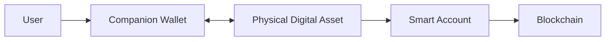
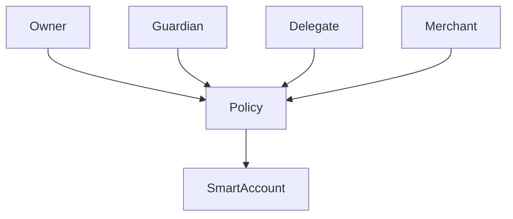
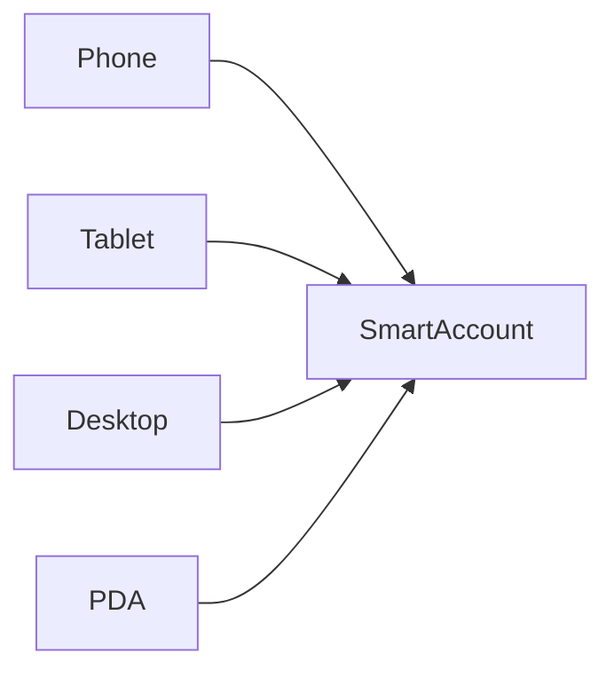
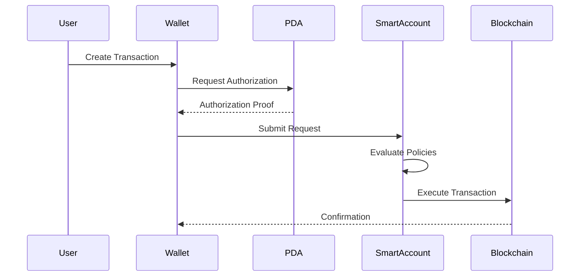

# Smart Accounts

## 7. Wallet Architecture

> _Smart Accounts extend traditional blockchain accounts by introducing programmable security, flexible authorization, and enhanced usability. Within the DCN ecosystem, Smart Accounts enable Physical Digital Assets to support modern account management without sacrificing self-custody or interoperability._

***

## Introduction

Traditional blockchain wallets are controlled by a single private key.

If that key is lost, the associated assets are often permanently inaccessible. Every transaction must be manually signed, and implementing features such as spending limits, delegated access, recovery, or automation requires custom smart contracts.

The DCN Standard adopts **Smart Accounts** to overcome these limitations.

A Smart Account is a programmable blockchain account that separates **ownership** from **authorization**. Instead of relying on a single key, the account follows configurable policies that determine who may perform operations and under what conditions.

This architecture enables Physical Digital Assets to behave more like modern financial instruments while preserving user ownership and cryptographic security.

***

## Purpose

Smart Accounts provide a secure and flexible account model for DCN-compatible assets.

They enable:

* Programmable authorization
* Multi-device access
* Spending policies
* Delegated permissions
* Social and enterprise recovery
* Gas abstraction
* Transaction automation
* Multi-signature approval
* Future extensibility

Smart Accounts simplify blockchain interaction while maintaining user control.

***

## Why Smart Accounts?

The limitations of traditional externally owned accounts (EOAs) include:

* Single private key dependency
* Difficult recovery
* No native spending controls
* Limited automation
* Poor enterprise support
* Weak delegation capabilities

Smart Accounts address these limitations through programmable account logic.

***

## Smart Account Architecture

A Smart Account sits between the user and the blockchain.

The Physical Digital Asset authorizes operations, while the Smart Account defines how those operations are executed on-chain.

***

## Core Components

Every Smart Account consists of several logical components.

| Component           | Purpose                                 |
| ------------------- | --------------------------------------- |
| Account Controller  | Controls account behavior               |
| Authorization Rules | Defines who may perform operations      |
| Permission Engine   | Evaluates requests                      |
| Policy Manager      | Applies spending and usage rules        |
| Recovery Module     | Supports secure recovery                |
| Execution Module    | Executes approved blockchain operations |

***

## Authorization Model

Unlike traditional wallets, Smart Accounts separate **ownership** from **permission**.

Each participant receives permissions according to the configured policy.

***

## Supported Operations

A Smart Account may authorize:

* Payments
* Asset transfers
* Balance reloads
* Ownership transfers
* Policy updates
* Recovery requests
* Session creation
* Merchant approvals
* Contract interactions

Every operation is evaluated against the account's configured rules.

***

## Policy-Based Authorization

Authorization decisions are determined by policies rather than a single private key.

Examples include:

* Daily spending limit
* Maximum transaction value
* Approved merchants
* Geographic restrictions
* Time restrictions
* Multi-signature approval
* Guardian approval
* Enterprise administrator approval

This allows one Smart Account to support many different use cases.

***

## Multi-Device Access

A user may securely access the same Smart Account from multiple trusted devices.

Examples include:

* Smartphone
* Tablet
* Desktop Wallet
* Hardware Wallet
* Physical Digital Asset

Each device may receive different permissions according to the account policy.

***

## Transaction Flow

A standard Smart Account transaction follows this sequence.

The Smart Account validates the request before interacting with the blockchain.

***

## Spending Controls

Smart Accounts support configurable spending controls.

Examples include:

| Control                | Example                  |
| ---------------------- | ------------------------ |
| Daily Limit            | Maximum amount per day   |
| Per Transaction Limit  | Maximum single payment   |
| Merchant Allow List    | Approved merchants only  |
| Geographic Restriction | Country or region limits |
| Time Window            | Business hours only      |
| Asset Restrictions     | Allowed asset categories |

These controls are enforced by account policies.

***

## Delegated Access

Owners may grant limited permissions to other users or applications.

Examples include:

* Child spending allowance
* Employee expense account
* Subscription payments
* Trusted merchant authorization
* Temporary event access

Delegated permissions should include:

* Scope
* Duration
* Spending limit
* Revocation capability

Delegation never changes ownership.

***

## Enterprise Support

Smart Accounts are suitable for enterprise deployments.

Examples include:

* Multi-manager approval
* Treasury operations
* Department budgets
* Employee expense cards
* Procurement workflows

Policies can require approval from multiple authorized participants before a transaction is executed.

***

## Gas Abstraction

The Companion Wallet should shield users from blockchain complexity where possible.

Depending on the supported blockchain network, transaction fees may be:

* Paid by the user
* Sponsored by the Publisher
* Sponsored by an enterprise
* Paid from a dedicated fee account
* Included within a service model

This creates a simpler user experience while remaining compatible with blockchain requirements.

***

## Security

Smart Accounts improve security by supporting:

* Multiple authorization methods
* Hardware-backed approvals
* Recovery policies
* Multi-signature workflows
* Fine-grained permissions
* Session management
* Spending limits

Compromise of one device does not necessarily compromise the entire account.

***

## Relationship with Physical Digital Assets

The Smart Account does not replace the Physical Digital Asset.

Instead:

* The Physical Digital Asset provides trusted authorization.
* The Smart Account provides programmable account logic.
* The Companion Wallet provides the user interface.

Together, they form the complete DCN account model.

***

## Design Principles

Smart Accounts follow these principles.

#### User Ownership

Users retain ultimate control of their assets.

#### Programmable

Policies can adapt to different use cases.

#### Secure

Authorization is protected by trusted hardware.

#### Flexible

Supports consumer, enterprise, and government deployments.

#### Interoperable

Works across supported blockchain networks.

***

## Summary

Smart Accounts provide the programmable account layer of the DCN ecosystem.

By separating ownership from authorization, they enable spending controls, delegated permissions, multi-device access, enterprise workflows, gas abstraction, and flexible recovery while preserving the security of the Physical Digital Asset.

Together with the Companion Wallet, Smart Accounts deliver a modern blockchain experience that is both secure and user-friendly.
