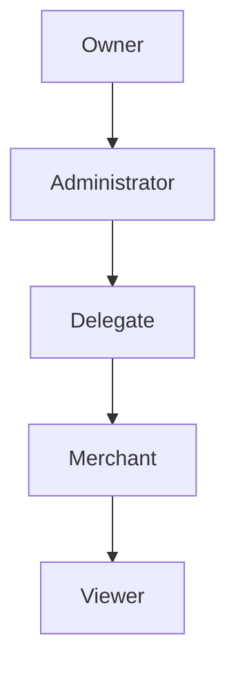
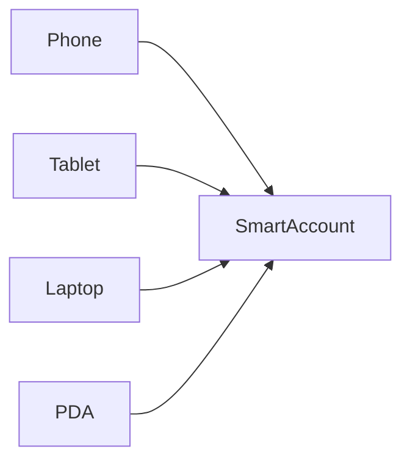
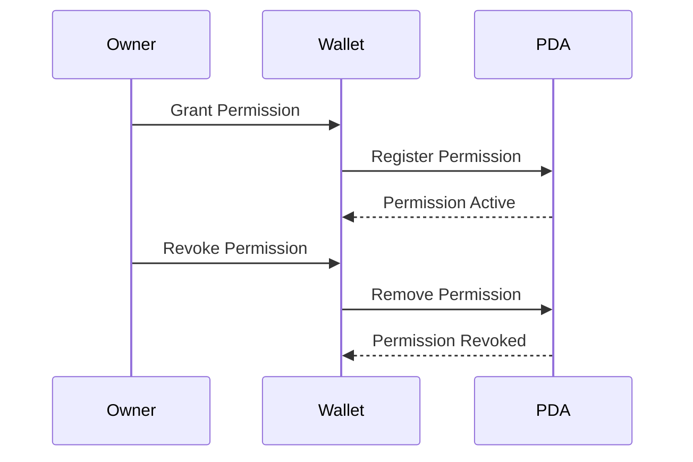
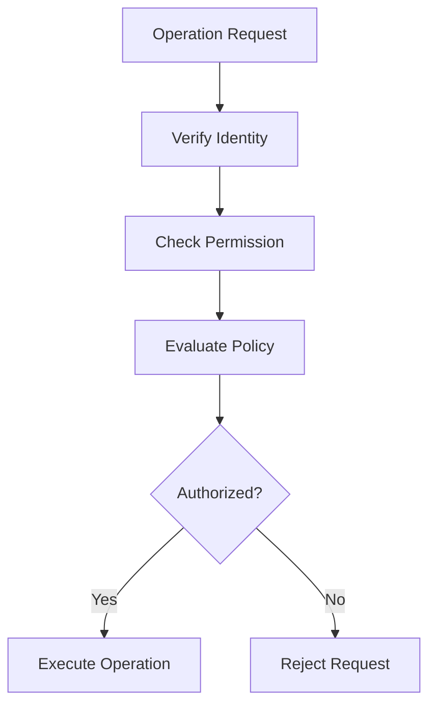

# User Permissions

> _User Permissions define who can interact with a Physical Digital Asset, what actions they are authorized to perform, and under which conditions those actions are permitted. The DCN Standard separates ownership from permissions, enabling secure delegation without sacrificing user control._

***

## Introduction

Not every interaction with a Physical Digital Asset should require full ownership privileges.

A user may want to allow a family member to spend a limited amount, authorize an employee to use a corporate payment card, permit a merchant to process recurring payments, or grant temporary access to a device without transferring ownership.

The DCN Standard addresses these scenarios through a flexible **permission-based access model**.

Ownership remains with the asset owner, while permissions define what other users, devices, or applications are allowed to do.

This separation enables secure delegation, enterprise workflows, and programmable access control without compromising self-custody.

***

## Purpose

The User Permission model enables:

* Separation of ownership and usage
* Delegated access
* Temporary permissions
* Multi-user asset management
* Enterprise administration
* Family and shared accounts
* Merchant authorizations
* Application-specific access
* Fine-grained security policies

Permissions improve usability while preserving ownership.

***

## Permission Model

Every action performed on a Physical Digital Asset should be evaluated against an authorization policy.

The Permission Engine determines whether the requested operation is allowed.

***

## Permission Principles

The DCN Standard follows several core principles.

#### Owner Control

The owner determines who receives permissions.

#### Least Privilege

Permissions should grant only the minimum authority required.

#### Time Limited

Permissions may expire automatically.

#### Revocable

Permissions should be removable at any time.

#### Auditable

Permission changes should be recorded.

***

## Permission Roles

Different participants may have different roles.

| Role                     | Typical Responsibilities              |
| ------------------------ | ------------------------------------- |
| Owner                    | Full control of the asset             |
| Delegate                 | Limited operational access            |
| Guardian                 | Recovery participation                |
| Merchant                 | Approved payment requests             |
| Enterprise Administrator | Organization policy management        |
| Publisher                | Lifecycle management where applicable |
| Verifier                 | Read-only verification                |

Each role has a clearly defined scope.

***

## Permission Types

Permissions may authorize different operations.

| Permission         | Description                   |
| ------------------ | ----------------------------- |
| View Asset         | Read public asset information |
| View Balance       | Display balances              |
| Make Payments      | Initiate approved payments    |
| Receive Assets     | Accept incoming transfers     |
| Reload Balance     | Add value where supported     |
| Configure Settings | Update user preferences       |
| Manage Permissions | Grant or revoke delegates     |
| Transfer Ownership | Change ownership              |
| Recover Asset      | Participate in recovery       |

Not every asset type supports every permission.

***

## Permission Hierarchy

Permissions are hierarchical.

Higher roles may grant or revoke lower-level permissions according to Publisher policy.

***

## Delegated Permissions

Owners may safely delegate specific capabilities.

Examples include:

* Family spending allowance
* Employee expense account
* Child payment card
* Shared travel card
* Temporary event access
* Business purchasing authority

Delegation does not transfer ownership.

***

## Permission Constraints

Permissions may include additional restrictions.

Examples include:

* Maximum transaction amount
* Daily spending limit
* Allowed merchants
* Geographic restrictions
* Supported asset types
* Time-of-day restrictions
* Expiration date
* Device restrictions

These constraints reduce risk while maintaining flexibility.

***

## Temporary Permissions

Permissions may be granted for a limited duration.

Typical examples include:

* One-day event pass
* Hotel room access
* Temporary contractor badge
* Limited travel authorization
* Time-limited corporate expense card

Expired permissions should automatically become inactive without requiring manual revocation.

***

## Multi-Device Permissions

Users may access the same Smart Account from multiple trusted devices.

Each device may receive different permission levels.

For example:

| Device                 | Permission Level               |
| ---------------------- | ------------------------------ |
| Physical Digital Asset | Full transaction authorization |
| Smartphone             | Daily payments                 |
| Tablet                 | Read-only                      |
| Desktop                | Administration                 |

***

## Enterprise Permissions

Enterprise deployments often require role-based access.

Examples include:

* Finance Manager
* Department Head
* Employee
* Auditor
* Procurement Officer

Different organizational roles receive different permissions according to enterprise policy.

***

## Merchant Permissions

Merchants may receive limited authorization.

Typical permissions include:

* Request payment
* Verify authenticity
* Process refunds
* Validate ownership where permitted

Merchants should never gain unrestricted control over a customer's asset.

***

## Application Permissions

Applications interacting with Smart Accounts may also receive permissions.

Examples include:

* Subscription services
* Transit systems
* Loyalty platforms
* Identity verification services
* IoT devices

Application permissions should always be explicit and revocable.

***

## Permission Lifecycle

Permissions follow a defined lifecycle.

Every change should be authenticated and recorded.

***

## Permission Evaluation

Every protected operation should follow a consistent authorization process.

Permission checks should occur before any protected action is performed.

***

## Permission Revocation

Permissions may be revoked by:

* Asset Owner
* Enterprise Administrator
* Publisher (where applicable)
* Security Policy
* Expiration

Revocation should take effect immediately or according to the configured policy.

***

## Audit Logging

Permission changes should generate audit events.

Examples include:

* Permission granted
* Permission updated
* Permission revoked
* Permission expired
* Unauthorized request
* Administrative override

Audit records improve transparency and security investigations.

***

## Privacy

Permission data should follow the principle of least disclosure.

Participants should see only the permissions relevant to them.

For example:

* A merchant should not view family delegates.
* A delegate should not access recovery settings.
* A viewer should not see administrative policies.

This minimizes unnecessary exposure of user information.

***

## Security Considerations

Implementations should protect against:

* Unauthorized delegation
* Privilege escalation
* Stolen devices
* Replay attacks
* Expired permission reuse
* Insider abuse
* Social engineering
* Unauthorized administrative actions

Permission evaluation should always occur inside the trusted authorization model.

***

## Asset-Type Examples

Different Physical Digital Assets may use different permission models.

| Asset Type          | Example Permissions            |
| ------------------- | ------------------------------ |
| DCN-S Stored Value  | Owner, Delegate                |
| DCN-R Reloadable    | Owner, Family Member           |
| DCN-P Programmable  | Owner, Administrator, Employee |
| DCN-C Collectible   | Owner, Viewer                  |
| Identity Credential | Holder, Verifier               |
| Transit Pass        | Holder, Transit Operator       |
| Event Ticket        | Holder, Event Verifier         |
| Gift Card           | Holder                         |

The Publisher determines which permission model applies to each asset profile.

***

## Design Principles

The User Permission model follows five principles.

#### Flexible

Supports consumer, enterprise, and government use cases.

#### Secure

Every permission requires authenticated authorization.

#### Granular

Permissions are specific to individual operations.

#### Revocable

Permissions can be removed at any time.

#### Interoperable

Permission concepts remain consistent across all DCN-compatible assets.

***

## Summary

The User Permission model enables secure delegation while preserving user ownership.

By separating ownership from authorization, the DCN Standard allows Physical Digital Assets to support shared access, enterprise administration, merchant interactions, family accounts, and programmable workflows without compromising security.

Together with the Companion Wallet, Smart Accounts, and Recovery architecture, User Permissions complete the Wallet Architecture defined by DCN Specification v1.0.
