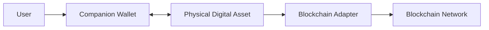
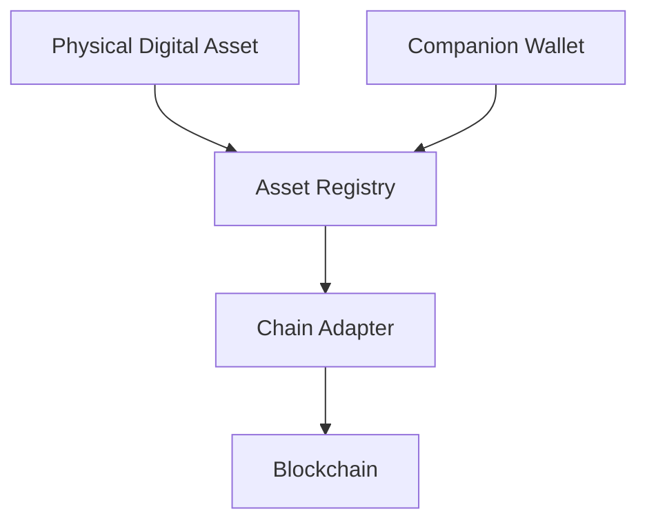

# 8. Multi-Chain Support

### Introduction

> _The DCN Standard is blockchain-neutral. A Physical Digital Asset is not tied to a single blockchain but is designed to securely represent digital assets across multiple blockchain networks through a common interoperability framework._

***

## Introduction

One of the core principles of the DCN Standard is **blockchain neutrality**.

Digital assets today exist across hundreds of blockchain networks, each with its own architecture, wallet standards, transaction formats, and smart contract models.

Examples include:

* Bitcoin
* Ethereum
* Solana
* BNB Chain
* Avalanche
* Polygon
* Cosmos
* Polkadot
* TON
* Hyperledger
* Ripple
* Cardano
* Aptos
* Sui

If Physical Digital Assets were designed for only one blockchain, they would become isolated ecosystems.

Instead, the DCN Standard defines a common architecture that enables Physical Digital Assets to operate across multiple blockchain networks while providing users with a consistent experience.

A user should interact with a Physical Digital Asset—not with blockchain-specific complexity.

***

## Purpose

The Multi-Chain Architecture is designed to:

* Support multiple blockchain networks
* Remove blockchain-specific complexity from users
* Standardize asset interaction
* Enable interoperability
* Simplify wallet development
* Support future blockchain networks
* Allow publishers to issue assets on their preferred blockchain
* Preserve a consistent user experience

The blockchain becomes an implementation detail rather than the user interface.

***

## Blockchain Neutrality

The DCN Standard does **not** define its own blockchain.

Instead, it defines how Physical Digital Assets interact with existing and future blockchain ecosystems.

This approach allows Publishers to choose the blockchain that best meets their business, regulatory, or technical requirements without changing the Physical Digital Asset itself.

For example:

* A stablecoin Publisher may choose Ethereum.
* A government may issue CBDCs on a permissioned network.
* A gaming platform may issue assets on Solana.
* An enterprise may use Hyperledger.
* A loyalty platform may use Polygon.

All remain interoperable through the DCN Standard.

***

## Multi-Chain Architecture

The Multi-Chain Architecture separates the Physical Digital Asset from blockchain implementation details.

The Physical Digital Asset communicates through standardized DCN interfaces.

Blockchain-specific logic is handled by the Blockchain Adapter.

***

## Benefits

Supporting multiple blockchain networks provides several advantages.

### User Benefits

* One wallet for multiple blockchains
* Consistent user experience
* Simplified payments
* Reduced technical complexity

### Publisher Benefits

* Freedom to choose any blockchain
* Easier migration between networks
* Larger ecosystem reach
* Reduced vendor lock-in

### Developer Benefits

* One SDK
* One API model
* One security architecture
* Multiple blockchain integrations

***

## Architecture Principles

The Multi-Chain Architecture follows five principles.

#### Blockchain Agnostic

No blockchain receives special treatment within the DCN Standard.

#### Interoperable

Assets from different blockchain ecosystems should coexist.

#### Extensible

New blockchain networks can be added without changing the core specification.

#### Standardized

Wallets interact through one consistent protocol.

#### Future Ready

The architecture is designed to support blockchain technologies that do not yet exist.

***

## Logical Architecture

Each component has a distinct responsibility.

| Component              | Responsibility                 |
| ---------------------- | ------------------------------ |
| Physical Digital Asset | Secure asset representation    |
| Companion Wallet       | User interaction               |
| Asset Registry         | Asset discovery and mapping    |
| Chain Adapter          | Blockchain-specific operations |
| Blockchain             | Settlement and consensus       |

***

## Relationship to Following Sections

This chapter is divided into three sections:

* **Supported Networks** — Blockchain compatibility and supported ecosystems.
* **Asset Registry** — Universal identification and asset mapping.
* **Chain Adapters** — Blockchain-specific communication and transaction handling.

Together, these components allow one Physical Digital Asset to securely operate across many blockchain ecosystems without changing the user experience.

***

## Summary

The DCN Multi-Chain Architecture enables Physical Digital Assets to function independently of any specific blockchain.

By separating asset security from blockchain implementation, the DCN Standard creates a universal framework capable of supporting cryptocurrencies, stablecoins, CBDCs, tokenized securities, identity credentials, collectibles, and future digital assets across multiple blockchain networks.

This architecture ensures that DCN remains an **open standard for Physical Digital Assets**, rather than a solution tied to any single blockchain ecosystem.

***

## In this chapter

* [Supported Networks](supported-networks.md)
* [Asset Registry](asset-registry.md)
* [Chain Adapters](chain-adapters.md)
