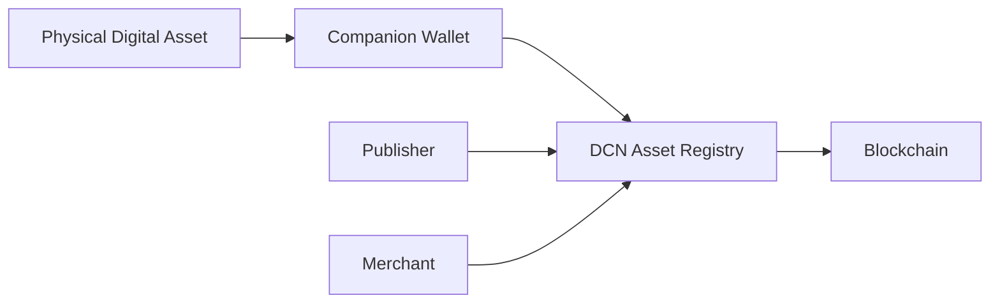
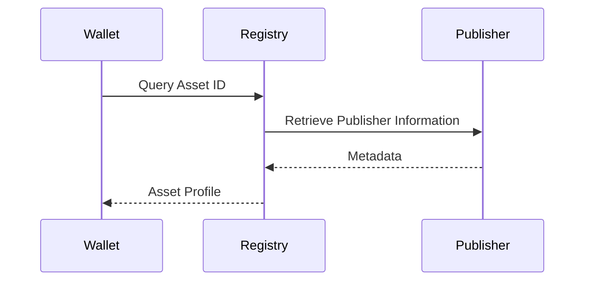
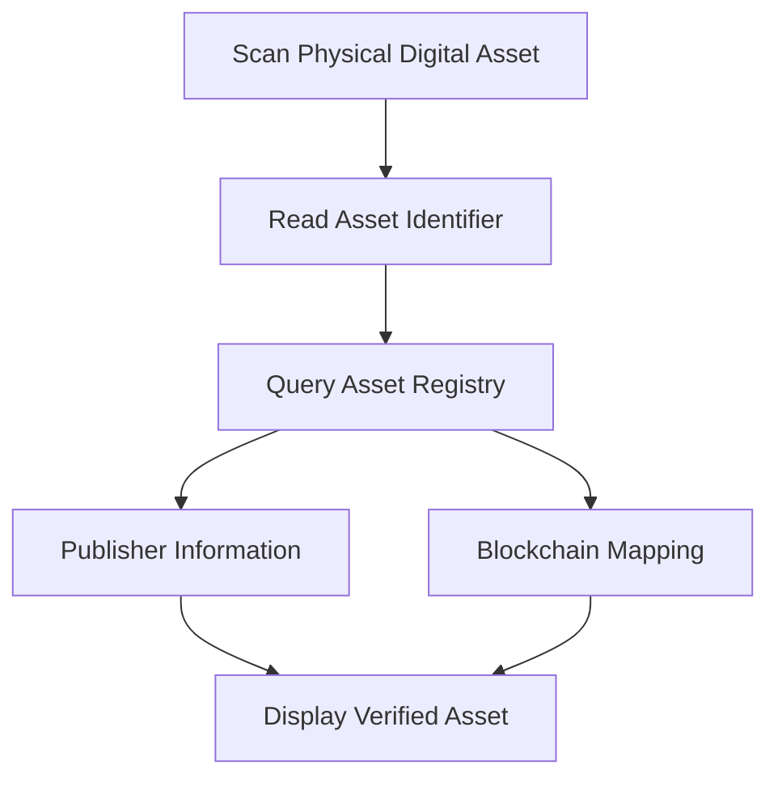

# Asset Registry

> _The Asset Registry provides the universal directory for Physical Digital Assets. It enables wallets, publishers, merchants, and verification services to identify, validate, and discover assets regardless of the underlying blockchain network._

***

## Introduction

Every Physical Digital Asset requires a globally unique identity.

Without a standardized registry, wallets would have no reliable way to determine:

* What the asset represents
* Which Publisher issued it
* Which blockchain network it belongs to
* Which token or smart contract it references
* Whether it has been revoked
* Whether it is genuine

The **DCN Asset Registry** solves this problem.

Rather than storing balances or ownership, the registry stores **asset metadata and trust information** that enables interoperability across the entire DCN ecosystem.

Think of the Asset Registry as the **DNS of Physical Digital Assets**—a universal directory that allows any compliant wallet or service to understand and verify any DCN-compatible asset.

***

## Purpose

The Asset Registry enables the ecosystem to:

* Uniquely identify Physical Digital Assets
* Discover Publisher information
* Locate blockchain references
* Validate supported capabilities
* Verify lifecycle status
* Enable interoperability
* Support future blockchain networks
* Prevent asset identifier conflicts

The registry acts as the common discovery layer for the DCN ecosystem.

***

## Registry Architecture



The registry does **not** hold private keys or user funds.

It provides trusted information required to understand and validate an asset.

***

## Registry Responsibilities

The Asset Registry maintains information such as:

| Information          | Purpose                                     |
| -------------------- | ------------------------------------------- |
| Asset Identifier     | Global unique identifier                    |
| Publisher Identifier | Asset issuer                                |
| Asset Profile        | DCN-S, DCN-R, DCN-P, DCN-C                  |
| Asset Type           | Payment, Identity, Ticket, etc.             |
| Supported Blockchain | Settlement network                          |
| Contract Address     | Smart contract reference (where applicable) |
| Token Standard       | ERC-20, ERC-721, SPL, etc.                  |
| Lifecycle Status     | Active, Suspended, Revoked                  |
| Security Profile     | Certified security level                    |
| Version              | Supported DCN specification version         |

The registry intentionally excludes sensitive ownership information.

***

## Global Asset Identifier

Every Physical Digital Asset should have a globally unique identifier.

Example structure:

```
dcn:publisher:asset-id
```

Example:

```
dcn:cardsense:4F91A28D7C10
```

The identifier remains independent of the blockchain network.

Even if the asset is migrated to another blockchain, its DCN identity remains unchanged.

***

## Registry Record

A registry entry may contain:

```
Asset ID
Publisher ID
Asset Profile
Asset Type
Blockchain Network
Contract Address
Token Identifier
Supported Wallet Version
Lifecycle State
Security Profile
Metadata Reference
Certification Status
```

Different asset types may require additional metadata.

***

## Asset Discovery

When a wallet scans a Physical Digital Asset, it may query the registry.



The wallet can then display meaningful information to the user without requiring blockchain-specific knowledge.

***

## Publisher Registration

Every Publisher participating in the DCN ecosystem should maintain a Publisher identity.

Typical Publisher information includes:

* Publisher Name
* Publisher Identifier
* Organization Certificate
* Supported Asset Profiles
* Supported Networks
* Contact Information
* Certification Status

This enables wallets to determine who issued the asset.

***

## Asset Classification

The registry categorizes assets according to standardized DCN profiles.

Examples include:

| Asset Profile | Typical Use  |
| ------------- | ------------ |
| DCN-S         | Stored Value |
| DCN-R         | Reloadable   |
| DCN-P         | Programmable |
| DCN-C         | Collectible  |

In addition, the registry may classify the business purpose:

* Stablecoin
* CBDC
* Gift Card
* Identity
* Ticket
* Payroll
* Transit
* Loyalty
* Membership
* Certificate
* Tokenized Security
* Carbon Credit

This separation allows wallets to understand both **how** an asset behaves and **what** it represents.

***

## Blockchain Mapping

The registry maps each asset to its corresponding blockchain resources.

Examples include:

| Registry Field  | Example                  |
| --------------- | ------------------------ |
| Network         | Ethereum                 |
| Contract        | ERC-20 Contract          |
| Token ID        | NFT Identifier           |
| Native Asset    | Bitcoin                  |
| Issuer Contract | Publisher Smart Contract |

This abstraction allows the Companion Wallet to locate blockchain information automatically.

***

## Metadata

The registry may expose public metadata describing an asset.

Examples include:

* Display Name
* Description
* Symbol
* Logo
* Supported Languages
* Issuer Website
* Terms of Use
* Expiration Rules

Metadata improves usability while remaining separate from security-critical information.

***

## Lifecycle Information

The registry may publish lifecycle status.

Typical states include:

* Manufactured
* Issued
* Active
* Suspended
* Expired
* Revoked
* Destroyed

Wallets should use lifecycle information to determine whether an asset can still be used.

***

## Certification Information

The registry may include certification records.

Examples include:

* Secure Hardware Certification
* Wallet Compatibility
* Publisher Certification
* Manufacturing Certification
* Security Profile
* Protocol Version

This allows wallets and merchants to validate trusted implementations.

***

## Registry Synchronization

The registry should remain synchronized with participating Publishers.

Updates may include:

* New asset issuance
* Lifecycle changes
* Revocations
* Security updates
* Metadata updates
* Certification changes

Synchronization mechanisms may vary according to deployment.

***

## Privacy

The Asset Registry should expose only public information.

It should **not** contain:

* Private keys
* User identities
* Wallet balances
* Transaction history
* Recovery secrets
* Personal information

Ownership remains verifiable through the appropriate blockchain or authorization model—not through the registry.

***

## Decentralized Registry

The DCN Standard does not require a centralized registry.

Possible implementations include:

* Smart contracts
* Distributed ledgers
* Federated registries
* Government registries
* Enterprise registries
* Hybrid architectures

The standard defines **what** information should be available, not **where** it must be stored.

***

## Registry Security

The registry should support:

* Digital signatures
* Publisher authentication
* Version management
* Tamper detection
* Audit logging
* Revocation records
* Access control for administrative functions

Public queries should remain read-only.

***

## Registry Query Flow



This process allows wallets to identify and verify assets before initiating sensitive operations.

***

## Future Extensibility

The Asset Registry is designed to support future asset categories without changing the core protocol.

Examples include:

* AI Agent Credentials
* Machine Identities
* IoT Devices
* Autonomous Vehicles
* Smart City Infrastructure
* Healthcare Credentials
* Academic Records
* Future Digital Asset Classes

This extensibility reinforces the role of DCN as a universal standard for Physical Digital Assets.

***

## Design Principles

The Asset Registry follows five principles.

#### Global

Every asset has a unique identity.

#### Interoperable

Supports all DCN-compatible assets.

#### Blockchain Neutral

Independent of settlement networks.

#### Privacy Respecting

Stores public metadata only.

#### Extensible

Supports future asset classes and blockchain ecosystems.

***

## Summary

The Asset Registry provides the universal discovery and identification layer of the DCN ecosystem.

By maintaining standardized information about Publishers, asset profiles, blockchain mappings, lifecycle status, and certification records, it enables wallets and services to understand any DCN-compatible Physical Digital Asset without requiring blockchain-specific logic.

Like DNS for the Internet or PKI for secure communications, the Asset Registry becomes foundational infrastructure that allows an open ecosystem of wallets, Publishers, merchants, governments, and developers to interoperate through a common standard.
