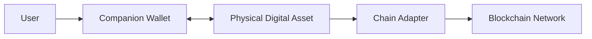
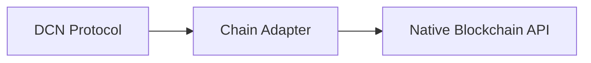
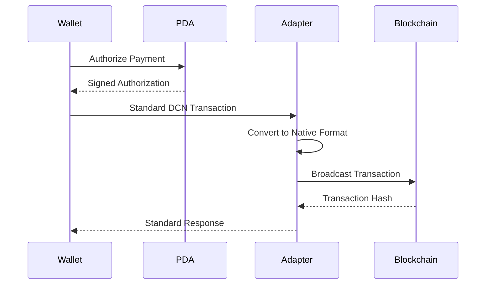
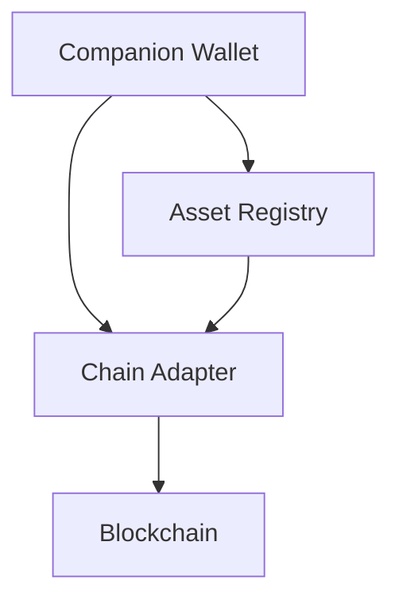

# Chain Adapters

> _Chain Adapters bridge the DCN Standard with individual blockchain networks. They translate standardized DCN operations into blockchain-specific transactions while allowing wallets and Physical Digital Assets to remain blockchain-neutral._

***

## Introduction

Every blockchain has its own architecture.

Some use **accounts**, others use **UTXOs**. Some support **smart contracts**, while others rely on native transaction scripts. Transaction formats, signature algorithms, fee models, and confirmation mechanisms vary significantly across networks.

Without abstraction, every wallet and every Physical Digital Asset would need to understand every blockchain individually.

The DCN Standard avoids this complexity through **Chain Adapters**.

A Chain Adapter is a software component that translates standardized DCN operations into the native language of a blockchain network.

This allows a user to interact with a Physical Digital Asset in exactly the same way regardless of whether the underlying asset exists on Ethereum, Bitcoin, Solana, a CBDC platform, or a future blockchain.

***

## Purpose

The Chain Adapter is responsible for:

* Connecting the DCN ecosystem to blockchain networks
* Translating standardized DCN operations into blockchain transactions
* Managing network-specific transaction formats
* Handling blockchain communication
* Estimating fees
* Broadcasting transactions
* Reading blockchain state
* Returning standardized responses to wallets

The adapter hides blockchain complexity from users and application developers.

***

## Architecture

The Companion Wallet communicates only with the DCN protocol.

The Chain Adapter communicates with the blockchain.

***

## Why Chain Adapters?

Different blockchain ecosystems have different technical requirements.

| Blockchain  | Example Differences           |
| ----------- | ----------------------------- |
| Bitcoin     | UTXO transactions             |
| Ethereum    | Account-based smart contracts |
| Solana      | Program accounts              |
| Cosmos      | Module-based architecture     |
| Hyperledger | Permissioned transactions     |

The Chain Adapter hides these differences behind a common interface.

***

## Standardized Operations

Regardless of blockchain, every Chain Adapter should support a common set of operations.

| DCN Operation         | Purpose                      |
| --------------------- | ---------------------------- |
| Query Balance         | Retrieve asset balance       |
| Send Transaction      | Submit a transfer            |
| Receive Asset         | Detect incoming assets       |
| Verify Ownership      | Confirm current owner        |
| Read Metadata         | Retrieve blockchain metadata |
| Estimate Fees         | Calculate transaction costs  |
| Broadcast Transaction | Submit signed transaction    |
| Monitor Status        | Check confirmation status    |

Applications interact with these standardized operations instead of blockchain-specific APIs.

***

## Translation Layer

The Chain Adapter acts as a translation layer.

For example:

* A **Pay** command becomes a Bitcoin transaction, an Ethereum transaction, or a Solana instruction depending on the selected network.

The wallet never needs to know the internal implementation.

***

## Transaction Flow

The adapter is responsible for blockchain-specific communication.

***

## Supported Adapter Types

The DCN ecosystem may include adapters for different blockchain families.

| Adapter            | Typical Networks                                     |
| ------------------ | ---------------------------------------------------- |
| Bitcoin Adapter    | Bitcoin-compatible networks                          |
| EVM Adapter        | Ethereum, Polygon, BNB Chain, Avalanche, Lycan Chain |
| Solana Adapter     | Solana ecosystem                                     |
| Cosmos Adapter     | Cosmos SDK chains                                    |
| Polkadot Adapter   | Polkadot ecosystem                                   |
| Enterprise Adapter | Hyperledger, Quorum                                  |
| CBDC Adapter       | Government-issued networks                           |

Each adapter implements the same logical DCN interface.

***

## Responsibilities

A Chain Adapter typically performs:

* Network connection
* Transaction formatting
* Address handling
* Signature verification
* Fee calculation
* Contract interaction
* Asset discovery
* Event monitoring
* Confirmation tracking
* Error handling

These responsibilities remain outside the Physical Digital Asset.

***

## Blockchain Independence

The Physical Digital Asset should not contain blockchain-specific logic.

Instead:

* The Physical Digital Asset authorizes operations.
* The Chain Adapter executes them on the selected blockchain.

This separation allows the same Physical Digital Asset to support future blockchain networks without hardware modification.

***

## Smart Contract Interaction

Where supported, Chain Adapters interact with smart contracts.

Examples include:

* Token transfers
* Asset issuance
* Ownership updates
* Metadata retrieval
* Registry interaction
* Publisher contracts

The Companion Wallet remains unaware of contract-specific implementation details.

***

## Native Asset Support

Some blockchain networks use native assets instead of smart contracts.

Examples include:

* Bitcoin
* Litecoin
* Monero (future support)
* Other UTXO-based networks

The corresponding Chain Adapter manages native transaction construction while presenting the same user experience.

***

## Fee Management

Each blockchain uses a different transaction fee model.

Examples include:

* Gas
* Mining fees
* Priority fees
* Resource credits
* Sponsored transactions

The Chain Adapter calculates and manages these differences.

Where supported, fees may be sponsored by the Publisher or enterprise rather than the end user.

***

## Confirmation Handling

Different blockchains reach finality differently.

The Chain Adapter standardizes confirmation states.

Example:

| Status    | Meaning                 |
| --------- | ----------------------- |
| Submitted | Transaction broadcast   |
| Pending   | Awaiting confirmation   |
| Confirmed | Accepted by the network |
| Finalized | Considered irreversible |
| Failed    | Transaction rejected    |

Wallets display these standardized states regardless of the blockchain.

***

## Error Handling

Blockchain errors should be translated into standardized DCN responses.

Examples include:

| Blockchain Error  | DCN Response         |
| ----------------- | -------------------- |
| Insufficient Gas  | Fee Required         |
| Invalid Nonce     | Transaction Conflict |
| Contract Reverted | Operation Rejected   |
| Network Offline   | Network Unavailable  |
| Timeout           | Retry Suggested      |

This creates a predictable developer experience.

***

## Performance

Chain Adapters should be optimized for:

* Low latency
* Reliable transaction submission
* Efficient fee estimation
* Network resilience
* High availability
* Parallel blockchain support

Performance optimizations should not compromise security or transaction integrity.

***

## Security

The Chain Adapter must never:

* Store protected device private keys
* Bypass Secure Element authorization
* Modify signed transaction payloads
* Override Publisher policies

Its responsibility is limited to blockchain communication and translation.

Transaction authorization always originates from the Physical Digital Asset.

***

## Future Blockchain Support

The Chain Adapter architecture enables new blockchain integrations without changing the DCN protocol.

To support a new blockchain, developers generally need to:

1. Implement a compliant Chain Adapter.
2. Register supported capabilities.
3. Validate interoperability.
4. Publish the adapter through the DCN ecosystem.

Existing wallets and Physical Digital Assets continue to operate unchanged.

***

## Developer Benefits

Developers build against one interface instead of many.

Benefits include:

* Reduced development effort
* Faster blockchain integration
* Consistent APIs
* Simplified maintenance
* Easier testing
* Future compatibility

This significantly lowers the barrier to supporting additional blockchain ecosystems.

***

## Relationship with Other Components

The Asset Registry identifies the correct blockchain.

The Chain Adapter communicates with that blockchain.

The Companion Wallet provides the user experience.

***

## Design Principles

Chain Adapters follow five core principles.

#### Standardized

Expose a common interface to the DCN ecosystem.

#### Blockchain Neutral

Support different blockchain architectures equally.

#### Secure

Never replace hardware-based authorization.

#### Extensible

Enable future blockchain integrations.

#### Interoperable

Provide consistent behavior across networks.

***

## Summary

Chain Adapters are the interoperability layer between the DCN Standard and blockchain networks.

They translate standardized DCN operations into blockchain-specific transactions, allowing wallets and Physical Digital Assets to remain independent of individual blockchain implementations.

By separating blockchain communication from asset security, the DCN Standard achieves one of its primary goals: creating an open, future-ready standard for **Physical Digital Assets** that can operate across public, private, enterprise, and government blockchain ecosystems.
