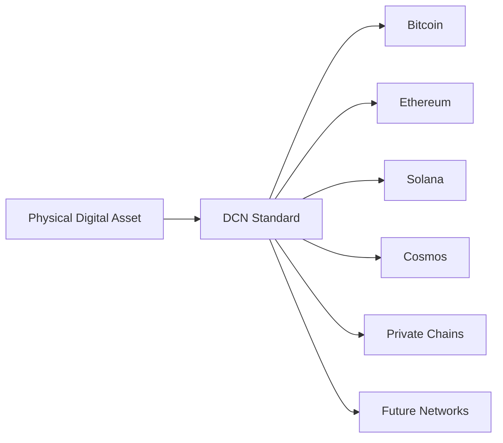

# Supported Networks

> _The DCN Standard is designed to operate across multiple blockchain ecosystems. Rather than being limited to a single network, Physical Digital Assets can securely represent and interact with digital assets issued on public, private, consortium, and future blockchain platforms._

***

## Introduction

One of the defining characteristics of the DCN Standard is its ability to support multiple blockchain networks through a unified architecture.

The goal is **not** to create another blockchain.

Instead, the goal is to create a universal physical asset standard that works consistently regardless of where the underlying digital asset exists.

To the user, tapping a Physical Digital Asset should feel the same whether it represents:

* Bitcoin
* Ethereum
* A stablecoin
* A CBDC
* A tokenized bond
* A loyalty point
* A digital identity
* A university certificate

The blockchain becomes the settlement layer, while the DCN Standard provides the physical interaction layer.

***

## Design Philosophy

The DCN Standard does not favor one blockchain over another.

Instead, every supported blockchain integrates through a common interface.

This architecture ensures long-term compatibility as blockchain technology evolves.

***

## Network Categories

Rather than listing individual blockchains only, the DCN Standard classifies supported networks into categories.

| Category                | Examples                                |
| ----------------------- | --------------------------------------- |
| Public Blockchains      | Bitcoin, Ethereum, Solana               |
| EVM-Compatible Networks | Ethereum, Polygon, BNB Chain, Avalanche |
| Enterprise Blockchains  | Hyperledger, Quorum                     |
| Consortium Networks     | Banking and government networks         |
| Permissioned Networks   | CBDC platforms                          |
| Layer-2 Networks        | Rollups and payment networks            |
| Future Networks         | Networks added after DCN v1.0           |

This approach allows the standard to evolve without requiring major specification changes.

***

## Public Blockchain Support

Public blockchains provide decentralized ownership and settlement.

Typical supported assets include:

* Cryptocurrencies
* Stablecoins
* NFTs
* Tokenized assets
* Digital collectibles

The DCN Standard interacts with these networks through standardized blockchain adapters.

***

## EVM-Compatible Networks

Many blockchain ecosystems implement the Ethereum Virtual Machine (EVM).

Supporting one EVM adapter enables compatibility with many networks.

Examples include:

* Ethereum
* Polygon
* BNB Chain
* Avalanche C-Chain
* Arbitrum
* Optimism
* Base
* Lycan Chain (DCN-compatible implementation)

This significantly reduces development complexity.

***

## Bitcoin Support

Bitcoin follows a fundamentally different transaction model from account-based blockchains.

DCN supports Bitcoin through a dedicated adapter capable of handling:

* UTXO management
* Transaction construction
* Signature generation
* Address formats
* Network-specific rules

Bitcoin users receive the same tap-based experience without needing to understand UTXO mechanics.

***

## Solana and High-Performance Networks

Networks such as Solana provide high transaction throughput and low latency.

A dedicated adapter handles:

* Account models
* Program interactions
* Transaction formats
* Network confirmation
* Fee calculation

The Companion Wallet presents a consistent interface regardless of these differences.

***

## Enterprise Networks

Organizations may deploy DCN assets on enterprise blockchain platforms.

Typical applications include:

* Supply-chain assets
* Corporate credentials
* Asset tracking
* Internal payment systems
* Enterprise loyalty programs

These deployments may not require public blockchain access.

***

## Permissioned Networks

Governments and regulated institutions often require permissioned blockchain environments.

Examples include:

* CBDCs
* Government identity
* National registries
* Regulated financial assets

The DCN Standard supports these deployments while preserving interoperability with the broader ecosystem.

***

## Multi-Network Assets

A single Publisher may issue assets across multiple blockchain networks.

For example:

| Asset            | Network              |
| ---------------- | -------------------- |
| Stablecoin       | Ethereum             |
| Loyalty Points   | Polygon              |
| CBDC             | Permissioned Network |
| Digital Identity | Government Network   |
| Collectible      | Solana               |

Despite using different settlement layers, all assets can be managed through the same Companion Wallet.

***

## Network Selection

When a user interacts with a Physical Digital Asset, the blockchain network is determined automatically.

Selection may depend on:

* Asset metadata
* Publisher configuration
* Asset Registry
* Supported wallet capabilities
* Network availability

Users should not need to manually configure blockchain parameters for ordinary transactions.

***

## Network Capabilities

Different blockchains provide different capabilities.

| Capability            | Depends on Network |
| --------------------- | ------------------ |
| Smart Contracts       | Yes                |
| Native Tokens         | Yes                |
| NFTs                  | Yes                |
| Account Abstraction   | Network-specific   |
| Gas Sponsorship       | Network-specific   |
| Offline Settlement    | Future research    |
| Cross-Chain Messaging | Adapter dependent  |

The DCN Standard exposes these capabilities through a common interface while allowing adapters to handle implementation details.

***

## Adding New Networks

One of the strengths of the DCN architecture is extensibility.

Supporting a new blockchain generally requires:

1. Developing a Chain Adapter.
2. Registering the supported network.
3. Defining supported capabilities.
4. Testing interoperability.
5. Publishing the adapter through the DCN ecosystem.

The core specification does not require modification.

***

## Network Independence

A Physical Digital Asset should not become obsolete because a blockchain evolves or is replaced.

Publishers may migrate future issuances to newer networks while maintaining the same user interaction model.

This protects long-term investments in physical infrastructure.

***

## Security Considerations

Every supported blockchain must provide an appropriate security model for the intended asset.

The DCN Standard does not guarantee the security of the underlying blockchain.

Instead, it assumes that:

* Consensus security
* Network integrity
* Transaction finality
* Smart contract security
* Validator trust

remain the responsibility of the selected blockchain network.

The DCN Standard focuses on secure physical interaction with those networks.

***

## Design Principles

Supported Networks follow five principles.

#### Blockchain Neutral

No preferred blockchain.

#### Interoperable

Common user experience across networks.

#### Extensible

Support future blockchain ecosystems.

#### Publisher Choice

Publishers choose their preferred settlement network.

#### User Simplicity

Users interact with Physical Digital Assets—not blockchain complexity.

***

## Summary

The DCN Standard enables Physical Digital Assets to operate across diverse blockchain ecosystems without changing how users interact with them.

By abstracting blockchain-specific behavior through standardized interfaces, the DCN ecosystem allows Publishers to choose the most appropriate settlement network while giving users a familiar tap-based experience.

This blockchain-neutral architecture positions DCN as an open standard for **Physical Digital Assets**, capable of supporting cryptocurrencies, stablecoins, CBDCs, identity credentials, tokenized securities, loyalty systems, and future digital asset classes across virtually any blockchain.
