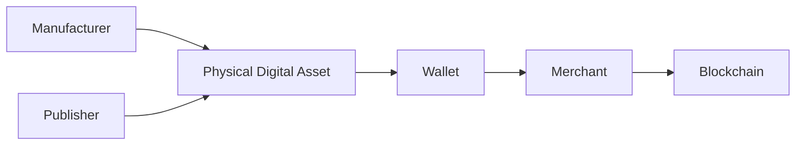
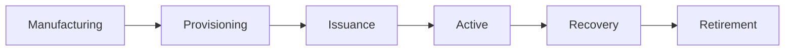

# 9. Security Architecture

### Introduction

> _Security is the foundation of the DCN Standard. Every Physical Digital Asset must protect its identity, ownership, authenticity, and transaction authority throughout its entire lifecycle. The Security Architecture combines secure hardware, cryptography, authentication, certificate infrastructure, and counterfeit protection into a unified trust framework._

***

## Introduction

A Physical Digital Asset represents real economic value or trusted digital rights in the physical world.

Unlike purely digital wallets, a Physical Digital Asset can be:

* Carried by people
* Stored physically
* Handed to another person
* Used at merchant terminals
* Lost or stolen
* Counterfeited
* Physically attacked

For this reason, the DCN Standard adopts a **layered security architecture** that protects both the physical device and the digital asset it represents.

Security is not provided by a single technology.

Instead, trust is established through multiple independent security layers working together.

***

## Purpose

The Security Architecture is designed to:

* Protect asset ownership
* Protect private cryptographic keys
* Prevent cloning and counterfeiting
* Authenticate devices and participants
* Verify trusted hardware
* Secure communications
* Prevent unauthorized transactions
* Support secure recovery
* Enable global interoperability
* Maintain long-term trust

***

## Security Philosophy

The DCN Standard follows five fundamental security principles.

#### Security by Design

Security is integrated into every component of the architecture from the beginning.

#### Defense in Depth

Multiple independent security layers protect every Physical Digital Asset.

#### Zero Trust

No participant, device, application, or network is trusted automatically.

Every interaction must be verified.

#### Least Privilege

Every participant receives only the permissions required to perform its role.

#### Open Standards

Security is based on open, reviewable standards rather than proprietary or hidden mechanisms.

***

## Security Layers

The DCN Security Architecture consists of several complementary layers.

Each layer reinforces the others.

Compromise of one layer should not automatically compromise the entire asset.

***

## Trust Model

Trust within the DCN ecosystem is established through cryptographic verification rather than assumptions.

Every participant verifies the identity and authority of the others before performing security-sensitive operations.

***

## Security Objectives

The DCN Standard provides protection for five primary security goals.

| Goal            | Description                      |
| --------------- | -------------------------------- |
| Confidentiality | Protect sensitive information    |
| Integrity       | Detect unauthorized modification |
| Authentication  | Verify identities                |
| Authorization   | Control permitted actions        |
| Availability    | Maintain reliable operation      |

These objectives apply across the entire lifecycle of every Physical Digital Asset.

***

## Security Domains

Security responsibilities are distributed across multiple domains.

| Domain                     | Responsibility                     |
| -------------------------- | ---------------------------------- |
| Secure Hardware            | Protect keys and trusted execution |
| Wallet                     | User interaction                   |
| Publisher                  | Asset issuance and lifecycle       |
| Blockchain                 | Settlement and consensus           |
| Certificate Infrastructure | Identity and trust                 |
| Verification Services      | Authenticity validation            |

Each domain contributes independently to the overall trust model.

***

## Lifecycle Security

Security applies throughout the complete lifecycle of a Physical Digital Asset.

Each lifecycle stage introduces different security requirements and controls.

***

## Threat Categories

The Security Architecture is designed to address multiple categories of threats.

Examples include:

* Device cloning
* Counterfeit assets
* Stolen devices
* Key extraction
* Relay attacks
* Replay attacks
* Malware
* Unauthorized recovery
* Supply-chain compromise
* Insider threats
* Network attacks
* Social engineering

The detailed threat model is described later in the Security section of the specification.

***

## Security Components

The Security Architecture is composed of four primary components.

| Component                  | Purpose                             |
| -------------------------- | ----------------------------------- |
| Cryptography               | Protect identities and transactions |
| Authentication             | Verify trusted participants         |
| Certificate Infrastructure | Establish global trust              |
| Counterfeit Protection     | Detect and prevent fake assets      |

These components work together to create a trusted ecosystem.

***

## Relationship to Following Sections

The Security Architecture is divided into four sections:

* **Cryptography** — Protecting identities, keys, and transactions.
* **Authentication** — Verifying users, devices, wallets, merchants, and services.
* **Certificate Infrastructure** — Establishing trust through digital certificates and certificate authorities.
* **Counterfeit Protection** — Preventing cloning, forgery, and unauthorized Physical Digital Assets.

Together, these components provide end-to-end protection for the DCN ecosystem.

***

## Summary

The Security Architecture provides the trust foundation of the DCN Standard.

By combining secure hardware, cryptographic protection, authentication, certificate infrastructure, and counterfeit protection, the DCN ecosystem enables Physical Digital Assets to securely represent digital value across multiple blockchain networks.

Rather than relying on a single security mechanism, DCN establishes trust through multiple independent layers, creating an open, interoperable, and resilient platform for Physical Digital Assets.

***

## In this chapter

* [Cryptography](cryptography.md)
* [Authentication](authentication.md)
* [Certificate Infrastructure](certificate-infrastructure.md)
* [Counterfeit Protection](counterfeit-protection.md)
