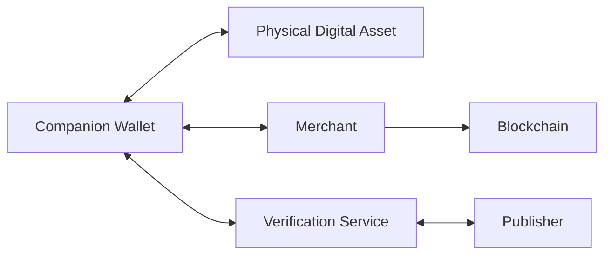
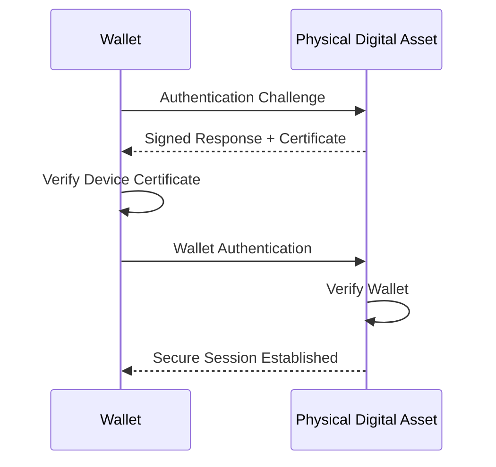

# Authentication

> _Authentication establishes trust between participants in the DCN ecosystem. Before any sensitive operation is performed, every device, wallet, merchant, publisher, and service must prove its identity through cryptographic verification._

***

## Introduction

Trust cannot be assumed.

A wallet cannot assume that a Physical Digital Asset is genuine.

A Physical Digital Asset cannot assume that a wallet is legitimate.

A merchant cannot assume that a payment request is authentic.

Likewise, a Publisher, verification service, or blockchain gateway should never trust an incoming request without verification.

For this reason, the DCN Standard adopts a **mutual authentication model**, where every participant proves its identity before security-sensitive operations are allowed.

Authentication is one of the most important protections against counterfeit devices, cloned hardware, malicious wallets, unauthorized merchants, and fraudulent transactions.

***

## Purpose

The Authentication architecture is designed to:

* Verify Physical Digital Assets
* Verify Companion Wallets
* Verify Merchants
* Verify Publishers
* Verify Verification Services
* Establish trusted communication sessions
* Prevent impersonation attacks
* Prevent replay attacks
* Protect high-value transactions

Authentication is required before authorization.

***

## Authentication Model

Authentication occurs between multiple participants.

Each participant independently verifies the identity of the others.

No participant is automatically trusted.

***

## Authentication Principles

The DCN Standard follows five authentication principles.

#### Mutual Trust

Both parties verify each other.

#### Cryptographic Proof

Authentication relies on digital signatures and certificates rather than passwords or serial numbers.

#### Challenge–Response

Authentication should prove possession of cryptographic keys without revealing them.

#### Session Based

Authentication establishes a secure session that is valid only for a limited time.

#### Least Disclosure

Only the information necessary for authentication should be exchanged.

***

## Authentication Participants

Authentication may involve several participants.

| Participant            | Authentication Purpose       |
| ---------------------- | ---------------------------- |
| Physical Digital Asset | Prove genuine hardware       |
| Companion Wallet       | Prove trusted wallet         |
| Merchant               | Prove authorized merchant    |
| Publisher              | Prove issuing authority      |
| Verification Service   | Prove trusted validation     |
| Recovery Authority     | Prove recovery authorization |

Each participant authenticates according to its assigned role.

***

## Mutual Authentication

Authentication is bidirectional.

Only after successful mutual authentication should sensitive commands be accepted.

***

## Challenge–Response Authentication

The DCN Standard recommends challenge–response authentication.

The verifier sends a random challenge.

The responding device signs or authenticates the challenge using its protected cryptographic key.

Because every challenge is unique, previously captured responses cannot be reused successfully.

Benefits include:

* No transmission of private keys
* Replay resistance
* Strong cryptographic proof
* Hardware-backed authentication

***

## Device Authentication

Every Physical Digital Asset should prove:

* Genuine Secure Element
* Valid Device Certificate
* Approved firmware
* Correct lifecycle state
* Valid security profile

This enables wallets and merchants to distinguish genuine assets from counterfeit devices.

***

## Wallet Authentication

Companion Wallets may also authenticate themselves.

Wallet authentication can provide:

* Trusted application identity
* Secure session establishment
* Policy enforcement
* Enterprise access control
* Publisher authorization

High-risk operations may require authenticated wallets.

***

## Merchant Authentication

Merchants accepting Physical Digital Assets may authenticate themselves before requesting payment.

Typical information includes:

* Merchant Certificate
* Merchant Identifier
* Terminal Identifier
* Supported Protocol Version
* Payment Capabilities

Merchant authentication reduces the risk of fraudulent payment terminals.

***

## Publisher Authentication

Publishers authenticate when performing privileged operations such as:

* Issuing assets
* Updating lifecycle state
* Personalization
* Revocation
* Recovery assistance

Publisher authentication should use organizational certificates issued through the DCN Certificate Infrastructure.

***

## Session Authentication

Authentication establishes a secure communication session.

Once established, all protected communication should occur within the authenticated session.

***

## Session Lifetime

Authentication should not remain valid indefinitely.

Sessions should expire when:

* The transaction completes
* Communication is interrupted
* A timeout occurs
* Security policies require re-authentication
* The Physical Digital Asset leaves the NFC field

New sessions should establish fresh cryptographic material.

***

## Authentication Levels

Different operations require different authentication strengths.

| Level          | Typical Operation        |
| -------------- | ------------------------ |
| Basic          | Read public metadata     |
| Standard       | Payment authorization    |
| Strong         | Ownership transfer       |
| High Assurance | Recovery                 |
| Critical       | Publisher administration |

Publishers determine which authentication level applies to their assets.

***

## Authentication Factors

Depending on the deployment, authentication may involve one or more factors.

Examples include:

* Physical Digital Asset
* Companion Wallet
* Device Certificate
* Biometric verification
* PIN or passcode
* Enterprise credentials
* Government identity

The DCN Standard does not mandate a specific authentication factor but allows Publishers to define appropriate policies.

***

## Replay Protection

Authentication messages should not be reusable.

Protection mechanisms include:

* Random nonces
* Session identifiers
* Timestamps
* Secure counters
* Limited session lifetime

These controls help prevent replay attacks.

***

## Failed Authentication

When authentication fails, the system should:

* Reject the request
* Terminate the session
* Record the event where appropriate
* Prevent unauthorized operations
* Allow controlled retry according to policy

Repeated failures may trigger additional security measures.

***

## Authentication Privacy

Authentication should reveal only the minimum information necessary.

For example:

* Device certificates should avoid exposing personal information.
* Wallet identifiers should support privacy-preserving operation.
* Merchants should authenticate without accessing unrelated user data.

Authentication must not become a tracking mechanism.

***

## Design Principles

The Authentication architecture follows five principles.

#### Mutual

Every participant verifies the other.

#### Cryptographic

Authentication is based on digital proof.

#### Secure

Private keys never leave trusted hardware.

#### Privacy Respecting

Only necessary information is disclosed.

#### Interoperable

Authentication works consistently across all supported blockchain networks and asset types.

***

## Summary

Authentication establishes trust between every participant in the DCN ecosystem.

Through mutual authentication, challenge–response protocols, secure sessions, and certificate-based identities, the DCN Standard ensures that wallets, Physical Digital Assets, merchants, Publishers, and services can verify one another before any protected operation is performed.

This authentication framework forms the foundation upon which secure payments, ownership, recovery, and verification are built.
