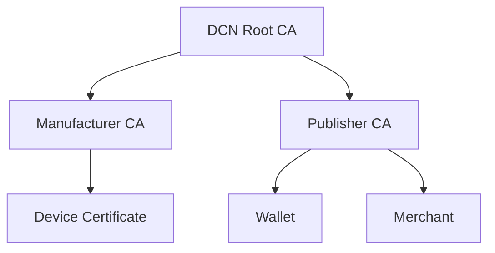
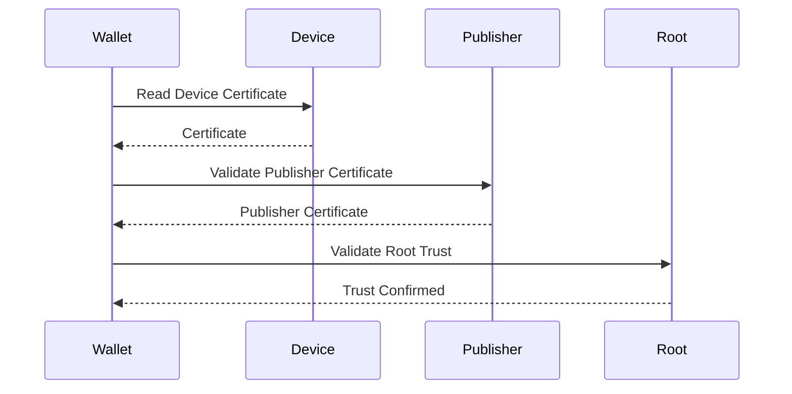
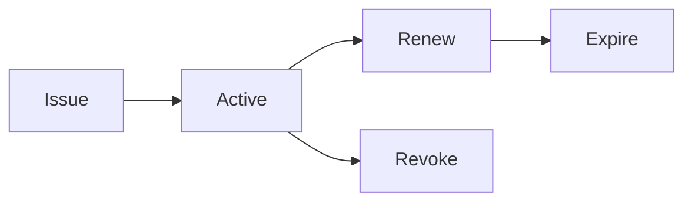
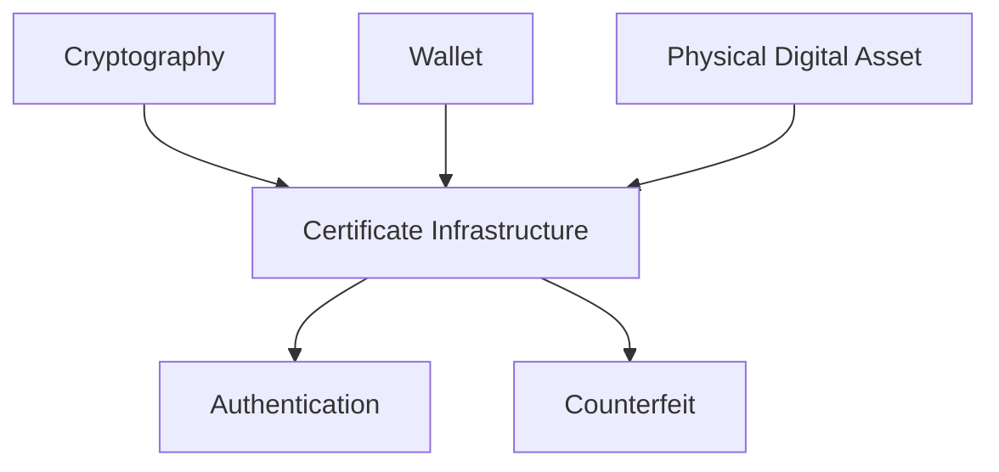

# Certificate Infrastructure

> _The Certificate Infrastructure establishes the chain of trust within the DCN ecosystem. It enables wallets, merchants, publishers, manufacturers, and verification services to cryptographically verify the authenticity of every Physical Digital Asset._

***

## Introduction

A Physical Digital Asset should never be trusted simply because it looks authentic.

Visual inspection alone cannot determine:

* Who manufactured the device
* Who issued the asset
* Whether the hardware is genuine
* Whether the asset has been revoked
* Whether the firmware is trusted
* Whether the Publisher is authorized

To solve this problem, the DCN Standard uses a **Public Key Infrastructure (PKI)** based Certificate Infrastructure.

Every trusted participant receives one or more digital certificates that prove its identity and authority.

When a wallet scans a Physical Digital Asset, it verifies these certificates before allowing protected operations.

Trust is therefore established through **cryptographic proof**, not appearance.

***

## Purpose

The Certificate Infrastructure is designed to:

* Establish trusted identities
* Authenticate hardware manufacturers
* Authenticate Publishers
* Authenticate Physical Digital Assets
* Authenticate merchants
* Authenticate verification services
* Prevent counterfeit devices
* Support certificate revocation
* Enable global interoperability

***

## Trust Hierarchy

The DCN ecosystem follows a hierarchical chain of trust.

Every certificate ultimately traces back to a trusted root authority.

***

## Certificate Authorities

The DCN Certificate Infrastructure consists of several certificate authorities.

| Certificate Authority | Responsibility                   |
| --------------------- | -------------------------------- |
| DCN Root CA           | Highest trust anchor             |
| Manufacturer CA       | Certifies hardware manufacturers |
| Publisher CA          | Certifies Publishers             |
| Enterprise CA         | Optional enterprise deployments  |
| Government CA         | Optional government deployments  |

Additional certificate authorities may be introduced for specialized deployments.

***

## Root Certificate Authority

The **DCN Root CA** is the highest level of trust within the ecosystem.

Its responsibilities include:

* Approving trusted certificate authorities
* Signing subordinate CA certificates
* Defining certificate policies
* Protecting ecosystem trust

The Root CA should be operated with the highest level of operational security.

Its private keys should remain offline and protected by Hardware Security Modules (HSMs).

***

## Manufacturer Certificates

Every approved hardware manufacturer receives a Manufacturer Certificate.

This certificate proves that:

* The manufacturer is trusted.
* The production process meets DCN requirements.
* Secure Elements originate from an approved source.

Manufacturer certificates are used during device provisioning and manufacturing verification.

***

## Publisher Certificates

Every organization issuing Physical Digital Assets should possess a Publisher Certificate.

The certificate identifies:

* Publisher identity
* Authorized asset categories
* Supported protocol version
* Certificate validity
* Public verification key

Publisher Certificates allow wallets and merchants to verify that an asset was issued by an authorized organization.

***

## Device Certificates

Every Physical Digital Asset should contain a unique Device Certificate.

Typical information includes:

* Device Identifier
* Manufacturer Identifier
* Public Key
* Supported Protocol Version
* Hardware Profile
* Certificate Expiration
* Digital Signature

The Device Certificate is permanently associated with the Secure Element.

Replacing the Secure Element requires a new certificate.

***

## Wallet Certificates

Wallet Certificates may be used for:

* Enterprise wallets
* Government wallets
* Merchant wallets
* High-assurance deployments

Consumer wallets may operate without individual certificates where permitted by Publisher policy.

***

## Merchant Certificates

Merchant Certificates identify authorized merchants and payment terminals.

Typical information includes:

* Merchant Identifier
* Organization Name
* Terminal Identifier
* Supported Capabilities
* Public Key
* Certificate Validity

Merchant authentication protects users against fraudulent payment terminals.

***

## Verification Certificates

Verification services also authenticate themselves using digital certificates.

These services may include:

* Authenticity verification
* Ownership verification
* Revocation checking
* Risk assessment
* Analytics

Wallets should verify the identity of verification services before trusting responses.

***

## Certificate Chain

Before trusting an asset, wallets validate the complete certificate chain.

If any certificate in the chain is invalid, the verification process fails.

***

## Certificate Validation

Wallets should validate:

* Digital signature
* Certificate chain
* Expiration date
* Revocation status
* Supported protocol version
* Usage restrictions

Only valid certificates should establish trusted relationships.

***

## Certificate Revocation

Certificates occasionally become invalid.

Reasons include:

* Hardware compromise
* Stolen production keys
* Publisher suspension
* Device destruction
* Certificate expiration
* Security incident

Revoked certificates should no longer be trusted.

***

## Certificate Lifecycle

Every certificate follows a lifecycle.

Lifecycle events should be recorded and auditable.

***

## Certificate Storage

Certificates are public information but should remain protected against unauthorized modification.

Typical storage locations include:

* Secure Element
* Publisher systems
* Asset Registry
* Verification Services

Private keys associated with certificates must remain inside trusted hardware.

***

## Certificate Profiles

Different participants require different certificate profiles.

| Certificate              | Typical Holder            |
| ------------------------ | ------------------------- |
| Root Certificate         | DCN Foundation            |
| Manufacturer Certificate | Hardware Manufacturer     |
| Publisher Certificate    | Issuing Organization      |
| Device Certificate       | Physical Digital Asset    |
| Merchant Certificate     | Merchant Terminal         |
| Enterprise Certificate   | Enterprise Infrastructure |
| Government Certificate   | Government Authority      |

Each profile defines permitted usage.

***

## Cross-Certification

Large organizations or governments may maintain independent certificate infrastructures.

The DCN Standard supports cross-certification where trusted certificate authorities recognize one another according to agreed governance policies.

This enables interoperability while respecting organizational independence.

***

## Security Considerations

Certificate Infrastructure protects against:

* Counterfeit devices
* Unauthorized Publishers
* Fake merchants
* Impersonation
* Device substitution
* Rogue verification services

It does not replace Secure Hardware or Authentication.

Instead, it strengthens the overall trust architecture.

***

## Design Principles

The Certificate Infrastructure follows five principles.

#### Hierarchical

Trust flows through a defined certificate chain.

#### Cryptographic

Certificates rely on digital signatures.

#### Open

Based on internationally recognized PKI concepts.

#### Interoperable

Supports global deployments.

#### Scalable

Accommodates consumer, enterprise, and government ecosystems.

***

## Relationship to Other Components

Certificates provide identity.

Authentication verifies identity.

Cryptography protects identity.

Counterfeit Protection relies on trusted identity.

***

## Summary

The Certificate Infrastructure establishes the cryptographic trust framework of the DCN ecosystem.

Through a hierarchical Public Key Infrastructure, every trusted participant—including manufacturers, Publishers, Physical Digital Assets, merchants, wallets, and verification services—can prove its identity using digitally signed certificates.

This enables wallets and merchants to verify authenticity before any protected operation is performed, providing a scalable and interoperable trust model suitable for global deployment.&#x20;
