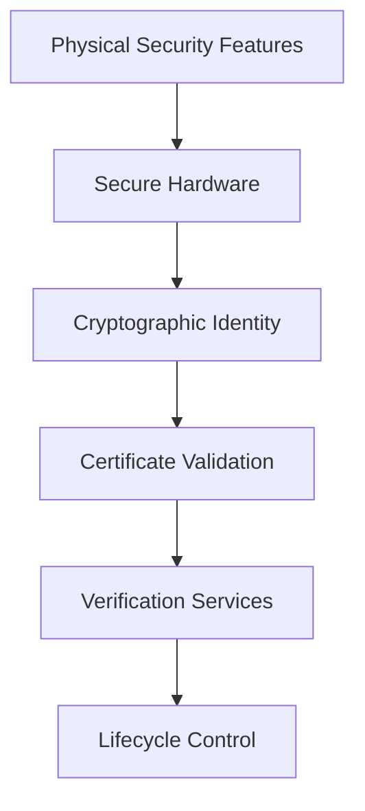
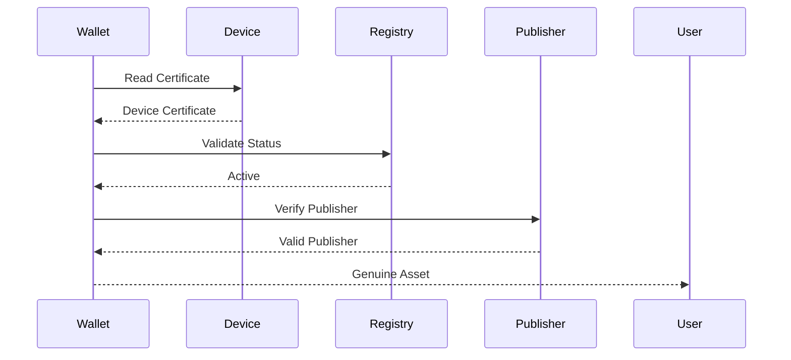
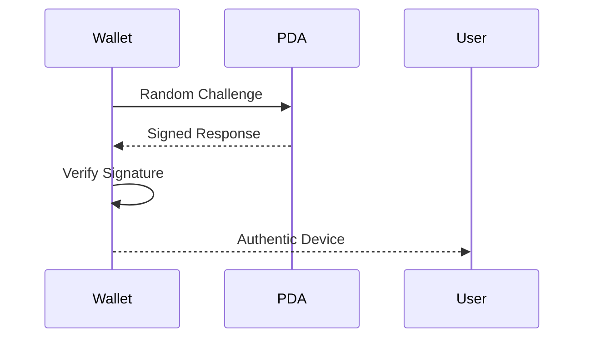
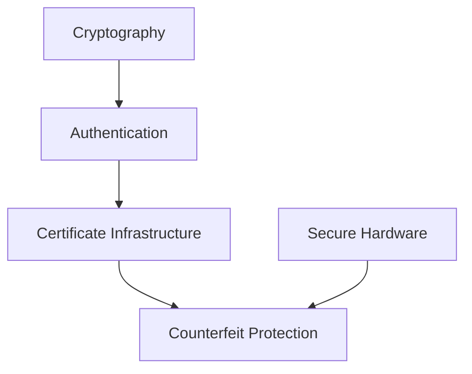

# Counterfeit Protection

> _Counterfeit Protection ensures that every Physical Digital Asset can be distinguished from unauthorized copies. The DCN Standard combines secure hardware, cryptographic identity, certificate verification, and lifecycle management to make counterfeiting economically impractical and technically detectable._

***

## Introduction

Physical money, payment cards, tickets, certificates, and identity documents have always faced the challenge of counterfeiting.

As Digital Assets move into the physical world, the same challenge exists for Physical Digital Assets.

An attacker may attempt to:

* Clone an NFC chip
* Copy printed artwork
* Duplicate a device identifier
* Replace genuine hardware
* Modify firmware
* Reproduce a collectible
* Create fake event tickets
* Issue unauthorized gift cards
* Manufacture counterfeit CBDC devices

The DCN Standard is designed to ensure that a copied appearance does **not** create a valid Physical Digital Asset.

Authenticity is established through **cryptographic identity**, **trusted hardware**, and **certificate verification**, not through visual appearance alone.

***

## Purpose

Counterfeit Protection is designed to:

* Prevent hardware cloning
* Detect counterfeit assets
* Verify genuine manufacturers
* Verify authorized Publishers
* Protect users and merchants
* Preserve trust in issued assets
* Reduce fraud
* Support forensic investigation
* Enable immediate revocation when required

***

## Counterfeit Threat Model

Counterfeit attempts generally fall into four categories.

| Threat              | Example                             |
| ------------------- | ----------------------------------- |
| Visual Counterfeit  | Copying artwork or printing         |
| Hardware Clone      | Replacing or duplicating hardware   |
| Identity Clone      | Copying identifiers or certificates |
| Digital Counterfeit | Issuing unauthorized assets         |

The DCN Security Architecture addresses all four categories simultaneously.

***

## Multi-Layer Protection

Counterfeit protection relies on multiple independent security layers.

An attacker would need to defeat **every layer** to create a convincing counterfeit.

***

## Physical Security

The printed or manufactured asset may include visible security features.

Examples include:

* Holograms
* Microtext
* UV ink
* Guilloché patterns
* Laser engraving
* Security fibers
* Tamper-evident seals
* Serialized printing

These features help users perform basic visual inspection.

However, they do **not** establish authenticity.

***

## Secure Hardware

Every genuine Physical Digital Asset contains trusted hardware.

Examples include:

* Secure Element
* Hardware Root of Trust
* Protected memory
* Cryptographic engine
* Hardware random number generator
* Secure boot

The Secure Element contains cryptographic identities that cannot simply be copied onto another device.

***

## Device Identity

Each Physical Digital Asset possesses a unique Device Identity.

Characteristics include:

* Globally unique
* Cryptographically verifiable
* Bound to trusted hardware
* Protected by certificates
* Resistant to duplication

Two genuine devices should never share the same identity.

***

## Certificate Verification

Every genuine device presents a valid certificate chain.

Counterfeit devices typically fail certificate validation because they cannot produce trusted certificates signed by authorized certificate authorities.

***

## Challenge–Response Verification

Static identifiers are easy to copy.

The DCN Standard therefore relies on **challenge–response authentication**.

Since every challenge is unique, previously captured responses cannot be reused successfully.

***

## Asset Registry Verification

The Asset Registry provides an additional layer of counterfeit detection.

Wallets may verify:

* Asset Identifier
* Publisher
* Asset Profile
* Lifecycle Status
* Supported Networks
* Certification Status

If registry information does not match the physical asset, the asset should be treated as suspicious.

***

## Lifecycle Verification

Counterfeit protection extends throughout the asset lifecycle.

Valid lifecycle states include:

* Manufactured
* Provisioned
* Issued
* Active
* Suspended
* Revoked
* Destroyed

Assets outside their expected lifecycle should not be accepted for protected operations.

***

## Duplicate Detection

Verification services may detect cloned devices by identifying duplicate identities.

Examples include:

* Same Device ID observed simultaneously in different locations
* Repeated use of revoked certificates
* Multiple hardware profiles sharing one identity
* Conflicting lifecycle records

Such anomalies should trigger investigation and possible revocation.

***

## Revocation

If an asset is compromised or determined to be counterfeit, its certificates and identifiers may be revoked.

Wallets should refuse protected operations involving revoked assets.

Revocation protects the broader ecosystem from continued misuse.

***

## Publisher Verification

Counterfeit assets may imitate well-known Publishers.

Before trusting an asset, wallets should verify:

* Publisher Certificate
* Publisher Identifier
* Authorized Asset Types
* Certification Status

Unauthorized Publishers should not be able to issue trusted Physical Digital Assets.

***

## Merchant Verification

Merchants also contribute to counterfeit detection.

Before accepting a payment, a merchant terminal may verify:

* Device authenticity
* Lifecycle status
* Revocation status
* Supported protocol version
* Security profile

This protects both merchants and users.

***

## Manufacturing Controls

Counterfeit prevention begins during manufacturing.

Recommended controls include:

* Certified production facilities
* Secure key injection
* Secure Element provisioning
* Controlled inventory
* Serialized components
* Production auditing
* Secure logistics

Unauthorized manufacturing should be prevented through strict operational controls.

***

## Supply Chain Protection

The supply chain should protect against:

* Hardware substitution
* Counterfeit Secure Elements
* Unauthorized assembly
* Device interception
* Certificate theft
* Firmware modification

Each stage should maintain traceability from production to issuance.

***

## User Verification

Users should be able to verify assets with a simple tap.

The Companion Wallet may display results such as:

| Status                | Meaning                     |
| --------------------- | --------------------------- |
| Verified              | Genuine asset               |
| Verification Required | Network unavailable         |
| Suspended             | Temporarily restricted      |
| Revoked               | Asset no longer trusted     |
| Unknown               | Identity cannot be verified |

Complex security details should remain hidden from ordinary users.

***

## Asset-Type Considerations

Different asset categories require different counterfeit protections.

| Asset Type           | Protection Level |
| -------------------- | ---------------- |
| Event Ticket         | Standard         |
| Gift Card            | Standard         |
| Loyalty Card         | Standard         |
| Identity Credential  | High             |
| CBDC                 | Critical         |
| Government Benefit   | High             |
| Tokenized Bond       | Critical         |
| Corporate Credential | High             |
| Collectible          | Standard or High |
| DCN-S / DCN-R        | High             |

Protection should be proportional to the value and risk associated with the asset.

***

## Future Enhancements

Future versions of the DCN Standard may introduce additional protections, including:

* AI-assisted counterfeit detection
* Decentralized reputation systems
* Hardware attestation enhancements
* Continuous risk scoring
* Secure hardware fingerprinting
* Advanced forensic verification

The architecture is designed to evolve alongside emerging threats.

***

## Design Principles

Counterfeit Protection follows five principles.

#### Hardware Based

Trust begins with genuine hardware.

#### Cryptographic

Authenticity is proven mathematically.

#### Layered

Multiple independent protections operate together.

#### Verifiable

Authenticity can be independently confirmed.

#### Scalable

Protection applies consistently across all Physical Digital Asset types.

***

## Relationship to the Security Architecture

Counterfeit Protection is the result of the complete Security Architecture—not a single technology.

Secure Hardware protects identities.

Cryptography secures them.

Authentication proves them.

Certificates establish trust.

Together, they make counterfeit Physical Digital Assets detectable.

***

## Summary

Counterfeit Protection ensures that Physical Digital Assets cannot be trusted based on appearance alone.

By combining secure hardware, cryptographic identities, certificate infrastructure, challenge–response authentication, registry verification, lifecycle management, and secure manufacturing, the DCN Standard creates a comprehensive defense against cloning, forgery, and unauthorized asset issuance.

This layered approach protects users, merchants, Publishers, governments, and enterprises while preserving confidence in the global DCN ecosystem.
