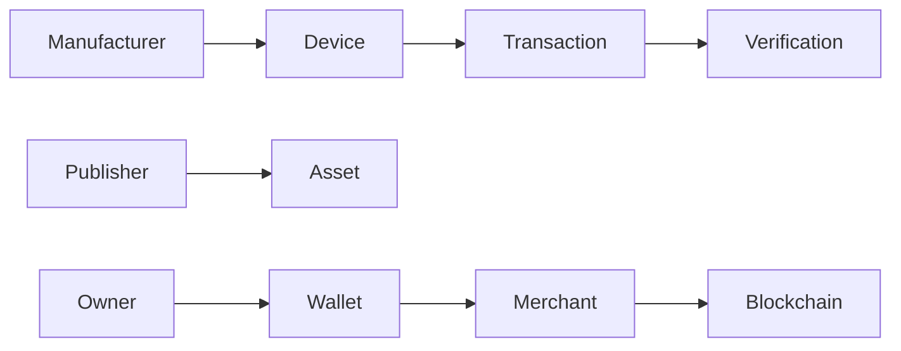
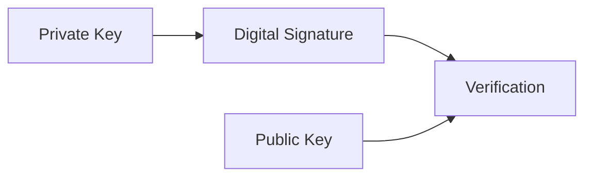
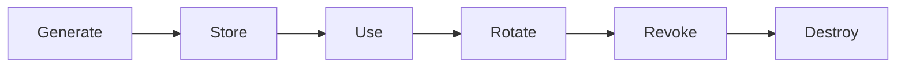

# Cryptography

> _Cryptography is the mathematical foundation of trust in the DCN ecosystem. It enables Physical Digital Assets to securely establish identity, prove authenticity, authorize transactions, protect communications, and maintain ownership without revealing secret information._

***

## Introduction

Every trust decision in the DCN ecosystem is ultimately based on cryptography.

When a wallet verifies a Physical Digital Asset, when a merchant accepts a payment, when a Publisher issues a new asset, or when a blockchain validates a transaction, cryptographic algorithms provide the proof that these operations are genuine.

Unlike passwords or visual security features, cryptography provides mathematically verifiable security that does not depend on trust in individuals or organizations.

The DCN Standard does not invent new cryptographic algorithms. Instead, it adopts internationally recognized and well-reviewed cryptographic standards to ensure interoperability, long-term security, and future compatibility.

***

## Purpose

The Cryptographic Architecture enables the DCN ecosystem to:

* Establish trusted identities
* Protect private keys
* Create digital signatures
* Verify authenticity
* Secure communication
* Prevent replay attacks
* Support secure key exchange
* Protect asset ownership
* Enable blockchain transactions
* Support future cryptographic upgrades

***

## Role of Cryptography

Within the DCN ecosystem, cryptography protects every major trust relationship.

Each interaction relies on cryptographic proof rather than visual inspection or implicit trust.

***

## Core Cryptographic Services

The DCN Standard relies on several cryptographic services.

| Service            | Purpose                              |
| ------------------ | ------------------------------------ |
| Identity           | Uniquely identify devices and assets |
| Authentication     | Verify trusted participants          |
| Digital Signatures | Authorize transactions               |
| Encryption         | Protect confidential data            |
| Hashing            | Verify data integrity                |
| Secure Randomness  | Generate unpredictable values        |
| Key Agreement      | Establish secure communication       |

Together, these services form the cryptographic foundation of the DCN ecosystem.

***

## Public Key Cryptography

The DCN Standard primarily relies on **public key cryptography**.

Each trusted participant possesses a cryptographic key pair:

* **Private Key** — Secret, never shared
* **Public Key** — Publicly distributable

The private key is used to authorize operations.

The public key is used by others to verify those operations.

The private key must remain protected inside the Secure Element.

***

## Key Types

Different cryptographic keys serve different purposes.

| Key Type        | Purpose                         |
| --------------- | ------------------------------- |
| Device Key      | Hardware identity               |
| Asset Key       | Physical Digital Asset identity |
| Transaction Key | Payment authorization           |
| Session Key     | Secure communication            |
| Recovery Key    | Recovery operations             |
| Publisher Key   | Asset issuance                  |
| Certificate Key | Digital certificates            |

Each key has a specific security role.

***

## Digital Signatures

Digital signatures provide proof that an operation was authorized by the correct cryptographic identity.

They are used for:

* Payments
* Ownership transfer
* Asset issuance
* Certificate signing
* Firmware approval
* Metadata integrity

A digital signature provides:

* Authenticity
* Integrity
* Non-repudiation
* Tamper detection

The private signing key never leaves the Secure Element.

***

## Cryptographic Hash Functions

Hash functions create a fixed-length fingerprint of data.

Typical uses include:

* Certificate verification
* Firmware validation
* Metadata integrity
* Transaction identification
* Asset fingerprinting

A secure hash function should be:

* Deterministic
* Collision resistant
* One-way
* Efficient to compute

Any modification to the protected data produces a completely different hash value.

***

## Encryption

Encryption protects confidential information from unauthorized disclosure.

Typical encrypted data includes:

* Secure session messages
* Recovery information
* Sensitive metadata
* Administrative commands
* Internal provisioning data

The DCN Standard distinguishes between:

* **Data at Rest** — Stored securely inside trusted hardware.
* **Data in Transit** — Protected during communication.

***

## Secure Randomness

High-quality randomness is essential for cryptographic security.

Random values are used for:

* Private key generation
* Nonces
* Session keys
* Authentication challenges
* Transaction identifiers

The Secure Element should provide a certified hardware random number generator to ensure unpredictability.

Weak randomness can compromise the security of the entire ecosystem.

***

## Key Agreement

Before sensitive information is exchanged, communicating parties establish a secure session.

Key agreement enables:

* Mutual authentication
* Session encryption
* Confidential communication
* Replay protection

Each secure session should derive fresh session keys.

Long-term keys should not be reused directly for communication.

***

## Key Lifecycle

Every cryptographic key follows a lifecycle.

Each stage should be protected by security controls.

Keys should be rotated or revoked when required by policy or security events.

***

## Key Protection

The DCN Standard requires strong protection for private keys.

Private keys should:

* Be generated inside secure hardware
* Never be exported in plaintext
* Be protected against extraction
* Be isolated from application software
* Be erased during secure destruction

Applications interact with cryptographic services rather than directly accessing private keys.

***

## Cryptographic Agility

Cryptographic algorithms evolve over time.

The DCN Standard therefore supports **cryptographic agility**.

This means:

* Algorithms can be upgraded.
* Deprecated algorithms can be removed.
* New standards can be adopted.
* Existing assets remain interoperable where possible.

This approach protects the long-term viability of the DCN ecosystem.

***

## Standards

The DCN Standard should rely on internationally recognized cryptographic standards whenever possible.

Examples include:

* NIST recommendations
* ISO cryptographic standards
* IETF standards
* W3C recommendations
* Blockchain-specific signature standards

The exact algorithms and parameter sets should be defined in the DCN Cryptographic Profile.

***

## Security Considerations

Cryptography alone does not provide complete security.

Effective protection also depends on:

* Secure hardware
* Trusted manufacturing
* Certificate infrastructure
* Authentication
* User permissions
* Secure software
* Proper lifecycle management

Weak implementation can undermine even the strongest cryptographic algorithms.

***

## Design Principles

The Cryptographic Architecture follows five principles.

#### Open

Based on internationally recognized standards.

#### Secure

Protects identities and transactions.

#### Hardware Protected

Private keys remain inside trusted hardware.

#### Interoperable

Works across multiple blockchain ecosystems.

#### Future Ready

Supports algorithm upgrades through cryptographic agility.

***

## Summary

Cryptography provides the mathematical trust foundation of the DCN ecosystem.

It enables trusted identities, digital signatures, secure communication, key management, and transaction authorization while ensuring that private keys remain protected within secure hardware.

By adopting open cryptographic standards and supporting future algorithm evolution, the DCN Standard provides a secure and interoperable foundation for Physical Digital Assets across public, private, enterprise, and government blockchain networks.
