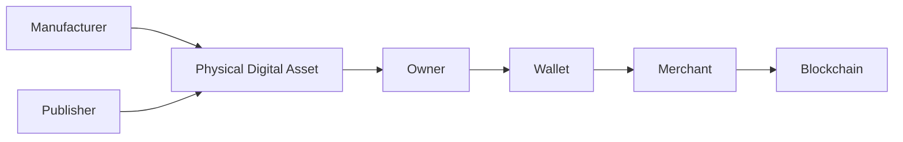
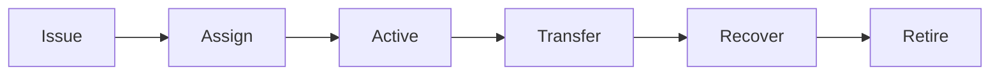

# 10. Ownership & Trust

### Introduction

> _Ownership and Trust define who has legitimate authority over a Physical Digital Asset and how that authority is established, transferred, verified, and recovered. The DCN Standard separates physical possession from digital ownership, creating a secure trust model for Physical Digital Assets._

***

## Introduction

Trust is the cornerstone of every financial and identity system.

When a person accepts cash, a payment card, an identity document, or a government credential, they trust that:

* The item is genuine.
* The issuer is legitimate.
* The holder is authorized.
* The value or rights are valid.

The same principle applies to Physical Digital Assets.

Unlike traditional physical objects, however, a Physical Digital Asset combines **physical possession** with **digital ownership**.

These two concepts are related but not always identical.

For example:

* A user may physically hold a Digital Crypto Note but not yet be its registered owner.
* A government-issued identity card may remain government property while being assigned to a citizen.
* A corporate payment asset may belong to a company while being used by an employee.

The DCN Standard therefore defines a flexible trust framework that supports different ownership models while maintaining cryptographic security and interoperability.

***

## Purpose

The Ownership & Trust Architecture enables the DCN ecosystem to:

* Establish trusted identities
* Verify asset ownership
* Authenticate Publishers
* Transfer ownership securely
* Support secure recovery
* Prevent unauthorized ownership changes
* Maintain an auditable trust chain
* Support consumer, enterprise, and government deployments

***

## Ownership Principles

Every Physical Digital Asset should follow these principles.

#### Verifiable

Ownership must be cryptographically verifiable.

#### Transferable

Where permitted, ownership can be securely transferred.

#### Recoverable

Ownership may be restored according to the Publisher's recovery policy.

#### Auditable

Ownership changes should be traceable.

#### Policy Driven

Different asset types may implement different ownership rules.

***

## Ownership vs Possession

One of the most important concepts in the DCN Standard is the distinction between **physical possession** and **digital ownership**.

| Physical Possession                    | Digital Ownership                       |
| -------------------------------------- | --------------------------------------- |
| Holds the asset                        | Controls the digital rights             |
| Can be temporary                       | Cryptographically verified              |
| May change without registration        | Recorded according to policy            |
| Does not automatically grant authority | Determines who may authorize operations |

This separation enables secure lending, delegation, enterprise deployments, and identity credentials.

***

## Trust Relationships

Trust is established through several interconnected participants.

Each participant contributes to the overall trust model.

***

## Ownership Lifecycle

Ownership evolves throughout the asset lifecycle.

Each transition requires appropriate authentication and authorization.

***

## Security Goals

The Ownership & Trust Architecture aims to:

* Ensure only authorized owners control assets.
* Prevent unauthorized ownership changes.
* Enable trusted transfers.
* Support regulated ownership models.
* Preserve long-term trust in the ecosystem.

***

## Relationship to Following Sections

This chapter is divided into four sections:

* **Identity** — Establishing trusted digital identities.
* **Publisher Certificates** — Trusting the organization that issued the asset.
* **Ownership Transfer** — Securely changing ownership.
* **Recovery** — Restoring ownership when access is lost.

Together, these components complete the trust model of the DCN ecosystem.

***

## Summary

Ownership within the DCN ecosystem is established through cryptographic trust rather than physical possession alone.

By separating identity, authority, possession, and recovery, the DCN Standard enables Physical Digital Assets to support a wide variety of use cases—from digital cash and CBDCs to identity credentials and enterprise assets—while maintaining security, interoperability, and user confidence.

***

## In this chapter

* [Identity](identity.md)
* [Publisher Certificates](publisher-certificates.md)
* [Ownership Transfer](ownership-transfer.md)
* [Recovery](recovery.md)
