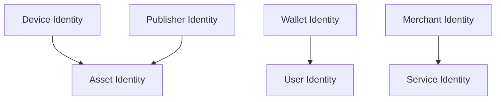

# Identity

> _Identity is the foundation of trust within the DCN ecosystem. Every participant—including Physical Digital Assets, publishers, wallets, merchants, users, and services—possesses a unique identity that can be cryptographically verified without relying on implicit trust._

***

## Introduction

Before ownership can be established, identity must first be verified.

The DCN Standard treats identity as a **cryptographic proof**, not simply a name, serial number, or account identifier.

Every trusted participant within the ecosystem has an identity that can be independently verified.

This allows wallets, merchants, publishers, and verification services to establish trusted relationships before any payment, ownership transfer, or recovery operation takes place.

Identity is therefore the first building block of trust.

***

## Purpose

The Identity Model is designed to:

* Establish unique identities
* Enable trusted verification
* Support multiple participant types
* Prevent impersonation
* Protect privacy
* Enable interoperability
* Support decentralized and regulated deployments
* Provide the basis for ownership

***

## Identity Principles

Every identity within the DCN ecosystem should follow these principles.

#### Unique

Each participant must have a globally unique identity.

#### Verifiable

Identity should be proven through cryptographic verification.

#### Persistent

Identity should remain stable throughout the participant's lifecycle unless intentionally replaced.

#### Privacy Respecting

Identity should disclose only the information necessary for the requested operation.

#### Interoperable

Identity should be recognized consistently across the DCN ecosystem.

***

## Identity Types

The DCN Standard recognizes multiple identity types.

| Identity           | Purpose                                             |
| ------------------ | --------------------------------------------------- |
| Device Identity    | Identifies the Physical Digital Asset hardware      |
| Asset Identity     | Identifies the logical Physical Digital Asset       |
| Publisher Identity | Identifies the issuing organization                 |
| Wallet Identity    | Identifies trusted wallet software                  |
| Merchant Identity  | Identifies merchant terminals and businesses        |
| User Identity      | Represents the owner or holder where applicable     |
| Service Identity   | Identifies verification and infrastructure services |

Each identity serves a different role within the trust architecture.

***

## Identity Architecture



These identities interact through authenticated and cryptographically verified relationships.

***

## Device Identity

Every Physical Digital Asset contains a permanent Device Identity.

Characteristics include:

* Globally unique
* Generated during provisioning
* Bound to the Secure Element
* Protected by hardware
* Verifiable through certificates

The Device Identity proves that the hardware itself is genuine.

***

## Asset Identity

The Asset Identity represents the digital asset associated with the physical device.

Unlike the Device Identity, the Asset Identity may evolve during the asset lifecycle.

It identifies:

* The asset profile
* Publisher
* Blockchain association
* Asset metadata
* Lifecycle status

The Asset Identity enables wallets to understand what the Physical Digital Asset represents.

***

## Publisher Identity

Every Publisher participating in the DCN ecosystem possesses a unique Publisher Identity.

This identity allows wallets and verification services to determine:

* Who issued the asset
* Which asset categories are authorized
* Which protocol versions are supported
* Whether the Publisher remains trusted

Publisher Identity is validated through the Certificate Infrastructure.

***

## Wallet Identity

Companion Wallets may also possess identities.

Wallet Identity enables:

* Enterprise deployments
* Trusted wallet ecosystems
* Secure communication
* Policy enforcement
* Device management

Consumer wallets may use simplified identity models depending on Publisher policy.

***

## Merchant Identity

Merchant Identity enables trusted commercial interactions.

Typical information includes:

* Merchant Identifier
* Organization
* Terminal Identifier
* Supported capabilities
* Certificate status

Merchant Identity helps prevent fraudulent payment terminals.

***

## User Identity

Not every Physical Digital Asset requires a registered user identity.

The identity model depends on the asset profile.

Examples:

| Asset Type          | User Identity     |
| ------------------- | ----------------- |
| Digital Cash        | Optional          |
| Gift Card           | Usually anonymous |
| Loyalty Card        | Registered user   |
| Employee Credential | Required          |
| CBDC                | Policy dependent  |
| Government ID       | Mandatory         |

This flexibility allows DCN to support both privacy-preserving and regulated environments.

***

## Service Identity

Infrastructure services also require trusted identities.

Examples include:

* Verification services
* Recovery services
* Asset Registry
* Analytics platforms
* Blockchain gateways

Service identities prevent unauthorized infrastructure components from participating in the ecosystem.

***

## Identity Verification

Identity is verified using cryptographic methods.

```mermaid
sequenceDiagram

participant Wallet

participant Participant

participant Certificate

Wallet->>Participant: Identity Challenge

Participant-->>Wallet: Signed Response

Wallet->>Certificate: Validate Certificate

Certificate-->>Wallet: Identity Verified
```

Verification confirms both identity and trust.

***

## Identity and Ownership

Identity does not automatically imply ownership.

For example:

* A device has its own identity.
* An asset has its own identity.
* The owner has a separate identity.
* The Publisher has another identity.

Ownership is established through the relationships between these identities rather than through a single identifier.

***

## Privacy

Identity should be disclosed according to the principle of minimum disclosure.

Examples include:

* Anonymous gift cards reveal no user identity.
* Identity credentials reveal only required attributes.
* Merchants learn only what is necessary to complete a payment.
* Verification services avoid unnecessary collection of personal information.

Privacy remains a core principle of the DCN Standard.

***

## Lifecycle

Identities follow defined lifecycles.


Lifecycle management ensures that obsolete or compromised identities are no longer trusted.

***

## Security Considerations

Identity management should protect against:

* Identity cloning
* Certificate forgery
* Device substitution
* Unauthorized reassignment
* Impersonation attacks
* Identity replay
* Unauthorized disclosure

Strong cryptographic protection and certificate validation are essential.

***

## Design Principles

The Identity model follows five principles.

#### Unique

Every participant has a distinct identity.

#### Trusted

Identity is established through cryptographic proof.

#### Privacy Respecting

Only necessary information is disclosed.

#### Interoperable

Identity works across all supported ecosystems.

#### Future Ready

The model supports new participant types and future identity technologies.

***

## Summary

Identity forms the foundation of trust within the DCN ecosystem.

By assigning unique, cryptographically verifiable identities to devices, assets, Publishers, wallets, merchants, users, and infrastructure services, the DCN Standard creates a secure framework for ownership, authentication, payments, and recovery.

This identity architecture enables trusted interactions across consumer, enterprise, government, and multi-chain environments while preserving privacy and interoperability.
