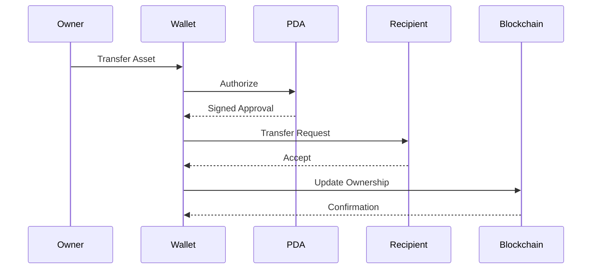

# Ownership Transfer

> _Ownership Transfer defines how control of a Physical Digital Asset moves from one owner to another. The DCN Standard provides a secure, verifiable, and policy-driven transfer model that supports digital cash, stablecoins, CBDCs, collectibles, identity credentials, tickets, and other Physical Digital Assets._

***

## Introduction

One of the unique capabilities of the DCN Standard is that a Physical Digital Asset can be **handed to another person**, much like physical cash or a payment card.

However, unlike traditional physical objects, handing over the asset does not always mean ownership has changed.

The transfer process depends on the **asset profile**, **Publisher policy**, and **business use case**.

For example:

* A **Digital Cash Note (DCN-S)** may transfer ownership instantly during payment.
* A **Reloadable Payment Asset (DCN-R)** may require the new owner's wallet to register the asset.
* A **Government Identity Card** may never allow ownership transfer.
* An **Event Ticket** may allow transfer only before the event begins.
* A **Corporate Access Credential** may require administrator approval.
* A **Collectible (DCN-C)** may permanently record every owner in its provenance history.

The DCN Standard therefore defines a flexible ownership transfer framework rather than a single transfer mechanism.

***

## Purpose

The Ownership Transfer architecture enables:

* Secure ownership changes
* Cryptographic verification
* Policy-based transfer rules
* Transfer history
* Protection against unauthorized transfers
* Multi-chain compatibility
* Support for consumer, enterprise, and government assets

***

## Ownership Principles

Ownership transfer follows five principles.

#### Authorized

Only authorized owners or policies may initiate a transfer.

#### Verifiable

Transfers must be cryptographically verifiable.

#### Policy Driven

Every asset type may define different transfer rules.

#### Auditable

Transfer events should be traceable.

#### Secure

Transfers should resist replay, cloning, and fraud.

***

## Transfer Model

Ownership transfer consists of several stages.

The exact implementation depends on the asset profile and Publisher policy.

***

## Transfer Participants

Several participants may be involved.

| Participant            | Responsibility                |
| ---------------------- | ----------------------------- |
| Current Owner          | Initiates the transfer        |
| Recipient              | Accepts ownership             |
| Physical Digital Asset | Authorizes the transfer       |
| Companion Wallet       | Guides the user               |
| Publisher              | Applies policy where required |
| Blockchain             | Records ownership change      |
| Verification Service   | Validates authenticity        |

Not every transfer requires every participant.

***

## Transfer Modes

The DCN Standard supports multiple transfer modes.

### 1. Instant Transfer

Ownership changes immediately after authorization.

Typical assets:

* DCN-S Stored Value
* Gift Cards
* Promotional Assets

***

### 2. Registered Transfer

The recipient must register the asset.

Typical assets:

* DCN-R Reloadable Assets
* Stablecoin Cards
* Enterprise Assets

***

### 3. Approved Transfer

A Publisher or administrator must approve the transfer.

Typical assets:

* Corporate Assets
* Government Credentials
* Payroll Assets

***

### 4. Non-Transferable

Ownership cannot be transferred.

Typical assets:

* National Identity
* Employee Credentials
* Driver Licenses
* Certain CBDCs (policy dependent)

***

## Transfer Flow

A standard transfer may follow this sequence.

The Companion Wallet coordinates the process while the Physical Digital Asset performs trusted authorization.

***

## Physical Handover

For many Physical Digital Assets, ownership transfer also includes physical delivery.

Examples include:

* Handing a Digital Cash Note to another person
* Giving a gift card
* Selling a collectible
* Delivering an event ticket

The DCN Standard separates:

* **Physical Possession**
* **Digital Ownership**

Publishers may require both to complete a valid transfer.

***

## Ownership Verification

Before accepting ownership, the recipient's wallet should verify:

* Device authenticity
* Publisher Certificate
* Asset status
* Revocation status
* Transfer policy
* Blockchain state

Only verified assets should be accepted.

***

## Transfer Policies

Publishers may define transfer restrictions.

Examples include:

* Maximum number of transfers
* Time restrictions
* Geographic restrictions
* Identity verification
* Approved recipient types
* Expiration dates
* Regulatory requirements

Policies vary according to the asset profile.

***

## Transfer History

Some assets maintain ownership history.

Typical examples include:

* Digital Collectibles
* Tokenized Bonds
* Luxury Goods
* Certificates of Authenticity
* Real-World Assets

Other assets, such as digital cash, may intentionally minimize or avoid ownership history to preserve privacy.

The Publisher determines the appropriate model.

***

## Asset-Type Examples

| Asset Type          | Transfer Model      |
| ------------------- | ------------------- |
| DCN-S Stored Value  | Instant             |
| DCN-R Reloadable    | Registered          |
| DCN-P Programmable  | Policy Driven       |
| DCN-C Collectible   | Provenance Tracking |
| Gift Card           | Instant             |
| Event Ticket        | Time Restricted     |
| Identity Credential | Non-Transferable    |
| Transit Pass        | Publisher Policy    |
| Government Benefit  | Restricted          |
| Tokenized Bond      | Registered          |

This flexibility allows one standard to support many different industries.

***

## Security Considerations

Ownership transfer should protect against:

* Unauthorized transfers
* Replay attacks
* Counterfeit devices
* Duplicate ownership
* Device cloning
* Stolen assets
* Identity fraud

Transfers should occur only after successful authentication and policy evaluation.

***

## Multi-Chain Transfers

Ownership transfer is independent of the underlying blockchain.

Whether the asset exists on:

* Bitcoin
* Ethereum
* Solana
* Polygon
* CBDC Network
* Enterprise Blockchain

the transfer process follows the same DCN principles.

Blockchain-specific implementation is handled by the appropriate Chain Adapter.

***

## Failed Transfers

If a transfer cannot be completed, the system should:

* Preserve current ownership
* Reject partial updates
* Notify participants
* Record audit events where required
* Allow controlled retry

Ownership should never exist in an undefined state.

***

## Relationship with Smart Accounts

For programmable assets, Smart Accounts may enforce additional transfer conditions.

Examples include:

* Multi-signature approval
* Spending limits
* Enterprise approval
* Guardian authorization
* Automated policy checks

This enables sophisticated transfer models without changing the DCN protocol.

***

## Design Principles

Ownership Transfer follows five principles.

#### Secure

Every transfer is authenticated.

#### Flexible

Supports many transfer models.

#### Verifiable

Ownership changes are cryptographically provable.

#### Interoperable

Works across all supported blockchain ecosystems.

#### Policy Based

Publishers define transfer behavior appropriate for each asset type.

***

## Summary

Ownership Transfer enables Physical Digital Assets to move securely between participants while respecting the rules defined by each asset profile.

By separating physical possession from digital ownership and supporting instant, registered, approved, and non-transferable models, the DCN Standard provides a flexible framework capable of supporting digital cash, stablecoins, CBDCs, identity credentials, tickets, collectibles, tokenized real-world assets, and future Physical Digital Asset categories.
